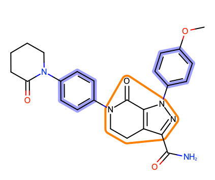
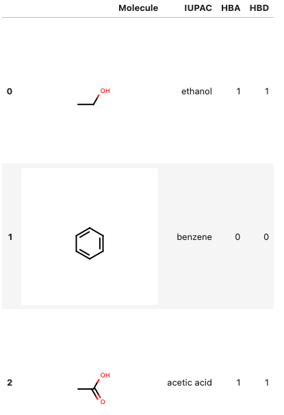
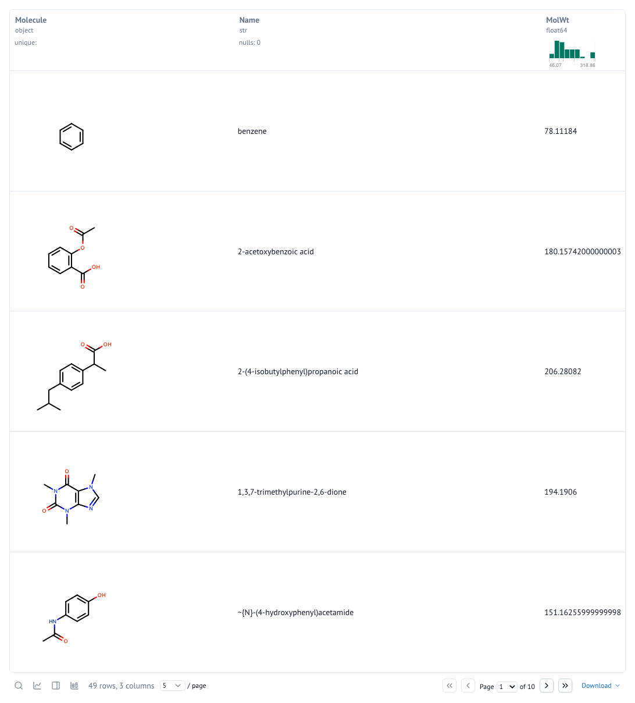
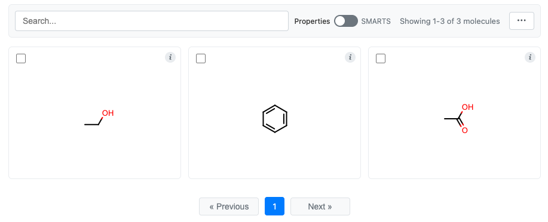
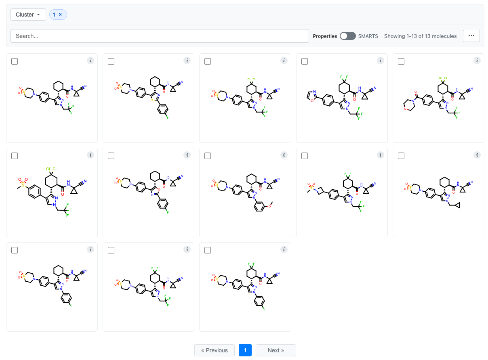
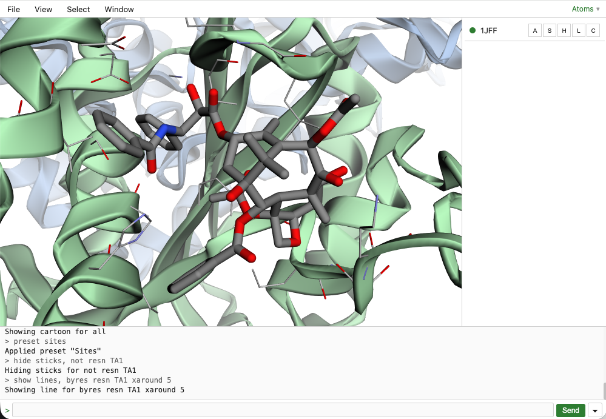
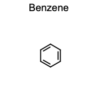
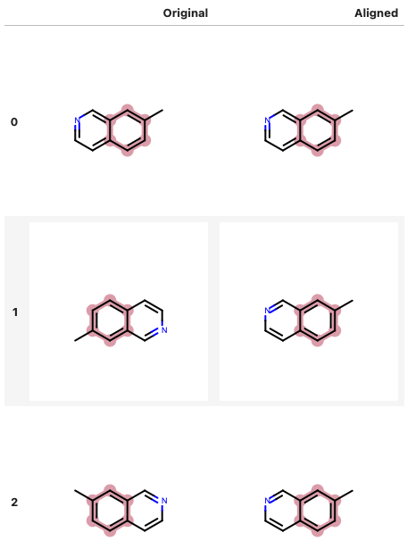

# CNotebook

[](https://www.python.org/downloads/)
[](https://www.eyesopen.com/toolkits)

**Author:** Scott Arne Johnson ([scott.arne.johnson@gmail.com](mailto:scott.arne.johnson@gmail.com))

**Documentation:** https://cnotebook.readthedocs.io/en/latest/

CNotebook provides chemistry visualization for Jupyter Notebooks and Marimo using the OpenEye Toolkits.
Import the package and your molecular data will automatically render as chemical structures without additional
configuration.

Supports both Pandas and Polars DataFrames with automatic environment detection.

**Render molecules in Jupyter and Marimo with style**
<br>


**Maintain Jupyter table formatting for Pandas and Polars**
<br>


**Compatible with native Marimo tables**
<br>


**Interactive molecule grids that support data**
<br>


**Cluster exploration in a molecule grid**
<br>


**Interactive 3D molecule viewing with C3D**
<br>
View proteins, ligands, and design units in an interactive 3Dmol.js-powered viewer with a built-in GUI, terminal, and sidebar.

**View molecules and design units in 3D**
<br>


## Table of Contents

- [Installation](#installation)
- [Getting Started](#getting-started)
- [Features](#features)
- [C3D Interactive 3D Viewer](#c3d-interactive-3d-viewer)
- [MolGrid Interactive Visualization](#molgrid-interactive-visualization)
- [DataFrame Integration](#dataframe-integration)
- [Example Notebooks](#example-notebooks)
- [Documentation](#documentation)
- [Contributing](#contributing)
- [License](#license)

## Installation

```bash
pip install cnotebook
```

**Prerequisites:** 
- [OpenEye Toolkits](http://eyesopen.com): `pip install openeye-toolkits`
- You must have a valid license (free for academia).

**Optional backends:**
- Pandas support: `pip install pandas oepandas`
- Polars support: `pip install polars oepolars`

Both backends can be installed together, neither are required unless you want to work with DataFrames.

## Getting Started

The fastest way to learn CNotebook is through the example notebooks in the `examples/` directory:

| Environment | Pandas                                                                        | Polars                                                                        | MolGrid                                                                             |
|-------------|-------------------------------------------------------------------------------|-------------------------------------------------------------------------------|-------------------------------------------------------------------------------------|
| **Jupyter** | [pandas_jupyter_demo.ipynb](examples/01-demo/pandas_jupyter_demo.ipynb)       | [polars_jupyter_demo.ipynb](examples/01-demo/polars_jupyter_demo.ipynb)       | [molgrid_jupyter_demo.ipynb](examples/02-molgrid/molgrid_jupyter_demo.ipynb)        |
| **Marimo**  | [pandas_marimo_demo.py](examples/01-demo/pandas_marimo_demo.py)               | [polars_marimo_demo.py](examples/01-demo/polars_marimo_demo.py)               | [molgrid_marimo_demo.py](examples/02-molgrid/molgrid_marimo_demo.py)                |

### Basic Usage

```python
import cnotebook
from openeye import oechem

# Create a molecule (supports titles in SMILES)
mol = oechem.OEGraphMol()
oechem.OESmilesToMol(mol, "c1cnccc1 Benzene")

# Display it - automatically renders as a chemical structure
mol
```


CNotebook registers formatters so OpenEye molecule objects display as chemical structures instead of text representations.

## Features

### Automatic Rendering
- Zero configuration required
- Supports Jupyter Notebooks and Marimo
- Automatic environment and backend detection

### Molecule Support
- Direct rendering of `oechem.OEMolBase` objects
- Advanced rendering with `OE2DMolDisplay` options
- `OEDesignUnit` rendering (protein-ligand complexes)
- Pandas integration via OEPandas
- Polars integration via OEPolars

### Visualization Options
- PNG (default) or SVG output
- Configurable width, height, and scaling
- Substructure highlighting with SMARTS patterns
- Molecular alignment to reference structures

### C3D Interactive 3D Viewer
- Self-contained 3Dmol.js viewer with built-in GUI
- Builder-style API for adding molecules and design units
- View presets (`simple`, `sites`, `ball-and-stick`)
- Custom atom styles and selections
- String-based selection expressions (e.g., `"resn 502"`, `"chain A"`)
- Configurable sidebar, menubar, and terminal panels
- Enable/disable individual molecules at load time
- Works in both Jupyter and Marimo

### MolGrid Interactive Visualization
- Paginated grid display for browsing molecules
- Cluster viewing by cluster labels
- Text search across molecular properties
- SMARTS substructure filtering
- Selection tools with export to SMILES or CSV
- Information tooltips with molecular data
- DataFrame integration with automatic field detection

### DataFrame Integration
- Automatic molecule column detection and rendering
- Per-row substructure highlighting
- Molecular alignment within DataFrames
- Fingerprint similarity visualization
- Property calculations on molecule columns

## C3D Interactive 3D Viewer

C3D provides an interactive 3D molecule viewer powered by [3Dmol.js](https://3dmol.csb.pitt.edu/) with a built-in GUI. It renders self-contained HTML with no external network requests, making it suitable for offline use and secure environments.

### Basic Example

```python
from cnotebook.c3d import C3D
from openeye import oechem

mol = oechem.OEMol()
oechem.OESmilesToMol(mol, "c1ccccc1")

viewer = C3D(width=800, height=600).add_molecule(mol, name="benzene")
viewer.display()
```

### Design Units

Load protein-ligand complexes from OpenEye design units:

```python
from cnotebook.c3d import C3D
from openeye import oechem

du = oechem.OEDesignUnit()
oechem.OEReadDesignUnit("complex.oedu", du)

viewer = (
    C3D(width=800, height=800)
    .add_design_unit(du, name="complex")
    .set_preset("sites")
    .zoom_to("resn 502")
)
viewer.display()
```

### View Presets

C3D includes compound view presets that combine multiple representations:

- **`simple`** - Element-coloured cartoon with per-chain carbons and sticks for ligands
- **`sites`** - Like `simple`, plus stick representation for residues within 5 angstroms of ligands
- **`ball-and-stick`** - Ball-and-stick for ligands only

### Builder API

All methods return `self` for chaining:

```python
viewer = (
    C3D(width=1024, height=768)
    .add_molecule(mol, name="ligand")
    .add_design_unit(du, name="protein", disabled=True)
    .add_style({"chain": "A"}, "cartoon", color="blue")
    .set_preset("sites")
    .set_ui(sidebar=True, menubar=True, terminal=False)
    .set_background("#ffffff")
    .zoom_to({"chain": "A"})
)
viewer.display()
```

### Disabled Molecules

Molecules can be loaded in a hidden state and toggled via the sidebar:

```python
viewer = (
    C3D()
    .add_molecule(mol1, name="active")
    .add_molecule(mol2, name="hidden", disabled=True)
)
viewer.display()
```

## MolGrid Interactive Visualization

MolGrid provides an interactive grid for browsing molecular datasets with search and selection capabilities.

### Basic Example

```python
from cnotebook import MolGrid
from openeye import oechem

# Create molecules
molecules = []
for smi in ["CCO", "c1ccccc1", "CC(=O)O"]:
    mol = oechem.OEGraphMol()
    oechem.OESmilesToMol(mol, smi)
    molecules.append(mol)

# Display interactive grid
grid = MolGrid(molecules)
grid.display()
```


### Search and Filter

MolGrid provides two search modes:
- **Properties mode:** Search by molecular titles and configurable text fields
- **SMARTS mode:** Filter by substructure patterns with match highlighting

### Selection

- Click molecules or checkboxes to select
- Use the menu for Select All, Clear, and Invert operations
- Export selections to SMILES or CSV files

### Information Tooltips

- Hover over the information button to view molecular data
- Click to pin tooltips for comparing multiple molecules
- Configure displayed fields with the `data` parameter

### DataFrame Integration

```python
import pandas as pd
from cnotebook import MolGrid
from openeye import oechem, oemolprop

# Create DataFrame
df = pd.DataFrame(
    {"Molecule": ["CCO", "c1ccccc1", "CC(=O)O"]}
).chem.as_molecule("Molecule")

# Calculate some properties
df["MW"] = df.Molecule.apply(oechem.OECalculateMolecularWeight)
df["PSA"] = df.Molecule.apply(oemolprop.OEGet2dPSA)
df["HBA"] = df.Molecule.apply(oemolprop.OEGetHBondAcceptorCount)
df["HBD"] = df.Molecule.apply(oemolprop.OEGetHBondDonorCount)

# Display the grid (using the 'Molecule' column for structures)
grid = df.chem.molgrid("Molecule")
grid.display()
```

This will display the same grid as above, but with molecule data if you click the "i".

### Retrieving Selections

```python
# Get selected molecules
selected_mols = grid.get_selection()

# Get selected indices
indices = grid.get_selection_indices()
```

## DataFrame Integration

### Pandas DataFrames

```python
import cnotebook
import oepandas as oepd

# Read the example unaligned molecules
df = oepd.read_sdf("examples/assets/rotations.sdf", no_title=True)

# Rename the "Molecule" column to "Original" so that we can
# see the original unaligned molecules
df = df.rename(columns={"Molecule": "Original"})

# Create a new molecule column called "Aligned" so that we can
# see the aligned molecules
df["Aligned"] = df.Original.chem.copy_molecules()

# Add substructure highlighting
df["Original"].chem.highlight("c1ccccc1")
df["Aligned"].chem.highlight("c1ccccc1")

# Align molecules to a reference
df["Aligned"].chem.align_depictions("first")

# Display the DataFrame
df
```



### Polars DataFrames

Same example as above using Polars instead of Pandas. The main difference is that some methods are called
from the DataFrame instead of the Series.

```python
import cnotebook
import oepolars as oepl

# Read the example unaligned molecules
df = oepl.read_sdf("examples/assets/rotations.sdf", no_title=True)

# Rename the "Molecule" column to "Original" so that we can
# see the original unaligned molecules
df = df.rename({"Molecule": "Original"})

# # Create a new molecule column called "Aligned" so that we can
# # see the aligned molecules
df = df.chem.copy_molecules("Original", "Aligned")

# # Add substructure highlighting
df.chem.highlight("Original", "c1ccccc1")
df.chem.highlight("Aligned", "c1ccccc1")

# # Align molecules to a reference
df["Aligned"].chem.align_depictions("first")

# Display the DataFrame
df
```

This will display the exact same table as above.

## Example Notebooks

The `examples/` directory contains comprehensive tutorials for learning CNotebook:

### Jupyter Notebooks

- **[pandas_jupyter_demo.ipynb](examples/01-demo/pandas_jupyter_demo.ipynb)** - Complete Pandas integration tutorial covering molecule rendering, highlighting, alignment, and fingerprint similarity
- **[polars_jupyter_demo.ipynb](examples/01-demo/polars_jupyter_demo.ipynb)** - Complete Polars integration tutorial with the same features adapted for Polars patterns
- **[molgrid_jupyter_demo.ipynb](examples/02-molgrid/molgrid_jupyter_demo.ipynb)** - Interactive molecule grid tutorial with search, selection, and export features
- **[pandas_jupyter_cluster_viewing.ipynb](examples/03-clusters/pandas_jupyter_cluster_viewing.ipynb)** - Viewing clustering results in molecule grids using Pandas
- **[pandas_jupyter_svgs.ipynb](examples/01-demo/pandas_jupyter_svgs.ipynb)** - SVG vs PNG rendering comparison and quality considerations

### Marimo Applications

- **[pandas_marimo_demo.py](examples/01-demo/pandas_marimo_demo.py)** - Pandas tutorial in reactive Marimo environment
- **[polars_marimo_demo.py](examples/01-demo/polars_marimo_demo.py)** - Polars tutorial in reactive Marimo environment
- **[molgrid_marimo_demo.py](examples/02-molgrid/molgrid_marimo_demo.py)** - MolGrid tutorial with reactive selection feedback

**Recommended starting point:** Begin with the MolGrid demo for your preferred environment, then explore the Pandas or Polars tutorials for DataFrame integration.

## Contributing

Contributions are welcome. Please ensure your code:
- Follows existing code style and conventions
- Includes appropriate tests
- Works with both Jupyter and Marimo environments
- Maintains compatibility with OpenEye Toolkits
- Works with both Pandas and Polars when applicable

See [CONTRIBUTING.md](CONTRIBUTING.md) for detailed guidelines.

## License

This project is licensed under the MIT License. See [LICENSE](LICENSE) for details.

## Support

For bug reports, feature requests, or questions, please open an issue on GitHub or contact [scott.arne.johnson@gmail.com](mailto:scott.arne.johnson@gmail.com).
