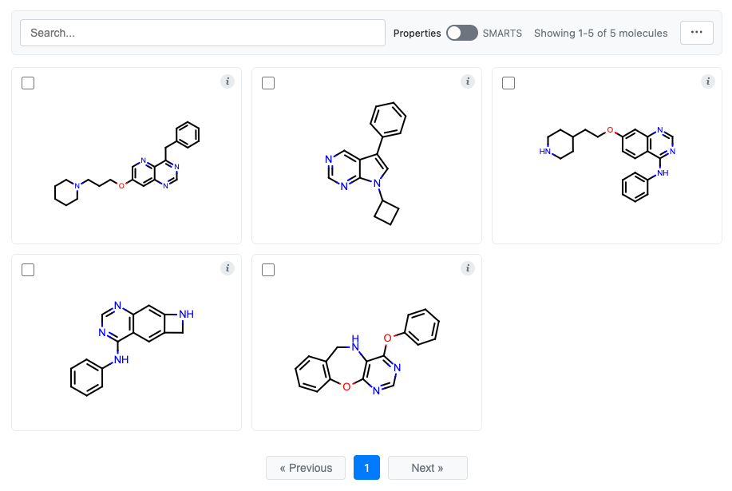

DataFrame Integration
=====================

CNotebook provides seamless integration with `Pandas`_ and `Polars`_ DataFrames through
the ``chem`` accessor, enabling chemistry-aware operations on molecular data.

.. _Pandas: https://pandas.pydata.org/
.. _Polars: https://pola.rs/

Pandas Integration
------------------

Prerequisites
^^^^^^^^^^^^^

.. code-block:: bash

    pip install pandas oepandas

Creating Molecule Columns
^^^^^^^^^^^^^^^^^^^^^^^^^

Convert SMILES strings to molecule objects:

.. code-block:: python

    import cnotebook
    import oepandas as oepd
    import pandas as pd

    df = pd.DataFrame({
        "Name": ["Benzene", "Pyridine", "Pyrimidine"],
        "Molecule": ["c1ccccc1", "c1cnccc1", "n1cnccc1"]
    })

    # Convert SMILES column to molecules (in place)
    df.chem.as_molecule("Molecule", inplace=True)

    # Display the DataFrame
    df

You should see:

.. raw:: html

    
<table border="1" class="dataframe">
      <thead>
        <tr style="text-align: right;">
          <th></th>
          <th>Name</th>
          <th style="min-width: 0.0;">Molecule</th>
        </tr>
      </thead>
      <tbody>
        <tr>
          <th>0</th>
          <td>Benzene</td>
          <td>

        <!--?xml version="1.0" encoding="UTF-8"?-->

    <svg xmlns="http://www.w3.org/2000/svg" xmlns:xlink="http://www.w3.org/1999/xlink" &nbsp;&nbsp;="" viewBox="0.00 0.00 200.00 200.00">
    <!-- Created by OpenEye Scientific Software -->
    <!-- Creation Date Thu Jan 29 12:59:39 2026 -->
    <rect width="200.00" height="200.00" fill="white"></rect>
    <line x1="80.48" y1="98.80" x2="100.00" y2="87.39" stroke="black" stroke-width="2" stroke-linejoin="round" stroke-linecap="round"></line>
    <line x1="85.93" y1="100.95" x2="99.20" y2="93.18" stroke="black" stroke-width="2" stroke-linejoin="round" stroke-linecap="round"></line>
    <line x1="80.48" y1="98.80" x2="80.48" y2="121.42" stroke="black" stroke-width="2" stroke-linejoin="round" stroke-linecap="round"></line>
    <line x1="80.48" y1="121.42" x2="100.00" y2="132.61" stroke="black" stroke-width="2" stroke-linejoin="round" stroke-linecap="round"></line>
    <line x1="85.90" y1="119.22" x2="99.17" y2="126.83" stroke="black" stroke-width="2" stroke-linejoin="round" stroke-linecap="round"></line>
    <line x1="100.00" y1="132.61" x2="119.52" y2="121.42" stroke="black" stroke-width="2" stroke-linejoin="round" stroke-linecap="round"></line>
    <line x1="119.52" y1="121.42" x2="119.52" y2="98.80" stroke="black" stroke-width="2" stroke-linejoin="round" stroke-linecap="round"></line>
    <line x1="114.92" y1="117.80" x2="114.92" y2="102.42" stroke="black" stroke-width="2" stroke-linejoin="round" stroke-linecap="round"></line>
    <line x1="119.52" y1="98.80" x2="100.00" y2="87.39" stroke="black" stroke-width="2" stroke-linejoin="round" stroke-linecap="round"></line>
    </svg>

    
</td>
        </tr>
        <tr>
          <th>1</th>
          <td>Pyridine</td>
          <td>

        <!--?xml version="1.0" encoding="UTF-8"?-->

    <svg xmlns="http://www.w3.org/2000/svg" xmlns:xlink="http://www.w3.org/1999/xlink" &nbsp;&nbsp;="" viewBox="0.00 0.00 200.00 200.00">
    <!-- Created by OpenEye Scientific Software -->
    <!-- Creation Date Thu Jan 29 12:59:39 2026 -->
    <rect width="200.00" height="200.00" fill="white"></rect>
    <line x1="80.48" y1="121.42" x2="100.00" y2="132.61" stroke="black" stroke-width="2" stroke-linejoin="round" stroke-linecap="round"></line>
    <line x1="85.90" y1="119.22" x2="99.17" y2="126.83" stroke="black" stroke-width="2" stroke-linejoin="round" stroke-linecap="round"></line>
    <line x1="80.48" y1="121.42" x2="80.48" y2="98.80" stroke="black" stroke-width="2" stroke-linejoin="round" stroke-linecap="round"></line>
    <line x1="90.24" y1="93.09" x2="80.48" y2="98.80" stroke="black" stroke-width="2" stroke-linejoin="round" stroke-linecap="round"></line>
    <line x1="90.24" y1="93.09" x2="94.74" y2="90.46" stroke="blue" stroke-width="2" stroke-linejoin="round" stroke-linecap="round"></line>
    <line x1="92.56" y1="97.06" x2="85.93" y2="100.95" stroke="black" stroke-width="2" stroke-linejoin="round" stroke-linecap="round"></line>
    <line x1="92.56" y1="97.06" x2="99.20" y2="93.18" stroke="blue" stroke-width="2" stroke-linejoin="round" stroke-linecap="round"></line>
    <line x1="109.76" y1="93.09" x2="105.26" y2="90.46" stroke="blue" stroke-width="2" stroke-linejoin="round" stroke-linecap="round"></line>
    <line x1="109.76" y1="93.09" x2="119.52" y2="98.80" stroke="black" stroke-width="2" stroke-linejoin="round" stroke-linecap="round"></line>
    <line x1="119.52" y1="98.80" x2="119.52" y2="121.42" stroke="black" stroke-width="2" stroke-linejoin="round" stroke-linecap="round"></line>
    <line x1="114.92" y1="102.42" x2="114.92" y2="117.80" stroke="black" stroke-width="2" stroke-linejoin="round" stroke-linecap="round"></line>
    <line x1="119.52" y1="121.42" x2="100.00" y2="132.61" stroke="black" stroke-width="2" stroke-linejoin="round" stroke-linecap="round"></line>
    <text x="100.00" y="90.36" fill="blue" font-family="Arial" font-size="9" font-style="normal" font-weight="normal" text-anchor="middle">&nbsp;&nbsp;N </text>
    </svg>

    
</td>
        </tr>
        <tr>
          <th>2</th>
          <td>Pyrimidine</td>
          <td>

        <!--?xml version="1.0" encoding="UTF-8"?-->

    <svg xmlns="http://www.w3.org/2000/svg" xmlns:xlink="http://www.w3.org/1999/xlink" &nbsp;&nbsp;="" viewBox="0.00 0.00 200.00 200.00">
    <!-- Created by OpenEye Scientific Software -->
    <!-- Creation Date Thu Jan 29 12:59:39 2026 -->
    <rect width="200.00" height="200.00" fill="white"></rect>
    <line x1="109.76" y1="127.02" x2="114.23" y2="124.46" stroke="blue" stroke-width="2" stroke-linejoin="round" stroke-linecap="round"></line>
    <line x1="109.76" y1="127.02" x2="100.00" y2="132.62" stroke="black" stroke-width="2" stroke-linejoin="round" stroke-linecap="round"></line>
    <line x1="107.47" y1="123.03" x2="114.11" y2="119.22" stroke="blue" stroke-width="2" stroke-linejoin="round" stroke-linecap="round"></line>
    <line x1="107.47" y1="123.03" x2="100.83" y2="126.84" stroke="black" stroke-width="2" stroke-linejoin="round" stroke-linecap="round"></line>
    <line x1="119.52" y1="110.11" x2="119.52" y2="115.33" stroke="blue" stroke-width="2" stroke-linejoin="round" stroke-linecap="round"></line>
    <line x1="119.52" y1="110.11" x2="119.52" y2="98.81" stroke="black" stroke-width="2" stroke-linejoin="round" stroke-linecap="round"></line>
    <line x1="109.76" y1="93.09" x2="119.52" y2="98.81" stroke="black" stroke-width="2" stroke-linejoin="round" stroke-linecap="round"></line>
    <line x1="109.76" y1="93.09" x2="105.26" y2="90.46" stroke="blue" stroke-width="2" stroke-linejoin="round" stroke-linecap="round"></line>
    <line x1="107.44" y1="97.06" x2="114.07" y2="100.95" stroke="black" stroke-width="2" stroke-linejoin="round" stroke-linecap="round"></line>
    <line x1="107.44" y1="97.06" x2="100.80" y2="93.18" stroke="blue" stroke-width="2" stroke-linejoin="round" stroke-linecap="round"></line>
    <line x1="90.24" y1="93.09" x2="94.74" y2="90.46" stroke="blue" stroke-width="2" stroke-linejoin="round" stroke-linecap="round"></line>
    <line x1="90.24" y1="93.09" x2="80.48" y2="98.81" stroke="black" stroke-width="2" stroke-linejoin="round" stroke-linecap="round"></line>
    <line x1="80.48" y1="98.81" x2="80.48" y2="121.42" stroke="black" stroke-width="2" stroke-linejoin="round" stroke-linecap="round"></line>
    <line x1="85.08" y1="102.42" x2="85.08" y2="117.80" stroke="black" stroke-width="2" stroke-linejoin="round" stroke-linecap="round"></line>
    <line x1="80.48" y1="121.42" x2="100.00" y2="132.62" stroke="black" stroke-width="2" stroke-linejoin="round" stroke-linecap="round"></line>
    <text x="119.52" y="124.39" fill="blue" font-family="Arial" font-size="9" font-style="normal" font-weight="normal" text-anchor="middle">&nbsp;&nbsp;N </text>
    <text x="100.00" y="90.35" fill="blue" font-family="Arial" font-size="9" font-style="normal" font-weight="normal" text-anchor="middle">&nbsp;&nbsp;N </text>
    </svg>

    
</td>
        </tr>
      </tbody>
    </table>

.. note::
    Molecule columns automatically render as chemical structures when displaying
    the DataFrame. This also works for anything that returns a DataFrame, such
    as ``df.head()``.

Substructure Highlighting
^^^^^^^^^^^^^^^^^^^^^^^^^

You can highlight a substructures within a DataFrame column using SMARTS. By default this uses ball-and-stick-style
highlighting that supports overlapping matches, using the ``oechem.OEGetLightColors()`` scheme.

.. code-block:: python

    # Highlight a single pattern using the DataFrame above
    df.Molecule.chem.highlight("c1ccccc1")  # Highlight benzene rings

    # Display the DataFrame
    df

Outputs:

.. raw:: html

    
<table border="1" class="dataframe">
      <thead>
        <tr style="text-align: right;">
          <th></th>
          <th>Name</th>
          <th style="min-width: 0.0;">Molecule</th>
        </tr>
      </thead>
      <tbody>
        <tr>
          <th>0</th>
          <td>Benzene</td>
          <td>

        <!--?xml version="1.0" encoding="UTF-8"?-->

    <svg xmlns="http://www.w3.org/2000/svg" xmlns:xlink="http://www.w3.org/1999/xlink" &nbsp;&nbsp;="" viewBox="0.00 0.00 200.00 200.00">
    <!-- Created by OpenEye Scientific Software -->
    <!-- Creation Date Thu Jan 29 14:25:15 2026 -->
    <rect width="200.00" height="200.00" fill="white"></rect>
    <circle cx="80.48" cy="98.80" r="6.00" fill="#db9ca9" stroke="#db9ca9" stroke-width="2" stroke-linejoin="round" stroke-linecap="round"></circle>
    <circle cx="80.48" cy="121.42" r="6.00" fill="#db9ca9" stroke="#db9ca9" stroke-width="2" stroke-linejoin="round" stroke-linecap="round"></circle>
    <circle cx="100.00" cy="132.61" r="6.00" fill="#db9ca9" stroke="#db9ca9" stroke-width="2" stroke-linejoin="round" stroke-linecap="round"></circle>
    <circle cx="119.52" cy="121.42" r="6.00" fill="#db9ca9" stroke="#db9ca9" stroke-width="2" stroke-linejoin="round" stroke-linecap="round"></circle>
    <circle cx="119.52" cy="98.80" r="6.00" fill="#db9ca9" stroke="#db9ca9" stroke-width="2" stroke-linejoin="round" stroke-linecap="round"></circle>
    <circle cx="100.00" cy="87.39" r="6.00" fill="#db9ca9" stroke="#db9ca9" stroke-width="2" stroke-linejoin="round" stroke-linecap="round"></circle>
    <line x1="80.48" y1="98.80" x2="100.00" y2="87.39" stroke="#db9ca9" stroke-width="7" stroke-linejoin="round" stroke-linecap="round"></line>
    <line x1="80.48" y1="98.80" x2="80.48" y2="121.42" stroke="#db9ca9" stroke-width="7" stroke-linejoin="round" stroke-linecap="round"></line>
    <line x1="80.48" y1="121.42" x2="100.00" y2="132.61" stroke="#db9ca9" stroke-width="7" stroke-linejoin="round" stroke-linecap="round"></line>
    <line x1="100.00" y1="132.61" x2="119.52" y2="121.42" stroke="#db9ca9" stroke-width="7" stroke-linejoin="round" stroke-linecap="round"></line>
    <line x1="119.52" y1="121.42" x2="119.52" y2="98.80" stroke="#db9ca9" stroke-width="7" stroke-linejoin="round" stroke-linecap="round"></line>
    <line x1="119.52" y1="98.80" x2="100.00" y2="87.39" stroke="#db9ca9" stroke-width="7" stroke-linejoin="round" stroke-linecap="round"></line>
    <line x1="80.48" y1="98.80" x2="100.00" y2="87.39" stroke="black" stroke-width="2" stroke-linejoin="round" stroke-linecap="round"></line>
    <line x1="85.93" y1="100.95" x2="99.20" y2="93.18" stroke="black" stroke-width="2" stroke-linejoin="round" stroke-linecap="round"></line>
    <line x1="80.48" y1="98.80" x2="80.48" y2="121.42" stroke="black" stroke-width="2" stroke-linejoin="round" stroke-linecap="round"></line>
    <line x1="80.48" y1="121.42" x2="100.00" y2="132.61" stroke="black" stroke-width="2" stroke-linejoin="round" stroke-linecap="round"></line>
    <line x1="85.90" y1="119.22" x2="99.17" y2="126.83" stroke="black" stroke-width="2" stroke-linejoin="round" stroke-linecap="round"></line>
    <line x1="100.00" y1="132.61" x2="119.52" y2="121.42" stroke="black" stroke-width="2" stroke-linejoin="round" stroke-linecap="round"></line>
    <line x1="119.52" y1="121.42" x2="119.52" y2="98.80" stroke="black" stroke-width="2" stroke-linejoin="round" stroke-linecap="round"></line>
    <line x1="114.92" y1="117.80" x2="114.92" y2="102.42" stroke="black" stroke-width="2" stroke-linejoin="round" stroke-linecap="round"></line>
    <line x1="119.52" y1="98.80" x2="100.00" y2="87.39" stroke="black" stroke-width="2" stroke-linejoin="round" stroke-linecap="round"></line>
    </svg>

    
</td>
        </tr>
        <tr>
          <th>1</th>
          <td>Pyridine</td>
          <td>

        <!--?xml version="1.0" encoding="UTF-8"?-->

    <svg xmlns="http://www.w3.org/2000/svg" xmlns:xlink="http://www.w3.org/1999/xlink" &nbsp;&nbsp;="" viewBox="0.00 0.00 200.00 200.00">
    <!-- Created by OpenEye Scientific Software -->
    <!-- Creation Date Thu Jan 29 14:25:15 2026 -->
    <rect width="200.00" height="200.00" fill="white"></rect>
    <line x1="80.48" y1="121.42" x2="100.00" y2="132.61" stroke="black" stroke-width="2" stroke-linejoin="round" stroke-linecap="round"></line>
    <line x1="85.90" y1="119.22" x2="99.17" y2="126.83" stroke="black" stroke-width="2" stroke-linejoin="round" stroke-linecap="round"></line>
    <line x1="80.48" y1="121.42" x2="80.48" y2="98.80" stroke="black" stroke-width="2" stroke-linejoin="round" stroke-linecap="round"></line>
    <line x1="90.24" y1="93.09" x2="80.48" y2="98.80" stroke="black" stroke-width="2" stroke-linejoin="round" stroke-linecap="round"></line>
    <line x1="90.24" y1="93.09" x2="94.74" y2="90.46" stroke="blue" stroke-width="2" stroke-linejoin="round" stroke-linecap="round"></line>
    <line x1="92.56" y1="97.06" x2="85.93" y2="100.95" stroke="black" stroke-width="2" stroke-linejoin="round" stroke-linecap="round"></line>
    <line x1="92.56" y1="97.06" x2="99.20" y2="93.18" stroke="blue" stroke-width="2" stroke-linejoin="round" stroke-linecap="round"></line>
    <line x1="109.76" y1="93.09" x2="105.26" y2="90.46" stroke="blue" stroke-width="2" stroke-linejoin="round" stroke-linecap="round"></line>
    <line x1="109.76" y1="93.09" x2="119.52" y2="98.80" stroke="black" stroke-width="2" stroke-linejoin="round" stroke-linecap="round"></line>
    <line x1="119.52" y1="98.80" x2="119.52" y2="121.42" stroke="black" stroke-width="2" stroke-linejoin="round" stroke-linecap="round"></line>
    <line x1="114.92" y1="102.42" x2="114.92" y2="117.80" stroke="black" stroke-width="2" stroke-linejoin="round" stroke-linecap="round"></line>
    <line x1="119.52" y1="121.42" x2="100.00" y2="132.61" stroke="black" stroke-width="2" stroke-linejoin="round" stroke-linecap="round"></line>
    <text x="100.00" y="90.36" fill="blue" font-family="Arial" font-size="9" font-style="normal" font-weight="normal" text-anchor="middle">&nbsp;&nbsp;N </text>
    </svg>

    
</td>
        </tr>
        <tr>
          <th>2</th>
          <td>Pyrimidine</td>
          <td>

        <!--?xml version="1.0" encoding="UTF-8"?-->

    <svg xmlns="http://www.w3.org/2000/svg" xmlns:xlink="http://www.w3.org/1999/xlink" &nbsp;&nbsp;="" viewBox="0.00 0.00 200.00 200.00">
    <!-- Created by OpenEye Scientific Software -->
    <!-- Creation Date Thu Jan 29 14:25:15 2026 -->
    <rect width="200.00" height="200.00" fill="white"></rect>
    <line x1="109.76" y1="127.02" x2="114.23" y2="124.46" stroke="blue" stroke-width="2" stroke-linejoin="round" stroke-linecap="round"></line>
    <line x1="109.76" y1="127.02" x2="100.00" y2="132.62" stroke="black" stroke-width="2" stroke-linejoin="round" stroke-linecap="round"></line>
    <line x1="107.47" y1="123.03" x2="114.11" y2="119.22" stroke="blue" stroke-width="2" stroke-linejoin="round" stroke-linecap="round"></line>
    <line x1="107.47" y1="123.03" x2="100.83" y2="126.84" stroke="black" stroke-width="2" stroke-linejoin="round" stroke-linecap="round"></line>
    <line x1="119.52" y1="110.11" x2="119.52" y2="115.33" stroke="blue" stroke-width="2" stroke-linejoin="round" stroke-linecap="round"></line>
    <line x1="119.52" y1="110.11" x2="119.52" y2="98.81" stroke="black" stroke-width="2" stroke-linejoin="round" stroke-linecap="round"></line>
    <line x1="109.76" y1="93.09" x2="119.52" y2="98.81" stroke="black" stroke-width="2" stroke-linejoin="round" stroke-linecap="round"></line>
    <line x1="109.76" y1="93.09" x2="105.26" y2="90.46" stroke="blue" stroke-width="2" stroke-linejoin="round" stroke-linecap="round"></line>
    <line x1="107.44" y1="97.06" x2="114.07" y2="100.95" stroke="black" stroke-width="2" stroke-linejoin="round" stroke-linecap="round"></line>
    <line x1="107.44" y1="97.06" x2="100.80" y2="93.18" stroke="blue" stroke-width="2" stroke-linejoin="round" stroke-linecap="round"></line>
    <line x1="90.24" y1="93.09" x2="94.74" y2="90.46" stroke="blue" stroke-width="2" stroke-linejoin="round" stroke-linecap="round"></line>
    <line x1="90.24" y1="93.09" x2="80.48" y2="98.81" stroke="black" stroke-width="2" stroke-linejoin="round" stroke-linecap="round"></line>
    <line x1="80.48" y1="98.81" x2="80.48" y2="121.42" stroke="black" stroke-width="2" stroke-linejoin="round" stroke-linecap="round"></line>
    <line x1="85.08" y1="102.42" x2="85.08" y2="117.80" stroke="black" stroke-width="2" stroke-linejoin="round" stroke-linecap="round"></line>
    <line x1="80.48" y1="121.42" x2="100.00" y2="132.62" stroke="black" stroke-width="2" stroke-linejoin="round" stroke-linecap="round"></line>
    <text x="119.52" y="124.39" fill="blue" font-family="Arial" font-size="9" font-style="normal" font-weight="normal" text-anchor="middle">&nbsp;&nbsp;N </text>
    <text x="100.00" y="90.35" fill="blue" font-family="Arial" font-size="9" font-style="normal" font-weight="normal" text-anchor="middle">&nbsp;&nbsp;N </text>
    </svg>

    
</td>
        </tr>
      </tbody>
    </table>

.. note::
    Highlighting persists until you remove it with ``df.chem.clear_formatting_rules()`` for a DataFrame or
    ``df["column_name"].clear_formatting_rules()``.

You can also use any of the normal highlighting capabilities:

.. code-block:: python

    # Highlight using normal stick highlighting
    df.Molecule.chem.highlight("c1ccccc1", style=oedepict.OEHighlightStyle_Stick, color=oechem.OELightBlue)

    # Display the DataFrame
    df

.. raw:: html

    
<table border="1" class="dataframe">
      <thead>
        <tr style="text-align: right;">
          <th></th>
          <th>Name</th>
          <th style="min-width: 0.0;">Molecule</th>
        </tr>
      </thead>
      <tbody>
        <tr>
          <th>0</th>
          <td>Benzene</td>
          <td>

        <!--?xml version="1.0" encoding="UTF-8"?-->

    <svg xmlns="http://www.w3.org/2000/svg" xmlns:xlink="http://www.w3.org/1999/xlink" &nbsp;&nbsp;="" viewBox="0.00 0.00 200.00 200.00">
    <!-- Created by OpenEye Scientific Software -->
    <!-- Creation Date Thu Jan 29 14:41:28 2026 -->
    <rect width="200.00" height="200.00" fill="white"></rect>
    <line x1="80.48" y1="98.80" x2="100.00" y2="87.39" stroke="#a0a0ff" stroke-width="7" stroke-linejoin="round" stroke-linecap="round"></line>
    <line x1="80.48" y1="98.80" x2="80.48" y2="121.42" stroke="#a0a0ff" stroke-width="7" stroke-linejoin="round" stroke-linecap="round"></line>
    <line x1="80.48" y1="121.42" x2="100.00" y2="132.61" stroke="#a0a0ff" stroke-width="7" stroke-linejoin="round" stroke-linecap="round"></line>
    <line x1="100.00" y1="132.61" x2="119.52" y2="121.42" stroke="#a0a0ff" stroke-width="7" stroke-linejoin="round" stroke-linecap="round"></line>
    <line x1="119.52" y1="121.42" x2="119.52" y2="98.80" stroke="#a0a0ff" stroke-width="7" stroke-linejoin="round" stroke-linecap="round"></line>
    <line x1="119.52" y1="98.80" x2="100.00" y2="87.39" stroke="#a0a0ff" stroke-width="7" stroke-linejoin="round" stroke-linecap="round"></line>
    <line x1="80.48" y1="98.80" x2="100.00" y2="87.39" stroke="black" stroke-width="2" stroke-linejoin="round" stroke-linecap="round"></line>
    <line x1="85.93" y1="100.95" x2="99.20" y2="93.18" stroke="black" stroke-width="2" stroke-linejoin="round" stroke-linecap="round"></line>
    <line x1="80.48" y1="98.80" x2="80.48" y2="121.42" stroke="black" stroke-width="2" stroke-linejoin="round" stroke-linecap="round"></line>
    <line x1="80.48" y1="121.42" x2="100.00" y2="132.61" stroke="black" stroke-width="2" stroke-linejoin="round" stroke-linecap="round"></line>
    <line x1="85.90" y1="119.22" x2="99.17" y2="126.83" stroke="black" stroke-width="2" stroke-linejoin="round" stroke-linecap="round"></line>
    <line x1="100.00" y1="132.61" x2="119.52" y2="121.42" stroke="black" stroke-width="2" stroke-linejoin="round" stroke-linecap="round"></line>
    <line x1="119.52" y1="121.42" x2="119.52" y2="98.80" stroke="black" stroke-width="2" stroke-linejoin="round" stroke-linecap="round"></line>
    <line x1="114.92" y1="117.80" x2="114.92" y2="102.42" stroke="black" stroke-width="2" stroke-linejoin="round" stroke-linecap="round"></line>
    <line x1="119.52" y1="98.80" x2="100.00" y2="87.39" stroke="black" stroke-width="2" stroke-linejoin="round" stroke-linecap="round"></line>
    </svg>

    
</td>
        </tr>
        <tr>
          <th>1</th>
          <td>Pyridine</td>
          <td>

        <!--?xml version="1.0" encoding="UTF-8"?-->

    <svg xmlns="http://www.w3.org/2000/svg" xmlns:xlink="http://www.w3.org/1999/xlink" &nbsp;&nbsp;="" viewBox="0.00 0.00 200.00 200.00">
    <!-- Created by OpenEye Scientific Software -->
    <!-- Creation Date Thu Jan 29 14:41:28 2026 -->
    <rect width="200.00" height="200.00" fill="white"></rect>
    <line x1="80.48" y1="121.42" x2="100.00" y2="132.61" stroke="black" stroke-width="2" stroke-linejoin="round" stroke-linecap="round"></line>
    <line x1="85.90" y1="119.22" x2="99.17" y2="126.83" stroke="black" stroke-width="2" stroke-linejoin="round" stroke-linecap="round"></line>
    <line x1="80.48" y1="121.42" x2="80.48" y2="98.80" stroke="black" stroke-width="2" stroke-linejoin="round" stroke-linecap="round"></line>
    <line x1="90.24" y1="93.09" x2="80.48" y2="98.80" stroke="black" stroke-width="2" stroke-linejoin="round" stroke-linecap="round"></line>
    <line x1="90.24" y1="93.09" x2="94.74" y2="90.46" stroke="blue" stroke-width="2" stroke-linejoin="round" stroke-linecap="round"></line>
    <line x1="92.56" y1="97.06" x2="85.93" y2="100.95" stroke="black" stroke-width="2" stroke-linejoin="round" stroke-linecap="round"></line>
    <line x1="92.56" y1="97.06" x2="99.20" y2="93.18" stroke="blue" stroke-width="2" stroke-linejoin="round" stroke-linecap="round"></line>
    <line x1="109.76" y1="93.09" x2="105.26" y2="90.46" stroke="blue" stroke-width="2" stroke-linejoin="round" stroke-linecap="round"></line>
    <line x1="109.76" y1="93.09" x2="119.52" y2="98.80" stroke="black" stroke-width="2" stroke-linejoin="round" stroke-linecap="round"></line>
    <line x1="119.52" y1="98.80" x2="119.52" y2="121.42" stroke="black" stroke-width="2" stroke-linejoin="round" stroke-linecap="round"></line>
    <line x1="114.92" y1="102.42" x2="114.92" y2="117.80" stroke="black" stroke-width="2" stroke-linejoin="round" stroke-linecap="round"></line>
    <line x1="119.52" y1="121.42" x2="100.00" y2="132.61" stroke="black" stroke-width="2" stroke-linejoin="round" stroke-linecap="round"></line>
    <text x="100.00" y="90.36" fill="blue" font-family="Arial" font-size="9" font-style="normal" font-weight="normal" text-anchor="middle">&nbsp;&nbsp;N </text>
    </svg>

    
</td>
        </tr>
        <tr>
          <th>2</th>
          <td>Pyrimidine</td>
          <td>

        <!--?xml version="1.0" encoding="UTF-8"?-->

    <svg xmlns="http://www.w3.org/2000/svg" xmlns:xlink="http://www.w3.org/1999/xlink" &nbsp;&nbsp;="" viewBox="0.00 0.00 200.00 200.00">
    <!-- Created by OpenEye Scientific Software -->
    <!-- Creation Date Thu Jan 29 14:41:28 2026 -->
    <rect width="200.00" height="200.00" fill="white"></rect>
    <line x1="109.76" y1="127.02" x2="114.23" y2="124.46" stroke="blue" stroke-width="2" stroke-linejoin="round" stroke-linecap="round"></line>
    <line x1="109.76" y1="127.02" x2="100.00" y2="132.62" stroke="black" stroke-width="2" stroke-linejoin="round" stroke-linecap="round"></line>
    <line x1="107.47" y1="123.03" x2="114.11" y2="119.22" stroke="blue" stroke-width="2" stroke-linejoin="round" stroke-linecap="round"></line>
    <line x1="107.47" y1="123.03" x2="100.83" y2="126.84" stroke="black" stroke-width="2" stroke-linejoin="round" stroke-linecap="round"></line>
    <line x1="119.52" y1="110.11" x2="119.52" y2="115.33" stroke="blue" stroke-width="2" stroke-linejoin="round" stroke-linecap="round"></line>
    <line x1="119.52" y1="110.11" x2="119.52" y2="98.81" stroke="black" stroke-width="2" stroke-linejoin="round" stroke-linecap="round"></line>
    <line x1="109.76" y1="93.09" x2="119.52" y2="98.81" stroke="black" stroke-width="2" stroke-linejoin="round" stroke-linecap="round"></line>
    <line x1="109.76" y1="93.09" x2="105.26" y2="90.46" stroke="blue" stroke-width="2" stroke-linejoin="round" stroke-linecap="round"></line>
    <line x1="107.44" y1="97.06" x2="114.07" y2="100.95" stroke="black" stroke-width="2" stroke-linejoin="round" stroke-linecap="round"></line>
    <line x1="107.44" y1="97.06" x2="100.80" y2="93.18" stroke="blue" stroke-width="2" stroke-linejoin="round" stroke-linecap="round"></line>
    <line x1="90.24" y1="93.09" x2="94.74" y2="90.46" stroke="blue" stroke-width="2" stroke-linejoin="round" stroke-linecap="round"></line>
    <line x1="90.24" y1="93.09" x2="80.48" y2="98.81" stroke="black" stroke-width="2" stroke-linejoin="round" stroke-linecap="round"></line>
    <line x1="80.48" y1="98.81" x2="80.48" y2="121.42" stroke="black" stroke-width="2" stroke-linejoin="round" stroke-linecap="round"></line>
    <line x1="85.08" y1="102.42" x2="85.08" y2="117.80" stroke="black" stroke-width="2" stroke-linejoin="round" stroke-linecap="round"></line>
    <line x1="80.48" y1="121.42" x2="100.00" y2="132.62" stroke="black" stroke-width="2" stroke-linejoin="round" stroke-linecap="round"></line>
    <text x="119.52" y="124.39" fill="blue" font-family="Arial" font-size="9" font-style="normal" font-weight="normal" text-anchor="middle">&nbsp;&nbsp;N </text>
    <text x="100.00" y="90.35" fill="blue" font-family="Arial" font-size="9" font-style="normal" font-weight="normal" text-anchor="middle">&nbsp;&nbsp;N </text>
    </svg>

    
</td>
        </tr>
      </tbody>
    </table>

Finally, you can highlight a substructure based on the value in another column, rather than a fixed pattern:

.. code-block:: python

    # Add a different pattern for each row
    df["Pattern"] = ["cc", "cnc", "ncn"]

    # Highlight using that pattern with a slightly different style
    df.chem.highlight_using_column("SMILES", "Pattern")

.. raw:: html

    
<table border="1" class="dataframe">
      <thead>
        <tr style="text-align: right;">
          <th></th>
          <th>Name</th>
          <th style="min-width: 0.0;">Molecule</th>
          <th>Pattern</th>
          <th style="min-width: 200.0;">highlighted_substructures</th>
        </tr>
      </thead>
      <tbody>
        <tr>
          <th>0</th>
          <td>Benzene</td>
          <td>

        <!--?xml version="1.0" encoding="UTF-8"?-->

    <svg xmlns="http://www.w3.org/2000/svg" xmlns:xlink="http://www.w3.org/1999/xlink" &nbsp;&nbsp;="" viewBox="0.00 0.00 200.00 200.00">
    <!-- Created by OpenEye Scientific Software -->
    <!-- Creation Date Thu Jan 29 14:47:29 2026 -->
    <rect width="200.00" height="200.00" fill="white"></rect>
    <line x1="80.48" y1="98.80" x2="100.00" y2="87.39" stroke="black" stroke-width="2" stroke-linejoin="round" stroke-linecap="round"></line>
    <line x1="85.93" y1="100.95" x2="99.20" y2="93.18" stroke="black" stroke-width="2" stroke-linejoin="round" stroke-linecap="round"></line>
    <line x1="80.48" y1="98.80" x2="80.48" y2="121.42" stroke="black" stroke-width="2" stroke-linejoin="round" stroke-linecap="round"></line>
    <line x1="80.48" y1="121.42" x2="100.00" y2="132.61" stroke="black" stroke-width="2" stroke-linejoin="round" stroke-linecap="round"></line>
    <line x1="85.90" y1="119.22" x2="99.17" y2="126.83" stroke="black" stroke-width="2" stroke-linejoin="round" stroke-linecap="round"></line>
    <line x1="100.00" y1="132.61" x2="119.52" y2="121.42" stroke="black" stroke-width="2" stroke-linejoin="round" stroke-linecap="round"></line>
    <line x1="119.52" y1="121.42" x2="119.52" y2="98.80" stroke="black" stroke-width="2" stroke-linejoin="round" stroke-linecap="round"></line>
    <line x1="114.92" y1="117.80" x2="114.92" y2="102.42" stroke="black" stroke-width="2" stroke-linejoin="round" stroke-linecap="round"></line>
    <line x1="119.52" y1="98.80" x2="100.00" y2="87.39" stroke="black" stroke-width="2" stroke-linejoin="round" stroke-linecap="round"></line>
    </svg>

    
</td>
          <td>cc</td>
          <td>

        <!--?xml version="1.0" encoding="UTF-8"?-->

    <svg xmlns="http://www.w3.org/2000/svg" xmlns:xlink="http://www.w3.org/1999/xlink" &nbsp;&nbsp;="" viewBox="0.00 0.00 200.00 200.00">
    <!-- Created by OpenEye Scientific Software -->
    <!-- Creation Date Thu Jan 29 14:47:29 2026 -->
    <rect width="200.00" height="200.00" fill="white"></rect>
    <line x1="80.48" y1="98.80" x2="100.00" y2="87.39" stroke="#db9ca9" stroke-width="7" stroke-linejoin="round" stroke-linecap="round"></line>
    <line x1="80.48" y1="98.80" x2="80.48" y2="121.42" stroke="#e5c49b" stroke-width="7" stroke-linejoin="round" stroke-linecap="round"></line>
    <line x1="80.48" y1="121.42" x2="100.00" y2="132.61" stroke="#f2ef9b" stroke-width="7" stroke-linejoin="round" stroke-linecap="round"></line>
    <line x1="100.00" y1="132.61" x2="119.52" y2="121.42" stroke="#dae387" stroke-width="7" stroke-linejoin="round" stroke-linecap="round"></line>
    <line x1="119.52" y1="121.42" x2="119.52" y2="98.80" stroke="#b6d9ab" stroke-width="7" stroke-linejoin="round" stroke-linecap="round"></line>
    <line x1="119.52" y1="98.80" x2="100.00" y2="87.39" stroke="#a1d2b6" stroke-width="7" stroke-linejoin="round" stroke-linecap="round"></line>
    <path d="M 80.48 98.80 L 80.48 92.80 A 6.00 6.00 0 0 1 85.68 95.80 z" &nbsp;&nbsp;fill="#db9ca9"></path>
    <path d="M 80.48 98.80 L 85.68 95.80 A 6.00 6.00 0 0 1 85.68 101.80 z" &nbsp;&nbsp;fill="#e5c49b"></path>
    <path d="M 80.48 98.80 L 85.68 101.80 A 6.00 6.00 0 0 1 80.48 104.80 z" &nbsp;&nbsp;fill="#db9ca9"></path>
    <path d="M 80.48 98.80 L 80.48 104.80 A 6.00 6.00 0 0 1 75.29 101.80 z" &nbsp;&nbsp;fill="#e5c49b"></path>
    <path d="M 80.48 98.80 L 75.29 101.80 A 6.00 6.00 0 0 1 75.29 95.80 z" &nbsp;&nbsp;fill="#db9ca9"></path>
    <path d="M 80.48 98.80 L 75.29 95.80 A 6.00 6.00 0 0 1 80.48 92.80 z" &nbsp;&nbsp;fill="#e5c49b"></path>
    <path d="M 80.48 121.42 L 80.48 115.42 A 6.00 6.00 0 0 1 85.68 118.42 z" &nbsp;&nbsp;fill="#e5c49b"></path>
    <path d="M 80.48 121.42 L 85.68 118.42 A 6.00 6.00 0 0 1 85.68 124.42 z" &nbsp;&nbsp;fill="#f2ef9b"></path>
    <path d="M 80.48 121.42 L 85.68 124.42 A 6.00 6.00 0 0 1 80.48 127.42 z" &nbsp;&nbsp;fill="#e5c49b"></path>
    <path d="M 80.48 121.42 L 80.48 127.42 A 6.00 6.00 0 0 1 75.29 124.42 z" &nbsp;&nbsp;fill="#f2ef9b"></path>
    <path d="M 80.48 121.42 L 75.29 124.42 A 6.00 6.00 0 0 1 75.29 118.42 z" &nbsp;&nbsp;fill="#e5c49b"></path>
    <path d="M 80.48 121.42 L 75.29 118.42 A 6.00 6.00 0 0 1 80.48 115.42 z" &nbsp;&nbsp;fill="#f2ef9b"></path>
    <path d="M 100.00 132.61 L 100.00 126.61 A 6.00 6.00 0 0 1 105.20 129.61 z" &nbsp;&nbsp;fill="#f2ef9b"></path>
    <path d="M 100.00 132.61 L 105.20 129.61 A 6.00 6.00 0 0 1 105.20 135.61 z" &nbsp;&nbsp;fill="#dae387"></path>
    <path d="M 100.00 132.61 L 105.20 135.61 A 6.00 6.00 0 0 1 100.00 138.61 z" &nbsp;&nbsp;fill="#f2ef9b"></path>
    <path d="M 100.00 132.61 L 100.00 138.61 A 6.00 6.00 0 0 1 94.80 135.61 z" &nbsp;&nbsp;fill="#dae387"></path>
    <path d="M 100.00 132.61 L 94.80 135.61 A 6.00 6.00 0 0 1 94.80 129.61 z" &nbsp;&nbsp;fill="#f2ef9b"></path>
    <path d="M 100.00 132.61 L 94.80 129.61 A 6.00 6.00 0 0 1 100.00 126.61 z" &nbsp;&nbsp;fill="#dae387"></path>
    <path d="M 119.52 121.42 L 119.52 115.42 A 6.00 6.00 0 0 1 124.71 118.42 z" &nbsp;&nbsp;fill="#dae387"></path>
    <path d="M 119.52 121.42 L 124.71 118.42 A 6.00 6.00 0 0 1 124.71 124.42 z" &nbsp;&nbsp;fill="#b6d9ab"></path>
    <path d="M 119.52 121.42 L 124.71 124.42 A 6.00 6.00 0 0 1 119.52 127.42 z" &nbsp;&nbsp;fill="#dae387"></path>
    <path d="M 119.52 121.42 L 119.52 127.42 A 6.00 6.00 0 0 1 114.32 124.42 z" &nbsp;&nbsp;fill="#b6d9ab"></path>
    <path d="M 119.52 121.42 L 114.32 124.42 A 6.00 6.00 0 0 1 114.32 118.42 z" &nbsp;&nbsp;fill="#dae387"></path>
    <path d="M 119.52 121.42 L 114.32 118.42 A 6.00 6.00 0 0 1 119.52 115.42 z" &nbsp;&nbsp;fill="#b6d9ab"></path>
    <path d="M 119.52 98.80 L 119.52 92.80 A 6.00 6.00 0 0 1 124.71 95.80 z" &nbsp;&nbsp;fill="#b6d9ab"></path>
    <path d="M 119.52 98.80 L 124.71 95.80 A 6.00 6.00 0 0 1 124.71 101.80 z" &nbsp;&nbsp;fill="#a1d2b6"></path>
    <path d="M 119.52 98.80 L 124.71 101.80 A 6.00 6.00 0 0 1 119.52 104.80 z" &nbsp;&nbsp;fill="#b6d9ab"></path>
    <path d="M 119.52 98.80 L 119.52 104.80 A 6.00 6.00 0 0 1 114.32 101.80 z" &nbsp;&nbsp;fill="#a1d2b6"></path>
    <path d="M 119.52 98.80 L 114.32 101.80 A 6.00 6.00 0 0 1 114.32 95.80 z" &nbsp;&nbsp;fill="#b6d9ab"></path>
    <path d="M 119.52 98.80 L 114.32 95.80 A 6.00 6.00 0 0 1 119.52 92.80 z" &nbsp;&nbsp;fill="#a1d2b6"></path>
    <path d="M 100.00 87.39 L 100.00 81.39 A 6.00 6.00 0 0 1 105.20 84.39 z" &nbsp;&nbsp;fill="#db9ca9"></path>
    <path d="M 100.00 87.39 L 105.20 84.39 A 6.00 6.00 0 0 1 105.20 90.39 z" &nbsp;&nbsp;fill="#a1d2b6"></path>
    <path d="M 100.00 87.39 L 105.20 90.39 A 6.00 6.00 0 0 1 100.00 93.39 z" &nbsp;&nbsp;fill="#db9ca9"></path>
    <path d="M 100.00 87.39 L 100.00 93.39 A 6.00 6.00 0 0 1 94.80 90.39 z" &nbsp;&nbsp;fill="#a1d2b6"></path>
    <path d="M 100.00 87.39 L 94.80 90.39 A 6.00 6.00 0 0 1 94.80 84.39 z" &nbsp;&nbsp;fill="#db9ca9"></path>
    <path d="M 100.00 87.39 L 94.80 84.39 A 6.00 6.00 0 0 1 100.00 81.39 z" &nbsp;&nbsp;fill="#a1d2b6"></path>
    <line x1="80.48" y1="98.80" x2="100.00" y2="87.39" stroke="black" stroke-width="2" stroke-linejoin="round" stroke-linecap="round"></line>
    <line x1="85.93" y1="100.95" x2="99.20" y2="93.18" stroke="black" stroke-width="2" stroke-linejoin="round" stroke-linecap="round"></line>
    <line x1="80.48" y1="98.80" x2="80.48" y2="121.42" stroke="black" stroke-width="2" stroke-linejoin="round" stroke-linecap="round"></line>
    <line x1="80.48" y1="121.42" x2="100.00" y2="132.61" stroke="black" stroke-width="2" stroke-linejoin="round" stroke-linecap="round"></line>
    <line x1="85.90" y1="119.22" x2="99.17" y2="126.83" stroke="black" stroke-width="2" stroke-linejoin="round" stroke-linecap="round"></line>
    <line x1="100.00" y1="132.61" x2="119.52" y2="121.42" stroke="black" stroke-width="2" stroke-linejoin="round" stroke-linecap="round"></line>
    <line x1="119.52" y1="121.42" x2="119.52" y2="98.80" stroke="black" stroke-width="2" stroke-linejoin="round" stroke-linecap="round"></line>
    <line x1="114.92" y1="117.80" x2="114.92" y2="102.42" stroke="black" stroke-width="2" stroke-linejoin="round" stroke-linecap="round"></line>
    <line x1="119.52" y1="98.80" x2="100.00" y2="87.39" stroke="black" stroke-width="2" stroke-linejoin="round" stroke-linecap="round"></line>
    </svg>

    
</td>
        </tr>
        <tr>
          <th>1</th>
          <td>Pyridine</td>
          <td>

        <!--?xml version="1.0" encoding="UTF-8"?-->

    <svg xmlns="http://www.w3.org/2000/svg" xmlns:xlink="http://www.w3.org/1999/xlink" &nbsp;&nbsp;="" viewBox="0.00 0.00 200.00 200.00">
    <!-- Created by OpenEye Scientific Software -->
    <!-- Creation Date Thu Jan 29 14:47:29 2026 -->
    <rect width="200.00" height="200.00" fill="white"></rect>
    <line x1="80.48" y1="121.42" x2="100.00" y2="132.61" stroke="black" stroke-width="2" stroke-linejoin="round" stroke-linecap="round"></line>
    <line x1="85.90" y1="119.22" x2="99.17" y2="126.83" stroke="black" stroke-width="2" stroke-linejoin="round" stroke-linecap="round"></line>
    <line x1="80.48" y1="121.42" x2="80.48" y2="98.80" stroke="black" stroke-width="2" stroke-linejoin="round" stroke-linecap="round"></line>
    <line x1="90.24" y1="93.09" x2="80.48" y2="98.80" stroke="black" stroke-width="2" stroke-linejoin="round" stroke-linecap="round"></line>
    <line x1="90.24" y1="93.09" x2="94.74" y2="90.46" stroke="blue" stroke-width="2" stroke-linejoin="round" stroke-linecap="round"></line>
    <line x1="92.56" y1="97.06" x2="85.93" y2="100.95" stroke="black" stroke-width="2" stroke-linejoin="round" stroke-linecap="round"></line>
    <line x1="92.56" y1="97.06" x2="99.20" y2="93.18" stroke="blue" stroke-width="2" stroke-linejoin="round" stroke-linecap="round"></line>
    <line x1="109.76" y1="93.09" x2="105.26" y2="90.46" stroke="blue" stroke-width="2" stroke-linejoin="round" stroke-linecap="round"></line>
    <line x1="109.76" y1="93.09" x2="119.52" y2="98.80" stroke="black" stroke-width="2" stroke-linejoin="round" stroke-linecap="round"></line>
    <line x1="119.52" y1="98.80" x2="119.52" y2="121.42" stroke="black" stroke-width="2" stroke-linejoin="round" stroke-linecap="round"></line>
    <line x1="114.92" y1="102.42" x2="114.92" y2="117.80" stroke="black" stroke-width="2" stroke-linejoin="round" stroke-linecap="round"></line>
    <line x1="119.52" y1="121.42" x2="100.00" y2="132.61" stroke="black" stroke-width="2" stroke-linejoin="round" stroke-linecap="round"></line>
    <text x="100.00" y="90.36" fill="blue" font-family="Arial" font-size="9" font-style="normal" font-weight="normal" text-anchor="middle">&nbsp;&nbsp;N </text>
    </svg>

    
</td>
          <td>cnc</td>
          <td>

        <!--?xml version="1.0" encoding="UTF-8"?-->

    <svg xmlns="http://www.w3.org/2000/svg" xmlns:xlink="http://www.w3.org/1999/xlink" &nbsp;&nbsp;="" viewBox="0.00 0.00 200.00 200.00">
    <!-- Created by OpenEye Scientific Software -->
    <!-- Creation Date Thu Jan 29 14:47:29 2026 -->
    <rect width="200.00" height="200.00" fill="white"></rect>
    <circle cx="80.48" cy="98.80" r="6.00" fill="#db9ca9" stroke="#db9ca9" stroke-width="2" stroke-linejoin="round" stroke-linecap="round"></circle>
    <circle cx="100.00" cy="87.39" r="6.00" fill="#db9ca9" stroke="#db9ca9" stroke-width="2" stroke-linejoin="round" stroke-linecap="round"></circle>
    <circle cx="119.52" cy="98.80" r="6.00" fill="#db9ca9" stroke="#db9ca9" stroke-width="2" stroke-linejoin="round" stroke-linecap="round"></circle>
    <line x1="80.48" y1="98.80" x2="100.00" y2="87.39" stroke="#db9ca9" stroke-width="7" stroke-linejoin="round" stroke-linecap="round"></line>
    <line x1="100.00" y1="87.39" x2="119.52" y2="98.80" stroke="#db9ca9" stroke-width="7" stroke-linejoin="round" stroke-linecap="round"></line>
    <line x1="80.48" y1="121.42" x2="100.00" y2="132.61" stroke="black" stroke-width="2" stroke-linejoin="round" stroke-linecap="round"></line>
    <line x1="85.90" y1="119.22" x2="99.17" y2="126.83" stroke="black" stroke-width="2" stroke-linejoin="round" stroke-linecap="round"></line>
    <line x1="80.48" y1="121.42" x2="80.48" y2="98.80" stroke="black" stroke-width="2" stroke-linejoin="round" stroke-linecap="round"></line>
    <line x1="80.48" y1="98.80" x2="94.74" y2="90.46" stroke="black" stroke-width="2" stroke-linejoin="round" stroke-linecap="round"></line>
    <line x1="85.93" y1="100.95" x2="99.20" y2="93.18" stroke="black" stroke-width="2" stroke-linejoin="round" stroke-linecap="round"></line>
    <line x1="105.26" y1="90.46" x2="119.52" y2="98.80" stroke="black" stroke-width="2" stroke-linejoin="round" stroke-linecap="round"></line>
    <line x1="119.52" y1="98.80" x2="119.52" y2="121.42" stroke="black" stroke-width="2" stroke-linejoin="round" stroke-linecap="round"></line>
    <line x1="114.92" y1="102.42" x2="114.92" y2="117.80" stroke="black" stroke-width="2" stroke-linejoin="round" stroke-linecap="round"></line>
    <line x1="119.52" y1="121.42" x2="100.00" y2="132.61" stroke="black" stroke-width="2" stroke-linejoin="round" stroke-linecap="round"></line>
    <text x="100.00" y="90.36" fill="black" font-family="Arial" font-size="9" font-style="normal" font-weight="normal" text-anchor="middle">&nbsp;&nbsp;N </text>
    </svg>

    
</td>
        </tr>
        <tr>
          <th>2</th>
          <td>Pyrimidine</td>
          <td>

        <!--?xml version="1.0" encoding="UTF-8"?-->

    <svg xmlns="http://www.w3.org/2000/svg" xmlns:xlink="http://www.w3.org/1999/xlink" &nbsp;&nbsp;="" viewBox="0.00 0.00 200.00 200.00">
    <!-- Created by OpenEye Scientific Software -->
    <!-- Creation Date Thu Jan 29 14:47:29 2026 -->
    <rect width="200.00" height="200.00" fill="white"></rect>
    <line x1="109.76" y1="127.02" x2="114.23" y2="124.46" stroke="blue" stroke-width="2" stroke-linejoin="round" stroke-linecap="round"></line>
    <line x1="109.76" y1="127.02" x2="100.00" y2="132.62" stroke="black" stroke-width="2" stroke-linejoin="round" stroke-linecap="round"></line>
    <line x1="107.47" y1="123.03" x2="114.11" y2="119.22" stroke="blue" stroke-width="2" stroke-linejoin="round" stroke-linecap="round"></line>
    <line x1="107.47" y1="123.03" x2="100.83" y2="126.84" stroke="black" stroke-width="2" stroke-linejoin="round" stroke-linecap="round"></line>
    <line x1="119.52" y1="110.11" x2="119.52" y2="115.33" stroke="blue" stroke-width="2" stroke-linejoin="round" stroke-linecap="round"></line>
    <line x1="119.52" y1="110.11" x2="119.52" y2="98.81" stroke="black" stroke-width="2" stroke-linejoin="round" stroke-linecap="round"></line>
    <line x1="109.76" y1="93.09" x2="119.52" y2="98.81" stroke="black" stroke-width="2" stroke-linejoin="round" stroke-linecap="round"></line>
    <line x1="109.76" y1="93.09" x2="105.26" y2="90.46" stroke="blue" stroke-width="2" stroke-linejoin="round" stroke-linecap="round"></line>
    <line x1="107.44" y1="97.06" x2="114.07" y2="100.95" stroke="black" stroke-width="2" stroke-linejoin="round" stroke-linecap="round"></line>
    <line x1="107.44" y1="97.06" x2="100.80" y2="93.18" stroke="blue" stroke-width="2" stroke-linejoin="round" stroke-linecap="round"></line>
    <line x1="90.24" y1="93.09" x2="94.74" y2="90.46" stroke="blue" stroke-width="2" stroke-linejoin="round" stroke-linecap="round"></line>
    <line x1="90.24" y1="93.09" x2="80.48" y2="98.81" stroke="black" stroke-width="2" stroke-linejoin="round" stroke-linecap="round"></line>
    <line x1="80.48" y1="98.81" x2="80.48" y2="121.42" stroke="black" stroke-width="2" stroke-linejoin="round" stroke-linecap="round"></line>
    <line x1="85.08" y1="102.42" x2="85.08" y2="117.80" stroke="black" stroke-width="2" stroke-linejoin="round" stroke-linecap="round"></line>
    <line x1="80.48" y1="121.42" x2="100.00" y2="132.62" stroke="black" stroke-width="2" stroke-linejoin="round" stroke-linecap="round"></line>
    <text x="119.52" y="124.39" fill="blue" font-family="Arial" font-size="9" font-style="normal" font-weight="normal" text-anchor="middle">&nbsp;&nbsp;N </text>
    <text x="100.00" y="90.35" fill="blue" font-family="Arial" font-size="9" font-style="normal" font-weight="normal" text-anchor="middle">&nbsp;&nbsp;N </text>
    </svg>

    
</td>
          <td>ncn</td>
          <td>

        <!--?xml version="1.0" encoding="UTF-8"?-->

    <svg xmlns="http://www.w3.org/2000/svg" xmlns:xlink="http://www.w3.org/1999/xlink" &nbsp;&nbsp;="" viewBox="0.00 0.00 200.00 200.00">
    <!-- Created by OpenEye Scientific Software -->
    <!-- Creation Date Thu Jan 29 14:47:29 2026 -->
    <rect width="200.00" height="200.00" fill="white"></rect>
    <circle cx="119.52" cy="121.42" r="6.00" fill="#db9ca9" stroke="#db9ca9" stroke-width="2" stroke-linejoin="round" stroke-linecap="round"></circle>
    <circle cx="119.52" cy="98.81" r="6.00" fill="#db9ca9" stroke="#db9ca9" stroke-width="2" stroke-linejoin="round" stroke-linecap="round"></circle>
    <circle cx="100.00" cy="87.38" r="6.00" fill="#db9ca9" stroke="#db9ca9" stroke-width="2" stroke-linejoin="round" stroke-linecap="round"></circle>
    <line x1="119.52" y1="121.42" x2="119.52" y2="98.81" stroke="#db9ca9" stroke-width="7" stroke-linejoin="round" stroke-linecap="round"></line>
    <line x1="119.52" y1="98.81" x2="100.00" y2="87.38" stroke="#db9ca9" stroke-width="7" stroke-linejoin="round" stroke-linecap="round"></line>
    <line x1="109.76" y1="127.02" x2="114.23" y2="124.46" stroke="blue" stroke-width="2" stroke-linejoin="round" stroke-linecap="round"></line>
    <line x1="109.76" y1="127.02" x2="100.00" y2="132.62" stroke="black" stroke-width="2" stroke-linejoin="round" stroke-linecap="round"></line>
    <line x1="107.47" y1="123.03" x2="114.11" y2="119.22" stroke="blue" stroke-width="2" stroke-linejoin="round" stroke-linecap="round"></line>
    <line x1="107.47" y1="123.03" x2="100.83" y2="126.84" stroke="black" stroke-width="2" stroke-linejoin="round" stroke-linecap="round"></line>
    <line x1="119.52" y1="115.33" x2="119.52" y2="98.81" stroke="black" stroke-width="2" stroke-linejoin="round" stroke-linecap="round"></line>
    <line x1="119.52" y1="98.81" x2="105.26" y2="90.46" stroke="black" stroke-width="2" stroke-linejoin="round" stroke-linecap="round"></line>
    <line x1="114.07" y1="100.95" x2="100.80" y2="93.18" stroke="black" stroke-width="2" stroke-linejoin="round" stroke-linecap="round"></line>
    <line x1="90.24" y1="93.09" x2="94.74" y2="90.46" stroke="blue" stroke-width="2" stroke-linejoin="round" stroke-linecap="round"></line>
    <line x1="90.24" y1="93.09" x2="80.48" y2="98.81" stroke="black" stroke-width="2" stroke-linejoin="round" stroke-linecap="round"></line>
    <line x1="80.48" y1="98.81" x2="80.48" y2="121.42" stroke="black" stroke-width="2" stroke-linejoin="round" stroke-linecap="round"></line>
    <line x1="85.08" y1="102.42" x2="85.08" y2="117.80" stroke="black" stroke-width="2" stroke-linejoin="round" stroke-linecap="round"></line>
    <line x1="80.48" y1="121.42" x2="100.00" y2="132.62" stroke="black" stroke-width="2" stroke-linejoin="round" stroke-linecap="round"></line>
    <text x="119.52" y="124.39" fill="black" font-family="Arial" font-size="9" font-style="normal" font-weight="normal" text-anchor="middle">&nbsp;&nbsp;N </text>
    <text x="100.00" y="90.35" fill="black" font-family="Arial" font-size="9" font-style="normal" font-weight="normal" text-anchor="middle">&nbsp;&nbsp;N </text>
    </svg>

    
</td>
        </tr>
      </tbody>
    </table>

Note that this creates a new column with display objects instead of molecules.

Molecular Alignment
^^^^^^^^^^^^^^^^^^^

Align molecule depictions for visual comparison:

.. code-block:: python

    import cnotebook
    import oepandas as oepd

    # Read the example unaligned molecules
    df = oepd.read_sdf("examples/assets/rotations.sdf", no_title=True)

    # Rename the "Molecule" column to "Original" so that we can
    # see the original unaligned molecules
    df = df.rename(columns={"Molecule": "Original"})

    # Create a new molecule column called "Aligned" so that we can
    # see the aligned molecules
    df["Aligned"] = df.Original.chem.copy_molecules()

    # Align the depictions based on the first molecule
    # By default this does a path fingerprint-based alignment
    df.Aligned.chem.align_depictions("first")

    # Show the structures
    df.head()

Outputs:

.. raw:: html

    
<table border="1" class="dataframe">
      <thead>
        <tr style="text-align: right;">
          <th></th>
          <th style="min-width: 0.0;">Original</th>
          <th style="min-width: 0.0;">Aligned</th>
        </tr>
      </thead>
      <tbody>
        <tr>
          <th>0</th>
          <td>

        <!--?xml version="1.0" encoding="UTF-8"?-->

    <svg xmlns="http://www.w3.org/2000/svg" xmlns:xlink="http://www.w3.org/1999/xlink" &nbsp;&nbsp;="" viewBox="0.00 0.00 200.00 200.00">
    <!-- Created by OpenEye Scientific Software -->
    <!-- Creation Date Thu Jan 29 21:37:00 2026 -->
    <rect width="200.00" height="200.00" fill="white"></rect>
    <line x1="51.29" y1="110.00" x2="51.29" y2="104.85" stroke="blue" stroke-width="2" stroke-linejoin="round" stroke-linecap="round"></line>
    <line x1="51.29" y1="110.00" x2="51.29" y2="121.25" stroke="black" stroke-width="2" stroke-linejoin="round" stroke-linecap="round"></line>
    <line x1="55.89" y1="110.00" x2="55.89" y2="102.35" stroke="blue" stroke-width="2" stroke-linejoin="round" stroke-linecap="round"></line>
    <line x1="55.89" y1="110.00" x2="55.89" y2="117.65" stroke="black" stroke-width="2" stroke-linejoin="round" stroke-linecap="round"></line>
    <line x1="51.29" y1="121.25" x2="70.77" y2="132.50" stroke="black" stroke-width="2" stroke-linejoin="round" stroke-linecap="round"></line>
    <line x1="70.77" y1="132.50" x2="90.26" y2="121.25" stroke="black" stroke-width="2" stroke-linejoin="round" stroke-linecap="round"></line>
    <line x1="71.59" y1="126.72" x2="84.84" y2="119.07" stroke="black" stroke-width="2" stroke-linejoin="round" stroke-linecap="round"></line>
    <line x1="90.26" y1="121.25" x2="90.26" y2="98.75" stroke="black" stroke-width="2" stroke-linejoin="round" stroke-linecap="round"></line>
    <line x1="90.26" y1="98.75" x2="70.77" y2="87.50" stroke="black" stroke-width="2" stroke-linejoin="round" stroke-linecap="round"></line>
    <line x1="84.84" y1="100.93" x2="71.59" y2="93.28" stroke="black" stroke-width="2" stroke-linejoin="round" stroke-linecap="round"></line>
    <line x1="61.03" y1="93.13" x2="70.77" y2="87.50" stroke="black" stroke-width="2" stroke-linejoin="round" stroke-linecap="round"></line>
    <line x1="61.03" y1="93.13" x2="56.56" y2="95.70" stroke="blue" stroke-width="2" stroke-linejoin="round" stroke-linecap="round"></line>
    <line x1="90.26" y1="121.25" x2="109.74" y2="132.50" stroke="black" stroke-width="2" stroke-linejoin="round" stroke-linecap="round"></line>
    <line x1="109.74" y1="132.50" x2="129.23" y2="121.25" stroke="black" stroke-width="2" stroke-linejoin="round" stroke-linecap="round"></line>
    <line x1="110.56" y1="126.72" x2="123.81" y2="119.07" stroke="black" stroke-width="2" stroke-linejoin="round" stroke-linecap="round"></line>
    <line x1="129.23" y1="121.25" x2="129.23" y2="98.75" stroke="black" stroke-width="2" stroke-linejoin="round" stroke-linecap="round"></line>
    <line x1="129.23" y1="98.75" x2="109.74" y2="87.50" stroke="black" stroke-width="2" stroke-linejoin="round" stroke-linecap="round"></line>
    <line x1="123.81" y1="100.93" x2="110.56" y2="93.28" stroke="black" stroke-width="2" stroke-linejoin="round" stroke-linecap="round"></line>
    <line x1="109.74" y1="87.50" x2="90.26" y2="98.75" stroke="black" stroke-width="2" stroke-linejoin="round" stroke-linecap="round"></line>
    <line x1="129.23" y1="98.75" x2="148.71" y2="87.50" stroke="black" stroke-width="2" stroke-linejoin="round" stroke-linecap="round"></line>
    <text x="51.29" y="101.72" fill="blue" font-family="Arial" font-size="9" font-style="normal" font-weight="normal" text-anchor="middle">&nbsp;&nbsp;N </text>
    </svg>

    
</td>
          <td>

        <!--?xml version="1.0" encoding="UTF-8"?-->

    <svg xmlns="http://www.w3.org/2000/svg" xmlns:xlink="http://www.w3.org/1999/xlink" &nbsp;&nbsp;="" viewBox="0.00 0.00 200.00 200.00">
    <!-- Created by OpenEye Scientific Software -->
    <!-- Creation Date Thu Jan 29 21:37:00 2026 -->
    <rect width="200.00" height="200.00" fill="white"></rect>
    <line x1="51.37" y1="110.15" x2="51.35" y2="104.97" stroke="blue" stroke-width="2" stroke-linejoin="round" stroke-linecap="round"></line>
    <line x1="51.37" y1="110.15" x2="51.40" y2="121.42" stroke="black" stroke-width="2" stroke-linejoin="round" stroke-linecap="round"></line>
    <line x1="55.97" y1="110.14" x2="55.95" y2="102.47" stroke="blue" stroke-width="2" stroke-linejoin="round" stroke-linecap="round"></line>
    <line x1="55.97" y1="110.14" x2="55.99" y2="117.80" stroke="black" stroke-width="2" stroke-linejoin="round" stroke-linecap="round"></line>
    <line x1="51.40" y1="121.42" x2="70.98" y2="132.59" stroke="black" stroke-width="2" stroke-linejoin="round" stroke-linecap="round"></line>
    <line x1="70.98" y1="132.59" x2="90.37" y2="121.33" stroke="black" stroke-width="2" stroke-linejoin="round" stroke-linecap="round"></line>
    <line x1="71.77" y1="126.81" x2="84.96" y2="119.15" stroke="black" stroke-width="2" stroke-linejoin="round" stroke-linecap="round"></line>
    <line x1="90.37" y1="121.33" x2="90.32" y2="98.77" stroke="black" stroke-width="2" stroke-linejoin="round" stroke-linecap="round"></line>
    <line x1="90.32" y1="98.77" x2="70.86" y2="87.48" stroke="black" stroke-width="2" stroke-linejoin="round" stroke-linecap="round"></line>
    <line x1="84.89" y1="100.94" x2="71.66" y2="93.26" stroke="black" stroke-width="2" stroke-linejoin="round" stroke-linecap="round"></line>
    <line x1="61.10" y1="93.18" x2="70.86" y2="87.48" stroke="black" stroke-width="2" stroke-linejoin="round" stroke-linecap="round"></line>
    <line x1="61.10" y1="93.18" x2="56.60" y2="95.80" stroke="blue" stroke-width="2" stroke-linejoin="round" stroke-linecap="round"></line>
    <line x1="90.37" y1="121.33" x2="109.73" y2="132.52" stroke="black" stroke-width="2" stroke-linejoin="round" stroke-linecap="round"></line>
    <line x1="109.73" y1="132.52" x2="129.21" y2="121.39" stroke="black" stroke-width="2" stroke-linejoin="round" stroke-linecap="round"></line>
    <line x1="110.56" y1="126.75" x2="123.81" y2="119.18" stroke="black" stroke-width="2" stroke-linejoin="round" stroke-linecap="round"></line>
    <line x1="129.21" y1="121.39" x2="129.25" y2="98.83" stroke="black" stroke-width="2" stroke-linejoin="round" stroke-linecap="round"></line>
    <line x1="129.25" y1="98.83" x2="109.80" y2="87.41" stroke="black" stroke-width="2" stroke-linejoin="round" stroke-linecap="round"></line>
    <line x1="123.81" y1="100.97" x2="110.58" y2="93.20" stroke="black" stroke-width="2" stroke-linejoin="round" stroke-linecap="round"></line>
    <line x1="109.80" y1="87.41" x2="90.32" y2="98.77" stroke="black" stroke-width="2" stroke-linejoin="round" stroke-linecap="round"></line>
    <line x1="129.25" y1="98.83" x2="148.66" y2="87.75" stroke="black" stroke-width="2" stroke-linejoin="round" stroke-linecap="round"></line>
    <text x="51.34" y="101.84" fill="blue" font-family="Arial" font-size="9" font-style="normal" font-weight="normal" text-anchor="middle">&nbsp;&nbsp;N </text>
    </svg>

    
</td>
        </tr>
        <tr>
          <th>1</th>
          <td>

        <!--?xml version="1.0" encoding="UTF-8"?-->

    <svg xmlns="http://www.w3.org/2000/svg" xmlns:xlink="http://www.w3.org/1999/xlink" &nbsp;&nbsp;="" viewBox="0.00 0.00 200.00 200.00">
    <!-- Created by OpenEye Scientific Software -->
    <!-- Creation Date Thu Jan 29 21:37:00 2026 -->
    <rect width="200.00" height="200.00" fill="white"></rect>
    <line x1="70.77" y1="98.75" x2="70.77" y2="121.25" stroke="black" stroke-width="2" stroke-linejoin="round" stroke-linecap="round"></line>
    <line x1="75.37" y1="102.35" x2="75.37" y2="117.65" stroke="black" stroke-width="2" stroke-linejoin="round" stroke-linecap="round"></line>
    <line x1="70.77" y1="121.25" x2="90.26" y2="132.50" stroke="black" stroke-width="2" stroke-linejoin="round" stroke-linecap="round"></line>
    <line x1="90.26" y1="132.50" x2="109.74" y2="121.25" stroke="black" stroke-width="2" stroke-linejoin="round" stroke-linecap="round"></line>
    <line x1="91.08" y1="126.72" x2="104.32" y2="119.07" stroke="black" stroke-width="2" stroke-linejoin="round" stroke-linecap="round"></line>
    <line x1="109.74" y1="121.25" x2="109.74" y2="98.75" stroke="black" stroke-width="2" stroke-linejoin="round" stroke-linecap="round"></line>
    <line x1="109.74" y1="98.75" x2="90.26" y2="87.50" stroke="black" stroke-width="2" stroke-linejoin="round" stroke-linecap="round"></line>
    <line x1="104.32" y1="100.93" x2="91.08" y2="93.28" stroke="black" stroke-width="2" stroke-linejoin="round" stroke-linecap="round"></line>
    <line x1="90.26" y1="87.50" x2="70.77" y2="98.75" stroke="black" stroke-width="2" stroke-linejoin="round" stroke-linecap="round"></line>
    <line x1="109.74" y1="121.25" x2="129.23" y2="132.50" stroke="black" stroke-width="2" stroke-linejoin="round" stroke-linecap="round"></line>
    <line x1="138.97" y1="126.87" x2="129.23" y2="132.50" stroke="black" stroke-width="2" stroke-linejoin="round" stroke-linecap="round"></line>
    <line x1="138.97" y1="126.87" x2="143.44" y2="124.30" stroke="blue" stroke-width="2" stroke-linejoin="round" stroke-linecap="round"></line>
    <line x1="136.67" y1="122.89" x2="130.05" y2="126.72" stroke="black" stroke-width="2" stroke-linejoin="round" stroke-linecap="round"></line>
    <line x1="136.67" y1="122.89" x2="143.30" y2="119.07" stroke="blue" stroke-width="2" stroke-linejoin="round" stroke-linecap="round"></line>
    <line x1="148.71" y1="110.00" x2="148.71" y2="115.15" stroke="blue" stroke-width="2" stroke-linejoin="round" stroke-linecap="round"></line>
    <line x1="148.71" y1="110.00" x2="148.71" y2="98.75" stroke="black" stroke-width="2" stroke-linejoin="round" stroke-linecap="round"></line>
    <line x1="148.71" y1="98.75" x2="129.23" y2="87.50" stroke="black" stroke-width="2" stroke-linejoin="round" stroke-linecap="round"></line>
    <line x1="143.30" y1="100.93" x2="130.05" y2="93.28" stroke="black" stroke-width="2" stroke-linejoin="round" stroke-linecap="round"></line>
    <line x1="129.23" y1="87.50" x2="109.74" y2="98.75" stroke="black" stroke-width="2" stroke-linejoin="round" stroke-linecap="round"></line>
    <line x1="70.77" y1="121.25" x2="51.29" y2="132.50" stroke="black" stroke-width="2" stroke-linejoin="round" stroke-linecap="round"></line>
    <text x="148.71" y="124.22" fill="blue" font-family="Arial" font-size="9" font-style="normal" font-weight="normal" text-anchor="middle">&nbsp;&nbsp;N </text>
    </svg>

    
</td>
          <td>

        <!--?xml version="1.0" encoding="UTF-8"?-->

    <svg xmlns="http://www.w3.org/2000/svg" xmlns:xlink="http://www.w3.org/1999/xlink" &nbsp;&nbsp;="" viewBox="0.00 0.00 200.00 200.00">
    <!-- Created by OpenEye Scientific Software -->
    <!-- Creation Date Thu Jan 29 21:37:00 2026 -->
    <rect width="200.00" height="200.00" fill="white"></rect>
    <line x1="129.21" y1="121.39" x2="129.25" y2="98.83" stroke="black" stroke-width="2" stroke-linejoin="round" stroke-linecap="round"></line>
    <line x1="124.62" y1="117.77" x2="124.64" y2="102.44" stroke="black" stroke-width="2" stroke-linejoin="round" stroke-linecap="round"></line>
    <line x1="129.25" y1="98.83" x2="109.80" y2="87.41" stroke="black" stroke-width="2" stroke-linejoin="round" stroke-linecap="round"></line>
    <line x1="109.80" y1="87.41" x2="90.32" y2="98.77" stroke="black" stroke-width="2" stroke-linejoin="round" stroke-linecap="round"></line>
    <line x1="109.00" y1="93.20" x2="95.75" y2="100.93" stroke="black" stroke-width="2" stroke-linejoin="round" stroke-linecap="round"></line>
    <line x1="90.32" y1="98.77" x2="90.37" y2="121.33" stroke="black" stroke-width="2" stroke-linejoin="round" stroke-linecap="round"></line>
    <line x1="90.37" y1="121.33" x2="109.73" y2="132.52" stroke="black" stroke-width="2" stroke-linejoin="round" stroke-linecap="round"></line>
    <line x1="95.77" y1="119.14" x2="108.93" y2="126.75" stroke="black" stroke-width="2" stroke-linejoin="round" stroke-linecap="round"></line>
    <line x1="109.73" y1="132.52" x2="129.21" y2="121.39" stroke="black" stroke-width="2" stroke-linejoin="round" stroke-linecap="round"></line>
    <line x1="90.32" y1="98.77" x2="70.86" y2="87.48" stroke="black" stroke-width="2" stroke-linejoin="round" stroke-linecap="round"></line>
    <line x1="61.10" y1="93.18" x2="70.86" y2="87.48" stroke="black" stroke-width="2" stroke-linejoin="round" stroke-linecap="round"></line>
    <line x1="61.10" y1="93.18" x2="56.60" y2="95.80" stroke="blue" stroke-width="2" stroke-linejoin="round" stroke-linecap="round"></line>
    <line x1="63.42" y1="97.15" x2="70.05" y2="93.27" stroke="black" stroke-width="2" stroke-linejoin="round" stroke-linecap="round"></line>
    <line x1="63.42" y1="97.15" x2="56.78" y2="101.02" stroke="blue" stroke-width="2" stroke-linejoin="round" stroke-linecap="round"></line>
    <line x1="51.37" y1="110.15" x2="51.35" y2="104.97" stroke="blue" stroke-width="2" stroke-linejoin="round" stroke-linecap="round"></line>
    <line x1="51.37" y1="110.15" x2="51.40" y2="121.42" stroke="black" stroke-width="2" stroke-linejoin="round" stroke-linecap="round"></line>
    <line x1="51.40" y1="121.42" x2="70.98" y2="132.59" stroke="black" stroke-width="2" stroke-linejoin="round" stroke-linecap="round"></line>
    <line x1="56.81" y1="119.22" x2="70.12" y2="126.81" stroke="black" stroke-width="2" stroke-linejoin="round" stroke-linecap="round"></line>
    <line x1="70.98" y1="132.59" x2="90.37" y2="121.33" stroke="black" stroke-width="2" stroke-linejoin="round" stroke-linecap="round"></line>
    <line x1="129.25" y1="98.83" x2="148.66" y2="87.75" stroke="black" stroke-width="2" stroke-linejoin="round" stroke-linecap="round"></line>
    <text x="51.34" y="101.84" fill="blue" font-family="Arial" font-size="9" font-style="normal" font-weight="normal" text-anchor="middle">&nbsp;&nbsp;N </text>
    </svg>

    
</td>
        </tr>
        <tr>
          <th>2</th>
          <td>

        <!--?xml version="1.0" encoding="UTF-8"?-->

    <svg xmlns="http://www.w3.org/2000/svg" xmlns:xlink="http://www.w3.org/1999/xlink" &nbsp;&nbsp;="" viewBox="0.00 0.00 200.00 200.00">
    <!-- Created by OpenEye Scientific Software -->
    <!-- Creation Date Thu Jan 29 21:37:00 2026 -->
    <rect width="200.00" height="200.00" fill="white"></rect>
    <line x1="70.77" y1="98.75" x2="70.77" y2="121.25" stroke="black" stroke-width="2" stroke-linejoin="round" stroke-linecap="round"></line>
    <line x1="75.37" y1="102.35" x2="75.37" y2="117.65" stroke="black" stroke-width="2" stroke-linejoin="round" stroke-linecap="round"></line>
    <line x1="70.77" y1="121.25" x2="90.26" y2="132.50" stroke="black" stroke-width="2" stroke-linejoin="round" stroke-linecap="round"></line>
    <line x1="90.26" y1="132.50" x2="109.74" y2="121.25" stroke="black" stroke-width="2" stroke-linejoin="round" stroke-linecap="round"></line>
    <line x1="91.08" y1="126.72" x2="104.32" y2="119.07" stroke="black" stroke-width="2" stroke-linejoin="round" stroke-linecap="round"></line>
    <line x1="109.74" y1="121.25" x2="109.74" y2="98.75" stroke="black" stroke-width="2" stroke-linejoin="round" stroke-linecap="round"></line>
    <line x1="109.74" y1="98.75" x2="90.26" y2="87.50" stroke="black" stroke-width="2" stroke-linejoin="round" stroke-linecap="round"></line>
    <line x1="104.32" y1="100.93" x2="91.08" y2="93.28" stroke="black" stroke-width="2" stroke-linejoin="round" stroke-linecap="round"></line>
    <line x1="90.26" y1="87.50" x2="70.77" y2="98.75" stroke="black" stroke-width="2" stroke-linejoin="round" stroke-linecap="round"></line>
    <line x1="109.74" y1="121.25" x2="129.23" y2="132.50" stroke="black" stroke-width="2" stroke-linejoin="round" stroke-linecap="round"></line>
    <line x1="129.23" y1="132.50" x2="148.71" y2="121.25" stroke="black" stroke-width="2" stroke-linejoin="round" stroke-linecap="round"></line>
    <line x1="130.05" y1="126.72" x2="143.30" y2="119.07" stroke="black" stroke-width="2" stroke-linejoin="round" stroke-linecap="round"></line>
    <line x1="148.71" y1="110.00" x2="148.71" y2="121.25" stroke="black" stroke-width="2" stroke-linejoin="round" stroke-linecap="round"></line>
    <line x1="148.71" y1="110.00" x2="148.71" y2="104.85" stroke="blue" stroke-width="2" stroke-linejoin="round" stroke-linecap="round"></line>
    <line x1="138.97" y1="93.13" x2="143.44" y2="95.70" stroke="blue" stroke-width="2" stroke-linejoin="round" stroke-linecap="round"></line>
    <line x1="138.97" y1="93.13" x2="129.23" y2="87.50" stroke="black" stroke-width="2" stroke-linejoin="round" stroke-linecap="round"></line>
    <line x1="136.67" y1="97.11" x2="143.30" y2="100.93" stroke="blue" stroke-width="2" stroke-linejoin="round" stroke-linecap="round"></line>
    <line x1="136.67" y1="97.11" x2="130.05" y2="93.28" stroke="black" stroke-width="2" stroke-linejoin="round" stroke-linecap="round"></line>
    <line x1="129.23" y1="87.50" x2="109.74" y2="98.75" stroke="black" stroke-width="2" stroke-linejoin="round" stroke-linecap="round"></line>
    <line x1="70.77" y1="98.75" x2="51.29" y2="87.50" stroke="black" stroke-width="2" stroke-linejoin="round" stroke-linecap="round"></line>
    <text x="148.71" y="101.72" fill="blue" font-family="Arial" font-size="9" font-style="normal" font-weight="normal" text-anchor="middle">&nbsp;&nbsp;N </text>
    </svg>

    
</td>
          <td>

        <!--?xml version="1.0" encoding="UTF-8"?-->

    <svg xmlns="http://www.w3.org/2000/svg" xmlns:xlink="http://www.w3.org/1999/xlink" &nbsp;&nbsp;="" viewBox="0.00 0.00 200.00 200.00">
    <!-- Created by OpenEye Scientific Software -->
    <!-- Creation Date Thu Jan 29 21:37:00 2026 -->
    <rect width="200.00" height="200.00" fill="white"></rect>
    <line x1="129.25" y1="98.83" x2="129.21" y2="121.39" stroke="black" stroke-width="2" stroke-linejoin="round" stroke-linecap="round"></line>
    <line x1="124.64" y1="102.44" x2="124.62" y2="117.77" stroke="black" stroke-width="2" stroke-linejoin="round" stroke-linecap="round"></line>
    <line x1="129.21" y1="121.39" x2="109.73" y2="132.52" stroke="black" stroke-width="2" stroke-linejoin="round" stroke-linecap="round"></line>
    <line x1="109.73" y1="132.52" x2="90.37" y2="121.33" stroke="black" stroke-width="2" stroke-linejoin="round" stroke-linecap="round"></line>
    <line x1="108.93" y1="126.75" x2="95.77" y2="119.14" stroke="black" stroke-width="2" stroke-linejoin="round" stroke-linecap="round"></line>
    <line x1="90.37" y1="121.33" x2="90.32" y2="98.77" stroke="black" stroke-width="2" stroke-linejoin="round" stroke-linecap="round"></line>
    <line x1="90.32" y1="98.77" x2="109.80" y2="87.41" stroke="black" stroke-width="2" stroke-linejoin="round" stroke-linecap="round"></line>
    <line x1="95.75" y1="100.93" x2="109.00" y2="93.20" stroke="black" stroke-width="2" stroke-linejoin="round" stroke-linecap="round"></line>
    <line x1="109.80" y1="87.41" x2="129.25" y2="98.83" stroke="black" stroke-width="2" stroke-linejoin="round" stroke-linecap="round"></line>
    <line x1="90.37" y1="121.33" x2="70.98" y2="132.59" stroke="black" stroke-width="2" stroke-linejoin="round" stroke-linecap="round"></line>
    <line x1="70.98" y1="132.59" x2="51.40" y2="121.42" stroke="black" stroke-width="2" stroke-linejoin="round" stroke-linecap="round"></line>
    <line x1="70.12" y1="126.81" x2="56.81" y2="119.22" stroke="black" stroke-width="2" stroke-linejoin="round" stroke-linecap="round"></line>
    <line x1="51.37" y1="110.15" x2="51.40" y2="121.42" stroke="black" stroke-width="2" stroke-linejoin="round" stroke-linecap="round"></line>
    <line x1="51.37" y1="110.15" x2="51.35" y2="104.97" stroke="blue" stroke-width="2" stroke-linejoin="round" stroke-linecap="round"></line>
    <line x1="61.10" y1="93.18" x2="56.60" y2="95.80" stroke="blue" stroke-width="2" stroke-linejoin="round" stroke-linecap="round"></line>
    <line x1="61.10" y1="93.18" x2="70.86" y2="87.48" stroke="black" stroke-width="2" stroke-linejoin="round" stroke-linecap="round"></line>
    <line x1="63.42" y1="97.15" x2="56.78" y2="101.02" stroke="blue" stroke-width="2" stroke-linejoin="round" stroke-linecap="round"></line>
    <line x1="63.42" y1="97.15" x2="70.05" y2="93.27" stroke="black" stroke-width="2" stroke-linejoin="round" stroke-linecap="round"></line>
    <line x1="70.86" y1="87.48" x2="90.32" y2="98.77" stroke="black" stroke-width="2" stroke-linejoin="round" stroke-linecap="round"></line>
    <line x1="129.25" y1="98.83" x2="148.66" y2="87.75" stroke="black" stroke-width="2" stroke-linejoin="round" stroke-linecap="round"></line>
    <text x="51.34" y="101.84" fill="blue" font-family="Arial" font-size="9" font-style="normal" font-weight="normal" text-anchor="middle">&nbsp;&nbsp;N </text>
    </svg>

    
</td>
        </tr>
      </tbody>
    </table>

The ``align_depictions`` method accepts the following parameters:

+---------------+------------------------------------------------------------------+-------------------+
| Parameter     | Description                                                      | Default           |
+===============+==================================================================+===================+
| ``ref``       | Alignment reference. Can be:                                     | Required          |
|               |                                                                  |                   |
|               | - ``"first"`` - Use the first molecule as reference              |                   |
|               | - ``oechem.OEMolBase`` - A molecule to use as reference          |                   |
|               | - ``oechem.OESubSearch`` - A substructure search pattern         |                   |
|               | - ``oechem.OEMCSSearch`` - A maximum common substructure search  |                   |
|               | - ``str`` - A SMARTS pattern                                     |                   |
+---------------+------------------------------------------------------------------+-------------------+
| ``method``    | Alignment method. Can be:                                        | ``None`` (auto)   |
|               |                                                                  |                   |
|               | - ``"substructure"`` / ``"ss"`` - Substructure-based alignment   |                   |
|               | - ``"mcss"`` - Maximum common substructure alignment             |                   |
|               | - ``"fingerprint"`` / ``"fp"`` - Fingerprint-based alignment     |                   |
|               | - ``None`` - Auto-detect based on ``ref`` type                   |                   |
+---------------+------------------------------------------------------------------+-------------------+

Fingerprint Similarity
^^^^^^^^^^^^^^^^^^^^^^

Color molecules by similarity to a reference:

.. code-block:: python

    import cnotebook
    import oepandas as oepd
    from openeye import oechem, oedepict

    # Read the example EGFR molecule file
    df = oepd.read_smi("examples/assets/egfr.smi")

    # Use Gefitinib as a reference
    # We call oedepict.OEPrepareDepiction to give the SMILES string nice 2D coordinates
    gefitinib = oechem.OEGraphMol()
    oechem.OESmilesToMol(gefitinib, "COc1cc2c(cc1OCCCN3CCOCC3)c(ncn2)Nc4ccc(c(c4)Cl)F")

    # Align all molecules to Gefitinib
    df.Molecule.chem.align_depictions(gefitinib)

    # Show similarity to Gefitinib
    df.chem.fingerprint_similarity("Molecule", gefitinib, inplace=True)

    # Show just the fingerprint similarity
    df[["reference_similarity", "target_similarity"]]

This will output aligned structures that are colored by fingerprint similarity for both the target and reference:

.. raw:: html

    
<table border="1" class="dataframe">
      <thead>
        <tr style="text-align: right;">
          <th></th>
          <th style="min-width: 248.0;">reference_similarity</th>
          <th style="min-width: 223.0;">target_similarity</th>
        </tr>
      </thead>
      <tbody>
        <tr>
          <th>0</th>
          <td>

        <!--?xml version="1.0" encoding="UTF-8"?-->

    <svg xmlns="http://www.w3.org/2000/svg" xmlns:xlink="http://www.w3.org/1999/xlink" &nbsp;&nbsp;="" viewBox="0.00 0.00 248.00 203.00">
    <!-- Created by OpenEye Scientific Software -->
    <!-- Creation Date Thu Jan 29 22:08:47 2026 -->
    <rect width="248.00" height="203.00" fill="white"></rect>
    <line x1="133.92" y1="30.75" x2="133.99" y2="53.25" stroke="#ffabbb" stroke-width="7" stroke-linejoin="round" stroke-linecap="round"></line>
    <line x1="133.99" y1="53.25" x2="153.51" y2="64.45" stroke="#ebf500" stroke-width="7" stroke-linejoin="round" stroke-linecap="round"></line>
    <line x1="153.51" y1="64.45" x2="153.51" y2="87.07" stroke="#ebf500" stroke-width="7" stroke-linejoin="round" stroke-linecap="round"></line>
    <line x1="153.51" y1="64.45" x2="173.04" y2="53.02" stroke="#bede00" stroke-width="7" stroke-linejoin="round" stroke-linecap="round"></line>
    <line x1="173.04" y1="53.02" x2="192.56" y2="64.45" stroke="#a7d300" stroke-width="7" stroke-linejoin="round" stroke-linecap="round"></line>
    <line x1="192.56" y1="64.45" x2="212.04" y2="53.05" stroke="#75ba00" stroke-width="7" stroke-linejoin="round" stroke-linecap="round"></line>
    <line x1="192.56" y1="64.45" x2="192.59" y2="87.07" stroke="#72b800" stroke-width="7" stroke-linejoin="round" stroke-linecap="round"></line>
    <line x1="192.59" y1="87.07" x2="173.04" y2="98.27" stroke="#b2d900" stroke-width="7" stroke-linejoin="round" stroke-linecap="round"></line>
    <line x1="173.04" y1="98.27" x2="153.51" y2="87.07" stroke="#afd700" stroke-width="7" stroke-linejoin="round" stroke-linecap="round"></line>
    <line x1="153.51" y1="87.07" x2="134.04" y2="98.35" stroke="#cde600" stroke-width="7" stroke-linejoin="round" stroke-linecap="round"></line>
    <line x1="134.04" y1="98.35" x2="114.54" y2="87.13" stroke="#d5ea00" stroke-width="7" stroke-linejoin="round" stroke-linecap="round"></line>
    <line x1="114.54" y1="87.13" x2="95.07" y2="98.41" stroke="#89c400" stroke-width="7" stroke-linejoin="round" stroke-linecap="round"></line>
    <line x1="95.07" y1="98.41" x2="75.57" y2="87.19" stroke="#3c9e00" stroke-width="7" stroke-linejoin="round" stroke-linecap="round"></line>
    <line x1="75.57" y1="87.19" x2="56.10" y2="98.47" stroke="green" stroke-width="7" stroke-linejoin="round" stroke-linecap="round"></line>
    <line x1="56.10" y1="98.47" x2="36.63" y2="87.19" stroke="#269200" stroke-width="7" stroke-linejoin="round" stroke-linecap="round"></line>
    <line x1="56.10" y1="98.47" x2="56.20" y2="120.97" stroke="#269200" stroke-width="7" stroke-linejoin="round" stroke-linecap="round"></line>
    <line x1="56.20" y1="120.97" x2="36.63" y2="132.30" stroke="#8cc600" stroke-width="7" stroke-linejoin="round" stroke-linecap="round"></line>
    <line x1="36.63" y1="132.30" x2="16.96" y2="121.14" stroke="#fbfd00" stroke-width="7" stroke-linejoin="round" stroke-linecap="round"></line>
    <line x1="16.96" y1="121.14" x2="17.06" y2="98.52" stroke="#fbfd00" stroke-width="7" stroke-linejoin="round" stroke-linecap="round"></line>
    <line x1="17.06" y1="98.52" x2="36.63" y2="87.19" stroke="#8cc600" stroke-width="7" stroke-linejoin="round" stroke-linecap="round"></line>
    <line x1="192.59" y1="87.07" x2="212.09" y2="98.30" stroke="#89c400" stroke-width="7" stroke-linejoin="round" stroke-linecap="round"></line>
    <line x1="212.09" y1="98.30" x2="231.69" y2="87.02" stroke="#98cb00" stroke-width="7" stroke-linejoin="round" stroke-linecap="round"></line>
    <line x1="231.69" y1="87.02" x2="231.66" y2="64.40" stroke="#a7d300" stroke-width="7" stroke-linejoin="round" stroke-linecap="round"></line>
    <line x1="231.66" y1="64.40" x2="212.04" y2="53.05" stroke="#9ccd00" stroke-width="7" stroke-linejoin="round" stroke-linecap="round"></line>
    <line x1="212.09" y1="98.30" x2="212.09" y2="120.80" stroke="#ffabbb" stroke-width="7" stroke-linejoin="round" stroke-linecap="round"></line>
    <line x1="212.09" y1="120.80" x2="192.61" y2="132.05" stroke="#ffabbb" stroke-width="7" stroke-linejoin="round" stroke-linecap="round"></line>
    <line x1="192.61" y1="132.05" x2="192.67" y2="154.66" stroke="#d1e800" stroke-width="7" stroke-linejoin="round" stroke-linecap="round"></line>
    <line x1="192.61" y1="132.05" x2="173.06" y2="120.68" stroke="#d1e800" stroke-width="7" stroke-linejoin="round" stroke-linecap="round"></line>
    <line x1="173.06" y1="120.68" x2="153.57" y2="131.93" stroke="#dced00" stroke-width="7" stroke-linejoin="round" stroke-linecap="round"></line>
    <line x1="153.57" y1="131.93" x2="153.44" y2="154.43" stroke="#e4f100" stroke-width="7" stroke-linejoin="round" stroke-linecap="round"></line>
    <line x1="153.44" y1="154.43" x2="172.99" y2="165.79" stroke="#ebf500" stroke-width="7" stroke-linejoin="round" stroke-linecap="round"></line>
    <line x1="172.99" y1="165.79" x2="192.67" y2="154.66" stroke="#dced00" stroke-width="7" stroke-linejoin="round" stroke-linecap="round"></line>
    <line x1="172.99" y1="165.79" x2="172.86" y2="188.29" stroke="#ffabbb" stroke-width="7" stroke-linejoin="round" stroke-linecap="round"></line>
    <line x1="153.44" y1="154.43" x2="133.90" y2="165.59" stroke="#ffabbb" stroke-width="7" stroke-linejoin="round" stroke-linecap="round"></line>
    <line x1="133.96" y1="42.00" x2="133.92" y2="30.75" stroke="black" stroke-width="2" stroke-linejoin="round" stroke-linecap="round"></line>
    <line x1="133.96" y1="42.00" x2="133.97" y2="46.40" stroke="red" stroke-width="2" stroke-linejoin="round" stroke-linecap="round"></line>
    <line x1="143.75" y1="58.85" x2="139.94" y2="56.66" stroke="red" stroke-width="2" stroke-linejoin="round" stroke-linecap="round"></line>
    <line x1="143.75" y1="58.85" x2="153.51" y2="64.45" stroke="black" stroke-width="2" stroke-linejoin="round" stroke-linecap="round"></line>
    <line x1="153.51" y1="64.45" x2="153.51" y2="87.07" stroke="black" stroke-width="2" stroke-linejoin="round" stroke-linecap="round"></line>
    <line x1="158.11" y1="68.07" x2="158.11" y2="83.45" stroke="black" stroke-width="2" stroke-linejoin="round" stroke-linecap="round"></line>
    <line x1="153.51" y1="64.45" x2="173.04" y2="53.02" stroke="black" stroke-width="2" stroke-linejoin="round" stroke-linecap="round"></line>
    <line x1="173.04" y1="53.02" x2="192.56" y2="64.45" stroke="black" stroke-width="2" stroke-linejoin="round" stroke-linecap="round"></line>
    <line x1="173.84" y1="58.82" x2="187.12" y2="66.59" stroke="black" stroke-width="2" stroke-linejoin="round" stroke-linecap="round"></line>
    <line x1="202.30" y1="58.75" x2="192.56" y2="64.45" stroke="black" stroke-width="2" stroke-linejoin="round" stroke-linecap="round"></line>
    <line x1="202.30" y1="58.75" x2="206.78" y2="56.13" stroke="blue" stroke-width="2" stroke-linejoin="round" stroke-linecap="round"></line>
    <line x1="192.56" y1="64.45" x2="192.59" y2="87.07" stroke="black" stroke-width="2" stroke-linejoin="round" stroke-linecap="round"></line>
    <line x1="192.59" y1="87.07" x2="173.04" y2="98.27" stroke="black" stroke-width="2" stroke-linejoin="round" stroke-linecap="round"></line>
    <line x1="187.18" y1="84.87" x2="173.88" y2="92.49" stroke="black" stroke-width="2" stroke-linejoin="round" stroke-linecap="round"></line>
    <line x1="173.04" y1="98.27" x2="153.51" y2="87.07" stroke="black" stroke-width="2" stroke-linejoin="round" stroke-linecap="round"></line>
    <line x1="143.77" y1="92.71" x2="153.51" y2="87.07" stroke="black" stroke-width="2" stroke-linejoin="round" stroke-linecap="round"></line>
    <line x1="143.77" y1="92.71" x2="139.97" y2="94.92" stroke="red" stroke-width="2" stroke-linejoin="round" stroke-linecap="round"></line>
    <line x1="124.29" y1="92.74" x2="128.10" y2="94.93" stroke="red" stroke-width="2" stroke-linejoin="round" stroke-linecap="round"></line>
    <line x1="124.29" y1="92.74" x2="114.54" y2="87.13" stroke="black" stroke-width="2" stroke-linejoin="round" stroke-linecap="round"></line>
    <line x1="114.54" y1="87.13" x2="95.07" y2="98.41" stroke="black" stroke-width="2" stroke-linejoin="round" stroke-linecap="round"></line>
    <line x1="95.07" y1="98.41" x2="75.57" y2="87.19" stroke="black" stroke-width="2" stroke-linejoin="round" stroke-linecap="round"></line>
    <line x1="65.83" y1="92.83" x2="75.57" y2="87.19" stroke="black" stroke-width="2" stroke-linejoin="round" stroke-linecap="round"></line>
    <line x1="65.83" y1="92.83" x2="61.37" y2="95.41" stroke="blue" stroke-width="2" stroke-linejoin="round" stroke-linecap="round"></line>
    <line x1="46.36" y1="92.83" x2="50.82" y2="95.41" stroke="blue" stroke-width="2" stroke-linejoin="round" stroke-linecap="round"></line>
    <line x1="46.36" y1="92.83" x2="36.63" y2="87.19" stroke="black" stroke-width="2" stroke-linejoin="round" stroke-linecap="round"></line>
    <line x1="56.15" y1="109.72" x2="56.12" y2="104.56" stroke="blue" stroke-width="2" stroke-linejoin="round" stroke-linecap="round"></line>
    <line x1="56.15" y1="109.72" x2="56.20" y2="120.97" stroke="black" stroke-width="2" stroke-linejoin="round" stroke-linecap="round"></line>
    <line x1="56.20" y1="120.97" x2="36.63" y2="132.30" stroke="black" stroke-width="2" stroke-linejoin="round" stroke-linecap="round"></line>
    <line x1="26.79" y1="126.72" x2="36.63" y2="132.30" stroke="black" stroke-width="2" stroke-linejoin="round" stroke-linecap="round"></line>
    <line x1="26.79" y1="126.72" x2="22.92" y2="124.52" stroke="red" stroke-width="2" stroke-linejoin="round" stroke-linecap="round"></line>
    <line x1="17.01" y1="109.83" x2="16.99" y2="114.28" stroke="red" stroke-width="2" stroke-linejoin="round" stroke-linecap="round"></line>
    <line x1="17.01" y1="109.83" x2="17.06" y2="98.52" stroke="black" stroke-width="2" stroke-linejoin="round" stroke-linecap="round"></line>
    <line x1="17.06" y1="98.52" x2="36.63" y2="87.19" stroke="black" stroke-width="2" stroke-linejoin="round" stroke-linecap="round"></line>
    <line x1="192.59" y1="87.07" x2="212.09" y2="98.30" stroke="black" stroke-width="2" stroke-linejoin="round" stroke-linecap="round"></line>
    <line x1="221.89" y1="92.66" x2="212.09" y2="98.30" stroke="black" stroke-width="2" stroke-linejoin="round" stroke-linecap="round"></line>
    <line x1="221.89" y1="92.66" x2="226.41" y2="90.06" stroke="blue" stroke-width="2" stroke-linejoin="round" stroke-linecap="round"></line>
    <line x1="219.60" y1="88.67" x2="212.94" y2="92.51" stroke="black" stroke-width="2" stroke-linejoin="round" stroke-linecap="round"></line>
    <line x1="219.60" y1="88.67" x2="226.26" y2="84.84" stroke="blue" stroke-width="2" stroke-linejoin="round" stroke-linecap="round"></line>
    <line x1="231.68" y1="75.71" x2="231.68" y2="80.93" stroke="blue" stroke-width="2" stroke-linejoin="round" stroke-linecap="round"></line>
    <line x1="231.68" y1="75.71" x2="231.66" y2="64.40" stroke="black" stroke-width="2" stroke-linejoin="round" stroke-linecap="round"></line>
    <line x1="221.85" y1="58.72" x2="231.66" y2="64.40" stroke="black" stroke-width="2" stroke-linejoin="round" stroke-linecap="round"></line>
    <line x1="221.85" y1="58.72" x2="217.31" y2="56.10" stroke="blue" stroke-width="2" stroke-linejoin="round" stroke-linecap="round"></line>
    <line x1="219.55" y1="62.70" x2="226.22" y2="66.56" stroke="black" stroke-width="2" stroke-linejoin="round" stroke-linecap="round"></line>
    <line x1="219.55" y1="62.70" x2="212.87" y2="58.84" stroke="blue" stroke-width="2" stroke-linejoin="round" stroke-linecap="round"></line>
    <line x1="212.09" y1="109.55" x2="212.09" y2="98.30" stroke="black" stroke-width="2" stroke-linejoin="round" stroke-linecap="round"></line>
    <line x1="212.09" y1="109.55" x2="212.09" y2="114.70" stroke="blue" stroke-width="2" stroke-linejoin="round" stroke-linecap="round"></line>
    <line x1="202.35" y1="126.42" x2="206.81" y2="123.85" stroke="blue" stroke-width="2" stroke-linejoin="round" stroke-linecap="round"></line>
    <line x1="202.35" y1="126.42" x2="192.61" y2="132.05" stroke="black" stroke-width="2" stroke-linejoin="round" stroke-linecap="round"></line>
    <line x1="192.61" y1="132.05" x2="192.67" y2="154.66" stroke="black" stroke-width="2" stroke-linejoin="round" stroke-linecap="round"></line>
    <line x1="188.02" y1="135.68" x2="188.06" y2="151.05" stroke="black" stroke-width="2" stroke-linejoin="round" stroke-linecap="round"></line>
    <line x1="192.61" y1="132.05" x2="173.06" y2="120.68" stroke="black" stroke-width="2" stroke-linejoin="round" stroke-linecap="round"></line>
    <line x1="173.06" y1="120.68" x2="153.57" y2="131.93" stroke="black" stroke-width="2" stroke-linejoin="round" stroke-linecap="round"></line>
    <line x1="172.24" y1="126.46" x2="158.99" y2="134.11" stroke="black" stroke-width="2" stroke-linejoin="round" stroke-linecap="round"></line>
    <line x1="153.57" y1="131.93" x2="153.44" y2="154.43" stroke="black" stroke-width="2" stroke-linejoin="round" stroke-linecap="round"></line>
    <line x1="153.44" y1="154.43" x2="172.99" y2="165.79" stroke="black" stroke-width="2" stroke-linejoin="round" stroke-linecap="round"></line>
    <line x1="158.88" y1="152.27" x2="172.17" y2="160.00" stroke="black" stroke-width="2" stroke-linejoin="round" stroke-linecap="round"></line>
    <line x1="172.99" y1="165.79" x2="192.67" y2="154.66" stroke="black" stroke-width="2" stroke-linejoin="round" stroke-linecap="round"></line>
    <line x1="172.92" y1="177.04" x2="172.99" y2="165.79" stroke="black" stroke-width="2" stroke-linejoin="round" stroke-linecap="round"></line>
    <line x1="172.92" y1="177.04" x2="172.90" y2="180.68" stroke="#82d700" stroke-width="2" stroke-linejoin="round" stroke-linecap="round"></line>
    <line x1="143.67" y1="160.01" x2="153.44" y2="154.43" stroke="black" stroke-width="2" stroke-linejoin="round" stroke-linecap="round"></line>
    <line x1="143.67" y1="160.01" x2="138.84" y2="162.77" stroke="#00cd00" stroke-width="2" stroke-linejoin="round" stroke-linecap="round"></line>
    <text x="133.99" y="56.22" fill="red" font-family="Arial" font-size="9" font-style="normal" font-weight="normal" text-anchor="middle">&nbsp;&nbsp;O </text>
    <text x="134.04" y="101.32" fill="red" font-family="Arial" font-size="9" font-style="normal" font-weight="normal" text-anchor="middle">&nbsp;&nbsp;O </text>
    <text x="56.10" y="101.44" fill="blue" font-family="Arial" font-size="9" font-style="normal" font-weight="normal" text-anchor="middle">&nbsp;&nbsp;N </text>
    <text x="16.96" y="124.11" fill="red" font-family="Arial" font-size="9" font-style="normal" font-weight="normal" text-anchor="middle">&nbsp;&nbsp;O </text>
    <text x="231.69" y="89.99" fill="blue" font-family="Arial" font-size="9" font-style="normal" font-weight="normal" text-anchor="middle">&nbsp;&nbsp;N </text>
    <text x="212.04" y="56.02" fill="blue" font-family="Arial" font-size="9" font-style="normal" font-weight="normal" text-anchor="middle">&nbsp;&nbsp;N </text>
    <text x="212.09" y="123.77" fill="blue" font-family="Arial" font-size="9" font-style="normal" font-weight="normal" text-anchor="middle">&nbsp;&nbsp;N </text>
    <text x="218.39" y="123.77" fill="blue" font-family="Arial" font-size="9" font-style="normal" font-weight="normal" text-anchor="middle">&nbsp;&nbsp;H </text>
    <text x="172.86" y="191.26" fill="#82d700" font-family="Arial" font-size="9" font-style="normal" font-weight="normal" text-anchor="middle">&nbsp;&nbsp;Cl </text>
    <text x="133.90" y="168.56" fill="#00cd00" font-family="Arial" font-size="9" font-style="normal" font-weight="normal" text-anchor="middle">&nbsp;&nbsp;F </text>
    </svg>

    
</td>
          <td>

        <!--?xml version="1.0" encoding="UTF-8"?-->

    <svg xmlns="http://www.w3.org/2000/svg" xmlns:xlink="http://www.w3.org/1999/xlink" &nbsp;&nbsp;="" viewBox="0.00 0.00 223.00 200.00">
    <!-- Created by OpenEye Scientific Software -->
    <!-- Creation Date Thu Jan 29 22:08:47 2026 -->
    <rect width="223.00" height="200.00" fill="white"></rect>
    <line x1="141.91" y1="162.93" x2="163.07" y2="170.91" stroke="yellow" stroke-width="7" stroke-linejoin="round" stroke-linecap="round"></line>
    <line x1="141.91" y1="162.93" x2="138.32" y2="140.72" stroke="yellow" stroke-width="7" stroke-linejoin="round" stroke-linecap="round"></line>
    <line x1="138.32" y1="140.72" x2="155.68" y2="126.41" stroke="#f3f900" stroke-width="7" stroke-linejoin="round" stroke-linecap="round"></line>
    <line x1="155.68" y1="126.41" x2="176.84" y2="134.39" stroke="#d1e800" stroke-width="7" stroke-linejoin="round" stroke-linecap="round"></line>
    <line x1="176.84" y1="134.39" x2="180.64" y2="156.68" stroke="#d1e800" stroke-width="7" stroke-linejoin="round" stroke-linecap="round"></line>
    <line x1="180.64" y1="156.68" x2="163.07" y2="170.91" stroke="#f3f900" stroke-width="7" stroke-linejoin="round" stroke-linecap="round"></line>
    <line x1="176.84" y1="134.39" x2="194.20" y2="120.07" stroke="#ffabbb" stroke-width="7" stroke-linejoin="round" stroke-linecap="round"></line>
    <line x1="194.20" y1="120.07" x2="190.48" y2="97.88" stroke="#ffabbb" stroke-width="7" stroke-linejoin="round" stroke-linecap="round"></line>
    <line x1="190.48" y1="97.88" x2="207.92" y2="83.40" stroke="#badc00" stroke-width="7" stroke-linejoin="round" stroke-linecap="round"></line>
    <line x1="190.48" y1="97.88" x2="169.37" y2="89.91" stroke="#98cb00" stroke-width="7" stroke-linejoin="round" stroke-linecap="round"></line>
    <line x1="169.37" y1="89.91" x2="152.04" y2="104.45" stroke="#bede00" stroke-width="7" stroke-linejoin="round" stroke-linecap="round"></line>
    <line x1="169.37" y1="89.91" x2="165.60" y2="67.60" stroke="#359a00" stroke-width="7" stroke-linejoin="round" stroke-linecap="round"></line>
    <line x1="165.60" y1="67.60" x2="144.44" y2="59.84" stroke="#40a000" stroke-width="7" stroke-linejoin="round" stroke-linecap="round"></line>
    <line x1="144.44" y1="59.84" x2="127.07" y2="74.16" stroke="#75ba00" stroke-width="7" stroke-linejoin="round" stroke-linecap="round"></line>
    <line x1="127.07" y1="74.16" x2="130.87" y2="96.46" stroke="#c9e400" stroke-width="7" stroke-linejoin="round" stroke-linecap="round"></line>
    <line x1="130.87" y1="96.46" x2="152.04" y2="104.45" stroke="#dced00" stroke-width="7" stroke-linejoin="round" stroke-linecap="round"></line>
    <line x1="127.07" y1="74.16" x2="105.99" y2="66.30" stroke="#b6da00" stroke-width="7" stroke-linejoin="round" stroke-linecap="round"></line>
    <line x1="105.99" y1="66.30" x2="88.65" y2="80.64" stroke="#c5e200" stroke-width="7" stroke-linejoin="round" stroke-linecap="round"></line>
    <line x1="88.65" y1="80.64" x2="92.39" y2="102.83" stroke="#badc00" stroke-width="7" stroke-linejoin="round" stroke-linecap="round"></line>
    <line x1="92.39" y1="102.83" x2="75.05" y2="117.16" stroke="#75ba00" stroke-width="7" stroke-linejoin="round" stroke-linecap="round"></line>
    <line x1="75.05" y1="117.16" x2="53.96" y2="109.31" stroke="#168b00" stroke-width="7" stroke-linejoin="round" stroke-linecap="round"></line>
    <line x1="53.96" y1="109.31" x2="50.07" y2="87.04" stroke="#1a8d00" stroke-width="7" stroke-linejoin="round" stroke-linecap="round"></line>
    <line x1="53.96" y1="109.31" x2="36.45" y2="123.62" stroke="#1a8d00" stroke-width="7" stroke-linejoin="round" stroke-linecap="round"></line>
    <line x1="36.45" y1="123.62" x2="15.26" y2="115.73" stroke="#81c000" stroke-width="7" stroke-linejoin="round" stroke-linecap="round"></line>
    <line x1="15.26" y1="115.73" x2="11.58" y2="93.53" stroke="#d8ec00" stroke-width="7" stroke-linejoin="round" stroke-linecap="round"></line>
    <line x1="11.58" y1="93.53" x2="28.88" y2="79.15" stroke="#d8ec00" stroke-width="7" stroke-linejoin="round" stroke-linecap="round"></line>
    <line x1="28.88" y1="79.15" x2="50.07" y2="87.04" stroke="#81c000" stroke-width="7" stroke-linejoin="round" stroke-linecap="round"></line>
    <line x1="165.60" y1="67.60" x2="182.94" y2="53.26" stroke="#98cb00" stroke-width="7" stroke-linejoin="round" stroke-linecap="round"></line>
    <line x1="182.94" y1="53.26" x2="204.16" y2="61.08" stroke="#afd700" stroke-width="7" stroke-linejoin="round" stroke-linecap="round"></line>
    <line x1="204.16" y1="61.08" x2="207.92" y2="83.40" stroke="#badc00" stroke-width="7" stroke-linejoin="round" stroke-linecap="round"></line>
    <line x1="141.91" y1="162.93" x2="163.07" y2="170.91" stroke="black" stroke-width="2" stroke-linejoin="round" stroke-linecap="round"></line>
    <line x1="146.92" y1="159.90" x2="161.30" y2="165.33" stroke="black" stroke-width="2" stroke-linejoin="round" stroke-linecap="round"></line>
    <line x1="141.91" y1="162.93" x2="138.32" y2="140.72" stroke="black" stroke-width="2" stroke-linejoin="round" stroke-linecap="round"></line>
    <line x1="138.32" y1="140.72" x2="155.68" y2="126.41" stroke="black" stroke-width="2" stroke-linejoin="round" stroke-linecap="round"></line>
    <line x1="144.02" y1="141.98" x2="155.83" y2="132.25" stroke="black" stroke-width="2" stroke-linejoin="round" stroke-linecap="round"></line>
    <line x1="155.68" y1="126.41" x2="176.84" y2="134.39" stroke="black" stroke-width="2" stroke-linejoin="round" stroke-linecap="round"></line>
    <line x1="176.84" y1="134.39" x2="180.64" y2="156.68" stroke="black" stroke-width="2" stroke-linejoin="round" stroke-linecap="round"></line>
    <line x1="172.91" y1="138.72" x2="175.49" y2="153.88" stroke="black" stroke-width="2" stroke-linejoin="round" stroke-linecap="round"></line>
    <line x1="180.64" y1="156.68" x2="163.07" y2="170.91" stroke="black" stroke-width="2" stroke-linejoin="round" stroke-linecap="round"></line>
    <line x1="176.84" y1="134.39" x2="194.20" y2="120.07" stroke="black" stroke-width="2" stroke-linejoin="round" stroke-linecap="round"></line>
    <line x1="194.20" y1="120.07" x2="190.48" y2="97.88" stroke="black" stroke-width="2" stroke-linejoin="round" stroke-linecap="round"></line>
    <line x1="199.20" y1="90.64" x2="190.48" y2="97.88" stroke="black" stroke-width="2" stroke-linejoin="round" stroke-linecap="round"></line>
    <line x1="199.20" y1="90.64" x2="203.24" y2="87.29" stroke="blue" stroke-width="2" stroke-linejoin="round" stroke-linecap="round"></line>
    <line x1="196.26" y1="87.10" x2="190.33" y2="92.02" stroke="black" stroke-width="2" stroke-linejoin="round" stroke-linecap="round"></line>
    <line x1="196.26" y1="87.10" x2="202.20" y2="82.17" stroke="blue" stroke-width="2" stroke-linejoin="round" stroke-linecap="round"></line>
    <line x1="190.48" y1="97.88" x2="169.37" y2="89.91" stroke="black" stroke-width="2" stroke-linejoin="round" stroke-linecap="round"></line>
    <line x1="160.71" y1="97.18" x2="169.37" y2="89.91" stroke="black" stroke-width="2" stroke-linejoin="round" stroke-linecap="round"></line>
    <line x1="160.71" y1="97.18" x2="156.71" y2="100.53" stroke="blue" stroke-width="2" stroke-linejoin="round" stroke-linecap="round"></line>
    <line x1="157.75" y1="93.65" x2="163.64" y2="88.71" stroke="black" stroke-width="2" stroke-linejoin="round" stroke-linecap="round"></line>
    <line x1="157.75" y1="93.65" x2="151.86" y2="98.60" stroke="blue" stroke-width="2" stroke-linejoin="round" stroke-linecap="round"></line>
    <line x1="169.37" y1="89.91" x2="165.60" y2="67.60" stroke="black" stroke-width="2" stroke-linejoin="round" stroke-linecap="round"></line>
    <line x1="165.60" y1="67.60" x2="144.44" y2="59.84" stroke="black" stroke-width="2" stroke-linejoin="round" stroke-linecap="round"></line>
    <line x1="160.63" y1="70.67" x2="146.25" y2="65.40" stroke="black" stroke-width="2" stroke-linejoin="round" stroke-linecap="round"></line>
    <line x1="144.44" y1="59.84" x2="127.07" y2="74.16" stroke="black" stroke-width="2" stroke-linejoin="round" stroke-linecap="round"></line>
    <line x1="127.07" y1="74.16" x2="130.87" y2="96.46" stroke="black" stroke-width="2" stroke-linejoin="round" stroke-linecap="round"></line>
    <line x1="132.22" y1="76.95" x2="134.80" y2="92.12" stroke="black" stroke-width="2" stroke-linejoin="round" stroke-linecap="round"></line>
    <line x1="141.45" y1="100.46" x2="130.87" y2="96.46" stroke="black" stroke-width="2" stroke-linejoin="round" stroke-linecap="round"></line>
    <line x1="141.45" y1="100.46" x2="146.34" y2="102.30" stroke="blue" stroke-width="2" stroke-linejoin="round" stroke-linecap="round"></line>
    <line x1="116.53" y1="70.23" x2="127.07" y2="74.16" stroke="black" stroke-width="2" stroke-linejoin="round" stroke-linecap="round"></line>
    <line x1="116.53" y1="70.23" x2="112.41" y2="68.70" stroke="red" stroke-width="2" stroke-linejoin="round" stroke-linecap="round"></line>
    <line x1="97.32" y1="73.47" x2="100.70" y2="70.67" stroke="red" stroke-width="2" stroke-linejoin="round" stroke-linecap="round"></line>
    <line x1="97.32" y1="73.47" x2="88.65" y2="80.64" stroke="black" stroke-width="2" stroke-linejoin="round" stroke-linecap="round"></line>
    <line x1="88.65" y1="80.64" x2="92.39" y2="102.83" stroke="black" stroke-width="2" stroke-linejoin="round" stroke-linecap="round"></line>
    <line x1="92.39" y1="102.83" x2="75.05" y2="117.16" stroke="black" stroke-width="2" stroke-linejoin="round" stroke-linecap="round"></line>
    <line x1="64.51" y1="113.24" x2="75.05" y2="117.16" stroke="black" stroke-width="2" stroke-linejoin="round" stroke-linecap="round"></line>
    <line x1="64.51" y1="113.24" x2="59.67" y2="111.44" stroke="blue" stroke-width="2" stroke-linejoin="round" stroke-linecap="round"></line>
    <line x1="52.02" y1="98.18" x2="52.91" y2="103.31" stroke="blue" stroke-width="2" stroke-linejoin="round" stroke-linecap="round"></line>
    <line x1="52.02" y1="98.18" x2="50.07" y2="87.04" stroke="black" stroke-width="2" stroke-linejoin="round" stroke-linecap="round"></line>
    <line x1="45.21" y1="116.47" x2="49.24" y2="113.17" stroke="blue" stroke-width="2" stroke-linejoin="round" stroke-linecap="round"></line>
    <line x1="45.21" y1="116.47" x2="36.45" y2="123.62" stroke="black" stroke-width="2" stroke-linejoin="round" stroke-linecap="round"></line>
    <line x1="36.45" y1="123.62" x2="15.26" y2="115.73" stroke="black" stroke-width="2" stroke-linejoin="round" stroke-linecap="round"></line>
    <line x1="15.26" y1="115.73" x2="11.58" y2="93.53" stroke="black" stroke-width="2" stroke-linejoin="round" stroke-linecap="round"></line>
    <line x1="11.58" y1="93.53" x2="28.88" y2="79.15" stroke="black" stroke-width="2" stroke-linejoin="round" stroke-linecap="round"></line>
    <line x1="28.88" y1="79.15" x2="50.07" y2="87.04" stroke="black" stroke-width="2" stroke-linejoin="round" stroke-linecap="round"></line>
    <line x1="174.27" y1="60.43" x2="165.60" y2="67.60" stroke="black" stroke-width="2" stroke-linejoin="round" stroke-linecap="round"></line>
    <line x1="174.27" y1="60.43" x2="178.25" y2="57.14" stroke="blue" stroke-width="2" stroke-linejoin="round" stroke-linecap="round"></line>
    <line x1="193.55" y1="57.17" x2="188.66" y2="55.37" stroke="blue" stroke-width="2" stroke-linejoin="round" stroke-linecap="round"></line>
    <line x1="193.55" y1="57.17" x2="204.16" y2="61.08" stroke="black" stroke-width="2" stroke-linejoin="round" stroke-linecap="round"></line>
    <line x1="191.96" y1="61.49" x2="184.75" y2="58.83" stroke="blue" stroke-width="2" stroke-linejoin="round" stroke-linecap="round"></line>
    <line x1="191.96" y1="61.49" x2="199.17" y2="64.15" stroke="black" stroke-width="2" stroke-linejoin="round" stroke-linecap="round"></line>
    <line x1="206.04" y1="72.24" x2="204.16" y2="61.08" stroke="black" stroke-width="2" stroke-linejoin="round" stroke-linecap="round"></line>
    <line x1="206.04" y1="72.24" x2="206.91" y2="77.39" stroke="blue" stroke-width="2" stroke-linejoin="round" stroke-linecap="round"></line>
    <text x="152.04" y="107.42" fill="blue" font-family="Arial" font-size="9" font-style="normal" font-weight="normal" text-anchor="middle">&nbsp;&nbsp;N </text>
    <text x="105.99" y="69.27" fill="red" font-family="Arial" font-size="9" font-style="normal" font-weight="normal" text-anchor="middle">&nbsp;&nbsp;O </text>
    <text x="53.96" y="112.28" fill="blue" font-family="Arial" font-size="9" font-style="normal" font-weight="normal" text-anchor="middle">&nbsp;&nbsp;N </text>
    <text x="182.94" y="56.23" fill="blue" font-family="Arial" font-size="9" font-style="normal" font-weight="normal" text-anchor="middle">&nbsp;&nbsp;N </text>
    <text x="207.92" y="86.37" fill="blue" font-family="Arial" font-size="9" font-style="normal" font-weight="normal" text-anchor="middle">&nbsp;&nbsp;N </text>
    </svg>

    
</td>
        </tr>
        <tr>
          <th>1</th>
          <td>

        <!--?xml version="1.0" encoding="UTF-8"?-->

    <svg xmlns="http://www.w3.org/2000/svg" xmlns:xlink="http://www.w3.org/1999/xlink" &nbsp;&nbsp;="" viewBox="0.00 0.00 248.00 203.00">
    <!-- Created by OpenEye Scientific Software -->
    <!-- Creation Date Thu Jan 29 22:08:47 2026 -->
    <rect width="248.00" height="203.00" fill="white"></rect>
    <line x1="133.92" y1="30.75" x2="133.99" y2="53.25" stroke="#ffabbb" stroke-width="7" stroke-linejoin="round" stroke-linecap="round"></line>
    <line x1="133.99" y1="53.25" x2="153.51" y2="64.45" stroke="#ffabbb" stroke-width="7" stroke-linejoin="round" stroke-linecap="round"></line>
    <line x1="153.51" y1="64.45" x2="153.51" y2="87.07" stroke="#bfdf00" stroke-width="7" stroke-linejoin="round" stroke-linecap="round"></line>
    <line x1="153.51" y1="64.45" x2="173.04" y2="53.02" stroke="#c7e300" stroke-width="7" stroke-linejoin="round" stroke-linecap="round"></line>
    <line x1="173.04" y1="53.02" x2="192.56" y2="64.45" stroke="#afd700" stroke-width="7" stroke-linejoin="round" stroke-linecap="round"></line>
    <line x1="192.56" y1="64.45" x2="212.04" y2="53.05" stroke="#afd700" stroke-width="7" stroke-linejoin="round" stroke-linecap="round"></line>
    <line x1="192.56" y1="64.45" x2="192.59" y2="87.07" stroke="#3f9f00" stroke-width="7" stroke-linejoin="round" stroke-linecap="round"></line>
    <line x1="192.59" y1="87.07" x2="173.04" y2="98.27" stroke="#6fb700" stroke-width="7" stroke-linejoin="round" stroke-linecap="round"></line>
    <line x1="173.04" y1="98.27" x2="153.51" y2="87.07" stroke="#c7e300" stroke-width="7" stroke-linejoin="round" stroke-linecap="round"></line>
    <line x1="153.51" y1="87.07" x2="134.04" y2="98.35" stroke="#ffabbb" stroke-width="7" stroke-linejoin="round" stroke-linecap="round"></line>
    <line x1="134.04" y1="98.35" x2="114.54" y2="87.13" stroke="#ffabbb" stroke-width="7" stroke-linejoin="round" stroke-linecap="round"></line>
    <line x1="114.54" y1="87.13" x2="95.07" y2="98.41" stroke="#eff700" stroke-width="7" stroke-linejoin="round" stroke-linecap="round"></line>
    <line x1="95.07" y1="98.41" x2="75.57" y2="87.19" stroke="#eff700" stroke-width="7" stroke-linejoin="round" stroke-linecap="round"></line>
    <line x1="75.57" y1="87.19" x2="56.10" y2="98.47" stroke="#ffabbb" stroke-width="7" stroke-linejoin="round" stroke-linecap="round"></line>
    <line x1="56.10" y1="98.47" x2="36.63" y2="87.19" stroke="#ffabbb" stroke-width="7" stroke-linejoin="round" stroke-linecap="round"></line>
    <line x1="56.10" y1="98.47" x2="56.20" y2="120.97" stroke="#ffabbb" stroke-width="7" stroke-linejoin="round" stroke-linecap="round"></line>
    <line x1="56.20" y1="120.97" x2="36.63" y2="132.30" stroke="#f7fb00" stroke-width="7" stroke-linejoin="round" stroke-linecap="round"></line>
    <line x1="36.63" y1="132.30" x2="16.96" y2="121.14" stroke="#ffabbb" stroke-width="7" stroke-linejoin="round" stroke-linecap="round"></line>
    <line x1="16.96" y1="121.14" x2="17.06" y2="98.52" stroke="#ffabbb" stroke-width="7" stroke-linejoin="round" stroke-linecap="round"></line>
    <line x1="17.06" y1="98.52" x2="36.63" y2="87.19" stroke="#f7fb00" stroke-width="7" stroke-linejoin="round" stroke-linecap="round"></line>
    <line x1="192.59" y1="87.07" x2="212.09" y2="98.30" stroke="#5faf00" stroke-width="7" stroke-linejoin="round" stroke-linecap="round"></line>
    <line x1="212.09" y1="98.30" x2="231.69" y2="87.02" stroke="#a7d300" stroke-width="7" stroke-linejoin="round" stroke-linecap="round"></line>
    <line x1="231.69" y1="87.02" x2="231.66" y2="64.40" stroke="#a7d300" stroke-width="7" stroke-linejoin="round" stroke-linecap="round"></line>
    <line x1="231.66" y1="64.40" x2="212.04" y2="53.05" stroke="#a7d300" stroke-width="7" stroke-linejoin="round" stroke-linecap="round"></line>
    <line x1="212.09" y1="98.30" x2="212.09" y2="120.80" stroke="#ffabbb" stroke-width="7" stroke-linejoin="round" stroke-linecap="round"></line>
    <line x1="212.09" y1="120.80" x2="192.61" y2="132.05" stroke="#ffabbb" stroke-width="7" stroke-linejoin="round" stroke-linecap="round"></line>
    <line x1="192.61" y1="132.05" x2="192.67" y2="154.66" stroke="#cfe700" stroke-width="7" stroke-linejoin="round" stroke-linecap="round"></line>
    <line x1="192.61" y1="132.05" x2="173.06" y2="120.68" stroke="#bfdf00" stroke-width="7" stroke-linejoin="round" stroke-linecap="round"></line>
    <line x1="173.06" y1="120.68" x2="153.57" y2="131.93" stroke="#b7db00" stroke-width="7" stroke-linejoin="round" stroke-linecap="round"></line>
    <line x1="153.57" y1="131.93" x2="153.44" y2="154.43" stroke="#b7db00" stroke-width="7" stroke-linejoin="round" stroke-linecap="round"></line>
    <line x1="153.44" y1="154.43" x2="172.99" y2="165.79" stroke="#bfdf00" stroke-width="7" stroke-linejoin="round" stroke-linecap="round"></line>
    <line x1="172.99" y1="165.79" x2="192.67" y2="154.66" stroke="#c7e300" stroke-width="7" stroke-linejoin="round" stroke-linecap="round"></line>
    <line x1="172.99" y1="165.79" x2="172.86" y2="188.29" stroke="#ffabbb" stroke-width="7" stroke-linejoin="round" stroke-linecap="round"></line>
    <line x1="153.44" y1="154.43" x2="133.90" y2="165.59" stroke="#ffabbb" stroke-width="7" stroke-linejoin="round" stroke-linecap="round"></line>
    <line x1="133.96" y1="42.00" x2="133.92" y2="30.75" stroke="black" stroke-width="2" stroke-linejoin="round" stroke-linecap="round"></line>
    <line x1="133.96" y1="42.00" x2="133.97" y2="46.40" stroke="red" stroke-width="2" stroke-linejoin="round" stroke-linecap="round"></line>
    <line x1="143.75" y1="58.85" x2="139.94" y2="56.66" stroke="red" stroke-width="2" stroke-linejoin="round" stroke-linecap="round"></line>
    <line x1="143.75" y1="58.85" x2="153.51" y2="64.45" stroke="black" stroke-width="2" stroke-linejoin="round" stroke-linecap="round"></line>
    <line x1="153.51" y1="64.45" x2="153.51" y2="87.07" stroke="black" stroke-width="2" stroke-linejoin="round" stroke-linecap="round"></line>
    <line x1="158.11" y1="68.07" x2="158.11" y2="83.45" stroke="black" stroke-width="2" stroke-linejoin="round" stroke-linecap="round"></line>
    <line x1="153.51" y1="64.45" x2="173.04" y2="53.02" stroke="black" stroke-width="2" stroke-linejoin="round" stroke-linecap="round"></line>
    <line x1="173.04" y1="53.02" x2="192.56" y2="64.45" stroke="black" stroke-width="2" stroke-linejoin="round" stroke-linecap="round"></line>
    <line x1="173.84" y1="58.82" x2="187.12" y2="66.59" stroke="black" stroke-width="2" stroke-linejoin="round" stroke-linecap="round"></line>
    <line x1="202.30" y1="58.75" x2="192.56" y2="64.45" stroke="black" stroke-width="2" stroke-linejoin="round" stroke-linecap="round"></line>
    <line x1="202.30" y1="58.75" x2="206.78" y2="56.13" stroke="blue" stroke-width="2" stroke-linejoin="round" stroke-linecap="round"></line>
    <line x1="192.56" y1="64.45" x2="192.59" y2="87.07" stroke="black" stroke-width="2" stroke-linejoin="round" stroke-linecap="round"></line>
    <line x1="192.59" y1="87.07" x2="173.04" y2="98.27" stroke="black" stroke-width="2" stroke-linejoin="round" stroke-linecap="round"></line>
    <line x1="187.18" y1="84.87" x2="173.88" y2="92.49" stroke="black" stroke-width="2" stroke-linejoin="round" stroke-linecap="round"></line>
    <line x1="173.04" y1="98.27" x2="153.51" y2="87.07" stroke="black" stroke-width="2" stroke-linejoin="round" stroke-linecap="round"></line>
    <line x1="143.77" y1="92.71" x2="153.51" y2="87.07" stroke="black" stroke-width="2" stroke-linejoin="round" stroke-linecap="round"></line>
    <line x1="143.77" y1="92.71" x2="139.97" y2="94.92" stroke="red" stroke-width="2" stroke-linejoin="round" stroke-linecap="round"></line>
    <line x1="124.29" y1="92.74" x2="128.10" y2="94.93" stroke="red" stroke-width="2" stroke-linejoin="round" stroke-linecap="round"></line>
    <line x1="124.29" y1="92.74" x2="114.54" y2="87.13" stroke="black" stroke-width="2" stroke-linejoin="round" stroke-linecap="round"></line>
    <line x1="114.54" y1="87.13" x2="95.07" y2="98.41" stroke="black" stroke-width="2" stroke-linejoin="round" stroke-linecap="round"></line>
    <line x1="95.07" y1="98.41" x2="75.57" y2="87.19" stroke="black" stroke-width="2" stroke-linejoin="round" stroke-linecap="round"></line>
    <line x1="65.83" y1="92.83" x2="75.57" y2="87.19" stroke="black" stroke-width="2" stroke-linejoin="round" stroke-linecap="round"></line>
    <line x1="65.83" y1="92.83" x2="61.37" y2="95.41" stroke="blue" stroke-width="2" stroke-linejoin="round" stroke-linecap="round"></line>
    <line x1="46.36" y1="92.83" x2="50.82" y2="95.41" stroke="blue" stroke-width="2" stroke-linejoin="round" stroke-linecap="round"></line>
    <line x1="46.36" y1="92.83" x2="36.63" y2="87.19" stroke="black" stroke-width="2" stroke-linejoin="round" stroke-linecap="round"></line>
    <line x1="56.15" y1="109.72" x2="56.12" y2="104.56" stroke="blue" stroke-width="2" stroke-linejoin="round" stroke-linecap="round"></line>
    <line x1="56.15" y1="109.72" x2="56.20" y2="120.97" stroke="black" stroke-width="2" stroke-linejoin="round" stroke-linecap="round"></line>
    <line x1="56.20" y1="120.97" x2="36.63" y2="132.30" stroke="black" stroke-width="2" stroke-linejoin="round" stroke-linecap="round"></line>
    <line x1="26.79" y1="126.72" x2="36.63" y2="132.30" stroke="black" stroke-width="2" stroke-linejoin="round" stroke-linecap="round"></line>
    <line x1="26.79" y1="126.72" x2="22.92" y2="124.52" stroke="red" stroke-width="2" stroke-linejoin="round" stroke-linecap="round"></line>
    <line x1="17.01" y1="109.83" x2="16.99" y2="114.28" stroke="red" stroke-width="2" stroke-linejoin="round" stroke-linecap="round"></line>
    <line x1="17.01" y1="109.83" x2="17.06" y2="98.52" stroke="black" stroke-width="2" stroke-linejoin="round" stroke-linecap="round"></line>
    <line x1="17.06" y1="98.52" x2="36.63" y2="87.19" stroke="black" stroke-width="2" stroke-linejoin="round" stroke-linecap="round"></line>
    <line x1="192.59" y1="87.07" x2="212.09" y2="98.30" stroke="black" stroke-width="2" stroke-linejoin="round" stroke-linecap="round"></line>
    <line x1="221.89" y1="92.66" x2="212.09" y2="98.30" stroke="black" stroke-width="2" stroke-linejoin="round" stroke-linecap="round"></line>
    <line x1="221.89" y1="92.66" x2="226.41" y2="90.06" stroke="blue" stroke-width="2" stroke-linejoin="round" stroke-linecap="round"></line>
    <line x1="219.60" y1="88.67" x2="212.94" y2="92.51" stroke="black" stroke-width="2" stroke-linejoin="round" stroke-linecap="round"></line>
    <line x1="219.60" y1="88.67" x2="226.26" y2="84.84" stroke="blue" stroke-width="2" stroke-linejoin="round" stroke-linecap="round"></line>
    <line x1="231.68" y1="75.71" x2="231.68" y2="80.93" stroke="blue" stroke-width="2" stroke-linejoin="round" stroke-linecap="round"></line>
    <line x1="231.68" y1="75.71" x2="231.66" y2="64.40" stroke="black" stroke-width="2" stroke-linejoin="round" stroke-linecap="round"></line>
    <line x1="221.85" y1="58.72" x2="231.66" y2="64.40" stroke="black" stroke-width="2" stroke-linejoin="round" stroke-linecap="round"></line>
    <line x1="221.85" y1="58.72" x2="217.31" y2="56.10" stroke="blue" stroke-width="2" stroke-linejoin="round" stroke-linecap="round"></line>
    <line x1="219.55" y1="62.70" x2="226.22" y2="66.56" stroke="black" stroke-width="2" stroke-linejoin="round" stroke-linecap="round"></line>
    <line x1="219.55" y1="62.70" x2="212.87" y2="58.84" stroke="blue" stroke-width="2" stroke-linejoin="round" stroke-linecap="round"></line>
    <line x1="212.09" y1="109.55" x2="212.09" y2="98.30" stroke="black" stroke-width="2" stroke-linejoin="round" stroke-linecap="round"></line>
    <line x1="212.09" y1="109.55" x2="212.09" y2="114.70" stroke="blue" stroke-width="2" stroke-linejoin="round" stroke-linecap="round"></line>
    <line x1="202.35" y1="126.42" x2="206.81" y2="123.85" stroke="blue" stroke-width="2" stroke-linejoin="round" stroke-linecap="round"></line>
    <line x1="202.35" y1="126.42" x2="192.61" y2="132.05" stroke="black" stroke-width="2" stroke-linejoin="round" stroke-linecap="round"></line>
    <line x1="192.61" y1="132.05" x2="192.67" y2="154.66" stroke="black" stroke-width="2" stroke-linejoin="round" stroke-linecap="round"></line>
    <line x1="188.02" y1="135.68" x2="188.06" y2="151.05" stroke="black" stroke-width="2" stroke-linejoin="round" stroke-linecap="round"></line>
    <line x1="192.61" y1="132.05" x2="173.06" y2="120.68" stroke="black" stroke-width="2" stroke-linejoin="round" stroke-linecap="round"></line>
    <line x1="173.06" y1="120.68" x2="153.57" y2="131.93" stroke="black" stroke-width="2" stroke-linejoin="round" stroke-linecap="round"></line>
    <line x1="172.24" y1="126.46" x2="158.99" y2="134.11" stroke="black" stroke-width="2" stroke-linejoin="round" stroke-linecap="round"></line>
    <line x1="153.57" y1="131.93" x2="153.44" y2="154.43" stroke="black" stroke-width="2" stroke-linejoin="round" stroke-linecap="round"></line>
    <line x1="153.44" y1="154.43" x2="172.99" y2="165.79" stroke="black" stroke-width="2" stroke-linejoin="round" stroke-linecap="round"></line>
    <line x1="158.88" y1="152.27" x2="172.17" y2="160.00" stroke="black" stroke-width="2" stroke-linejoin="round" stroke-linecap="round"></line>
    <line x1="172.99" y1="165.79" x2="192.67" y2="154.66" stroke="black" stroke-width="2" stroke-linejoin="round" stroke-linecap="round"></line>
    <line x1="172.92" y1="177.04" x2="172.99" y2="165.79" stroke="black" stroke-width="2" stroke-linejoin="round" stroke-linecap="round"></line>
    <line x1="172.92" y1="177.04" x2="172.90" y2="180.68" stroke="#82d700" stroke-width="2" stroke-linejoin="round" stroke-linecap="round"></line>
    <line x1="143.67" y1="160.01" x2="153.44" y2="154.43" stroke="black" stroke-width="2" stroke-linejoin="round" stroke-linecap="round"></line>
    <line x1="143.67" y1="160.01" x2="138.84" y2="162.77" stroke="#00cd00" stroke-width="2" stroke-linejoin="round" stroke-linecap="round"></line>
    <text x="133.99" y="56.22" fill="red" font-family="Arial" font-size="9" font-style="normal" font-weight="normal" text-anchor="middle">&nbsp;&nbsp;O </text>
    <text x="134.04" y="101.32" fill="red" font-family="Arial" font-size="9" font-style="normal" font-weight="normal" text-anchor="middle">&nbsp;&nbsp;O </text>
    <text x="56.10" y="101.44" fill="blue" font-family="Arial" font-size="9" font-style="normal" font-weight="normal" text-anchor="middle">&nbsp;&nbsp;N </text>
    <text x="16.96" y="124.11" fill="red" font-family="Arial" font-size="9" font-style="normal" font-weight="normal" text-anchor="middle">&nbsp;&nbsp;O </text>
    <text x="231.69" y="89.99" fill="blue" font-family="Arial" font-size="9" font-style="normal" font-weight="normal" text-anchor="middle">&nbsp;&nbsp;N </text>
    <text x="212.04" y="56.02" fill="blue" font-family="Arial" font-size="9" font-style="normal" font-weight="normal" text-anchor="middle">&nbsp;&nbsp;N </text>
    <text x="212.09" y="123.77" fill="blue" font-family="Arial" font-size="9" font-style="normal" font-weight="normal" text-anchor="middle">&nbsp;&nbsp;N </text>
    <text x="218.39" y="123.77" fill="blue" font-family="Arial" font-size="9" font-style="normal" font-weight="normal" text-anchor="middle">&nbsp;&nbsp;H </text>
    <text x="172.86" y="191.26" fill="#82d700" font-family="Arial" font-size="9" font-style="normal" font-weight="normal" text-anchor="middle">&nbsp;&nbsp;Cl </text>
    <text x="133.90" y="168.56" fill="#00cd00" font-family="Arial" font-size="9" font-style="normal" font-weight="normal" text-anchor="middle">&nbsp;&nbsp;F </text>
    </svg>

    
</td>
          <td>

        <!--?xml version="1.0" encoding="UTF-8"?-->

    <svg xmlns="http://www.w3.org/2000/svg" xmlns:xlink="http://www.w3.org/1999/xlink" &nbsp;&nbsp;="" viewBox="0.00 0.00 200.00 200.00">
    <!-- Created by OpenEye Scientific Software -->
    <!-- Creation Date Thu Jan 29 22:08:47 2026 -->
    <rect width="200.00" height="200.00" fill="white"></rect>
    <line x1="137.62" y1="172.78" x2="151.81" y2="155.17" stroke="yellow" stroke-width="7" stroke-linejoin="round" stroke-linecap="round"></line>
    <line x1="137.62" y1="172.78" x2="115.40" y2="169.26" stroke="yellow" stroke-width="7" stroke-linejoin="round" stroke-linecap="round"></line>
    <line x1="115.40" y1="169.26" x2="107.23" y2="148.29" stroke="#e7f300" stroke-width="7" stroke-linejoin="round" stroke-linecap="round"></line>
    <line x1="107.23" y1="148.29" x2="121.42" y2="130.68" stroke="#9fcf00" stroke-width="7" stroke-linejoin="round" stroke-linecap="round"></line>
    <line x1="121.42" y1="130.68" x2="143.78" y2="134.03" stroke="#9fcf00" stroke-width="7" stroke-linejoin="round" stroke-linecap="round"></line>
    <line x1="143.78" y1="134.03" x2="151.81" y2="155.17" stroke="#e7f300" stroke-width="7" stroke-linejoin="round" stroke-linecap="round"></line>
    <line x1="121.42" y1="130.68" x2="113.24" y2="109.72" stroke="#ffabbb" stroke-width="7" stroke-linejoin="round" stroke-linecap="round"></line>
    <line x1="113.24" y1="109.72" x2="125.48" y2="90.65" stroke="#078300" stroke-width="7" stroke-linejoin="round" stroke-linecap="round"></line>
    <line x1="113.24" y1="109.72" x2="91.32" y2="103.98" stroke="#5faf00" stroke-width="7" stroke-linejoin="round" stroke-linecap="round"></line>
    <line x1="91.32" y1="103.98" x2="90.01" y2="81.35" stroke="#ffabbb" stroke-width="7" stroke-linejoin="round" stroke-linecap="round"></line>
    <line x1="90.01" y1="81.35" x2="111.12" y2="73.12" stroke="#ffabbb" stroke-width="7" stroke-linejoin="round" stroke-linecap="round"></line>
    <line x1="111.12" y1="73.12" x2="119.16" y2="52.10" stroke="#4fa700" stroke-width="7" stroke-linejoin="round" stroke-linecap="round"></line>
    <line x1="111.12" y1="73.12" x2="125.48" y2="90.65" stroke="#078300" stroke-width="7" stroke-linejoin="round" stroke-linecap="round"></line>
    <line x1="125.48" y1="90.65" x2="147.83" y2="87.12" stroke="green" stroke-width="7" stroke-linejoin="round" stroke-linecap="round"></line>
    <line x1="147.83" y1="87.12" x2="155.70" y2="65.91" stroke="#f7fb00" stroke-width="7" stroke-linejoin="round" stroke-linecap="round"></line>
    <line x1="155.70" y1="65.91" x2="141.36" y2="48.40" stroke="#cfe700" stroke-width="7" stroke-linejoin="round" stroke-linecap="round"></line>
    <line x1="141.36" y1="48.40" x2="119.16" y2="52.10" stroke="#8fc700" stroke-width="7" stroke-linejoin="round" stroke-linecap="round"></line>
    <line x1="90.01" y1="81.35" x2="71.08" y2="69.20" stroke="#ffabbb" stroke-width="7" stroke-linejoin="round" stroke-linecap="round"></line>
    <line x1="71.08" y1="69.20" x2="49.09" y2="74.00" stroke="#ffabbb" stroke-width="7" stroke-linejoin="round" stroke-linecap="round"></line>
    <line x1="71.08" y1="69.20" x2="66.28" y2="47.22" stroke="#ffabbb" stroke-width="7" stroke-linejoin="round" stroke-linecap="round"></line>
    <line x1="66.28" y1="47.22" x2="44.30" y2="52.02" stroke="#dfef00" stroke-width="7" stroke-linejoin="round" stroke-linecap="round"></line>
    <line x1="44.30" y1="52.02" x2="49.09" y2="74.00" stroke="#dfef00" stroke-width="7" stroke-linejoin="round" stroke-linecap="round"></line>
    <line x1="137.62" y1="172.78" x2="151.81" y2="155.17" stroke="black" stroke-width="2" stroke-linejoin="round" stroke-linecap="round"></line>
    <line x1="136.31" y1="167.08" x2="145.96" y2="155.10" stroke="black" stroke-width="2" stroke-linejoin="round" stroke-linecap="round"></line>
    <line x1="137.62" y1="172.78" x2="115.40" y2="169.26" stroke="black" stroke-width="2" stroke-linejoin="round" stroke-linecap="round"></line>
    <line x1="115.40" y1="169.26" x2="107.23" y2="148.29" stroke="black" stroke-width="2" stroke-linejoin="round" stroke-linecap="round"></line>
    <line x1="118.38" y1="164.23" x2="112.82" y2="149.98" stroke="black" stroke-width="2" stroke-linejoin="round" stroke-linecap="round"></line>
    <line x1="107.23" y1="148.29" x2="121.42" y2="130.68" stroke="black" stroke-width="2" stroke-linejoin="round" stroke-linecap="round"></line>
    <line x1="121.42" y1="130.68" x2="143.78" y2="134.03" stroke="black" stroke-width="2" stroke-linejoin="round" stroke-linecap="round"></line>
    <line x1="124.31" y1="135.77" x2="139.52" y2="138.05" stroke="black" stroke-width="2" stroke-linejoin="round" stroke-linecap="round"></line>
    <line x1="143.78" y1="134.03" x2="151.81" y2="155.17" stroke="black" stroke-width="2" stroke-linejoin="round" stroke-linecap="round"></line>
    <line x1="121.42" y1="130.68" x2="113.24" y2="109.72" stroke="black" stroke-width="2" stroke-linejoin="round" stroke-linecap="round"></line>
    <line x1="113.24" y1="109.72" x2="125.48" y2="90.65" stroke="black" stroke-width="2" stroke-linejoin="round" stroke-linecap="round"></line>
    <line x1="113.24" y1="109.72" x2="91.32" y2="103.98" stroke="black" stroke-width="2" stroke-linejoin="round" stroke-linecap="round"></line>
    <line x1="110.90" y1="104.35" x2="95.99" y2="100.45" stroke="black" stroke-width="2" stroke-linejoin="round" stroke-linecap="round"></line>
    <line x1="90.67" y1="92.67" x2="91.32" y2="103.98" stroke="black" stroke-width="2" stroke-linejoin="round" stroke-linecap="round"></line>
    <line x1="90.67" y1="92.67" x2="90.37" y2="87.44" stroke="blue" stroke-width="2" stroke-linejoin="round" stroke-linecap="round"></line>
    <line x1="100.57" y1="77.24" x2="95.69" y2="79.14" stroke="blue" stroke-width="2" stroke-linejoin="round" stroke-linecap="round"></line>
    <line x1="100.57" y1="77.24" x2="111.12" y2="73.12" stroke="black" stroke-width="2" stroke-linejoin="round" stroke-linecap="round"></line>
    <line x1="115.14" y1="62.61" x2="111.12" y2="73.12" stroke="black" stroke-width="2" stroke-linejoin="round" stroke-linecap="round"></line>
    <line x1="115.14" y1="62.61" x2="116.98" y2="57.80" stroke="blue" stroke-width="2" stroke-linejoin="round" stroke-linecap="round"></line>
    <line x1="119.44" y1="64.25" x2="116.71" y2="71.40" stroke="black" stroke-width="2" stroke-linejoin="round" stroke-linecap="round"></line>
    <line x1="119.44" y1="64.25" x2="122.17" y2="57.11" stroke="blue" stroke-width="2" stroke-linejoin="round" stroke-linecap="round"></line>
    <line x1="111.12" y1="73.12" x2="125.48" y2="90.65" stroke="black" stroke-width="2" stroke-linejoin="round" stroke-linecap="round"></line>
    <line x1="125.48" y1="90.65" x2="147.83" y2="87.12" stroke="black" stroke-width="2" stroke-linejoin="round" stroke-linecap="round"></line>
    <line x1="128.34" y1="85.54" x2="143.54" y2="83.14" stroke="black" stroke-width="2" stroke-linejoin="round" stroke-linecap="round"></line>
    <line x1="151.77" y1="76.51" x2="147.83" y2="87.12" stroke="black" stroke-width="2" stroke-linejoin="round" stroke-linecap="round"></line>
    <line x1="151.77" y1="76.51" x2="153.58" y2="71.62" stroke="blue" stroke-width="2" stroke-linejoin="round" stroke-linecap="round"></line>
    <line x1="148.53" y1="57.15" x2="151.84" y2="61.19" stroke="blue" stroke-width="2" stroke-linejoin="round" stroke-linecap="round"></line>
    <line x1="148.53" y1="57.15" x2="141.36" y2="48.40" stroke="black" stroke-width="2" stroke-linejoin="round" stroke-linecap="round"></line>
    <line x1="144.97" y1="60.07" x2="149.85" y2="66.02" stroke="blue" stroke-width="2" stroke-linejoin="round" stroke-linecap="round"></line>
    <line x1="144.97" y1="60.07" x2="140.10" y2="54.11" stroke="black" stroke-width="2" stroke-linejoin="round" stroke-linecap="round"></line>
    <line x1="130.26" y1="50.25" x2="141.36" y2="48.40" stroke="black" stroke-width="2" stroke-linejoin="round" stroke-linecap="round"></line>
    <line x1="130.26" y1="50.25" x2="125.17" y2="51.10" stroke="blue" stroke-width="2" stroke-linejoin="round" stroke-linecap="round"></line>
    <line x1="80.55" y1="75.28" x2="84.88" y2="78.06" stroke="blue" stroke-width="2" stroke-linejoin="round" stroke-linecap="round"></line>
    <line x1="80.55" y1="75.28" x2="71.08" y2="69.20" stroke="black" stroke-width="2" stroke-linejoin="round" stroke-linecap="round"></line>
    <line x1="71.08" y1="69.20" x2="49.09" y2="74.00" stroke="black" stroke-width="2" stroke-linejoin="round" stroke-linecap="round"></line>
    <line x1="71.08" y1="69.20" x2="66.28" y2="47.22" stroke="black" stroke-width="2" stroke-linejoin="round" stroke-linecap="round"></line>
    <line x1="66.28" y1="47.22" x2="44.30" y2="52.02" stroke="black" stroke-width="2" stroke-linejoin="round" stroke-linecap="round"></line>
    <line x1="44.30" y1="52.02" x2="49.09" y2="74.00" stroke="black" stroke-width="2" stroke-linejoin="round" stroke-linecap="round"></line>
    <text x="90.01" y="84.32" fill="blue" font-family="Arial" font-size="9" font-style="normal" font-weight="normal" text-anchor="middle">&nbsp;&nbsp;N </text>
    <text x="155.70" y="68.88" fill="blue" font-family="Arial" font-size="9" font-style="normal" font-weight="normal" text-anchor="middle">&nbsp;&nbsp;N </text>
    <text x="119.16" y="55.07" fill="blue" font-family="Arial" font-size="9" font-style="normal" font-weight="normal" text-anchor="middle">&nbsp;&nbsp;N </text>
    </svg>

    
</td>
        </tr>
        <tr>
          <th>2</th>
          <td>

        <!--?xml version="1.0" encoding="UTF-8"?-->

    <svg xmlns="http://www.w3.org/2000/svg" xmlns:xlink="http://www.w3.org/1999/xlink" &nbsp;&nbsp;="" viewBox="0.00 0.00 248.00 203.00">
    <!-- Created by OpenEye Scientific Software -->
    <!-- Creation Date Thu Jan 29 22:08:47 2026 -->
    <rect width="248.00" height="203.00" fill="white"></rect>
    <line x1="133.92" y1="30.75" x2="133.99" y2="53.25" stroke="#ffabbb" stroke-width="7" stroke-linejoin="round" stroke-linecap="round"></line>
    <line x1="133.99" y1="53.25" x2="153.51" y2="64.45" stroke="#eef600" stroke-width="7" stroke-linejoin="round" stroke-linecap="round"></line>
    <line x1="153.51" y1="64.45" x2="153.51" y2="87.07" stroke="#d7eb00" stroke-width="7" stroke-linejoin="round" stroke-linecap="round"></line>
    <line x1="153.51" y1="64.45" x2="173.04" y2="53.02" stroke="#b0d700" stroke-width="7" stroke-linejoin="round" stroke-linecap="round"></line>
    <line x1="173.04" y1="53.02" x2="192.56" y2="64.45" stroke="#93c900" stroke-width="7" stroke-linejoin="round" stroke-linecap="round"></line>
    <line x1="192.56" y1="64.45" x2="212.04" y2="53.05" stroke="#8cc600" stroke-width="7" stroke-linejoin="round" stroke-linecap="round"></line>
    <line x1="192.56" y1="64.45" x2="192.59" y2="87.07" stroke="#4ea700" stroke-width="7" stroke-linejoin="round" stroke-linecap="round"></line>
    <line x1="192.59" y1="87.07" x2="173.04" y2="98.27" stroke="#75ba00" stroke-width="7" stroke-linejoin="round" stroke-linecap="round"></line>
    <line x1="173.04" y1="98.27" x2="153.51" y2="87.07" stroke="#aad400" stroke-width="7" stroke-linejoin="round" stroke-linecap="round"></line>
    <line x1="153.51" y1="87.07" x2="134.04" y2="98.35" stroke="#d7eb00" stroke-width="7" stroke-linejoin="round" stroke-linecap="round"></line>
    <line x1="134.04" y1="98.35" x2="114.54" y2="87.13" stroke="#e4f100" stroke-width="7" stroke-linejoin="round" stroke-linecap="round"></line>
    <line x1="114.54" y1="87.13" x2="95.07" y2="98.41" stroke="#ebf500" stroke-width="7" stroke-linejoin="round" stroke-linecap="round"></line>
    <line x1="95.07" y1="98.41" x2="75.57" y2="87.19" stroke="#f8fb00" stroke-width="7" stroke-linejoin="round" stroke-linecap="round"></line>
    <line x1="75.57" y1="87.19" x2="56.10" y2="98.47" stroke="#ffabbb" stroke-width="7" stroke-linejoin="round" stroke-linecap="round"></line>
    <line x1="56.10" y1="98.47" x2="36.63" y2="87.19" stroke="#ffabbb" stroke-width="7" stroke-linejoin="round" stroke-linecap="round"></line>
    <line x1="56.10" y1="98.47" x2="56.20" y2="120.97" stroke="#ffabbb" stroke-width="7" stroke-linejoin="round" stroke-linecap="round"></line>
    <line x1="56.20" y1="120.97" x2="36.63" y2="132.30" stroke="#f5fa00" stroke-width="7" stroke-linejoin="round" stroke-linecap="round"></line>
    <line x1="36.63" y1="132.30" x2="16.96" y2="121.14" stroke="#fbfd00" stroke-width="7" stroke-linejoin="round" stroke-linecap="round"></line>
    <line x1="16.96" y1="121.14" x2="17.06" y2="98.52" stroke="#fbfd00" stroke-width="7" stroke-linejoin="round" stroke-linecap="round"></line>
    <line x1="17.06" y1="98.52" x2="36.63" y2="87.19" stroke="#f5fa00" stroke-width="7" stroke-linejoin="round" stroke-linecap="round"></line>
    <line x1="192.59" y1="87.07" x2="212.09" y2="98.30" stroke="#4ea700" stroke-width="7" stroke-linejoin="round" stroke-linecap="round"></line>
    <line x1="212.09" y1="98.30" x2="231.69" y2="87.02" stroke="#82c100" stroke-width="7" stroke-linejoin="round" stroke-linecap="round"></line>
    <line x1="231.69" y1="87.02" x2="231.66" y2="64.40" stroke="#b0d700" stroke-width="7" stroke-linejoin="round" stroke-linecap="round"></line>
    <line x1="231.66" y1="64.40" x2="212.04" y2="53.05" stroke="#b0d700" stroke-width="7" stroke-linejoin="round" stroke-linecap="round"></line>
    <line x1="212.09" y1="98.30" x2="212.09" y2="120.80" stroke="#89c400" stroke-width="7" stroke-linejoin="round" stroke-linecap="round"></line>
    <line x1="212.09" y1="120.80" x2="192.61" y2="132.05" stroke="#96ca00" stroke-width="7" stroke-linejoin="round" stroke-linecap="round"></line>
    <line x1="192.61" y1="132.05" x2="192.67" y2="154.66" stroke="#a0cf00" stroke-width="7" stroke-linejoin="round" stroke-linecap="round"></line>
    <line x1="192.61" y1="132.05" x2="173.06" y2="120.68" stroke="#86c200" stroke-width="7" stroke-linejoin="round" stroke-linecap="round"></line>
    <line x1="173.06" y1="120.68" x2="153.57" y2="131.93" stroke="#a0cf00" stroke-width="7" stroke-linejoin="round" stroke-linecap="round"></line>
    <line x1="153.57" y1="131.93" x2="153.44" y2="154.43" stroke="#badc00" stroke-width="7" stroke-linejoin="round" stroke-linecap="round"></line>
    <line x1="153.44" y1="154.43" x2="172.99" y2="165.79" stroke="#cae400" stroke-width="7" stroke-linejoin="round" stroke-linecap="round"></line>
    <line x1="172.99" y1="165.79" x2="192.67" y2="154.66" stroke="#cae400" stroke-width="7" stroke-linejoin="round" stroke-linecap="round"></line>
    <line x1="172.99" y1="165.79" x2="172.86" y2="188.29" stroke="#ffabbb" stroke-width="7" stroke-linejoin="round" stroke-linecap="round"></line>
    <line x1="153.44" y1="154.43" x2="133.90" y2="165.59" stroke="#ffabbb" stroke-width="7" stroke-linejoin="round" stroke-linecap="round"></line>
    <line x1="133.96" y1="42.00" x2="133.92" y2="30.75" stroke="black" stroke-width="2" stroke-linejoin="round" stroke-linecap="round"></line>
    <line x1="133.96" y1="42.00" x2="133.97" y2="46.40" stroke="red" stroke-width="2" stroke-linejoin="round" stroke-linecap="round"></line>
    <line x1="143.75" y1="58.85" x2="139.94" y2="56.66" stroke="red" stroke-width="2" stroke-linejoin="round" stroke-linecap="round"></line>
    <line x1="143.75" y1="58.85" x2="153.51" y2="64.45" stroke="black" stroke-width="2" stroke-linejoin="round" stroke-linecap="round"></line>
    <line x1="153.51" y1="64.45" x2="153.51" y2="87.07" stroke="black" stroke-width="2" stroke-linejoin="round" stroke-linecap="round"></line>
    <line x1="158.11" y1="68.07" x2="158.11" y2="83.45" stroke="black" stroke-width="2" stroke-linejoin="round" stroke-linecap="round"></line>
    <line x1="153.51" y1="64.45" x2="173.04" y2="53.02" stroke="black" stroke-width="2" stroke-linejoin="round" stroke-linecap="round"></line>
    <line x1="173.04" y1="53.02" x2="192.56" y2="64.45" stroke="black" stroke-width="2" stroke-linejoin="round" stroke-linecap="round"></line>
    <line x1="173.84" y1="58.82" x2="187.12" y2="66.59" stroke="black" stroke-width="2" stroke-linejoin="round" stroke-linecap="round"></line>
    <line x1="202.30" y1="58.75" x2="192.56" y2="64.45" stroke="black" stroke-width="2" stroke-linejoin="round" stroke-linecap="round"></line>
    <line x1="202.30" y1="58.75" x2="206.78" y2="56.13" stroke="blue" stroke-width="2" stroke-linejoin="round" stroke-linecap="round"></line>
    <line x1="192.56" y1="64.45" x2="192.59" y2="87.07" stroke="black" stroke-width="2" stroke-linejoin="round" stroke-linecap="round"></line>
    <line x1="192.59" y1="87.07" x2="173.04" y2="98.27" stroke="black" stroke-width="2" stroke-linejoin="round" stroke-linecap="round"></line>
    <line x1="187.18" y1="84.87" x2="173.88" y2="92.49" stroke="black" stroke-width="2" stroke-linejoin="round" stroke-linecap="round"></line>
    <line x1="173.04" y1="98.27" x2="153.51" y2="87.07" stroke="black" stroke-width="2" stroke-linejoin="round" stroke-linecap="round"></line>
    <line x1="143.77" y1="92.71" x2="153.51" y2="87.07" stroke="black" stroke-width="2" stroke-linejoin="round" stroke-linecap="round"></line>
    <line x1="143.77" y1="92.71" x2="139.97" y2="94.92" stroke="red" stroke-width="2" stroke-linejoin="round" stroke-linecap="round"></line>
    <line x1="124.29" y1="92.74" x2="128.10" y2="94.93" stroke="red" stroke-width="2" stroke-linejoin="round" stroke-linecap="round"></line>
    <line x1="124.29" y1="92.74" x2="114.54" y2="87.13" stroke="black" stroke-width="2" stroke-linejoin="round" stroke-linecap="round"></line>
    <line x1="114.54" y1="87.13" x2="95.07" y2="98.41" stroke="black" stroke-width="2" stroke-linejoin="round" stroke-linecap="round"></line>
    <line x1="95.07" y1="98.41" x2="75.57" y2="87.19" stroke="black" stroke-width="2" stroke-linejoin="round" stroke-linecap="round"></line>
    <line x1="65.83" y1="92.83" x2="75.57" y2="87.19" stroke="black" stroke-width="2" stroke-linejoin="round" stroke-linecap="round"></line>
    <line x1="65.83" y1="92.83" x2="61.37" y2="95.41" stroke="blue" stroke-width="2" stroke-linejoin="round" stroke-linecap="round"></line>
    <line x1="46.36" y1="92.83" x2="50.82" y2="95.41" stroke="blue" stroke-width="2" stroke-linejoin="round" stroke-linecap="round"></line>
    <line x1="46.36" y1="92.83" x2="36.63" y2="87.19" stroke="black" stroke-width="2" stroke-linejoin="round" stroke-linecap="round"></line>
    <line x1="56.15" y1="109.72" x2="56.12" y2="104.56" stroke="blue" stroke-width="2" stroke-linejoin="round" stroke-linecap="round"></line>
    <line x1="56.15" y1="109.72" x2="56.20" y2="120.97" stroke="black" stroke-width="2" stroke-linejoin="round" stroke-linecap="round"></line>
    <line x1="56.20" y1="120.97" x2="36.63" y2="132.30" stroke="black" stroke-width="2" stroke-linejoin="round" stroke-linecap="round"></line>
    <line x1="26.79" y1="126.72" x2="36.63" y2="132.30" stroke="black" stroke-width="2" stroke-linejoin="round" stroke-linecap="round"></line>
    <line x1="26.79" y1="126.72" x2="22.92" y2="124.52" stroke="red" stroke-width="2" stroke-linejoin="round" stroke-linecap="round"></line>
    <line x1="17.01" y1="109.83" x2="16.99" y2="114.28" stroke="red" stroke-width="2" stroke-linejoin="round" stroke-linecap="round"></line>
    <line x1="17.01" y1="109.83" x2="17.06" y2="98.52" stroke="black" stroke-width="2" stroke-linejoin="round" stroke-linecap="round"></line>
    <line x1="17.06" y1="98.52" x2="36.63" y2="87.19" stroke="black" stroke-width="2" stroke-linejoin="round" stroke-linecap="round"></line>
    <line x1="192.59" y1="87.07" x2="212.09" y2="98.30" stroke="black" stroke-width="2" stroke-linejoin="round" stroke-linecap="round"></line>
    <line x1="221.89" y1="92.66" x2="212.09" y2="98.30" stroke="black" stroke-width="2" stroke-linejoin="round" stroke-linecap="round"></line>
    <line x1="221.89" y1="92.66" x2="226.41" y2="90.06" stroke="blue" stroke-width="2" stroke-linejoin="round" stroke-linecap="round"></line>
    <line x1="219.60" y1="88.67" x2="212.94" y2="92.51" stroke="black" stroke-width="2" stroke-linejoin="round" stroke-linecap="round"></line>
    <line x1="219.60" y1="88.67" x2="226.26" y2="84.84" stroke="blue" stroke-width="2" stroke-linejoin="round" stroke-linecap="round"></line>
    <line x1="231.68" y1="75.71" x2="231.68" y2="80.93" stroke="blue" stroke-width="2" stroke-linejoin="round" stroke-linecap="round"></line>
    <line x1="231.68" y1="75.71" x2="231.66" y2="64.40" stroke="black" stroke-width="2" stroke-linejoin="round" stroke-linecap="round"></line>
    <line x1="221.85" y1="58.72" x2="231.66" y2="64.40" stroke="black" stroke-width="2" stroke-linejoin="round" stroke-linecap="round"></line>
    <line x1="221.85" y1="58.72" x2="217.31" y2="56.10" stroke="blue" stroke-width="2" stroke-linejoin="round" stroke-linecap="round"></line>
    <line x1="219.55" y1="62.70" x2="226.22" y2="66.56" stroke="black" stroke-width="2" stroke-linejoin="round" stroke-linecap="round"></line>
    <line x1="219.55" y1="62.70" x2="212.87" y2="58.84" stroke="blue" stroke-width="2" stroke-linejoin="round" stroke-linecap="round"></line>
    <line x1="212.09" y1="109.55" x2="212.09" y2="98.30" stroke="black" stroke-width="2" stroke-linejoin="round" stroke-linecap="round"></line>
    <line x1="212.09" y1="109.55" x2="212.09" y2="114.70" stroke="blue" stroke-width="2" stroke-linejoin="round" stroke-linecap="round"></line>
    <line x1="202.35" y1="126.42" x2="206.81" y2="123.85" stroke="blue" stroke-width="2" stroke-linejoin="round" stroke-linecap="round"></line>
    <line x1="202.35" y1="126.42" x2="192.61" y2="132.05" stroke="black" stroke-width="2" stroke-linejoin="round" stroke-linecap="round"></line>
    <line x1="192.61" y1="132.05" x2="192.67" y2="154.66" stroke="black" stroke-width="2" stroke-linejoin="round" stroke-linecap="round"></line>
    <line x1="188.02" y1="135.68" x2="188.06" y2="151.05" stroke="black" stroke-width="2" stroke-linejoin="round" stroke-linecap="round"></line>
    <line x1="192.61" y1="132.05" x2="173.06" y2="120.68" stroke="black" stroke-width="2" stroke-linejoin="round" stroke-linecap="round"></line>
    <line x1="173.06" y1="120.68" x2="153.57" y2="131.93" stroke="black" stroke-width="2" stroke-linejoin="round" stroke-linecap="round"></line>
    <line x1="172.24" y1="126.46" x2="158.99" y2="134.11" stroke="black" stroke-width="2" stroke-linejoin="round" stroke-linecap="round"></line>
    <line x1="153.57" y1="131.93" x2="153.44" y2="154.43" stroke="black" stroke-width="2" stroke-linejoin="round" stroke-linecap="round"></line>
    <line x1="153.44" y1="154.43" x2="172.99" y2="165.79" stroke="black" stroke-width="2" stroke-linejoin="round" stroke-linecap="round"></line>
    <line x1="158.88" y1="152.27" x2="172.17" y2="160.00" stroke="black" stroke-width="2" stroke-linejoin="round" stroke-linecap="round"></line>
    <line x1="172.99" y1="165.79" x2="192.67" y2="154.66" stroke="black" stroke-width="2" stroke-linejoin="round" stroke-linecap="round"></line>
    <line x1="172.92" y1="177.04" x2="172.99" y2="165.79" stroke="black" stroke-width="2" stroke-linejoin="round" stroke-linecap="round"></line>
    <line x1="172.92" y1="177.04" x2="172.90" y2="180.68" stroke="#82d700" stroke-width="2" stroke-linejoin="round" stroke-linecap="round"></line>
    <line x1="143.67" y1="160.01" x2="153.44" y2="154.43" stroke="black" stroke-width="2" stroke-linejoin="round" stroke-linecap="round"></line>
    <line x1="143.67" y1="160.01" x2="138.84" y2="162.77" stroke="#00cd00" stroke-width="2" stroke-linejoin="round" stroke-linecap="round"></line>
    <text x="133.99" y="56.22" fill="red" font-family="Arial" font-size="9" font-style="normal" font-weight="normal" text-anchor="middle">&nbsp;&nbsp;O </text>
    <text x="134.04" y="101.32" fill="red" font-family="Arial" font-size="9" font-style="normal" font-weight="normal" text-anchor="middle">&nbsp;&nbsp;O </text>
    <text x="56.10" y="101.44" fill="blue" font-family="Arial" font-size="9" font-style="normal" font-weight="normal" text-anchor="middle">&nbsp;&nbsp;N </text>
    <text x="16.96" y="124.11" fill="red" font-family="Arial" font-size="9" font-style="normal" font-weight="normal" text-anchor="middle">&nbsp;&nbsp;O </text>
    <text x="231.69" y="89.99" fill="blue" font-family="Arial" font-size="9" font-style="normal" font-weight="normal" text-anchor="middle">&nbsp;&nbsp;N </text>
    <text x="212.04" y="56.02" fill="blue" font-family="Arial" font-size="9" font-style="normal" font-weight="normal" text-anchor="middle">&nbsp;&nbsp;N </text>
    <text x="212.09" y="123.77" fill="blue" font-family="Arial" font-size="9" font-style="normal" font-weight="normal" text-anchor="middle">&nbsp;&nbsp;N </text>
    <text x="218.39" y="123.77" fill="blue" font-family="Arial" font-size="9" font-style="normal" font-weight="normal" text-anchor="middle">&nbsp;&nbsp;H </text>
    <text x="172.86" y="191.26" fill="#82d700" font-family="Arial" font-size="9" font-style="normal" font-weight="normal" text-anchor="middle">&nbsp;&nbsp;Cl </text>
    <text x="133.90" y="168.56" fill="#00cd00" font-family="Arial" font-size="9" font-style="normal" font-weight="normal" text-anchor="middle">&nbsp;&nbsp;F </text>
    </svg>

    
</td>
          <td>

        <!--?xml version="1.0" encoding="UTF-8"?-->

    <svg xmlns="http://www.w3.org/2000/svg" xmlns:xlink="http://www.w3.org/1999/xlink" &nbsp;&nbsp;="" viewBox="0.00 0.00 211.00 200.00">
    <!-- Created by OpenEye Scientific Software -->
    <!-- Creation Date Thu Jan 29 22:08:47 2026 -->
    <rect width="211.00" height="200.00" fill="white"></rect>
    <line x1="117.58" y1="156.98" x2="136.98" y2="168.60" stroke="yellow" stroke-width="7" stroke-linejoin="round" stroke-linecap="round"></line>
    <line x1="117.58" y1="156.98" x2="117.99" y2="134.49" stroke="yellow" stroke-width="7" stroke-linejoin="round" stroke-linecap="round"></line>
    <line x1="117.99" y1="134.49" x2="137.62" y2="123.49" stroke="#ebf500" stroke-width="7" stroke-linejoin="round" stroke-linecap="round"></line>
    <line x1="137.62" y1="123.49" x2="157.03" y2="135.10" stroke="#aad400" stroke-width="7" stroke-linejoin="round" stroke-linecap="round"></line>
    <line x1="157.03" y1="135.10" x2="156.80" y2="157.71" stroke="#aad400" stroke-width="7" stroke-linejoin="round" stroke-linecap="round"></line>
    <line x1="156.80" y1="157.71" x2="136.98" y2="168.60" stroke="#ebf500" stroke-width="7" stroke-linejoin="round" stroke-linecap="round"></line>
    <line x1="157.03" y1="135.10" x2="176.65" y2="124.10" stroke="#96ca00" stroke-width="7" stroke-linejoin="round" stroke-linecap="round"></line>
    <line x1="176.65" y1="124.10" x2="176.94" y2="101.60" stroke="#89c400" stroke-width="7" stroke-linejoin="round" stroke-linecap="round"></line>
    <line x1="176.94" y1="101.60" x2="196.68" y2="90.58" stroke="#82c100" stroke-width="7" stroke-linejoin="round" stroke-linecap="round"></line>
    <line x1="176.94" y1="101.60" x2="157.59" y2="90.13" stroke="#3a9d00" stroke-width="7" stroke-linejoin="round" stroke-linecap="round"></line>
    <line x1="157.59" y1="90.13" x2="157.84" y2="67.51" stroke="green" stroke-width="7" stroke-linejoin="round" stroke-linecap="round"></line>
    <line x1="157.59" y1="90.13" x2="137.89" y2="101.08" stroke="#44a200" stroke-width="7" stroke-linejoin="round" stroke-linecap="round"></line>
    <line x1="137.89" y1="101.08" x2="118.50" y2="89.64" stroke="#d4e900" stroke-width="7" stroke-linejoin="round" stroke-linecap="round"></line>
    <line x1="118.50" y1="89.64" x2="118.79" y2="67.01" stroke="#b7db00" stroke-width="7" stroke-linejoin="round" stroke-linecap="round"></line>
    <line x1="118.79" y1="67.01" x2="138.46" y2="55.83" stroke="#75ba00" stroke-width="7" stroke-linejoin="round" stroke-linecap="round"></line>
    <line x1="138.46" y1="55.83" x2="157.84" y2="67.51" stroke="#44a200" stroke-width="7" stroke-linejoin="round" stroke-linecap="round"></line>
    <line x1="157.84" y1="67.51" x2="177.46" y2="56.35" stroke="#8cc600" stroke-width="7" stroke-linejoin="round" stroke-linecap="round"></line>
    <line x1="177.46" y1="56.35" x2="196.94" y2="67.95" stroke="#b0d700" stroke-width="7" stroke-linejoin="round" stroke-linecap="round"></line>
    <line x1="196.94" y1="67.95" x2="196.68" y2="90.58" stroke="#b0d700" stroke-width="7" stroke-linejoin="round" stroke-linecap="round"></line>
    <line x1="118.79" y1="67.01" x2="99.42" y2="55.57" stroke="#c4e100" stroke-width="7" stroke-linejoin="round" stroke-linecap="round"></line>
    <line x1="99.42" y1="55.57" x2="79.82" y2="66.63" stroke="#d7eb00" stroke-width="7" stroke-linejoin="round" stroke-linecap="round"></line>
    <line x1="79.82" y1="66.63" x2="79.60" y2="89.13" stroke="#e1f000" stroke-width="7" stroke-linejoin="round" stroke-linecap="round"></line>
    <line x1="79.60" y1="89.13" x2="60.01" y2="100.19" stroke="#ffabbb" stroke-width="7" stroke-linejoin="round" stroke-linecap="round"></line>
    <line x1="60.01" y1="100.19" x2="59.85" y2="122.69" stroke="#ffabbb" stroke-width="7" stroke-linejoin="round" stroke-linecap="round"></line>
    <line x1="60.01" y1="100.19" x2="40.66" y2="88.70" stroke="#ffabbb" stroke-width="7" stroke-linejoin="round" stroke-linecap="round"></line>
    <line x1="40.66" y1="88.70" x2="20.97" y2="99.81" stroke="#f5fa00" stroke-width="7" stroke-linejoin="round" stroke-linecap="round"></line>
    <line x1="20.97" y1="99.81" x2="20.62" y2="122.42" stroke="#ffabbb" stroke-width="7" stroke-linejoin="round" stroke-linecap="round"></line>
    <line x1="20.62" y1="122.42" x2="40.16" y2="133.80" stroke="#ffabbb" stroke-width="7" stroke-linejoin="round" stroke-linecap="round"></line>
    <line x1="40.16" y1="133.80" x2="59.85" y2="122.69" stroke="#f5fa00" stroke-width="7" stroke-linejoin="round" stroke-linecap="round"></line>
    <line x1="117.58" y1="156.98" x2="136.98" y2="168.60" stroke="black" stroke-width="2" stroke-linejoin="round" stroke-linecap="round"></line>
    <line x1="123.05" y1="154.89" x2="136.24" y2="162.79" stroke="black" stroke-width="2" stroke-linejoin="round" stroke-linecap="round"></line>
    <line x1="117.58" y1="156.98" x2="117.99" y2="134.49" stroke="black" stroke-width="2" stroke-linejoin="round" stroke-linecap="round"></line>
    <line x1="117.99" y1="134.49" x2="137.62" y2="123.49" stroke="black" stroke-width="2" stroke-linejoin="round" stroke-linecap="round"></line>
    <line x1="123.38" y1="136.74" x2="136.73" y2="129.26" stroke="black" stroke-width="2" stroke-linejoin="round" stroke-linecap="round"></line>
    <line x1="137.62" y1="123.49" x2="157.03" y2="135.10" stroke="black" stroke-width="2" stroke-linejoin="round" stroke-linecap="round"></line>
    <line x1="157.03" y1="135.10" x2="156.80" y2="157.71" stroke="black" stroke-width="2" stroke-linejoin="round" stroke-linecap="round"></line>
    <line x1="152.39" y1="138.67" x2="152.24" y2="154.05" stroke="black" stroke-width="2" stroke-linejoin="round" stroke-linecap="round"></line>
    <line x1="156.80" y1="157.71" x2="136.98" y2="168.60" stroke="black" stroke-width="2" stroke-linejoin="round" stroke-linecap="round"></line>
    <line x1="166.84" y1="129.60" x2="157.03" y2="135.10" stroke="black" stroke-width="2" stroke-linejoin="round" stroke-linecap="round"></line>
    <line x1="166.84" y1="129.60" x2="171.34" y2="127.08" stroke="blue" stroke-width="2" stroke-linejoin="round" stroke-linecap="round"></line>
    <line x1="176.80" y1="112.85" x2="176.73" y2="118.01" stroke="blue" stroke-width="2" stroke-linejoin="round" stroke-linecap="round"></line>
    <line x1="176.80" y1="112.85" x2="176.94" y2="101.60" stroke="black" stroke-width="2" stroke-linejoin="round" stroke-linecap="round"></line>
    <line x1="186.81" y1="96.09" x2="176.94" y2="101.60" stroke="black" stroke-width="2" stroke-linejoin="round" stroke-linecap="round"></line>
    <line x1="186.81" y1="96.09" x2="191.36" y2="93.55" stroke="blue" stroke-width="2" stroke-linejoin="round" stroke-linecap="round"></line>
    <line x1="184.57" y1="92.07" x2="177.86" y2="95.82" stroke="black" stroke-width="2" stroke-linejoin="round" stroke-linecap="round"></line>
    <line x1="184.57" y1="92.07" x2="191.28" y2="88.32" stroke="blue" stroke-width="2" stroke-linejoin="round" stroke-linecap="round"></line>
    <line x1="176.94" y1="101.60" x2="157.59" y2="90.13" stroke="black" stroke-width="2" stroke-linejoin="round" stroke-linecap="round"></line>
    <line x1="157.59" y1="90.13" x2="157.84" y2="67.51" stroke="black" stroke-width="2" stroke-linejoin="round" stroke-linecap="round"></line>
    <line x1="162.23" y1="86.56" x2="162.40" y2="71.18" stroke="black" stroke-width="2" stroke-linejoin="round" stroke-linecap="round"></line>
    <line x1="157.59" y1="90.13" x2="137.89" y2="101.08" stroke="black" stroke-width="2" stroke-linejoin="round" stroke-linecap="round"></line>
    <line x1="137.89" y1="101.08" x2="118.50" y2="89.64" stroke="black" stroke-width="2" stroke-linejoin="round" stroke-linecap="round"></line>
    <line x1="137.13" y1="95.29" x2="123.94" y2="87.51" stroke="black" stroke-width="2" stroke-linejoin="round" stroke-linecap="round"></line>
    <line x1="118.50" y1="89.64" x2="118.79" y2="67.01" stroke="black" stroke-width="2" stroke-linejoin="round" stroke-linecap="round"></line>
    <line x1="118.79" y1="67.01" x2="138.46" y2="55.83" stroke="black" stroke-width="2" stroke-linejoin="round" stroke-linecap="round"></line>
    <line x1="124.21" y1="69.22" x2="137.59" y2="61.62" stroke="black" stroke-width="2" stroke-linejoin="round" stroke-linecap="round"></line>
    <line x1="138.46" y1="55.83" x2="157.84" y2="67.51" stroke="black" stroke-width="2" stroke-linejoin="round" stroke-linecap="round"></line>
    <line x1="167.65" y1="61.93" x2="157.84" y2="67.51" stroke="black" stroke-width="2" stroke-linejoin="round" stroke-linecap="round"></line>
    <line x1="167.65" y1="61.93" x2="172.16" y2="59.37" stroke="blue" stroke-width="2" stroke-linejoin="round" stroke-linecap="round"></line>
    <line x1="187.20" y1="62.15" x2="182.70" y2="59.47" stroke="blue" stroke-width="2" stroke-linejoin="round" stroke-linecap="round"></line>
    <line x1="187.20" y1="62.15" x2="196.94" y2="67.95" stroke="black" stroke-width="2" stroke-linejoin="round" stroke-linecap="round"></line>
    <line x1="184.85" y1="66.11" x2="178.22" y2="62.16" stroke="blue" stroke-width="2" stroke-linejoin="round" stroke-linecap="round"></line>
    <line x1="184.85" y1="66.11" x2="191.47" y2="70.05" stroke="black" stroke-width="2" stroke-linejoin="round" stroke-linecap="round"></line>
    <line x1="196.81" y1="79.26" x2="196.94" y2="67.95" stroke="black" stroke-width="2" stroke-linejoin="round" stroke-linecap="round"></line>
    <line x1="196.81" y1="79.26" x2="196.75" y2="84.48" stroke="blue" stroke-width="2" stroke-linejoin="round" stroke-linecap="round"></line>
    <line x1="109.10" y1="61.29" x2="118.79" y2="67.01" stroke="black" stroke-width="2" stroke-linejoin="round" stroke-linecap="round"></line>
    <line x1="109.10" y1="61.29" x2="105.32" y2="59.06" stroke="red" stroke-width="2" stroke-linejoin="round" stroke-linecap="round"></line>
    <line x1="89.62" y1="61.10" x2="93.45" y2="58.94" stroke="red" stroke-width="2" stroke-linejoin="round" stroke-linecap="round"></line>
    <line x1="89.62" y1="61.10" x2="79.82" y2="66.63" stroke="black" stroke-width="2" stroke-linejoin="round" stroke-linecap="round"></line>
    <line x1="79.82" y1="66.63" x2="79.60" y2="89.13" stroke="black" stroke-width="2" stroke-linejoin="round" stroke-linecap="round"></line>
    <line x1="79.60" y1="89.13" x2="60.01" y2="100.19" stroke="black" stroke-width="2" stroke-linejoin="round" stroke-linecap="round"></line>
    <line x1="60.01" y1="100.19" x2="59.85" y2="122.69" stroke="black" stroke-width="2" stroke-linejoin="round" stroke-linecap="round"></line>
    <line x1="60.01" y1="100.19" x2="40.66" y2="88.70" stroke="black" stroke-width="2" stroke-linejoin="round" stroke-linecap="round"></line>
    <line x1="40.66" y1="88.70" x2="20.97" y2="99.81" stroke="black" stroke-width="2" stroke-linejoin="round" stroke-linecap="round"></line>
    <line x1="20.79" y1="111.12" x2="20.97" y2="99.81" stroke="black" stroke-width="2" stroke-linejoin="round" stroke-linecap="round"></line>
    <line x1="20.79" y1="111.12" x2="20.71" y2="116.33" stroke="blue" stroke-width="2" stroke-linejoin="round" stroke-linecap="round"></line>
    <line x1="30.39" y1="128.11" x2="25.89" y2="125.49" stroke="blue" stroke-width="2" stroke-linejoin="round" stroke-linecap="round"></line>
    <line x1="30.39" y1="128.11" x2="40.16" y2="133.80" stroke="black" stroke-width="2" stroke-linejoin="round" stroke-linecap="round"></line>
    <line x1="40.16" y1="133.80" x2="59.85" y2="122.69" stroke="black" stroke-width="2" stroke-linejoin="round" stroke-linecap="round"></line>
    <text x="176.65" y="127.07" fill="blue" font-family="Arial" font-size="9" font-style="normal" font-weight="normal" text-anchor="middle">&nbsp;&nbsp;N </text>
    <text x="182.95" y="127.07" fill="blue" font-family="Arial" font-size="9" font-style="normal" font-weight="normal" text-anchor="middle">&nbsp;&nbsp;H </text>
    <text x="177.46" y="59.32" fill="blue" font-family="Arial" font-size="9" font-style="normal" font-weight="normal" text-anchor="middle">&nbsp;&nbsp;N </text>
    <text x="196.68" y="93.55" fill="blue" font-family="Arial" font-size="9" font-style="normal" font-weight="normal" text-anchor="middle">&nbsp;&nbsp;N </text>
    <text x="99.42" y="58.54" fill="red" font-family="Arial" font-size="9" font-style="normal" font-weight="normal" text-anchor="middle">&nbsp;&nbsp;O </text>
    <text x="20.62" y="125.39" fill="blue" font-family="Arial" font-size="9" font-style="normal" font-weight="normal" text-anchor="middle">&nbsp;&nbsp;N </text>
    <text x="14.32" y="125.39" fill="blue" font-family="Arial" font-size="9" font-style="normal" font-weight="normal" text-anchor="middle">&nbsp;&nbsp;H </text>
    </svg>

    
</td>
        </tr>
        <tr>
          <th>3</th>
          <td>

        <!--?xml version="1.0" encoding="UTF-8"?-->

    <svg xmlns="http://www.w3.org/2000/svg" xmlns:xlink="http://www.w3.org/1999/xlink" &nbsp;&nbsp;="" viewBox="0.00 0.00 248.00 203.00">
    <!-- Created by OpenEye Scientific Software -->
    <!-- Creation Date Thu Jan 29 22:08:47 2026 -->
    <rect width="248.00" height="203.00" fill="white"></rect>
    <line x1="133.92" y1="30.75" x2="133.99" y2="53.25" stroke="#ffabbb" stroke-width="7" stroke-linejoin="round" stroke-linecap="round"></line>
    <line x1="133.99" y1="53.25" x2="153.51" y2="64.45" stroke="#ffabbb" stroke-width="7" stroke-linejoin="round" stroke-linecap="round"></line>
    <line x1="153.51" y1="64.45" x2="153.51" y2="87.07" stroke="#89c400" stroke-width="7" stroke-linejoin="round" stroke-linecap="round"></line>
    <line x1="153.51" y1="64.45" x2="173.04" y2="53.02" stroke="#83c100" stroke-width="7" stroke-linejoin="round" stroke-linecap="round"></line>
    <line x1="173.04" y1="53.02" x2="192.56" y2="64.45" stroke="#64b200" stroke-width="7" stroke-linejoin="round" stroke-linecap="round"></line>
    <line x1="192.56" y1="64.45" x2="212.04" y2="53.05" stroke="#97cb00" stroke-width="7" stroke-linejoin="round" stroke-linecap="round"></line>
    <line x1="192.56" y1="64.45" x2="192.59" y2="87.07" stroke="#1c8d00" stroke-width="7" stroke-linejoin="round" stroke-linecap="round"></line>
    <line x1="192.59" y1="87.07" x2="173.04" y2="98.27" stroke="#279300" stroke-width="7" stroke-linejoin="round" stroke-linecap="round"></line>
    <line x1="173.04" y1="98.27" x2="153.51" y2="87.07" stroke="#6ab500" stroke-width="7" stroke-linejoin="round" stroke-linecap="round"></line>
    <line x1="153.51" y1="87.07" x2="134.04" y2="98.35" stroke="#ffabbb" stroke-width="7" stroke-linejoin="round" stroke-linecap="round"></line>
    <line x1="134.04" y1="98.35" x2="114.54" y2="87.13" stroke="#ffabbb" stroke-width="7" stroke-linejoin="round" stroke-linecap="round"></line>
    <line x1="114.54" y1="87.13" x2="95.07" y2="98.41" stroke="#ffabbb" stroke-width="7" stroke-linejoin="round" stroke-linecap="round"></line>
    <line x1="95.07" y1="98.41" x2="75.57" y2="87.19" stroke="#ffabbb" stroke-width="7" stroke-linejoin="round" stroke-linecap="round"></line>
    <line x1="75.57" y1="87.19" x2="56.10" y2="98.47" stroke="#ffabbb" stroke-width="7" stroke-linejoin="round" stroke-linecap="round"></line>
    <line x1="56.10" y1="98.47" x2="36.63" y2="87.19" stroke="#ffabbb" stroke-width="7" stroke-linejoin="round" stroke-linecap="round"></line>
    <line x1="56.10" y1="98.47" x2="56.20" y2="120.97" stroke="#ffabbb" stroke-width="7" stroke-linejoin="round" stroke-linecap="round"></line>
    <line x1="56.20" y1="120.97" x2="36.63" y2="132.30" stroke="#ffabbb" stroke-width="7" stroke-linejoin="round" stroke-linecap="round"></line>
    <line x1="36.63" y1="132.30" x2="16.96" y2="121.14" stroke="#ffabbb" stroke-width="7" stroke-linejoin="round" stroke-linecap="round"></line>
    <line x1="16.96" y1="121.14" x2="17.06" y2="98.52" stroke="#ffabbb" stroke-width="7" stroke-linejoin="round" stroke-linecap="round"></line>
    <line x1="17.06" y1="98.52" x2="36.63" y2="87.19" stroke="#ffabbb" stroke-width="7" stroke-linejoin="round" stroke-linecap="round"></line>
    <line x1="192.59" y1="87.07" x2="212.09" y2="98.30" stroke="#43a100" stroke-width="7" stroke-linejoin="round" stroke-linecap="round"></line>
    <line x1="212.09" y1="98.30" x2="231.69" y2="87.02" stroke="#8ec700" stroke-width="7" stroke-linejoin="round" stroke-linecap="round"></line>
    <line x1="231.69" y1="87.02" x2="231.66" y2="64.40" stroke="#bd0" stroke-width="7" stroke-linejoin="round" stroke-linecap="round"></line>
    <line x1="231.66" y1="64.40" x2="212.04" y2="53.05" stroke="#bd0" stroke-width="7" stroke-linejoin="round" stroke-linecap="round"></line>
    <line x1="212.09" y1="98.30" x2="212.09" y2="120.80" stroke="#97cb00" stroke-width="7" stroke-linejoin="round" stroke-linecap="round"></line>
    <line x1="212.09" y1="120.80" x2="192.61" y2="132.05" stroke="#a5d200" stroke-width="7" stroke-linejoin="round" stroke-linecap="round"></line>
    <line x1="192.61" y1="132.05" x2="192.67" y2="154.66" stroke="#a8d300" stroke-width="7" stroke-linejoin="round" stroke-linecap="round"></line>
    <line x1="192.61" y1="132.05" x2="173.06" y2="120.68" stroke="#b6da00" stroke-width="7" stroke-linejoin="round" stroke-linecap="round"></line>
    <line x1="173.06" y1="120.68" x2="153.57" y2="131.93" stroke="#d4ea00" stroke-width="7" stroke-linejoin="round" stroke-linecap="round"></line>
    <line x1="153.57" y1="131.93" x2="153.44" y2="154.43" stroke="#cce500" stroke-width="7" stroke-linejoin="round" stroke-linecap="round"></line>
    <line x1="153.44" y1="154.43" x2="172.99" y2="165.79" stroke="#bede00" stroke-width="7" stroke-linejoin="round" stroke-linecap="round"></line>
    <line x1="172.99" y1="165.79" x2="192.67" y2="154.66" stroke="#bede00" stroke-width="7" stroke-linejoin="round" stroke-linecap="round"></line>
    <line x1="172.99" y1="165.79" x2="172.86" y2="188.29" stroke="#ffabbb" stroke-width="7" stroke-linejoin="round" stroke-linecap="round"></line>
    <line x1="153.44" y1="154.43" x2="133.90" y2="165.59" stroke="#ffabbb" stroke-width="7" stroke-linejoin="round" stroke-linecap="round"></line>
    <line x1="133.96" y1="42.00" x2="133.92" y2="30.75" stroke="black" stroke-width="2" stroke-linejoin="round" stroke-linecap="round"></line>
    <line x1="133.96" y1="42.00" x2="133.97" y2="46.40" stroke="red" stroke-width="2" stroke-linejoin="round" stroke-linecap="round"></line>
    <line x1="143.75" y1="58.85" x2="139.94" y2="56.66" stroke="red" stroke-width="2" stroke-linejoin="round" stroke-linecap="round"></line>
    <line x1="143.75" y1="58.85" x2="153.51" y2="64.45" stroke="black" stroke-width="2" stroke-linejoin="round" stroke-linecap="round"></line>
    <line x1="153.51" y1="64.45" x2="153.51" y2="87.07" stroke="black" stroke-width="2" stroke-linejoin="round" stroke-linecap="round"></line>
    <line x1="158.11" y1="68.07" x2="158.11" y2="83.45" stroke="black" stroke-width="2" stroke-linejoin="round" stroke-linecap="round"></line>
    <line x1="153.51" y1="64.45" x2="173.04" y2="53.02" stroke="black" stroke-width="2" stroke-linejoin="round" stroke-linecap="round"></line>
    <line x1="173.04" y1="53.02" x2="192.56" y2="64.45" stroke="black" stroke-width="2" stroke-linejoin="round" stroke-linecap="round"></line>
    <line x1="173.84" y1="58.82" x2="187.12" y2="66.59" stroke="black" stroke-width="2" stroke-linejoin="round" stroke-linecap="round"></line>
    <line x1="202.30" y1="58.75" x2="192.56" y2="64.45" stroke="black" stroke-width="2" stroke-linejoin="round" stroke-linecap="round"></line>
    <line x1="202.30" y1="58.75" x2="206.78" y2="56.13" stroke="blue" stroke-width="2" stroke-linejoin="round" stroke-linecap="round"></line>
    <line x1="192.56" y1="64.45" x2="192.59" y2="87.07" stroke="black" stroke-width="2" stroke-linejoin="round" stroke-linecap="round"></line>
    <line x1="192.59" y1="87.07" x2="173.04" y2="98.27" stroke="black" stroke-width="2" stroke-linejoin="round" stroke-linecap="round"></line>
    <line x1="187.18" y1="84.87" x2="173.88" y2="92.49" stroke="black" stroke-width="2" stroke-linejoin="round" stroke-linecap="round"></line>
    <line x1="173.04" y1="98.27" x2="153.51" y2="87.07" stroke="black" stroke-width="2" stroke-linejoin="round" stroke-linecap="round"></line>
    <line x1="143.77" y1="92.71" x2="153.51" y2="87.07" stroke="black" stroke-width="2" stroke-linejoin="round" stroke-linecap="round"></line>
    <line x1="143.77" y1="92.71" x2="139.97" y2="94.92" stroke="red" stroke-width="2" stroke-linejoin="round" stroke-linecap="round"></line>
    <line x1="124.29" y1="92.74" x2="128.10" y2="94.93" stroke="red" stroke-width="2" stroke-linejoin="round" stroke-linecap="round"></line>
    <line x1="124.29" y1="92.74" x2="114.54" y2="87.13" stroke="black" stroke-width="2" stroke-linejoin="round" stroke-linecap="round"></line>
    <line x1="114.54" y1="87.13" x2="95.07" y2="98.41" stroke="black" stroke-width="2" stroke-linejoin="round" stroke-linecap="round"></line>
    <line x1="95.07" y1="98.41" x2="75.57" y2="87.19" stroke="black" stroke-width="2" stroke-linejoin="round" stroke-linecap="round"></line>
    <line x1="65.83" y1="92.83" x2="75.57" y2="87.19" stroke="black" stroke-width="2" stroke-linejoin="round" stroke-linecap="round"></line>
    <line x1="65.83" y1="92.83" x2="61.37" y2="95.41" stroke="blue" stroke-width="2" stroke-linejoin="round" stroke-linecap="round"></line>
    <line x1="46.36" y1="92.83" x2="50.82" y2="95.41" stroke="blue" stroke-width="2" stroke-linejoin="round" stroke-linecap="round"></line>
    <line x1="46.36" y1="92.83" x2="36.63" y2="87.19" stroke="black" stroke-width="2" stroke-linejoin="round" stroke-linecap="round"></line>
    <line x1="56.15" y1="109.72" x2="56.12" y2="104.56" stroke="blue" stroke-width="2" stroke-linejoin="round" stroke-linecap="round"></line>
    <line x1="56.15" y1="109.72" x2="56.20" y2="120.97" stroke="black" stroke-width="2" stroke-linejoin="round" stroke-linecap="round"></line>
    <line x1="56.20" y1="120.97" x2="36.63" y2="132.30" stroke="black" stroke-width="2" stroke-linejoin="round" stroke-linecap="round"></line>
    <line x1="26.79" y1="126.72" x2="36.63" y2="132.30" stroke="black" stroke-width="2" stroke-linejoin="round" stroke-linecap="round"></line>
    <line x1="26.79" y1="126.72" x2="22.92" y2="124.52" stroke="red" stroke-width="2" stroke-linejoin="round" stroke-linecap="round"></line>
    <line x1="17.01" y1="109.83" x2="16.99" y2="114.28" stroke="red" stroke-width="2" stroke-linejoin="round" stroke-linecap="round"></line>
    <line x1="17.01" y1="109.83" x2="17.06" y2="98.52" stroke="black" stroke-width="2" stroke-linejoin="round" stroke-linecap="round"></line>
    <line x1="17.06" y1="98.52" x2="36.63" y2="87.19" stroke="black" stroke-width="2" stroke-linejoin="round" stroke-linecap="round"></line>
    <line x1="192.59" y1="87.07" x2="212.09" y2="98.30" stroke="black" stroke-width="2" stroke-linejoin="round" stroke-linecap="round"></line>
    <line x1="221.89" y1="92.66" x2="212.09" y2="98.30" stroke="black" stroke-width="2" stroke-linejoin="round" stroke-linecap="round"></line>
    <line x1="221.89" y1="92.66" x2="226.41" y2="90.06" stroke="blue" stroke-width="2" stroke-linejoin="round" stroke-linecap="round"></line>
    <line x1="219.60" y1="88.67" x2="212.94" y2="92.51" stroke="black" stroke-width="2" stroke-linejoin="round" stroke-linecap="round"></line>
    <line x1="219.60" y1="88.67" x2="226.26" y2="84.84" stroke="blue" stroke-width="2" stroke-linejoin="round" stroke-linecap="round"></line>
    <line x1="231.68" y1="75.71" x2="231.68" y2="80.93" stroke="blue" stroke-width="2" stroke-linejoin="round" stroke-linecap="round"></line>
    <line x1="231.68" y1="75.71" x2="231.66" y2="64.40" stroke="black" stroke-width="2" stroke-linejoin="round" stroke-linecap="round"></line>
    <line x1="221.85" y1="58.72" x2="231.66" y2="64.40" stroke="black" stroke-width="2" stroke-linejoin="round" stroke-linecap="round"></line>
    <line x1="221.85" y1="58.72" x2="217.31" y2="56.10" stroke="blue" stroke-width="2" stroke-linejoin="round" stroke-linecap="round"></line>
    <line x1="219.55" y1="62.70" x2="226.22" y2="66.56" stroke="black" stroke-width="2" stroke-linejoin="round" stroke-linecap="round"></line>
    <line x1="219.55" y1="62.70" x2="212.87" y2="58.84" stroke="blue" stroke-width="2" stroke-linejoin="round" stroke-linecap="round"></line>
    <line x1="212.09" y1="109.55" x2="212.09" y2="98.30" stroke="black" stroke-width="2" stroke-linejoin="round" stroke-linecap="round"></line>
    <line x1="212.09" y1="109.55" x2="212.09" y2="114.70" stroke="blue" stroke-width="2" stroke-linejoin="round" stroke-linecap="round"></line>
    <line x1="202.35" y1="126.42" x2="206.81" y2="123.85" stroke="blue" stroke-width="2" stroke-linejoin="round" stroke-linecap="round"></line>
    <line x1="202.35" y1="126.42" x2="192.61" y2="132.05" stroke="black" stroke-width="2" stroke-linejoin="round" stroke-linecap="round"></line>
    <line x1="192.61" y1="132.05" x2="192.67" y2="154.66" stroke="black" stroke-width="2" stroke-linejoin="round" stroke-linecap="round"></line>
    <line x1="188.02" y1="135.68" x2="188.06" y2="151.05" stroke="black" stroke-width="2" stroke-linejoin="round" stroke-linecap="round"></line>
    <line x1="192.61" y1="132.05" x2="173.06" y2="120.68" stroke="black" stroke-width="2" stroke-linejoin="round" stroke-linecap="round"></line>
    <line x1="173.06" y1="120.68" x2="153.57" y2="131.93" stroke="black" stroke-width="2" stroke-linejoin="round" stroke-linecap="round"></line>
    <line x1="172.24" y1="126.46" x2="158.99" y2="134.11" stroke="black" stroke-width="2" stroke-linejoin="round" stroke-linecap="round"></line>
    <line x1="153.57" y1="131.93" x2="153.44" y2="154.43" stroke="black" stroke-width="2" stroke-linejoin="round" stroke-linecap="round"></line>
    <line x1="153.44" y1="154.43" x2="172.99" y2="165.79" stroke="black" stroke-width="2" stroke-linejoin="round" stroke-linecap="round"></line>
    <line x1="158.88" y1="152.27" x2="172.17" y2="160.00" stroke="black" stroke-width="2" stroke-linejoin="round" stroke-linecap="round"></line>
    <line x1="172.99" y1="165.79" x2="192.67" y2="154.66" stroke="black" stroke-width="2" stroke-linejoin="round" stroke-linecap="round"></line>
    <line x1="172.92" y1="177.04" x2="172.99" y2="165.79" stroke="black" stroke-width="2" stroke-linejoin="round" stroke-linecap="round"></line>
    <line x1="172.92" y1="177.04" x2="172.90" y2="180.68" stroke="#82d700" stroke-width="2" stroke-linejoin="round" stroke-linecap="round"></line>
    <line x1="143.67" y1="160.01" x2="153.44" y2="154.43" stroke="black" stroke-width="2" stroke-linejoin="round" stroke-linecap="round"></line>
    <line x1="143.67" y1="160.01" x2="138.84" y2="162.77" stroke="#00cd00" stroke-width="2" stroke-linejoin="round" stroke-linecap="round"></line>
    <text x="133.99" y="56.22" fill="red" font-family="Arial" font-size="9" font-style="normal" font-weight="normal" text-anchor="middle">&nbsp;&nbsp;O </text>
    <text x="134.04" y="101.32" fill="red" font-family="Arial" font-size="9" font-style="normal" font-weight="normal" text-anchor="middle">&nbsp;&nbsp;O </text>
    <text x="56.10" y="101.44" fill="blue" font-family="Arial" font-size="9" font-style="normal" font-weight="normal" text-anchor="middle">&nbsp;&nbsp;N </text>
    <text x="16.96" y="124.11" fill="red" font-family="Arial" font-size="9" font-style="normal" font-weight="normal" text-anchor="middle">&nbsp;&nbsp;O </text>
    <text x="231.69" y="89.99" fill="blue" font-family="Arial" font-size="9" font-style="normal" font-weight="normal" text-anchor="middle">&nbsp;&nbsp;N </text>
    <text x="212.04" y="56.02" fill="blue" font-family="Arial" font-size="9" font-style="normal" font-weight="normal" text-anchor="middle">&nbsp;&nbsp;N </text>
    <text x="212.09" y="123.77" fill="blue" font-family="Arial" font-size="9" font-style="normal" font-weight="normal" text-anchor="middle">&nbsp;&nbsp;N </text>
    <text x="218.39" y="123.77" fill="blue" font-family="Arial" font-size="9" font-style="normal" font-weight="normal" text-anchor="middle">&nbsp;&nbsp;H </text>
    <text x="172.86" y="191.26" fill="#82d700" font-family="Arial" font-size="9" font-style="normal" font-weight="normal" text-anchor="middle">&nbsp;&nbsp;Cl </text>
    <text x="133.90" y="168.56" fill="#00cd00" font-family="Arial" font-size="9" font-style="normal" font-weight="normal" text-anchor="middle">&nbsp;&nbsp;F </text>
    </svg>

    
</td>
          <td>

        <!--?xml version="1.0" encoding="UTF-8"?-->

    <svg xmlns="http://www.w3.org/2000/svg" xmlns:xlink="http://www.w3.org/1999/xlink" &nbsp;&nbsp;="" viewBox="0.00 0.00 200.00 200.00">
    <!-- Created by OpenEye Scientific Software -->
    <!-- Creation Date Thu Jan 29 22:08:47 2026 -->
    <rect width="200.00" height="200.00" fill="white"></rect>
    <line x1="72.29" y1="155.06" x2="91.85" y2="166.42" stroke="yellow" stroke-width="7" stroke-linejoin="round" stroke-linecap="round"></line>
    <line x1="72.29" y1="155.06" x2="72.42" y2="132.56" stroke="yellow" stroke-width="7" stroke-linejoin="round" stroke-linecap="round"></line>
    <line x1="72.42" y1="132.56" x2="91.90" y2="121.31" stroke="#eef600" stroke-width="7" stroke-linejoin="round" stroke-linecap="round"></line>
    <line x1="91.90" y1="121.31" x2="111.46" y2="132.67" stroke="#b6da00" stroke-width="7" stroke-linejoin="round" stroke-linecap="round"></line>
    <line x1="111.46" y1="132.67" x2="111.53" y2="155.28" stroke="#b6da00" stroke-width="7" stroke-linejoin="round" stroke-linecap="round"></line>
    <line x1="111.53" y1="155.28" x2="91.85" y2="166.42" stroke="#eef600" stroke-width="7" stroke-linejoin="round" stroke-linecap="round"></line>
    <line x1="111.46" y1="132.67" x2="130.94" y2="121.42" stroke="#a5d200" stroke-width="7" stroke-linejoin="round" stroke-linecap="round"></line>
    <line x1="130.94" y1="121.42" x2="130.94" y2="98.92" stroke="#97cb00" stroke-width="7" stroke-linejoin="round" stroke-linecap="round"></line>
    <line x1="130.94" y1="98.92" x2="150.50" y2="87.70" stroke="#8ec700" stroke-width="7" stroke-linejoin="round" stroke-linecap="round"></line>
    <line x1="130.94" y1="98.92" x2="111.35" y2="87.69" stroke="#389b00" stroke-width="7" stroke-linejoin="round" stroke-linecap="round"></line>
    <line x1="111.35" y1="87.69" x2="111.38" y2="65.02" stroke="green" stroke-width="7" stroke-linejoin="round" stroke-linecap="round"></line>
    <line x1="111.35" y1="87.69" x2="91.81" y2="98.93" stroke="green" stroke-width="7" stroke-linejoin="round" stroke-linecap="round"></line>
    <line x1="91.81" y1="98.93" x2="72.32" y2="87.69" stroke="#48a400" stroke-width="7" stroke-linejoin="round" stroke-linecap="round"></line>
    <line x1="72.32" y1="87.69" x2="49.60" y2="87.80" stroke="#ffabbb" stroke-width="7" stroke-linejoin="round" stroke-linecap="round"></line>
    <line x1="72.32" y1="87.69" x2="72.21" y2="64.96" stroke="#6db600" stroke-width="7" stroke-linejoin="round" stroke-linecap="round"></line>
    <line x1="72.21" y1="64.96" x2="91.88" y2="53.60" stroke="#64b200" stroke-width="7" stroke-linejoin="round" stroke-linecap="round"></line>
    <line x1="91.88" y1="53.60" x2="111.38" y2="65.02" stroke="#46a200" stroke-width="7" stroke-linejoin="round" stroke-linecap="round"></line>
    <line x1="111.38" y1="65.02" x2="130.95" y2="53.58" stroke="#97cb00" stroke-width="7" stroke-linejoin="round" stroke-linecap="round"></line>
    <line x1="130.95" y1="53.58" x2="150.51" y2="65.03" stroke="#bd0" stroke-width="7" stroke-linejoin="round" stroke-linecap="round"></line>
    <line x1="150.51" y1="65.03" x2="150.50" y2="87.70" stroke="#bd0" stroke-width="7" stroke-linejoin="round" stroke-linecap="round"></line>
    <line x1="72.21" y1="64.96" x2="49.49" y2="65.08" stroke="#ffabbb" stroke-width="7" stroke-linejoin="round" stroke-linecap="round"></line>
    <line x1="49.49" y1="65.08" x2="49.60" y2="87.80" stroke="#ffabbb" stroke-width="7" stroke-linejoin="round" stroke-linecap="round"></line>
    <line x1="72.29" y1="155.06" x2="91.85" y2="166.42" stroke="black" stroke-width="2" stroke-linejoin="round" stroke-linecap="round"></line>
    <line x1="77.73" y1="152.90" x2="91.03" y2="160.62" stroke="black" stroke-width="2" stroke-linejoin="round" stroke-linecap="round"></line>
    <line x1="72.29" y1="155.06" x2="72.42" y2="132.56" stroke="black" stroke-width="2" stroke-linejoin="round" stroke-linecap="round"></line>
    <line x1="72.42" y1="132.56" x2="91.90" y2="121.31" stroke="black" stroke-width="2" stroke-linejoin="round" stroke-linecap="round"></line>
    <line x1="77.84" y1="134.74" x2="91.09" y2="127.09" stroke="black" stroke-width="2" stroke-linejoin="round" stroke-linecap="round"></line>
    <line x1="91.90" y1="121.31" x2="111.46" y2="132.67" stroke="black" stroke-width="2" stroke-linejoin="round" stroke-linecap="round"></line>
    <line x1="111.46" y1="132.67" x2="111.53" y2="155.28" stroke="black" stroke-width="2" stroke-linejoin="round" stroke-linecap="round"></line>
    <line x1="106.87" y1="136.30" x2="106.92" y2="151.68" stroke="black" stroke-width="2" stroke-linejoin="round" stroke-linecap="round"></line>
    <line x1="111.53" y1="155.28" x2="91.85" y2="166.42" stroke="black" stroke-width="2" stroke-linejoin="round" stroke-linecap="round"></line>
    <line x1="121.20" y1="127.04" x2="111.46" y2="132.67" stroke="black" stroke-width="2" stroke-linejoin="round" stroke-linecap="round"></line>
    <line x1="121.20" y1="127.04" x2="125.66" y2="124.46" stroke="blue" stroke-width="2" stroke-linejoin="round" stroke-linecap="round"></line>
    <line x1="130.94" y1="110.17" x2="130.94" y2="115.32" stroke="blue" stroke-width="2" stroke-linejoin="round" stroke-linecap="round"></line>
    <line x1="130.94" y1="110.17" x2="130.94" y2="98.92" stroke="black" stroke-width="2" stroke-linejoin="round" stroke-linecap="round"></line>
    <line x1="140.72" y1="93.31" x2="130.94" y2="98.92" stroke="black" stroke-width="2" stroke-linejoin="round" stroke-linecap="round"></line>
    <line x1="140.72" y1="93.31" x2="145.22" y2="90.73" stroke="blue" stroke-width="2" stroke-linejoin="round" stroke-linecap="round"></line>
    <line x1="138.43" y1="89.32" x2="131.78" y2="93.13" stroke="black" stroke-width="2" stroke-linejoin="round" stroke-linecap="round"></line>
    <line x1="138.43" y1="89.32" x2="145.08" y2="85.50" stroke="blue" stroke-width="2" stroke-linejoin="round" stroke-linecap="round"></line>
    <line x1="130.94" y1="98.92" x2="111.35" y2="87.69" stroke="black" stroke-width="2" stroke-linejoin="round" stroke-linecap="round"></line>
    <line x1="111.35" y1="87.69" x2="111.38" y2="65.02" stroke="black" stroke-width="2" stroke-linejoin="round" stroke-linecap="round"></line>
    <line x1="115.95" y1="84.07" x2="115.98" y2="68.66" stroke="black" stroke-width="2" stroke-linejoin="round" stroke-linecap="round"></line>
    <line x1="111.35" y1="87.69" x2="91.81" y2="98.93" stroke="black" stroke-width="2" stroke-linejoin="round" stroke-linecap="round"></line>
    <line x1="91.81" y1="98.93" x2="72.32" y2="87.69" stroke="black" stroke-width="2" stroke-linejoin="round" stroke-linecap="round"></line>
    <line x1="90.99" y1="93.15" x2="77.74" y2="85.50" stroke="black" stroke-width="2" stroke-linejoin="round" stroke-linecap="round"></line>
    <line x1="72.32" y1="87.69" x2="49.60" y2="87.80" stroke="black" stroke-width="2" stroke-linejoin="round" stroke-linecap="round"></line>
    <line x1="72.32" y1="87.69" x2="72.21" y2="64.96" stroke="black" stroke-width="2" stroke-linejoin="round" stroke-linecap="round"></line>
    <line x1="72.21" y1="64.96" x2="91.88" y2="53.60" stroke="black" stroke-width="2" stroke-linejoin="round" stroke-linecap="round"></line>
    <line x1="77.66" y1="67.13" x2="91.03" y2="59.40" stroke="black" stroke-width="2" stroke-linejoin="round" stroke-linecap="round"></line>
    <line x1="91.88" y1="53.60" x2="111.38" y2="65.02" stroke="black" stroke-width="2" stroke-linejoin="round" stroke-linecap="round"></line>
    <line x1="121.17" y1="59.30" x2="111.38" y2="65.02" stroke="black" stroke-width="2" stroke-linejoin="round" stroke-linecap="round"></line>
    <line x1="121.17" y1="59.30" x2="125.69" y2="56.66" stroke="blue" stroke-width="2" stroke-linejoin="round" stroke-linecap="round"></line>
    <line x1="140.73" y1="59.31" x2="136.21" y2="56.66" stroke="blue" stroke-width="2" stroke-linejoin="round" stroke-linecap="round"></line>
    <line x1="140.73" y1="59.31" x2="150.51" y2="65.03" stroke="black" stroke-width="2" stroke-linejoin="round" stroke-linecap="round"></line>
    <line x1="138.40" y1="63.28" x2="131.75" y2="59.38" stroke="blue" stroke-width="2" stroke-linejoin="round" stroke-linecap="round"></line>
    <line x1="138.40" y1="63.28" x2="145.05" y2="67.17" stroke="black" stroke-width="2" stroke-linejoin="round" stroke-linecap="round"></line>
    <line x1="150.51" y1="76.37" x2="150.51" y2="65.03" stroke="black" stroke-width="2" stroke-linejoin="round" stroke-linecap="round"></line>
    <line x1="150.51" y1="76.37" x2="150.50" y2="81.61" stroke="blue" stroke-width="2" stroke-linejoin="round" stroke-linecap="round"></line>
    <line x1="60.85" y1="65.02" x2="72.21" y2="64.96" stroke="black" stroke-width="2" stroke-linejoin="round" stroke-linecap="round"></line>
    <line x1="60.85" y1="65.02" x2="55.59" y2="65.05" stroke="blue" stroke-width="2" stroke-linejoin="round" stroke-linecap="round"></line>
    <line x1="49.55" y1="76.44" x2="49.52" y2="71.17" stroke="blue" stroke-width="2" stroke-linejoin="round" stroke-linecap="round"></line>
    <line x1="49.55" y1="76.44" x2="49.60" y2="87.80" stroke="black" stroke-width="2" stroke-linejoin="round" stroke-linecap="round"></line>
    <text x="130.94" y="124.39" fill="blue" font-family="Arial" font-size="9" font-style="normal" font-weight="normal" text-anchor="middle">&nbsp;&nbsp;N </text>
    <text x="137.24" y="124.39" fill="blue" font-family="Arial" font-size="9" font-style="normal" font-weight="normal" text-anchor="middle">&nbsp;&nbsp;H </text>
    <text x="130.95" y="56.55" fill="blue" font-family="Arial" font-size="9" font-style="normal" font-weight="normal" text-anchor="middle">&nbsp;&nbsp;N </text>
    <text x="150.50" y="90.67" fill="blue" font-family="Arial" font-size="9" font-style="normal" font-weight="normal" text-anchor="middle">&nbsp;&nbsp;N </text>
    <text x="49.49" y="68.05" fill="blue" font-family="Arial" font-size="9" font-style="normal" font-weight="normal" text-anchor="middle">&nbsp;&nbsp;N </text>
    <text x="43.19" y="68.05" fill="blue" font-family="Arial" font-size="9" font-style="normal" font-weight="normal" text-anchor="middle">&nbsp;&nbsp;H </text>
    </svg>

    
</td>
        </tr>
        <tr>
          <th>4</th>
          <td>

        <!--?xml version="1.0" encoding="UTF-8"?-->

    <svg xmlns="http://www.w3.org/2000/svg" xmlns:xlink="http://www.w3.org/1999/xlink" &nbsp;&nbsp;="" viewBox="0.00 0.00 248.00 203.00">
    <!-- Created by OpenEye Scientific Software -->
    <!-- Creation Date Thu Jan 29 22:08:47 2026 -->
    <rect width="248.00" height="203.00" fill="white"></rect>
    <line x1="133.92" y1="30.75" x2="133.99" y2="53.25" stroke="#ffabbb" stroke-width="7" stroke-linejoin="round" stroke-linecap="round"></line>
    <line x1="133.99" y1="53.25" x2="153.51" y2="64.45" stroke="#9fcf00" stroke-width="7" stroke-linejoin="round" stroke-linecap="round"></line>
    <line x1="153.51" y1="64.45" x2="153.51" y2="87.07" stroke="#67b300" stroke-width="7" stroke-linejoin="round" stroke-linecap="round"></line>
    <line x1="153.51" y1="64.45" x2="173.04" y2="53.02" stroke="#97cb00" stroke-width="7" stroke-linejoin="round" stroke-linecap="round"></line>
    <line x1="173.04" y1="53.02" x2="192.56" y2="64.45" stroke="#cfe700" stroke-width="7" stroke-linejoin="round" stroke-linecap="round"></line>
    <line x1="192.56" y1="64.45" x2="212.04" y2="53.05" stroke="#7b0" stroke-width="7" stroke-linejoin="round" stroke-linecap="round"></line>
    <line x1="192.56" y1="64.45" x2="192.59" y2="87.07" stroke="#47a300" stroke-width="7" stroke-linejoin="round" stroke-linecap="round"></line>
    <line x1="192.59" y1="87.07" x2="173.04" y2="98.27" stroke="#bfdf00" stroke-width="7" stroke-linejoin="round" stroke-linecap="round"></line>
    <line x1="173.04" y1="98.27" x2="153.51" y2="87.07" stroke="#97cb00" stroke-width="7" stroke-linejoin="round" stroke-linecap="round"></line>
    <line x1="153.51" y1="87.07" x2="134.04" y2="98.35" stroke="#9fcf00" stroke-width="7" stroke-linejoin="round" stroke-linecap="round"></line>
    <line x1="134.04" y1="98.35" x2="114.54" y2="87.13" stroke="#ffabbb" stroke-width="7" stroke-linejoin="round" stroke-linecap="round"></line>
    <line x1="114.54" y1="87.13" x2="95.07" y2="98.41" stroke="#ffabbb" stroke-width="7" stroke-linejoin="round" stroke-linecap="round"></line>
    <line x1="95.07" y1="98.41" x2="75.57" y2="87.19" stroke="#ffabbb" stroke-width="7" stroke-linejoin="round" stroke-linecap="round"></line>
    <line x1="75.57" y1="87.19" x2="56.10" y2="98.47" stroke="#ffabbb" stroke-width="7" stroke-linejoin="round" stroke-linecap="round"></line>
    <line x1="56.10" y1="98.47" x2="36.63" y2="87.19" stroke="#ffabbb" stroke-width="7" stroke-linejoin="round" stroke-linecap="round"></line>
    <line x1="56.10" y1="98.47" x2="56.20" y2="120.97" stroke="#ffabbb" stroke-width="7" stroke-linejoin="round" stroke-linecap="round"></line>
    <line x1="56.20" y1="120.97" x2="36.63" y2="132.30" stroke="#ffabbb" stroke-width="7" stroke-linejoin="round" stroke-linecap="round"></line>
    <line x1="36.63" y1="132.30" x2="16.96" y2="121.14" stroke="#ffabbb" stroke-width="7" stroke-linejoin="round" stroke-linecap="round"></line>
    <line x1="16.96" y1="121.14" x2="17.06" y2="98.52" stroke="#ffabbb" stroke-width="7" stroke-linejoin="round" stroke-linecap="round"></line>
    <line x1="17.06" y1="98.52" x2="36.63" y2="87.19" stroke="#ffabbb" stroke-width="7" stroke-linejoin="round" stroke-linecap="round"></line>
    <line x1="192.59" y1="87.07" x2="212.09" y2="98.30" stroke="#5faf00" stroke-width="7" stroke-linejoin="round" stroke-linecap="round"></line>
    <line x1="212.09" y1="98.30" x2="231.69" y2="87.02" stroke="#7b0" stroke-width="7" stroke-linejoin="round" stroke-linecap="round"></line>
    <line x1="231.69" y1="87.02" x2="231.66" y2="64.40" stroke="#7b0" stroke-width="7" stroke-linejoin="round" stroke-linecap="round"></line>
    <line x1="231.66" y1="64.40" x2="212.04" y2="53.05" stroke="#7b0" stroke-width="7" stroke-linejoin="round" stroke-linecap="round"></line>
    <line x1="212.09" y1="98.30" x2="212.09" y2="120.80" stroke="#ffabbb" stroke-width="7" stroke-linejoin="round" stroke-linecap="round"></line>
    <line x1="212.09" y1="120.80" x2="192.61" y2="132.05" stroke="#ffabbb" stroke-width="7" stroke-linejoin="round" stroke-linecap="round"></line>
    <line x1="192.61" y1="132.05" x2="192.67" y2="154.66" stroke="#cfe700" stroke-width="7" stroke-linejoin="round" stroke-linecap="round"></line>
    <line x1="192.61" y1="132.05" x2="173.06" y2="120.68" stroke="#afd700" stroke-width="7" stroke-linejoin="round" stroke-linecap="round"></line>
    <line x1="173.06" y1="120.68" x2="153.57" y2="131.93" stroke="#5faf00" stroke-width="7" stroke-linejoin="round" stroke-linecap="round"></line>
    <line x1="153.57" y1="131.93" x2="153.44" y2="154.43" stroke="#8fc700" stroke-width="7" stroke-linejoin="round" stroke-linecap="round"></line>
    <line x1="153.44" y1="154.43" x2="172.99" y2="165.79" stroke="#a7d300" stroke-width="7" stroke-linejoin="round" stroke-linecap="round"></line>
    <line x1="172.99" y1="165.79" x2="192.67" y2="154.66" stroke="#bfdf00" stroke-width="7" stroke-linejoin="round" stroke-linecap="round"></line>
    <line x1="172.99" y1="165.79" x2="172.86" y2="188.29" stroke="#ffabbb" stroke-width="7" stroke-linejoin="round" stroke-linecap="round"></line>
    <line x1="153.44" y1="154.43" x2="133.90" y2="165.59" stroke="#ffabbb" stroke-width="7" stroke-linejoin="round" stroke-linecap="round"></line>
    <line x1="133.96" y1="42.00" x2="133.92" y2="30.75" stroke="black" stroke-width="2" stroke-linejoin="round" stroke-linecap="round"></line>
    <line x1="133.96" y1="42.00" x2="133.97" y2="46.40" stroke="red" stroke-width="2" stroke-linejoin="round" stroke-linecap="round"></line>
    <line x1="143.75" y1="58.85" x2="139.94" y2="56.66" stroke="red" stroke-width="2" stroke-linejoin="round" stroke-linecap="round"></line>
    <line x1="143.75" y1="58.85" x2="153.51" y2="64.45" stroke="black" stroke-width="2" stroke-linejoin="round" stroke-linecap="round"></line>
    <line x1="153.51" y1="64.45" x2="153.51" y2="87.07" stroke="black" stroke-width="2" stroke-linejoin="round" stroke-linecap="round"></line>
    <line x1="158.11" y1="68.07" x2="158.11" y2="83.45" stroke="black" stroke-width="2" stroke-linejoin="round" stroke-linecap="round"></line>
    <line x1="153.51" y1="64.45" x2="173.04" y2="53.02" stroke="black" stroke-width="2" stroke-linejoin="round" stroke-linecap="round"></line>
    <line x1="173.04" y1="53.02" x2="192.56" y2="64.45" stroke="black" stroke-width="2" stroke-linejoin="round" stroke-linecap="round"></line>
    <line x1="173.84" y1="58.82" x2="187.12" y2="66.59" stroke="black" stroke-width="2" stroke-linejoin="round" stroke-linecap="round"></line>
    <line x1="202.30" y1="58.75" x2="192.56" y2="64.45" stroke="black" stroke-width="2" stroke-linejoin="round" stroke-linecap="round"></line>
    <line x1="202.30" y1="58.75" x2="206.78" y2="56.13" stroke="blue" stroke-width="2" stroke-linejoin="round" stroke-linecap="round"></line>
    <line x1="192.56" y1="64.45" x2="192.59" y2="87.07" stroke="black" stroke-width="2" stroke-linejoin="round" stroke-linecap="round"></line>
    <line x1="192.59" y1="87.07" x2="173.04" y2="98.27" stroke="black" stroke-width="2" stroke-linejoin="round" stroke-linecap="round"></line>
    <line x1="187.18" y1="84.87" x2="173.88" y2="92.49" stroke="black" stroke-width="2" stroke-linejoin="round" stroke-linecap="round"></line>
    <line x1="173.04" y1="98.27" x2="153.51" y2="87.07" stroke="black" stroke-width="2" stroke-linejoin="round" stroke-linecap="round"></line>
    <line x1="143.77" y1="92.71" x2="153.51" y2="87.07" stroke="black" stroke-width="2" stroke-linejoin="round" stroke-linecap="round"></line>
    <line x1="143.77" y1="92.71" x2="139.97" y2="94.92" stroke="red" stroke-width="2" stroke-linejoin="round" stroke-linecap="round"></line>
    <line x1="124.29" y1="92.74" x2="128.10" y2="94.93" stroke="red" stroke-width="2" stroke-linejoin="round" stroke-linecap="round"></line>
    <line x1="124.29" y1="92.74" x2="114.54" y2="87.13" stroke="black" stroke-width="2" stroke-linejoin="round" stroke-linecap="round"></line>
    <line x1="114.54" y1="87.13" x2="95.07" y2="98.41" stroke="black" stroke-width="2" stroke-linejoin="round" stroke-linecap="round"></line>
    <line x1="95.07" y1="98.41" x2="75.57" y2="87.19" stroke="black" stroke-width="2" stroke-linejoin="round" stroke-linecap="round"></line>
    <line x1="65.83" y1="92.83" x2="75.57" y2="87.19" stroke="black" stroke-width="2" stroke-linejoin="round" stroke-linecap="round"></line>
    <line x1="65.83" y1="92.83" x2="61.37" y2="95.41" stroke="blue" stroke-width="2" stroke-linejoin="round" stroke-linecap="round"></line>
    <line x1="46.36" y1="92.83" x2="50.82" y2="95.41" stroke="blue" stroke-width="2" stroke-linejoin="round" stroke-linecap="round"></line>
    <line x1="46.36" y1="92.83" x2="36.63" y2="87.19" stroke="black" stroke-width="2" stroke-linejoin="round" stroke-linecap="round"></line>
    <line x1="56.15" y1="109.72" x2="56.12" y2="104.56" stroke="blue" stroke-width="2" stroke-linejoin="round" stroke-linecap="round"></line>
    <line x1="56.15" y1="109.72" x2="56.20" y2="120.97" stroke="black" stroke-width="2" stroke-linejoin="round" stroke-linecap="round"></line>
    <line x1="56.20" y1="120.97" x2="36.63" y2="132.30" stroke="black" stroke-width="2" stroke-linejoin="round" stroke-linecap="round"></line>
    <line x1="26.79" y1="126.72" x2="36.63" y2="132.30" stroke="black" stroke-width="2" stroke-linejoin="round" stroke-linecap="round"></line>
    <line x1="26.79" y1="126.72" x2="22.92" y2="124.52" stroke="red" stroke-width="2" stroke-linejoin="round" stroke-linecap="round"></line>
    <line x1="17.01" y1="109.83" x2="16.99" y2="114.28" stroke="red" stroke-width="2" stroke-linejoin="round" stroke-linecap="round"></line>
    <line x1="17.01" y1="109.83" x2="17.06" y2="98.52" stroke="black" stroke-width="2" stroke-linejoin="round" stroke-linecap="round"></line>
    <line x1="17.06" y1="98.52" x2="36.63" y2="87.19" stroke="black" stroke-width="2" stroke-linejoin="round" stroke-linecap="round"></line>
    <line x1="192.59" y1="87.07" x2="212.09" y2="98.30" stroke="black" stroke-width="2" stroke-linejoin="round" stroke-linecap="round"></line>
    <line x1="221.89" y1="92.66" x2="212.09" y2="98.30" stroke="black" stroke-width="2" stroke-linejoin="round" stroke-linecap="round"></line>
    <line x1="221.89" y1="92.66" x2="226.41" y2="90.06" stroke="blue" stroke-width="2" stroke-linejoin="round" stroke-linecap="round"></line>
    <line x1="219.60" y1="88.67" x2="212.94" y2="92.51" stroke="black" stroke-width="2" stroke-linejoin="round" stroke-linecap="round"></line>
    <line x1="219.60" y1="88.67" x2="226.26" y2="84.84" stroke="blue" stroke-width="2" stroke-linejoin="round" stroke-linecap="round"></line>
    <line x1="231.68" y1="75.71" x2="231.68" y2="80.93" stroke="blue" stroke-width="2" stroke-linejoin="round" stroke-linecap="round"></line>
    <line x1="231.68" y1="75.71" x2="231.66" y2="64.40" stroke="black" stroke-width="2" stroke-linejoin="round" stroke-linecap="round"></line>
    <line x1="221.85" y1="58.72" x2="231.66" y2="64.40" stroke="black" stroke-width="2" stroke-linejoin="round" stroke-linecap="round"></line>
    <line x1="221.85" y1="58.72" x2="217.31" y2="56.10" stroke="blue" stroke-width="2" stroke-linejoin="round" stroke-linecap="round"></line>
    <line x1="219.55" y1="62.70" x2="226.22" y2="66.56" stroke="black" stroke-width="2" stroke-linejoin="round" stroke-linecap="round"></line>
    <line x1="219.55" y1="62.70" x2="212.87" y2="58.84" stroke="blue" stroke-width="2" stroke-linejoin="round" stroke-linecap="round"></line>
    <line x1="212.09" y1="109.55" x2="212.09" y2="98.30" stroke="black" stroke-width="2" stroke-linejoin="round" stroke-linecap="round"></line>
    <line x1="212.09" y1="109.55" x2="212.09" y2="114.70" stroke="blue" stroke-width="2" stroke-linejoin="round" stroke-linecap="round"></line>
    <line x1="202.35" y1="126.42" x2="206.81" y2="123.85" stroke="blue" stroke-width="2" stroke-linejoin="round" stroke-linecap="round"></line>
    <line x1="202.35" y1="126.42" x2="192.61" y2="132.05" stroke="black" stroke-width="2" stroke-linejoin="round" stroke-linecap="round"></line>
    <line x1="192.61" y1="132.05" x2="192.67" y2="154.66" stroke="black" stroke-width="2" stroke-linejoin="round" stroke-linecap="round"></line>
    <line x1="188.02" y1="135.68" x2="188.06" y2="151.05" stroke="black" stroke-width="2" stroke-linejoin="round" stroke-linecap="round"></line>
    <line x1="192.61" y1="132.05" x2="173.06" y2="120.68" stroke="black" stroke-width="2" stroke-linejoin="round" stroke-linecap="round"></line>
    <line x1="173.06" y1="120.68" x2="153.57" y2="131.93" stroke="black" stroke-width="2" stroke-linejoin="round" stroke-linecap="round"></line>
    <line x1="172.24" y1="126.46" x2="158.99" y2="134.11" stroke="black" stroke-width="2" stroke-linejoin="round" stroke-linecap="round"></line>
    <line x1="153.57" y1="131.93" x2="153.44" y2="154.43" stroke="black" stroke-width="2" stroke-linejoin="round" stroke-linecap="round"></line>
    <line x1="153.44" y1="154.43" x2="172.99" y2="165.79" stroke="black" stroke-width="2" stroke-linejoin="round" stroke-linecap="round"></line>
    <line x1="158.88" y1="152.27" x2="172.17" y2="160.00" stroke="black" stroke-width="2" stroke-linejoin="round" stroke-linecap="round"></line>
    <line x1="172.99" y1="165.79" x2="192.67" y2="154.66" stroke="black" stroke-width="2" stroke-linejoin="round" stroke-linecap="round"></line>
    <line x1="172.92" y1="177.04" x2="172.99" y2="165.79" stroke="black" stroke-width="2" stroke-linejoin="round" stroke-linecap="round"></line>
    <line x1="172.92" y1="177.04" x2="172.90" y2="180.68" stroke="#82d700" stroke-width="2" stroke-linejoin="round" stroke-linecap="round"></line>
    <line x1="143.67" y1="160.01" x2="153.44" y2="154.43" stroke="black" stroke-width="2" stroke-linejoin="round" stroke-linecap="round"></line>
    <line x1="143.67" y1="160.01" x2="138.84" y2="162.77" stroke="#00cd00" stroke-width="2" stroke-linejoin="round" stroke-linecap="round"></line>
    <text x="133.99" y="56.22" fill="red" font-family="Arial" font-size="9" font-style="normal" font-weight="normal" text-anchor="middle">&nbsp;&nbsp;O </text>
    <text x="134.04" y="101.32" fill="red" font-family="Arial" font-size="9" font-style="normal" font-weight="normal" text-anchor="middle">&nbsp;&nbsp;O </text>
    <text x="56.10" y="101.44" fill="blue" font-family="Arial" font-size="9" font-style="normal" font-weight="normal" text-anchor="middle">&nbsp;&nbsp;N </text>
    <text x="16.96" y="124.11" fill="red" font-family="Arial" font-size="9" font-style="normal" font-weight="normal" text-anchor="middle">&nbsp;&nbsp;O </text>
    <text x="231.69" y="89.99" fill="blue" font-family="Arial" font-size="9" font-style="normal" font-weight="normal" text-anchor="middle">&nbsp;&nbsp;N </text>
    <text x="212.04" y="56.02" fill="blue" font-family="Arial" font-size="9" font-style="normal" font-weight="normal" text-anchor="middle">&nbsp;&nbsp;N </text>
    <text x="212.09" y="123.77" fill="blue" font-family="Arial" font-size="9" font-style="normal" font-weight="normal" text-anchor="middle">&nbsp;&nbsp;N </text>
    <text x="218.39" y="123.77" fill="blue" font-family="Arial" font-size="9" font-style="normal" font-weight="normal" text-anchor="middle">&nbsp;&nbsp;H </text>
    <text x="172.86" y="191.26" fill="#82d700" font-family="Arial" font-size="9" font-style="normal" font-weight="normal" text-anchor="middle">&nbsp;&nbsp;Cl </text>
    <text x="133.90" y="168.56" fill="#00cd00" font-family="Arial" font-size="9" font-style="normal" font-weight="normal" text-anchor="middle">&nbsp;&nbsp;F </text>
    </svg>

    
</td>
          <td>

        <!--?xml version="1.0" encoding="UTF-8"?-->

    <svg xmlns="http://www.w3.org/2000/svg" xmlns:xlink="http://www.w3.org/1999/xlink" &nbsp;&nbsp;="" viewBox="0.00 0.00 200.00 200.00">
    <!-- Created by OpenEye Scientific Software -->
    <!-- Creation Date Thu Jan 29 22:08:47 2026 -->
    <rect width="200.00" height="200.00" fill="white"></rect>
    <line x1="122.52" y1="167.78" x2="145.09" y2="169.13" stroke="yellow" stroke-width="7" stroke-linejoin="round" stroke-linecap="round"></line>
    <line x1="122.52" y1="167.78" x2="112.51" y2="147.63" stroke="yellow" stroke-width="7" stroke-linejoin="round" stroke-linecap="round"></line>
    <line x1="112.51" y1="147.63" x2="124.85" y2="128.81" stroke="#e7f300" stroke-width="7" stroke-linejoin="round" stroke-linecap="round"></line>
    <line x1="124.85" y1="128.81" x2="147.43" y2="130.16" stroke="#8fc700" stroke-width="7" stroke-linejoin="round" stroke-linecap="round"></line>
    <line x1="147.43" y1="130.16" x2="157.66" y2="150.33" stroke="#8fc700" stroke-width="7" stroke-linejoin="round" stroke-linecap="round"></line>
    <line x1="157.66" y1="150.33" x2="145.09" y2="169.13" stroke="#e7f300" stroke-width="7" stroke-linejoin="round" stroke-linecap="round"></line>
    <line x1="147.43" y1="130.16" x2="159.77" y2="111.35" stroke="#d7eb00" stroke-width="7" stroke-linejoin="round" stroke-linecap="round"></line>
    <line x1="159.77" y1="111.35" x2="149.64" y2="91.26" stroke="#e7f300" stroke-width="7" stroke-linejoin="round" stroke-linecap="round"></line>
    <line x1="149.64" y1="91.26" x2="162.01" y2="72.26" stroke="#7b0" stroke-width="7" stroke-linejoin="round" stroke-linecap="round"></line>
    <line x1="149.64" y1="91.26" x2="127.12" y2="89.90" stroke="#57ab00" stroke-width="7" stroke-linejoin="round" stroke-linecap="round"></line>
    <line x1="127.12" y1="89.90" x2="117.96" y2="110.65" stroke="#ffabbb" stroke-width="7" stroke-linejoin="round" stroke-linecap="round"></line>
    <line x1="127.12" y1="89.90" x2="116.91" y2="69.70" stroke="#57ab00" stroke-width="7" stroke-linejoin="round" stroke-linecap="round"></line>
    <line x1="116.91" y1="69.70" x2="129.23" y2="50.87" stroke="#7b0" stroke-width="7" stroke-linejoin="round" stroke-linecap="round"></line>
    <line x1="129.23" y1="50.87" x2="151.81" y2="52.06" stroke="#7b0" stroke-width="7" stroke-linejoin="round" stroke-linecap="round"></line>
    <line x1="151.81" y1="52.06" x2="162.01" y2="72.26" stroke="#7b0" stroke-width="7" stroke-linejoin="round" stroke-linecap="round"></line>
    <line x1="116.91" y1="69.70" x2="94.67" y2="65.36" stroke="#e7f300" stroke-width="7" stroke-linejoin="round" stroke-linecap="round"></line>
    <line x1="94.67" y1="65.36" x2="77.26" y2="79.98" stroke="#a7d300" stroke-width="7" stroke-linejoin="round" stroke-linecap="round"></line>
    <line x1="77.26" y1="79.98" x2="77.86" y2="102.71" stroke="green" stroke-width="7" stroke-linejoin="round" stroke-linecap="round"></line>
    <line x1="77.26" y1="79.98" x2="57.39" y2="69.07" stroke="#1f8f00" stroke-width="7" stroke-linejoin="round" stroke-linecap="round"></line>
    <line x1="57.39" y1="69.07" x2="37.99" y2="81.02" stroke="#dfef00" stroke-width="7" stroke-linejoin="round" stroke-linecap="round"></line>
    <line x1="37.99" y1="81.02" x2="38.59" y2="103.75" stroke="yellow" stroke-width="7" stroke-linejoin="round" stroke-linecap="round"></line>
    <line x1="38.59" y1="103.75" x2="58.59" y2="114.53" stroke="#dfef00" stroke-width="7" stroke-linejoin="round" stroke-linecap="round"></line>
    <line x1="58.59" y1="114.53" x2="77.86" y2="102.71" stroke="#2f9700" stroke-width="7" stroke-linejoin="round" stroke-linecap="round"></line>
    <line x1="77.86" y1="102.71" x2="96.10" y2="116.37" stroke="#ffabbb" stroke-width="7" stroke-linejoin="round" stroke-linecap="round"></line>
    <line x1="96.10" y1="116.37" x2="117.96" y2="110.65" stroke="#ffabbb" stroke-width="7" stroke-linejoin="round" stroke-linecap="round"></line>
    <line x1="122.52" y1="167.78" x2="145.09" y2="169.13" stroke="black" stroke-width="2" stroke-linejoin="round" stroke-linecap="round"></line>
    <line x1="126.41" y1="163.40" x2="141.76" y2="164.32" stroke="black" stroke-width="2" stroke-linejoin="round" stroke-linecap="round"></line>
    <line x1="122.52" y1="167.78" x2="112.51" y2="147.63" stroke="black" stroke-width="2" stroke-linejoin="round" stroke-linecap="round"></line>
    <line x1="112.51" y1="147.63" x2="124.85" y2="128.81" stroke="black" stroke-width="2" stroke-linejoin="round" stroke-linecap="round"></line>
    <line x1="118.33" y1="147.14" x2="126.72" y2="134.35" stroke="black" stroke-width="2" stroke-linejoin="round" stroke-linecap="round"></line>
    <line x1="124.85" y1="128.81" x2="147.43" y2="130.16" stroke="black" stroke-width="2" stroke-linejoin="round" stroke-linecap="round"></line>
    <line x1="147.43" y1="130.16" x2="157.66" y2="150.33" stroke="black" stroke-width="2" stroke-linejoin="round" stroke-linecap="round"></line>
    <line x1="144.96" y1="135.47" x2="151.92" y2="149.18" stroke="black" stroke-width="2" stroke-linejoin="round" stroke-linecap="round"></line>
    <line x1="157.66" y1="150.33" x2="145.09" y2="169.13" stroke="black" stroke-width="2" stroke-linejoin="round" stroke-linecap="round"></line>
    <line x1="153.60" y1="120.76" x2="147.43" y2="130.16" stroke="black" stroke-width="2" stroke-linejoin="round" stroke-linecap="round"></line>
    <line x1="153.60" y1="120.76" x2="156.01" y2="117.08" stroke="red" stroke-width="2" stroke-linejoin="round" stroke-linecap="round"></line>
    <line x1="154.71" y1="101.30" x2="156.68" y2="105.23" stroke="red" stroke-width="2" stroke-linejoin="round" stroke-linecap="round"></line>
    <line x1="154.71" y1="101.30" x2="149.64" y2="91.26" stroke="black" stroke-width="2" stroke-linejoin="round" stroke-linecap="round"></line>
    <line x1="155.83" y1="81.76" x2="149.64" y2="91.26" stroke="black" stroke-width="2" stroke-linejoin="round" stroke-linecap="round"></line>
    <line x1="155.83" y1="81.76" x2="158.69" y2="77.36" stroke="blue" stroke-width="2" stroke-linejoin="round" stroke-linecap="round"></line>
    <line x1="151.97" y1="79.25" x2="147.77" y2="85.71" stroke="black" stroke-width="2" stroke-linejoin="round" stroke-linecap="round"></line>
    <line x1="151.97" y1="79.25" x2="156.18" y2="72.79" stroke="blue" stroke-width="2" stroke-linejoin="round" stroke-linecap="round"></line>
    <line x1="149.64" y1="91.26" x2="127.12" y2="89.90" stroke="black" stroke-width="2" stroke-linejoin="round" stroke-linecap="round"></line>
    <line x1="122.54" y1="100.27" x2="127.12" y2="89.90" stroke="black" stroke-width="2" stroke-linejoin="round" stroke-linecap="round"></line>
    <line x1="122.54" y1="100.27" x2="120.42" y2="105.07" stroke="blue" stroke-width="2" stroke-linejoin="round" stroke-linecap="round"></line>
    <line x1="127.12" y1="89.90" x2="116.91" y2="69.70" stroke="black" stroke-width="2" stroke-linejoin="round" stroke-linecap="round"></line>
    <line x1="129.59" y1="84.59" x2="122.65" y2="70.86" stroke="black" stroke-width="2" stroke-linejoin="round" stroke-linecap="round"></line>
    <line x1="123.07" y1="60.29" x2="116.91" y2="69.70" stroke="black" stroke-width="2" stroke-linejoin="round" stroke-linecap="round"></line>
    <line x1="123.07" y1="60.29" x2="125.89" y2="55.97" stroke="blue" stroke-width="2" stroke-linejoin="round" stroke-linecap="round"></line>
    <line x1="140.52" y1="51.47" x2="135.32" y2="51.19" stroke="blue" stroke-width="2" stroke-linejoin="round" stroke-linecap="round"></line>
    <line x1="140.52" y1="51.47" x2="151.81" y2="52.06" stroke="black" stroke-width="2" stroke-linejoin="round" stroke-linecap="round"></line>
    <line x1="140.28" y1="56.06" x2="132.60" y2="55.66" stroke="blue" stroke-width="2" stroke-linejoin="round" stroke-linecap="round"></line>
    <line x1="140.28" y1="56.06" x2="147.95" y2="56.47" stroke="black" stroke-width="2" stroke-linejoin="round" stroke-linecap="round"></line>
    <line x1="156.91" y1="62.16" x2="151.81" y2="52.06" stroke="black" stroke-width="2" stroke-linejoin="round" stroke-linecap="round"></line>
    <line x1="156.91" y1="62.16" x2="159.26" y2="66.82" stroke="blue" stroke-width="2" stroke-linejoin="round" stroke-linecap="round"></line>
    <line x1="105.79" y1="67.53" x2="116.91" y2="69.70" stroke="black" stroke-width="2" stroke-linejoin="round" stroke-linecap="round"></line>
    <line x1="105.79" y1="67.53" x2="101.40" y2="66.68" stroke="red" stroke-width="2" stroke-linejoin="round" stroke-linecap="round"></line>
    <line x1="85.97" y1="72.67" x2="89.42" y2="69.77" stroke="red" stroke-width="2" stroke-linejoin="round" stroke-linecap="round"></line>
    <line x1="85.97" y1="72.67" x2="77.26" y2="79.98" stroke="black" stroke-width="2" stroke-linejoin="round" stroke-linecap="round"></line>
    <line x1="77.26" y1="79.98" x2="77.86" y2="102.71" stroke="black" stroke-width="2" stroke-linejoin="round" stroke-linecap="round"></line>
    <line x1="72.76" y1="83.74" x2="73.17" y2="99.20" stroke="black" stroke-width="2" stroke-linejoin="round" stroke-linecap="round"></line>
    <line x1="77.26" y1="79.98" x2="57.39" y2="69.07" stroke="black" stroke-width="2" stroke-linejoin="round" stroke-linecap="round"></line>
    <line x1="57.39" y1="69.07" x2="37.99" y2="81.02" stroke="black" stroke-width="2" stroke-linejoin="round" stroke-linecap="round"></line>
    <line x1="56.69" y1="74.90" x2="43.50" y2="83.03" stroke="black" stroke-width="2" stroke-linejoin="round" stroke-linecap="round"></line>
    <line x1="37.99" y1="81.02" x2="38.59" y2="103.75" stroke="black" stroke-width="2" stroke-linejoin="round" stroke-linecap="round"></line>
    <line x1="38.59" y1="103.75" x2="58.59" y2="114.53" stroke="black" stroke-width="2" stroke-linejoin="round" stroke-linecap="round"></line>
    <line x1="43.97" y1="101.43" x2="57.57" y2="108.76" stroke="black" stroke-width="2" stroke-linejoin="round" stroke-linecap="round"></line>
    <line x1="58.59" y1="114.53" x2="77.86" y2="102.71" stroke="black" stroke-width="2" stroke-linejoin="round" stroke-linecap="round"></line>
    <line x1="77.86" y1="102.71" x2="96.10" y2="116.37" stroke="black" stroke-width="2" stroke-linejoin="round" stroke-linecap="round"></line>
    <line x1="107.03" y1="113.51" x2="96.10" y2="116.37" stroke="black" stroke-width="2" stroke-linejoin="round" stroke-linecap="round"></line>
    <line x1="107.03" y1="113.51" x2="112.06" y2="112.19" stroke="blue" stroke-width="2" stroke-linejoin="round" stroke-linecap="round"></line>
    <text x="159.77" y="114.32" fill="red" font-family="Arial" font-size="9" font-style="normal" font-weight="normal" text-anchor="middle">&nbsp;&nbsp;O </text>
    <text x="129.23" y="53.84" fill="blue" font-family="Arial" font-size="9" font-style="normal" font-weight="normal" text-anchor="middle">&nbsp;&nbsp;N </text>
    <text x="162.01" y="75.23" fill="blue" font-family="Arial" font-size="9" font-style="normal" font-weight="normal" text-anchor="middle">&nbsp;&nbsp;N </text>
    <text x="94.67" y="68.33" fill="red" font-family="Arial" font-size="9" font-style="normal" font-weight="normal" text-anchor="middle">&nbsp;&nbsp;O </text>
    <text x="117.96" y="113.62" fill="blue" font-family="Arial" font-size="9" font-style="normal" font-weight="normal" text-anchor="middle">&nbsp;&nbsp;N </text>
    <text x="117.96" y="120.82" fill="blue" font-family="Arial" font-size="9" font-style="normal" font-weight="normal" text-anchor="middle">&nbsp;&nbsp;H </text>
    </svg>

    
</td>
        </tr>
      </tbody>
    </table>

Polars Integration
------------------

Prerequisites
^^^^^^^^^^^^^

.. code-block:: bash

    pip install polars oepolars

Creating Molecule Columns
^^^^^^^^^^^^^^^^^^^^^^^^^

Convert SMILES strings to molecule objects:

.. code-block:: python

    import cnotebook
    import oepolars as oeplr
    import polars as pl

    df = pl.DataFrame({
        "Name": ["Benzene", "Pyridine", "Pyrimidine"],
        "smiles": ["c1ccccc1", "c1cnccc1", "n1cnccc1"]
    }).chem.as_molecule("smiles")

    # Display the DataFrame
    df

This outputs the same styled DataFrame (depending on whether you are using Jupyter or Marimo):

.. raw:: html

    
<table border="1" class="dataframe"><thead><tr style="text-align: right;"><th>Name</th><th style="min-width: 0.0px;">smiles</th></tr></thead><tbody><tr><td>Benzene</td><td>

        <!--?xml version="1.0" encoding="UTF-8"?-->

    <svg xmlns="http://www.w3.org/2000/svg" xmlns:xlink="http://www.w3.org/1999/xlink" viewBox="0.00 0.00 200.00 200.00">
    <!-- Created by OpenEye Scientific Software -->
    <!-- Creation Date Fri Jan 30 07:49:52 2026 -->
    <rect width="200.00" height="200.00" fill="white"></rect>
    <line x1="80.48" y1="98.80" x2="100.00" y2="87.39" stroke="black" stroke-width="2" stroke-linejoin="round" stroke-linecap="round"></line>
    <line x1="85.93" y1="100.95" x2="99.20" y2="93.18" stroke="black" stroke-width="2" stroke-linejoin="round" stroke-linecap="round"></line>
    <line x1="80.48" y1="98.80" x2="80.48" y2="121.42" stroke="black" stroke-width="2" stroke-linejoin="round" stroke-linecap="round"></line>
    <line x1="80.48" y1="121.42" x2="100.00" y2="132.61" stroke="black" stroke-width="2" stroke-linejoin="round" stroke-linecap="round"></line>
    <line x1="85.90" y1="119.22" x2="99.17" y2="126.83" stroke="black" stroke-width="2" stroke-linejoin="round" stroke-linecap="round"></line>
    <line x1="100.00" y1="132.61" x2="119.52" y2="121.42" stroke="black" stroke-width="2" stroke-linejoin="round" stroke-linecap="round"></line>
    <line x1="119.52" y1="121.42" x2="119.52" y2="98.80" stroke="black" stroke-width="2" stroke-linejoin="round" stroke-linecap="round"></line>
    <line x1="114.92" y1="117.80" x2="114.92" y2="102.42" stroke="black" stroke-width="2" stroke-linejoin="round" stroke-linecap="round"></line>
    <line x1="119.52" y1="98.80" x2="100.00" y2="87.39" stroke="black" stroke-width="2" stroke-linejoin="round" stroke-linecap="round"></line>
    </svg>

    
</td></tr><tr><td>Pyridine</td><td>

        <!--?xml version="1.0" encoding="UTF-8"?-->

    <svg xmlns="http://www.w3.org/2000/svg" xmlns:xlink="http://www.w3.org/1999/xlink" viewBox="0.00 0.00 200.00 200.00">
    <!-- Created by OpenEye Scientific Software -->
    <!-- Creation Date Fri Jan 30 07:49:52 2026 -->
    <rect width="200.00" height="200.00" fill="white"></rect>
    <line x1="80.48" y1="121.42" x2="100.00" y2="132.61" stroke="black" stroke-width="2" stroke-linejoin="round" stroke-linecap="round"></line>
    <line x1="85.90" y1="119.22" x2="99.17" y2="126.83" stroke="black" stroke-width="2" stroke-linejoin="round" stroke-linecap="round"></line>
    <line x1="80.48" y1="121.42" x2="80.48" y2="98.80" stroke="black" stroke-width="2" stroke-linejoin="round" stroke-linecap="round"></line>
    <line x1="90.24" y1="93.09" x2="80.48" y2="98.80" stroke="black" stroke-width="2" stroke-linejoin="round" stroke-linecap="round"></line>
    <line x1="90.24" y1="93.09" x2="94.74" y2="90.46" stroke="blue" stroke-width="2" stroke-linejoin="round" stroke-linecap="round"></line>
    <line x1="92.56" y1="97.06" x2="85.93" y2="100.95" stroke="black" stroke-width="2" stroke-linejoin="round" stroke-linecap="round"></line>
    <line x1="92.56" y1="97.06" x2="99.20" y2="93.18" stroke="blue" stroke-width="2" stroke-linejoin="round" stroke-linecap="round"></line>
    <line x1="109.76" y1="93.09" x2="105.26" y2="90.46" stroke="blue" stroke-width="2" stroke-linejoin="round" stroke-linecap="round"></line>
    <line x1="109.76" y1="93.09" x2="119.52" y2="98.80" stroke="black" stroke-width="2" stroke-linejoin="round" stroke-linecap="round"></line>
    <line x1="119.52" y1="98.80" x2="119.52" y2="121.42" stroke="black" stroke-width="2" stroke-linejoin="round" stroke-linecap="round"></line>
    <line x1="114.92" y1="102.42" x2="114.92" y2="117.80" stroke="black" stroke-width="2" stroke-linejoin="round" stroke-linecap="round"></line>
    <line x1="119.52" y1="121.42" x2="100.00" y2="132.61" stroke="black" stroke-width="2" stroke-linejoin="round" stroke-linecap="round"></line>
    <text x="100.00" y="90.36" fill="blue" font-family="Arial" font-size="9" font-style="normal" font-weight="normal" text-anchor="middle">  N </text>
    </svg>

    
</td></tr><tr><td>Pyrimidine</td><td>

        <!--?xml version="1.0" encoding="UTF-8"?-->

    <svg xmlns="http://www.w3.org/2000/svg" xmlns:xlink="http://www.w3.org/1999/xlink" viewBox="0.00 0.00 200.00 200.00">
    <!-- Created by OpenEye Scientific Software -->
    <!-- Creation Date Fri Jan 30 07:49:52 2026 -->
    <rect width="200.00" height="200.00" fill="white"></rect>
    <line x1="109.76" y1="127.02" x2="114.23" y2="124.46" stroke="blue" stroke-width="2" stroke-linejoin="round" stroke-linecap="round"></line>
    <line x1="109.76" y1="127.02" x2="100.00" y2="132.62" stroke="black" stroke-width="2" stroke-linejoin="round" stroke-linecap="round"></line>
    <line x1="107.47" y1="123.03" x2="114.11" y2="119.22" stroke="blue" stroke-width="2" stroke-linejoin="round" stroke-linecap="round"></line>
    <line x1="107.47" y1="123.03" x2="100.83" y2="126.84" stroke="black" stroke-width="2" stroke-linejoin="round" stroke-linecap="round"></line>
    <line x1="119.52" y1="110.11" x2="119.52" y2="115.33" stroke="blue" stroke-width="2" stroke-linejoin="round" stroke-linecap="round"></line>
    <line x1="119.52" y1="110.11" x2="119.52" y2="98.81" stroke="black" stroke-width="2" stroke-linejoin="round" stroke-linecap="round"></line>
    <line x1="109.76" y1="93.09" x2="119.52" y2="98.81" stroke="black" stroke-width="2" stroke-linejoin="round" stroke-linecap="round"></line>
    <line x1="109.76" y1="93.09" x2="105.26" y2="90.46" stroke="blue" stroke-width="2" stroke-linejoin="round" stroke-linecap="round"></line>
    <line x1="107.44" y1="97.06" x2="114.07" y2="100.95" stroke="black" stroke-width="2" stroke-linejoin="round" stroke-linecap="round"></line>
    <line x1="107.44" y1="97.06" x2="100.80" y2="93.18" stroke="blue" stroke-width="2" stroke-linejoin="round" stroke-linecap="round"></line>
    <line x1="90.24" y1="93.09" x2="94.74" y2="90.46" stroke="blue" stroke-width="2" stroke-linejoin="round" stroke-linecap="round"></line>
    <line x1="90.24" y1="93.09" x2="80.48" y2="98.81" stroke="black" stroke-width="2" stroke-linejoin="round" stroke-linecap="round"></line>
    <line x1="80.48" y1="98.81" x2="80.48" y2="121.42" stroke="black" stroke-width="2" stroke-linejoin="round" stroke-linecap="round"></line>
    <line x1="85.08" y1="102.42" x2="85.08" y2="117.80" stroke="black" stroke-width="2" stroke-linejoin="round" stroke-linecap="round"></line>
    <line x1="80.48" y1="121.42" x2="100.00" y2="132.62" stroke="black" stroke-width="2" stroke-linejoin="round" stroke-linecap="round"></line>
    <text x="119.52" y="124.39" fill="blue" font-family="Arial" font-size="9" font-style="normal" font-weight="normal" text-anchor="middle">  N </text>
    <text x="100.00" y="90.35" fill="blue" font-family="Arial" font-size="9" font-style="normal" font-weight="normal" text-anchor="middle">  N </text>
    </svg>

    
</td></tr></tbody></table>

DataFrames display automatically in both Jupyter and Marimo when left as a bare statement at the end of a cell.

Reading Molecule Files
^^^^^^^^^^^^^^^^^^^^^^

Read molecules directly from files:

.. code-block:: python

    # Read from SMILES file
    df = oeplr.read_smi("molecules.smi")

    # Read from SDF file
    df = oeplr.read_sdf("molecules.sdf")

Substructure Highlighting
^^^^^^^^^^^^^^^^^^^^^^^^^

Substructure highlighting must be done at the DataFrame level in Polars due to it's architecture. It works exactly
the same was as Pandas otherwise. By default this uses ball-and-stick-style highlighting that supports overlapping
matches, using the ``oechem.OEGetLightColors()`` scheme.

.. code-block:: python

    # Highlight a single pattern using the DataFrame above
    df.chem.highlight("smiles", "c1ccccc1")  # Highlight benzene rings

    # Display the DataFrame
    df

Outputs:

.. raw:: html

    
<table border="1" class="dataframe"><thead><tr style="text-align: right;"><th>Name</th><th style="min-width: 0.0px;">smiles</th></tr></thead><tbody><tr><td>Benzene</td><td>

        <!--?xml version="1.0" encoding="UTF-8"?-->

    <svg xmlns="http://www.w3.org/2000/svg" xmlns:xlink="http://www.w3.org/1999/xlink" viewBox="0.00 0.00 200.00 200.00">
    <!-- Created by OpenEye Scientific Software -->
    <!-- Creation Date Fri Jan 30 16:48:52 2026 -->
    <rect width="200.00" height="200.00" fill="white"></rect>
    <circle cx="80.48" cy="98.80" r="6.00" fill="#db9ca9" stroke="#db9ca9" stroke-width="2" stroke-linejoin="round" stroke-linecap="round"></circle>
    <circle cx="80.48" cy="121.42" r="6.00" fill="#db9ca9" stroke="#db9ca9" stroke-width="2" stroke-linejoin="round" stroke-linecap="round"></circle>
    <circle cx="100.00" cy="132.61" r="6.00" fill="#db9ca9" stroke="#db9ca9" stroke-width="2" stroke-linejoin="round" stroke-linecap="round"></circle>
    <circle cx="119.52" cy="121.42" r="6.00" fill="#db9ca9" stroke="#db9ca9" stroke-width="2" stroke-linejoin="round" stroke-linecap="round"></circle>
    <circle cx="119.52" cy="98.80" r="6.00" fill="#db9ca9" stroke="#db9ca9" stroke-width="2" stroke-linejoin="round" stroke-linecap="round"></circle>
    <circle cx="100.00" cy="87.39" r="6.00" fill="#db9ca9" stroke="#db9ca9" stroke-width="2" stroke-linejoin="round" stroke-linecap="round"></circle>
    <line x1="80.48" y1="98.80" x2="100.00" y2="87.39" stroke="#db9ca9" stroke-width="7" stroke-linejoin="round" stroke-linecap="round"></line>
    <line x1="80.48" y1="98.80" x2="80.48" y2="121.42" stroke="#db9ca9" stroke-width="7" stroke-linejoin="round" stroke-linecap="round"></line>
    <line x1="80.48" y1="121.42" x2="100.00" y2="132.61" stroke="#db9ca9" stroke-width="7" stroke-linejoin="round" stroke-linecap="round"></line>
    <line x1="100.00" y1="132.61" x2="119.52" y2="121.42" stroke="#db9ca9" stroke-width="7" stroke-linejoin="round" stroke-linecap="round"></line>
    <line x1="119.52" y1="121.42" x2="119.52" y2="98.80" stroke="#db9ca9" stroke-width="7" stroke-linejoin="round" stroke-linecap="round"></line>
    <line x1="119.52" y1="98.80" x2="100.00" y2="87.39" stroke="#db9ca9" stroke-width="7" stroke-linejoin="round" stroke-linecap="round"></line>
    <line x1="80.48" y1="98.80" x2="100.00" y2="87.39" stroke="black" stroke-width="2" stroke-linejoin="round" stroke-linecap="round"></line>
    <line x1="85.93" y1="100.95" x2="99.20" y2="93.18" stroke="black" stroke-width="2" stroke-linejoin="round" stroke-linecap="round"></line>
    <line x1="80.48" y1="98.80" x2="80.48" y2="121.42" stroke="black" stroke-width="2" stroke-linejoin="round" stroke-linecap="round"></line>
    <line x1="80.48" y1="121.42" x2="100.00" y2="132.61" stroke="black" stroke-width="2" stroke-linejoin="round" stroke-linecap="round"></line>
    <line x1="85.90" y1="119.22" x2="99.17" y2="126.83" stroke="black" stroke-width="2" stroke-linejoin="round" stroke-linecap="round"></line>
    <line x1="100.00" y1="132.61" x2="119.52" y2="121.42" stroke="black" stroke-width="2" stroke-linejoin="round" stroke-linecap="round"></line>
    <line x1="119.52" y1="121.42" x2="119.52" y2="98.80" stroke="black" stroke-width="2" stroke-linejoin="round" stroke-linecap="round"></line>
    <line x1="114.92" y1="117.80" x2="114.92" y2="102.42" stroke="black" stroke-width="2" stroke-linejoin="round" stroke-linecap="round"></line>
    <line x1="119.52" y1="98.80" x2="100.00" y2="87.39" stroke="black" stroke-width="2" stroke-linejoin="round" stroke-linecap="round"></line>
    </svg>

    
</td></tr><tr><td>Pyridine</td><td>

        <!--?xml version="1.0" encoding="UTF-8"?-->

    <svg xmlns="http://www.w3.org/2000/svg" xmlns:xlink="http://www.w3.org/1999/xlink" viewBox="0.00 0.00 200.00 200.00">
    <!-- Created by OpenEye Scientific Software -->
    <!-- Creation Date Fri Jan 30 16:48:52 2026 -->
    <rect width="200.00" height="200.00" fill="white"></rect>
    <line x1="80.48" y1="121.42" x2="100.00" y2="132.61" stroke="black" stroke-width="2" stroke-linejoin="round" stroke-linecap="round"></line>
    <line x1="85.90" y1="119.22" x2="99.17" y2="126.83" stroke="black" stroke-width="2" stroke-linejoin="round" stroke-linecap="round"></line>
    <line x1="80.48" y1="121.42" x2="80.48" y2="98.80" stroke="black" stroke-width="2" stroke-linejoin="round" stroke-linecap="round"></line>
    <line x1="90.24" y1="93.09" x2="80.48" y2="98.80" stroke="black" stroke-width="2" stroke-linejoin="round" stroke-linecap="round"></line>
    <line x1="90.24" y1="93.09" x2="94.74" y2="90.46" stroke="blue" stroke-width="2" stroke-linejoin="round" stroke-linecap="round"></line>
    <line x1="92.56" y1="97.06" x2="85.93" y2="100.95" stroke="black" stroke-width="2" stroke-linejoin="round" stroke-linecap="round"></line>
    <line x1="92.56" y1="97.06" x2="99.20" y2="93.18" stroke="blue" stroke-width="2" stroke-linejoin="round" stroke-linecap="round"></line>
    <line x1="109.76" y1="93.09" x2="105.26" y2="90.46" stroke="blue" stroke-width="2" stroke-linejoin="round" stroke-linecap="round"></line>
    <line x1="109.76" y1="93.09" x2="119.52" y2="98.80" stroke="black" stroke-width="2" stroke-linejoin="round" stroke-linecap="round"></line>
    <line x1="119.52" y1="98.80" x2="119.52" y2="121.42" stroke="black" stroke-width="2" stroke-linejoin="round" stroke-linecap="round"></line>
    <line x1="114.92" y1="102.42" x2="114.92" y2="117.80" stroke="black" stroke-width="2" stroke-linejoin="round" stroke-linecap="round"></line>
    <line x1="119.52" y1="121.42" x2="100.00" y2="132.61" stroke="black" stroke-width="2" stroke-linejoin="round" stroke-linecap="round"></line>
    <text x="100.00" y="90.36" fill="blue" font-family="Arial" font-size="9" font-style="normal" font-weight="normal" text-anchor="middle">  N </text>
    </svg>

    
</td></tr><tr><td>Pyrimidine</td><td>

        <!--?xml version="1.0" encoding="UTF-8"?-->

    <svg xmlns="http://www.w3.org/2000/svg" xmlns:xlink="http://www.w3.org/1999/xlink" viewBox="0.00 0.00 200.00 200.00">
    <!-- Created by OpenEye Scientific Software -->
    <!-- Creation Date Fri Jan 30 16:48:52 2026 -->
    <rect width="200.00" height="200.00" fill="white"></rect>
    <line x1="109.76" y1="127.02" x2="114.23" y2="124.46" stroke="blue" stroke-width="2" stroke-linejoin="round" stroke-linecap="round"></line>
    <line x1="109.76" y1="127.02" x2="100.00" y2="132.62" stroke="black" stroke-width="2" stroke-linejoin="round" stroke-linecap="round"></line>
    <line x1="107.47" y1="123.03" x2="114.11" y2="119.22" stroke="blue" stroke-width="2" stroke-linejoin="round" stroke-linecap="round"></line>
    <line x1="107.47" y1="123.03" x2="100.83" y2="126.84" stroke="black" stroke-width="2" stroke-linejoin="round" stroke-linecap="round"></line>
    <line x1="119.52" y1="110.11" x2="119.52" y2="115.33" stroke="blue" stroke-width="2" stroke-linejoin="round" stroke-linecap="round"></line>
    <line x1="119.52" y1="110.11" x2="119.52" y2="98.81" stroke="black" stroke-width="2" stroke-linejoin="round" stroke-linecap="round"></line>
    <line x1="109.76" y1="93.09" x2="119.52" y2="98.81" stroke="black" stroke-width="2" stroke-linejoin="round" stroke-linecap="round"></line>
    <line x1="109.76" y1="93.09" x2="105.26" y2="90.46" stroke="blue" stroke-width="2" stroke-linejoin="round" stroke-linecap="round"></line>
    <line x1="107.44" y1="97.06" x2="114.07" y2="100.95" stroke="black" stroke-width="2" stroke-linejoin="round" stroke-linecap="round"></line>
    <line x1="107.44" y1="97.06" x2="100.80" y2="93.18" stroke="blue" stroke-width="2" stroke-linejoin="round" stroke-linecap="round"></line>
    <line x1="90.24" y1="93.09" x2="94.74" y2="90.46" stroke="blue" stroke-width="2" stroke-linejoin="round" stroke-linecap="round"></line>
    <line x1="90.24" y1="93.09" x2="80.48" y2="98.81" stroke="black" stroke-width="2" stroke-linejoin="round" stroke-linecap="round"></line>
    <line x1="80.48" y1="98.81" x2="80.48" y2="121.42" stroke="black" stroke-width="2" stroke-linejoin="round" stroke-linecap="round"></line>
    <line x1="85.08" y1="102.42" x2="85.08" y2="117.80" stroke="black" stroke-width="2" stroke-linejoin="round" stroke-linecap="round"></line>
    <line x1="80.48" y1="121.42" x2="100.00" y2="132.62" stroke="black" stroke-width="2" stroke-linejoin="round" stroke-linecap="round"></line>
    <text x="119.52" y="124.39" fill="blue" font-family="Arial" font-size="9" font-style="normal" font-weight="normal" text-anchor="middle">  N </text>
    <text x="100.00" y="90.35" fill="blue" font-family="Arial" font-size="9" font-style="normal" font-weight="normal" text-anchor="middle">  N </text>
    </svg>

    
</td></tr></tbody></table>

.. note::
    Highlighting persists until you remove it with ``df.chem.clear_formatting_rules()``

Finally, you can highlight a substructure based on the value in another column, rather than a fixed pattern:

.. code-block:: python

    # Add a column with patterns to highlight
    df = df.with_columns(
        pl.Series("Pattern", ["cc", "cnc", "ncn"])
    )

    # Highlight each row using the Pattern column
    df = df.chem.highlight_using_column("smiles", "Pattern")

    # Display the DataFrame
    df

.. raw:: html

    
<table border="1" class="dataframe"><thead><tr style="text-align: right;"><th>Name</th><th style="min-width: 0.0px;">smiles</th><th>Pattern</th><th style="min-width: 200.0px;">highlighted_substructures</th></tr></thead><tbody><tr><td>Benzene</td><td>

        <!--?xml version="1.0" encoding="UTF-8"?-->

    <svg xmlns="http://www.w3.org/2000/svg" xmlns:xlink="http://www.w3.org/1999/xlink" viewBox="0.00 0.00 200.00 200.00">
    <!-- Created by OpenEye Scientific Software -->
    <!-- Creation Date Fri Jan 30 16:55:00 2026 -->
    <rect width="200.00" height="200.00" fill="white"></rect>
    <line x1="80.48" y1="98.80" x2="100.00" y2="87.39" stroke="black" stroke-width="2" stroke-linejoin="round" stroke-linecap="round"></line>
    <line x1="85.93" y1="100.95" x2="99.20" y2="93.18" stroke="black" stroke-width="2" stroke-linejoin="round" stroke-linecap="round"></line>
    <line x1="80.48" y1="98.80" x2="80.48" y2="121.42" stroke="black" stroke-width="2" stroke-linejoin="round" stroke-linecap="round"></line>
    <line x1="80.48" y1="121.42" x2="100.00" y2="132.61" stroke="black" stroke-width="2" stroke-linejoin="round" stroke-linecap="round"></line>
    <line x1="85.90" y1="119.22" x2="99.17" y2="126.83" stroke="black" stroke-width="2" stroke-linejoin="round" stroke-linecap="round"></line>
    <line x1="100.00" y1="132.61" x2="119.52" y2="121.42" stroke="black" stroke-width="2" stroke-linejoin="round" stroke-linecap="round"></line>
    <line x1="119.52" y1="121.42" x2="119.52" y2="98.80" stroke="black" stroke-width="2" stroke-linejoin="round" stroke-linecap="round"></line>
    <line x1="114.92" y1="117.80" x2="114.92" y2="102.42" stroke="black" stroke-width="2" stroke-linejoin="round" stroke-linecap="round"></line>
    <line x1="119.52" y1="98.80" x2="100.00" y2="87.39" stroke="black" stroke-width="2" stroke-linejoin="round" stroke-linecap="round"></line>
    </svg>

    
</td><td>cc</td><td>

        <!--?xml version="1.0" encoding="UTF-8"?-->

    <svg xmlns="http://www.w3.org/2000/svg" xmlns:xlink="http://www.w3.org/1999/xlink" viewBox="0.00 0.00 200.00 200.00">
    <!-- Created by OpenEye Scientific Software -->
    <!-- Creation Date Fri Jan 30 16:55:00 2026 -->
    <rect width="200.00" height="200.00" fill="white"></rect>
    <line x1="80.48" y1="98.80" x2="100.00" y2="87.39" stroke="#db9ca9" stroke-width="7" stroke-linejoin="round" stroke-linecap="round"></line>
    <line x1="80.48" y1="98.80" x2="80.48" y2="121.42" stroke="#e5c49b" stroke-width="7" stroke-linejoin="round" stroke-linecap="round"></line>
    <line x1="80.48" y1="121.42" x2="100.00" y2="132.61" stroke="#f2ef9b" stroke-width="7" stroke-linejoin="round" stroke-linecap="round"></line>
    <line x1="100.00" y1="132.61" x2="119.52" y2="121.42" stroke="#dae387" stroke-width="7" stroke-linejoin="round" stroke-linecap="round"></line>
    <line x1="119.52" y1="121.42" x2="119.52" y2="98.80" stroke="#b6d9ab" stroke-width="7" stroke-linejoin="round" stroke-linecap="round"></line>
    <line x1="119.52" y1="98.80" x2="100.00" y2="87.39" stroke="#a1d2b6" stroke-width="7" stroke-linejoin="round" stroke-linecap="round"></line>
    <path d="M 80.48 98.80 L 80.48 92.80 A 6.00 6.00 0 0 1 85.68 95.80 z" fill="#db9ca9"></path>
    <path d="M 80.48 98.80 L 85.68 95.80 A 6.00 6.00 0 0 1 85.68 101.80 z" fill="#e5c49b"></path>
    <path d="M 80.48 98.80 L 85.68 101.80 A 6.00 6.00 0 0 1 80.48 104.80 z" fill="#db9ca9"></path>
    <path d="M 80.48 98.80 L 80.48 104.80 A 6.00 6.00 0 0 1 75.29 101.80 z" fill="#e5c49b"></path>
    <path d="M 80.48 98.80 L 75.29 101.80 A 6.00 6.00 0 0 1 75.29 95.80 z" fill="#db9ca9"></path>
    <path d="M 80.48 98.80 L 75.29 95.80 A 6.00 6.00 0 0 1 80.48 92.80 z" fill="#e5c49b"></path>
    <path d="M 80.48 121.42 L 80.48 115.42 A 6.00 6.00 0 0 1 85.68 118.42 z" fill="#e5c49b"></path>
    <path d="M 80.48 121.42 L 85.68 118.42 A 6.00 6.00 0 0 1 85.68 124.42 z" fill="#f2ef9b"></path>
    <path d="M 80.48 121.42 L 85.68 124.42 A 6.00 6.00 0 0 1 80.48 127.42 z" fill="#e5c49b"></path>
    <path d="M 80.48 121.42 L 80.48 127.42 A 6.00 6.00 0 0 1 75.29 124.42 z" fill="#f2ef9b"></path>
    <path d="M 80.48 121.42 L 75.29 124.42 A 6.00 6.00 0 0 1 75.29 118.42 z" fill="#e5c49b"></path>
    <path d="M 80.48 121.42 L 75.29 118.42 A 6.00 6.00 0 0 1 80.48 115.42 z" fill="#f2ef9b"></path>
    <path d="M 100.00 132.61 L 100.00 126.61 A 6.00 6.00 0 0 1 105.20 129.61 z" fill="#f2ef9b"></path>
    <path d="M 100.00 132.61 L 105.20 129.61 A 6.00 6.00 0 0 1 105.20 135.61 z" fill="#dae387"></path>
    <path d="M 100.00 132.61 L 105.20 135.61 A 6.00 6.00 0 0 1 100.00 138.61 z" fill="#f2ef9b"></path>
    <path d="M 100.00 132.61 L 100.00 138.61 A 6.00 6.00 0 0 1 94.80 135.61 z" fill="#dae387"></path>
    <path d="M 100.00 132.61 L 94.80 135.61 A 6.00 6.00 0 0 1 94.80 129.61 z" fill="#f2ef9b"></path>
    <path d="M 100.00 132.61 L 94.80 129.61 A 6.00 6.00 0 0 1 100.00 126.61 z" fill="#dae387"></path>
    <path d="M 119.52 121.42 L 119.52 115.42 A 6.00 6.00 0 0 1 124.71 118.42 z" fill="#dae387"></path>
    <path d="M 119.52 121.42 L 124.71 118.42 A 6.00 6.00 0 0 1 124.71 124.42 z" fill="#b6d9ab"></path>
    <path d="M 119.52 121.42 L 124.71 124.42 A 6.00 6.00 0 0 1 119.52 127.42 z" fill="#dae387"></path>
    <path d="M 119.52 121.42 L 119.52 127.42 A 6.00 6.00 0 0 1 114.32 124.42 z" fill="#b6d9ab"></path>
    <path d="M 119.52 121.42 L 114.32 124.42 A 6.00 6.00 0 0 1 114.32 118.42 z" fill="#dae387"></path>
    <path d="M 119.52 121.42 L 114.32 118.42 A 6.00 6.00 0 0 1 119.52 115.42 z" fill="#b6d9ab"></path>
    <path d="M 119.52 98.80 L 119.52 92.80 A 6.00 6.00 0 0 1 124.71 95.80 z" fill="#b6d9ab"></path>
    <path d="M 119.52 98.80 L 124.71 95.80 A 6.00 6.00 0 0 1 124.71 101.80 z" fill="#a1d2b6"></path>
    <path d="M 119.52 98.80 L 124.71 101.80 A 6.00 6.00 0 0 1 119.52 104.80 z" fill="#b6d9ab"></path>
    <path d="M 119.52 98.80 L 119.52 104.80 A 6.00 6.00 0 0 1 114.32 101.80 z" fill="#a1d2b6"></path>
    <path d="M 119.52 98.80 L 114.32 101.80 A 6.00 6.00 0 0 1 114.32 95.80 z" fill="#b6d9ab"></path>
    <path d="M 119.52 98.80 L 114.32 95.80 A 6.00 6.00 0 0 1 119.52 92.80 z" fill="#a1d2b6"></path>
    <path d="M 100.00 87.39 L 100.00 81.39 A 6.00 6.00 0 0 1 105.20 84.39 z" fill="#db9ca9"></path>
    <path d="M 100.00 87.39 L 105.20 84.39 A 6.00 6.00 0 0 1 105.20 90.39 z" fill="#a1d2b6"></path>
    <path d="M 100.00 87.39 L 105.20 90.39 A 6.00 6.00 0 0 1 100.00 93.39 z" fill="#db9ca9"></path>
    <path d="M 100.00 87.39 L 100.00 93.39 A 6.00 6.00 0 0 1 94.80 90.39 z" fill="#a1d2b6"></path>
    <path d="M 100.00 87.39 L 94.80 90.39 A 6.00 6.00 0 0 1 94.80 84.39 z" fill="#db9ca9"></path>
    <path d="M 100.00 87.39 L 94.80 84.39 A 6.00 6.00 0 0 1 100.00 81.39 z" fill="#a1d2b6"></path>
    <line x1="80.48" y1="98.80" x2="100.00" y2="87.39" stroke="black" stroke-width="2" stroke-linejoin="round" stroke-linecap="round"></line>
    <line x1="85.93" y1="100.95" x2="99.20" y2="93.18" stroke="black" stroke-width="2" stroke-linejoin="round" stroke-linecap="round"></line>
    <line x1="80.48" y1="98.80" x2="80.48" y2="121.42" stroke="black" stroke-width="2" stroke-linejoin="round" stroke-linecap="round"></line>
    <line x1="80.48" y1="121.42" x2="100.00" y2="132.61" stroke="black" stroke-width="2" stroke-linejoin="round" stroke-linecap="round"></line>
    <line x1="85.90" y1="119.22" x2="99.17" y2="126.83" stroke="black" stroke-width="2" stroke-linejoin="round" stroke-linecap="round"></line>
    <line x1="100.00" y1="132.61" x2="119.52" y2="121.42" stroke="black" stroke-width="2" stroke-linejoin="round" stroke-linecap="round"></line>
    <line x1="119.52" y1="121.42" x2="119.52" y2="98.80" stroke="black" stroke-width="2" stroke-linejoin="round" stroke-linecap="round"></line>
    <line x1="114.92" y1="117.80" x2="114.92" y2="102.42" stroke="black" stroke-width="2" stroke-linejoin="round" stroke-linecap="round"></line>
    <line x1="119.52" y1="98.80" x2="100.00" y2="87.39" stroke="black" stroke-width="2" stroke-linejoin="round" stroke-linecap="round"></line>
    </svg>

    
</td></tr><tr><td>Pyridine</td><td>

        <!--?xml version="1.0" encoding="UTF-8"?-->

    <svg xmlns="http://www.w3.org/2000/svg" xmlns:xlink="http://www.w3.org/1999/xlink" viewBox="0.00 0.00 200.00 200.00">
    <!-- Created by OpenEye Scientific Software -->
    <!-- Creation Date Fri Jan 30 16:55:00 2026 -->
    <rect width="200.00" height="200.00" fill="white"></rect>
    <line x1="80.48" y1="121.42" x2="100.00" y2="132.61" stroke="black" stroke-width="2" stroke-linejoin="round" stroke-linecap="round"></line>
    <line x1="85.90" y1="119.22" x2="99.17" y2="126.83" stroke="black" stroke-width="2" stroke-linejoin="round" stroke-linecap="round"></line>
    <line x1="80.48" y1="121.42" x2="80.48" y2="98.80" stroke="black" stroke-width="2" stroke-linejoin="round" stroke-linecap="round"></line>
    <line x1="90.24" y1="93.09" x2="80.48" y2="98.80" stroke="black" stroke-width="2" stroke-linejoin="round" stroke-linecap="round"></line>
    <line x1="90.24" y1="93.09" x2="94.74" y2="90.46" stroke="blue" stroke-width="2" stroke-linejoin="round" stroke-linecap="round"></line>
    <line x1="92.56" y1="97.06" x2="85.93" y2="100.95" stroke="black" stroke-width="2" stroke-linejoin="round" stroke-linecap="round"></line>
    <line x1="92.56" y1="97.06" x2="99.20" y2="93.18" stroke="blue" stroke-width="2" stroke-linejoin="round" stroke-linecap="round"></line>
    <line x1="109.76" y1="93.09" x2="105.26" y2="90.46" stroke="blue" stroke-width="2" stroke-linejoin="round" stroke-linecap="round"></line>
    <line x1="109.76" y1="93.09" x2="119.52" y2="98.80" stroke="black" stroke-width="2" stroke-linejoin="round" stroke-linecap="round"></line>
    <line x1="119.52" y1="98.80" x2="119.52" y2="121.42" stroke="black" stroke-width="2" stroke-linejoin="round" stroke-linecap="round"></line>
    <line x1="114.92" y1="102.42" x2="114.92" y2="117.80" stroke="black" stroke-width="2" stroke-linejoin="round" stroke-linecap="round"></line>
    <line x1="119.52" y1="121.42" x2="100.00" y2="132.61" stroke="black" stroke-width="2" stroke-linejoin="round" stroke-linecap="round"></line>
    <text x="100.00" y="90.36" fill="blue" font-family="Arial" font-size="9" font-style="normal" font-weight="normal" text-anchor="middle">  N </text>
    </svg>

    
</td><td>cnc</td><td>

        <!--?xml version="1.0" encoding="UTF-8"?-->

    <svg xmlns="http://www.w3.org/2000/svg" xmlns:xlink="http://www.w3.org/1999/xlink" viewBox="0.00 0.00 200.00 200.00">
    <!-- Created by OpenEye Scientific Software -->
    <!-- Creation Date Fri Jan 30 16:55:00 2026 -->
    <rect width="200.00" height="200.00" fill="white"></rect>
    <circle cx="80.48" cy="98.80" r="6.00" fill="#db9ca9" stroke="#db9ca9" stroke-width="2" stroke-linejoin="round" stroke-linecap="round"></circle>
    <circle cx="100.00" cy="87.39" r="6.00" fill="#db9ca9" stroke="#db9ca9" stroke-width="2" stroke-linejoin="round" stroke-linecap="round"></circle>
    <circle cx="119.52" cy="98.80" r="6.00" fill="#db9ca9" stroke="#db9ca9" stroke-width="2" stroke-linejoin="round" stroke-linecap="round"></circle>
    <line x1="80.48" y1="98.80" x2="100.00" y2="87.39" stroke="#db9ca9" stroke-width="7" stroke-linejoin="round" stroke-linecap="round"></line>
    <line x1="100.00" y1="87.39" x2="119.52" y2="98.80" stroke="#db9ca9" stroke-width="7" stroke-linejoin="round" stroke-linecap="round"></line>
    <line x1="80.48" y1="121.42" x2="100.00" y2="132.61" stroke="black" stroke-width="2" stroke-linejoin="round" stroke-linecap="round"></line>
    <line x1="85.90" y1="119.22" x2="99.17" y2="126.83" stroke="black" stroke-width="2" stroke-linejoin="round" stroke-linecap="round"></line>
    <line x1="80.48" y1="121.42" x2="80.48" y2="98.80" stroke="black" stroke-width="2" stroke-linejoin="round" stroke-linecap="round"></line>
    <line x1="80.48" y1="98.80" x2="94.74" y2="90.46" stroke="black" stroke-width="2" stroke-linejoin="round" stroke-linecap="round"></line>
    <line x1="85.93" y1="100.95" x2="99.20" y2="93.18" stroke="black" stroke-width="2" stroke-linejoin="round" stroke-linecap="round"></line>
    <line x1="105.26" y1="90.46" x2="119.52" y2="98.80" stroke="black" stroke-width="2" stroke-linejoin="round" stroke-linecap="round"></line>
    <line x1="119.52" y1="98.80" x2="119.52" y2="121.42" stroke="black" stroke-width="2" stroke-linejoin="round" stroke-linecap="round"></line>
    <line x1="114.92" y1="102.42" x2="114.92" y2="117.80" stroke="black" stroke-width="2" stroke-linejoin="round" stroke-linecap="round"></line>
    <line x1="119.52" y1="121.42" x2="100.00" y2="132.61" stroke="black" stroke-width="2" stroke-linejoin="round" stroke-linecap="round"></line>
    <text x="100.00" y="90.36" fill="black" font-family="Arial" font-size="9" font-style="normal" font-weight="normal" text-anchor="middle">  N </text>
    </svg>

    
</td></tr><tr><td>Pyrimidine</td><td>

        <!--?xml version="1.0" encoding="UTF-8"?-->

    <svg xmlns="http://www.w3.org/2000/svg" xmlns:xlink="http://www.w3.org/1999/xlink" viewBox="0.00 0.00 200.00 200.00">
    <!-- Created by OpenEye Scientific Software -->
    <!-- Creation Date Fri Jan 30 16:55:00 2026 -->
    <rect width="200.00" height="200.00" fill="white"></rect>
    <line x1="109.76" y1="127.02" x2="114.23" y2="124.46" stroke="blue" stroke-width="2" stroke-linejoin="round" stroke-linecap="round"></line>
    <line x1="109.76" y1="127.02" x2="100.00" y2="132.62" stroke="black" stroke-width="2" stroke-linejoin="round" stroke-linecap="round"></line>
    <line x1="107.47" y1="123.03" x2="114.11" y2="119.22" stroke="blue" stroke-width="2" stroke-linejoin="round" stroke-linecap="round"></line>
    <line x1="107.47" y1="123.03" x2="100.83" y2="126.84" stroke="black" stroke-width="2" stroke-linejoin="round" stroke-linecap="round"></line>
    <line x1="119.52" y1="110.11" x2="119.52" y2="115.33" stroke="blue" stroke-width="2" stroke-linejoin="round" stroke-linecap="round"></line>
    <line x1="119.52" y1="110.11" x2="119.52" y2="98.81" stroke="black" stroke-width="2" stroke-linejoin="round" stroke-linecap="round"></line>
    <line x1="109.76" y1="93.09" x2="119.52" y2="98.81" stroke="black" stroke-width="2" stroke-linejoin="round" stroke-linecap="round"></line>
    <line x1="109.76" y1="93.09" x2="105.26" y2="90.46" stroke="blue" stroke-width="2" stroke-linejoin="round" stroke-linecap="round"></line>
    <line x1="107.44" y1="97.06" x2="114.07" y2="100.95" stroke="black" stroke-width="2" stroke-linejoin="round" stroke-linecap="round"></line>
    <line x1="107.44" y1="97.06" x2="100.80" y2="93.18" stroke="blue" stroke-width="2" stroke-linejoin="round" stroke-linecap="round"></line>
    <line x1="90.24" y1="93.09" x2="94.74" y2="90.46" stroke="blue" stroke-width="2" stroke-linejoin="round" stroke-linecap="round"></line>
    <line x1="90.24" y1="93.09" x2="80.48" y2="98.81" stroke="black" stroke-width="2" stroke-linejoin="round" stroke-linecap="round"></line>
    <line x1="80.48" y1="98.81" x2="80.48" y2="121.42" stroke="black" stroke-width="2" stroke-linejoin="round" stroke-linecap="round"></line>
    <line x1="85.08" y1="102.42" x2="85.08" y2="117.80" stroke="black" stroke-width="2" stroke-linejoin="round" stroke-linecap="round"></line>
    <line x1="80.48" y1="121.42" x2="100.00" y2="132.62" stroke="black" stroke-width="2" stroke-linejoin="round" stroke-linecap="round"></line>
    <text x="119.52" y="124.39" fill="blue" font-family="Arial" font-size="9" font-style="normal" font-weight="normal" text-anchor="middle">  N </text>
    <text x="100.00" y="90.35" fill="blue" font-family="Arial" font-size="9" font-style="normal" font-weight="normal" text-anchor="middle">  N </text>
    </svg>

    
</td><td>ncn</td><td>

        <!--?xml version="1.0" encoding="UTF-8"?-->

    <svg xmlns="http://www.w3.org/2000/svg" xmlns:xlink="http://www.w3.org/1999/xlink" viewBox="0.00 0.00 200.00 200.00">
    <!-- Created by OpenEye Scientific Software -->
    <!-- Creation Date Fri Jan 30 16:55:00 2026 -->
    <rect width="200.00" height="200.00" fill="white"></rect>
    <circle cx="119.52" cy="121.42" r="6.00" fill="#db9ca9" stroke="#db9ca9" stroke-width="2" stroke-linejoin="round" stroke-linecap="round"></circle>
    <circle cx="119.52" cy="98.81" r="6.00" fill="#db9ca9" stroke="#db9ca9" stroke-width="2" stroke-linejoin="round" stroke-linecap="round"></circle>
    <circle cx="100.00" cy="87.38" r="6.00" fill="#db9ca9" stroke="#db9ca9" stroke-width="2" stroke-linejoin="round" stroke-linecap="round"></circle>
    <line x1="119.52" y1="121.42" x2="119.52" y2="98.81" stroke="#db9ca9" stroke-width="7" stroke-linejoin="round" stroke-linecap="round"></line>
    <line x1="119.52" y1="98.81" x2="100.00" y2="87.38" stroke="#db9ca9" stroke-width="7" stroke-linejoin="round" stroke-linecap="round"></line>
    <line x1="109.76" y1="127.02" x2="114.23" y2="124.46" stroke="blue" stroke-width="2" stroke-linejoin="round" stroke-linecap="round"></line>
    <line x1="109.76" y1="127.02" x2="100.00" y2="132.62" stroke="black" stroke-width="2" stroke-linejoin="round" stroke-linecap="round"></line>
    <line x1="107.47" y1="123.03" x2="114.11" y2="119.22" stroke="blue" stroke-width="2" stroke-linejoin="round" stroke-linecap="round"></line>
    <line x1="107.47" y1="123.03" x2="100.83" y2="126.84" stroke="black" stroke-width="2" stroke-linejoin="round" stroke-linecap="round"></line>
    <line x1="119.52" y1="115.33" x2="119.52" y2="98.81" stroke="black" stroke-width="2" stroke-linejoin="round" stroke-linecap="round"></line>
    <line x1="119.52" y1="98.81" x2="105.26" y2="90.46" stroke="black" stroke-width="2" stroke-linejoin="round" stroke-linecap="round"></line>
    <line x1="114.07" y1="100.95" x2="100.80" y2="93.18" stroke="black" stroke-width="2" stroke-linejoin="round" stroke-linecap="round"></line>
    <line x1="90.24" y1="93.09" x2="94.74" y2="90.46" stroke="blue" stroke-width="2" stroke-linejoin="round" stroke-linecap="round"></line>
    <line x1="90.24" y1="93.09" x2="80.48" y2="98.81" stroke="black" stroke-width="2" stroke-linejoin="round" stroke-linecap="round"></line>
    <line x1="80.48" y1="98.81" x2="80.48" y2="121.42" stroke="black" stroke-width="2" stroke-linejoin="round" stroke-linecap="round"></line>
    <line x1="85.08" y1="102.42" x2="85.08" y2="117.80" stroke="black" stroke-width="2" stroke-linejoin="round" stroke-linecap="round"></line>
    <line x1="80.48" y1="121.42" x2="100.00" y2="132.62" stroke="black" stroke-width="2" stroke-linejoin="round" stroke-linecap="round"></line>
    <text x="119.52" y="124.39" fill="black" font-family="Arial" font-size="9" font-style="normal" font-weight="normal" text-anchor="middle">  N </text>
    <text x="100.00" y="90.35" fill="black" font-family="Arial" font-size="9" font-style="normal" font-weight="normal" text-anchor="middle">  N </text>
    </svg>

    
</td></tr></tbody></table>

Molecular Alignment
^^^^^^^^^^^^^^^^^^^

Align molecule depictions:

.. code-block:: python

    import cnotebook
    import oepolars as oepl

    # Read the example unaligned molecules
    df = oepl.read_sdf("examples/assets/rotations.sdf", no_title=True)

    # # Rename the "Molecule" column to "Original" so that we can
    # # see the original unaligned molecules
    df = df.rename({"Molecule": "Original"})

    # # Create a new molecule column called "Aligned" so that we can
    # # see the aligned molecules
    df = df.chem.copy_molecules("Original", "Aligned")

    # Align the depictions based on the first molecule
    # By default this does a path fingerprint-based alignment
    df["Aligned"].chem.align_depictions("first")

    # Show the structures
    df.head()

This will output:

.. raw:: html

    
<table border="1" class="dataframe"><thead><tr style="text-align: right;"><th style="min-width: 0.0px;">Original</th><th style="min-width: 0.0px;">Aligned</th></tr></thead><tbody><tr><td>

        <!--?xml version="1.0" encoding="UTF-8"?-->

    <svg xmlns="http://www.w3.org/2000/svg" xmlns:xlink="http://www.w3.org/1999/xlink" viewBox="0.00 0.00 200.00 200.00">
    <!-- Created by OpenEye Scientific Software -->
    <!-- Creation Date Mon Feb  2 10:08:34 2026 -->
    <rect width="200.00" height="200.00" fill="white"></rect>
    <line x1="51.29" y1="110.00" x2="51.29" y2="104.85" stroke="blue" stroke-width="2" stroke-linejoin="round" stroke-linecap="round"></line>
    <line x1="51.29" y1="110.00" x2="51.29" y2="121.25" stroke="black" stroke-width="2" stroke-linejoin="round" stroke-linecap="round"></line>
    <line x1="55.89" y1="110.00" x2="55.89" y2="102.35" stroke="blue" stroke-width="2" stroke-linejoin="round" stroke-linecap="round"></line>
    <line x1="55.89" y1="110.00" x2="55.89" y2="117.65" stroke="black" stroke-width="2" stroke-linejoin="round" stroke-linecap="round"></line>
    <line x1="51.29" y1="121.25" x2="70.77" y2="132.50" stroke="black" stroke-width="2" stroke-linejoin="round" stroke-linecap="round"></line>
    <line x1="70.77" y1="132.50" x2="90.26" y2="121.25" stroke="black" stroke-width="2" stroke-linejoin="round" stroke-linecap="round"></line>
    <line x1="71.59" y1="126.72" x2="84.84" y2="119.07" stroke="black" stroke-width="2" stroke-linejoin="round" stroke-linecap="round"></line>
    <line x1="90.26" y1="121.25" x2="90.26" y2="98.75" stroke="black" stroke-width="2" stroke-linejoin="round" stroke-linecap="round"></line>
    <line x1="90.26" y1="98.75" x2="70.77" y2="87.50" stroke="black" stroke-width="2" stroke-linejoin="round" stroke-linecap="round"></line>
    <line x1="84.84" y1="100.93" x2="71.59" y2="93.28" stroke="black" stroke-width="2" stroke-linejoin="round" stroke-linecap="round"></line>
    <line x1="61.03" y1="93.13" x2="70.77" y2="87.50" stroke="black" stroke-width="2" stroke-linejoin="round" stroke-linecap="round"></line>
    <line x1="61.03" y1="93.13" x2="56.56" y2="95.70" stroke="blue" stroke-width="2" stroke-linejoin="round" stroke-linecap="round"></line>
    <line x1="90.26" y1="121.25" x2="109.74" y2="132.50" stroke="black" stroke-width="2" stroke-linejoin="round" stroke-linecap="round"></line>
    <line x1="109.74" y1="132.50" x2="129.23" y2="121.25" stroke="black" stroke-width="2" stroke-linejoin="round" stroke-linecap="round"></line>
    <line x1="110.56" y1="126.72" x2="123.81" y2="119.07" stroke="black" stroke-width="2" stroke-linejoin="round" stroke-linecap="round"></line>
    <line x1="129.23" y1="121.25" x2="129.23" y2="98.75" stroke="black" stroke-width="2" stroke-linejoin="round" stroke-linecap="round"></line>
    <line x1="129.23" y1="98.75" x2="109.74" y2="87.50" stroke="black" stroke-width="2" stroke-linejoin="round" stroke-linecap="round"></line>
    <line x1="123.81" y1="100.93" x2="110.56" y2="93.28" stroke="black" stroke-width="2" stroke-linejoin="round" stroke-linecap="round"></line>
    <line x1="109.74" y1="87.50" x2="90.26" y2="98.75" stroke="black" stroke-width="2" stroke-linejoin="round" stroke-linecap="round"></line>
    <line x1="129.23" y1="98.75" x2="148.71" y2="87.50" stroke="black" stroke-width="2" stroke-linejoin="round" stroke-linecap="round"></line>
    <text x="51.29" y="101.72" fill="blue" font-family="Arial" font-size="9" font-style="normal" font-weight="normal" text-anchor="middle">  N </text>
    </svg>

    
</td><td>

        <!--?xml version="1.0" encoding="UTF-8"?-->

    <svg xmlns="http://www.w3.org/2000/svg" xmlns:xlink="http://www.w3.org/1999/xlink" viewBox="0.00 0.00 200.00 200.00">
    <!-- Created by OpenEye Scientific Software -->
    <!-- Creation Date Mon Feb  2 10:08:34 2026 -->
    <rect width="200.00" height="200.00" fill="white"></rect>
    <line x1="51.37" y1="110.15" x2="51.35" y2="104.97" stroke="blue" stroke-width="2" stroke-linejoin="round" stroke-linecap="round"></line>
    <line x1="51.37" y1="110.15" x2="51.40" y2="121.42" stroke="black" stroke-width="2" stroke-linejoin="round" stroke-linecap="round"></line>
    <line x1="55.97" y1="110.14" x2="55.95" y2="102.47" stroke="blue" stroke-width="2" stroke-linejoin="round" stroke-linecap="round"></line>
    <line x1="55.97" y1="110.14" x2="55.99" y2="117.80" stroke="black" stroke-width="2" stroke-linejoin="round" stroke-linecap="round"></line>
    <line x1="51.40" y1="121.42" x2="70.98" y2="132.59" stroke="black" stroke-width="2" stroke-linejoin="round" stroke-linecap="round"></line>
    <line x1="70.98" y1="132.59" x2="90.37" y2="121.33" stroke="black" stroke-width="2" stroke-linejoin="round" stroke-linecap="round"></line>
    <line x1="71.77" y1="126.81" x2="84.96" y2="119.15" stroke="black" stroke-width="2" stroke-linejoin="round" stroke-linecap="round"></line>
    <line x1="90.37" y1="121.33" x2="90.32" y2="98.77" stroke="black" stroke-width="2" stroke-linejoin="round" stroke-linecap="round"></line>
    <line x1="90.32" y1="98.77" x2="70.86" y2="87.48" stroke="black" stroke-width="2" stroke-linejoin="round" stroke-linecap="round"></line>
    <line x1="84.89" y1="100.94" x2="71.66" y2="93.26" stroke="black" stroke-width="2" stroke-linejoin="round" stroke-linecap="round"></line>
    <line x1="61.10" y1="93.18" x2="70.86" y2="87.48" stroke="black" stroke-width="2" stroke-linejoin="round" stroke-linecap="round"></line>
    <line x1="61.10" y1="93.18" x2="56.60" y2="95.80" stroke="blue" stroke-width="2" stroke-linejoin="round" stroke-linecap="round"></line>
    <line x1="90.37" y1="121.33" x2="109.73" y2="132.52" stroke="black" stroke-width="2" stroke-linejoin="round" stroke-linecap="round"></line>
    <line x1="109.73" y1="132.52" x2="129.21" y2="121.39" stroke="black" stroke-width="2" stroke-linejoin="round" stroke-linecap="round"></line>
    <line x1="110.56" y1="126.75" x2="123.81" y2="119.18" stroke="black" stroke-width="2" stroke-linejoin="round" stroke-linecap="round"></line>
    <line x1="129.21" y1="121.39" x2="129.25" y2="98.83" stroke="black" stroke-width="2" stroke-linejoin="round" stroke-linecap="round"></line>
    <line x1="129.25" y1="98.83" x2="109.80" y2="87.41" stroke="black" stroke-width="2" stroke-linejoin="round" stroke-linecap="round"></line>
    <line x1="123.81" y1="100.97" x2="110.58" y2="93.20" stroke="black" stroke-width="2" stroke-linejoin="round" stroke-linecap="round"></line>
    <line x1="109.80" y1="87.41" x2="90.32" y2="98.77" stroke="black" stroke-width="2" stroke-linejoin="round" stroke-linecap="round"></line>
    <line x1="129.25" y1="98.83" x2="148.66" y2="87.75" stroke="black" stroke-width="2" stroke-linejoin="round" stroke-linecap="round"></line>
    <text x="51.34" y="101.84" fill="blue" font-family="Arial" font-size="9" font-style="normal" font-weight="normal" text-anchor="middle">  N </text>
    </svg>

    
</td></tr><tr><td>

        <!--?xml version="1.0" encoding="UTF-8"?-->

    <svg xmlns="http://www.w3.org/2000/svg" xmlns:xlink="http://www.w3.org/1999/xlink" viewBox="0.00 0.00 200.00 200.00">
    <!-- Created by OpenEye Scientific Software -->
    <!-- Creation Date Mon Feb  2 10:08:34 2026 -->
    <rect width="200.00" height="200.00" fill="white"></rect>
    <line x1="70.77" y1="98.75" x2="70.77" y2="121.25" stroke="black" stroke-width="2" stroke-linejoin="round" stroke-linecap="round"></line>
    <line x1="75.37" y1="102.35" x2="75.37" y2="117.65" stroke="black" stroke-width="2" stroke-linejoin="round" stroke-linecap="round"></line>
    <line x1="70.77" y1="121.25" x2="90.26" y2="132.50" stroke="black" stroke-width="2" stroke-linejoin="round" stroke-linecap="round"></line>
    <line x1="90.26" y1="132.50" x2="109.74" y2="121.25" stroke="black" stroke-width="2" stroke-linejoin="round" stroke-linecap="round"></line>
    <line x1="91.08" y1="126.72" x2="104.32" y2="119.07" stroke="black" stroke-width="2" stroke-linejoin="round" stroke-linecap="round"></line>
    <line x1="109.74" y1="121.25" x2="109.74" y2="98.75" stroke="black" stroke-width="2" stroke-linejoin="round" stroke-linecap="round"></line>
    <line x1="109.74" y1="98.75" x2="90.26" y2="87.50" stroke="black" stroke-width="2" stroke-linejoin="round" stroke-linecap="round"></line>
    <line x1="104.32" y1="100.93" x2="91.08" y2="93.28" stroke="black" stroke-width="2" stroke-linejoin="round" stroke-linecap="round"></line>
    <line x1="90.26" y1="87.50" x2="70.77" y2="98.75" stroke="black" stroke-width="2" stroke-linejoin="round" stroke-linecap="round"></line>
    <line x1="109.74" y1="121.25" x2="129.23" y2="132.50" stroke="black" stroke-width="2" stroke-linejoin="round" stroke-linecap="round"></line>
    <line x1="138.97" y1="126.87" x2="129.23" y2="132.50" stroke="black" stroke-width="2" stroke-linejoin="round" stroke-linecap="round"></line>
    <line x1="138.97" y1="126.87" x2="143.44" y2="124.30" stroke="blue" stroke-width="2" stroke-linejoin="round" stroke-linecap="round"></line>
    <line x1="136.67" y1="122.89" x2="130.05" y2="126.72" stroke="black" stroke-width="2" stroke-linejoin="round" stroke-linecap="round"></line>
    <line x1="136.67" y1="122.89" x2="143.30" y2="119.07" stroke="blue" stroke-width="2" stroke-linejoin="round" stroke-linecap="round"></line>
    <line x1="148.71" y1="110.00" x2="148.71" y2="115.15" stroke="blue" stroke-width="2" stroke-linejoin="round" stroke-linecap="round"></line>
    <line x1="148.71" y1="110.00" x2="148.71" y2="98.75" stroke="black" stroke-width="2" stroke-linejoin="round" stroke-linecap="round"></line>
    <line x1="148.71" y1="98.75" x2="129.23" y2="87.50" stroke="black" stroke-width="2" stroke-linejoin="round" stroke-linecap="round"></line>
    <line x1="143.30" y1="100.93" x2="130.05" y2="93.28" stroke="black" stroke-width="2" stroke-linejoin="round" stroke-linecap="round"></line>
    <line x1="129.23" y1="87.50" x2="109.74" y2="98.75" stroke="black" stroke-width="2" stroke-linejoin="round" stroke-linecap="round"></line>
    <line x1="70.77" y1="121.25" x2="51.29" y2="132.50" stroke="black" stroke-width="2" stroke-linejoin="round" stroke-linecap="round"></line>
    <text x="148.71" y="124.22" fill="blue" font-family="Arial" font-size="9" font-style="normal" font-weight="normal" text-anchor="middle">  N </text>
    </svg>

    
</td><td>

        <!--?xml version="1.0" encoding="UTF-8"?-->

    <svg xmlns="http://www.w3.org/2000/svg" xmlns:xlink="http://www.w3.org/1999/xlink" viewBox="0.00 0.00 200.00 200.00">
    <!-- Created by OpenEye Scientific Software -->
    <!-- Creation Date Mon Feb  2 10:08:34 2026 -->
    <rect width="200.00" height="200.00" fill="white"></rect>
    <line x1="129.21" y1="121.39" x2="129.25" y2="98.83" stroke="black" stroke-width="2" stroke-linejoin="round" stroke-linecap="round"></line>
    <line x1="124.62" y1="117.77" x2="124.64" y2="102.44" stroke="black" stroke-width="2" stroke-linejoin="round" stroke-linecap="round"></line>
    <line x1="129.25" y1="98.83" x2="109.80" y2="87.41" stroke="black" stroke-width="2" stroke-linejoin="round" stroke-linecap="round"></line>
    <line x1="109.80" y1="87.41" x2="90.32" y2="98.77" stroke="black" stroke-width="2" stroke-linejoin="round" stroke-linecap="round"></line>
    <line x1="109.00" y1="93.20" x2="95.75" y2="100.93" stroke="black" stroke-width="2" stroke-linejoin="round" stroke-linecap="round"></line>
    <line x1="90.32" y1="98.77" x2="90.37" y2="121.33" stroke="black" stroke-width="2" stroke-linejoin="round" stroke-linecap="round"></line>
    <line x1="90.37" y1="121.33" x2="109.73" y2="132.52" stroke="black" stroke-width="2" stroke-linejoin="round" stroke-linecap="round"></line>
    <line x1="95.77" y1="119.14" x2="108.93" y2="126.75" stroke="black" stroke-width="2" stroke-linejoin="round" stroke-linecap="round"></line>
    <line x1="109.73" y1="132.52" x2="129.21" y2="121.39" stroke="black" stroke-width="2" stroke-linejoin="round" stroke-linecap="round"></line>
    <line x1="90.32" y1="98.77" x2="70.86" y2="87.48" stroke="black" stroke-width="2" stroke-linejoin="round" stroke-linecap="round"></line>
    <line x1="61.10" y1="93.18" x2="70.86" y2="87.48" stroke="black" stroke-width="2" stroke-linejoin="round" stroke-linecap="round"></line>
    <line x1="61.10" y1="93.18" x2="56.60" y2="95.80" stroke="blue" stroke-width="2" stroke-linejoin="round" stroke-linecap="round"></line>
    <line x1="63.42" y1="97.15" x2="70.05" y2="93.27" stroke="black" stroke-width="2" stroke-linejoin="round" stroke-linecap="round"></line>
    <line x1="63.42" y1="97.15" x2="56.78" y2="101.02" stroke="blue" stroke-width="2" stroke-linejoin="round" stroke-linecap="round"></line>
    <line x1="51.37" y1="110.15" x2="51.35" y2="104.97" stroke="blue" stroke-width="2" stroke-linejoin="round" stroke-linecap="round"></line>
    <line x1="51.37" y1="110.15" x2="51.40" y2="121.42" stroke="black" stroke-width="2" stroke-linejoin="round" stroke-linecap="round"></line>
    <line x1="51.40" y1="121.42" x2="70.98" y2="132.59" stroke="black" stroke-width="2" stroke-linejoin="round" stroke-linecap="round"></line>
    <line x1="56.81" y1="119.22" x2="70.12" y2="126.81" stroke="black" stroke-width="2" stroke-linejoin="round" stroke-linecap="round"></line>
    <line x1="70.98" y1="132.59" x2="90.37" y2="121.33" stroke="black" stroke-width="2" stroke-linejoin="round" stroke-linecap="round"></line>
    <line x1="129.25" y1="98.83" x2="148.66" y2="87.75" stroke="black" stroke-width="2" stroke-linejoin="round" stroke-linecap="round"></line>
    <text x="51.34" y="101.84" fill="blue" font-family="Arial" font-size="9" font-style="normal" font-weight="normal" text-anchor="middle">  N </text>
    </svg>

    
</td></tr><tr><td>

        <!--?xml version="1.0" encoding="UTF-8"?-->

    <svg xmlns="http://www.w3.org/2000/svg" xmlns:xlink="http://www.w3.org/1999/xlink" viewBox="0.00 0.00 200.00 200.00">
    <!-- Created by OpenEye Scientific Software -->
    <!-- Creation Date Mon Feb  2 10:08:34 2026 -->
    <rect width="200.00" height="200.00" fill="white"></rect>
    <line x1="70.77" y1="98.75" x2="70.77" y2="121.25" stroke="black" stroke-width="2" stroke-linejoin="round" stroke-linecap="round"></line>
    <line x1="75.37" y1="102.35" x2="75.37" y2="117.65" stroke="black" stroke-width="2" stroke-linejoin="round" stroke-linecap="round"></line>
    <line x1="70.77" y1="121.25" x2="90.26" y2="132.50" stroke="black" stroke-width="2" stroke-linejoin="round" stroke-linecap="round"></line>
    <line x1="90.26" y1="132.50" x2="109.74" y2="121.25" stroke="black" stroke-width="2" stroke-linejoin="round" stroke-linecap="round"></line>
    <line x1="91.08" y1="126.72" x2="104.32" y2="119.07" stroke="black" stroke-width="2" stroke-linejoin="round" stroke-linecap="round"></line>
    <line x1="109.74" y1="121.25" x2="109.74" y2="98.75" stroke="black" stroke-width="2" stroke-linejoin="round" stroke-linecap="round"></line>
    <line x1="109.74" y1="98.75" x2="90.26" y2="87.50" stroke="black" stroke-width="2" stroke-linejoin="round" stroke-linecap="round"></line>
    <line x1="104.32" y1="100.93" x2="91.08" y2="93.28" stroke="black" stroke-width="2" stroke-linejoin="round" stroke-linecap="round"></line>
    <line x1="90.26" y1="87.50" x2="70.77" y2="98.75" stroke="black" stroke-width="2" stroke-linejoin="round" stroke-linecap="round"></line>
    <line x1="109.74" y1="121.25" x2="129.23" y2="132.50" stroke="black" stroke-width="2" stroke-linejoin="round" stroke-linecap="round"></line>
    <line x1="129.23" y1="132.50" x2="148.71" y2="121.25" stroke="black" stroke-width="2" stroke-linejoin="round" stroke-linecap="round"></line>
    <line x1="130.05" y1="126.72" x2="143.30" y2="119.07" stroke="black" stroke-width="2" stroke-linejoin="round" stroke-linecap="round"></line>
    <line x1="148.71" y1="110.00" x2="148.71" y2="121.25" stroke="black" stroke-width="2" stroke-linejoin="round" stroke-linecap="round"></line>
    <line x1="148.71" y1="110.00" x2="148.71" y2="104.85" stroke="blue" stroke-width="2" stroke-linejoin="round" stroke-linecap="round"></line>
    <line x1="138.97" y1="93.13" x2="143.44" y2="95.70" stroke="blue" stroke-width="2" stroke-linejoin="round" stroke-linecap="round"></line>
    <line x1="138.97" y1="93.13" x2="129.23" y2="87.50" stroke="black" stroke-width="2" stroke-linejoin="round" stroke-linecap="round"></line>
    <line x1="136.67" y1="97.11" x2="143.30" y2="100.93" stroke="blue" stroke-width="2" stroke-linejoin="round" stroke-linecap="round"></line>
    <line x1="136.67" y1="97.11" x2="130.05" y2="93.28" stroke="black" stroke-width="2" stroke-linejoin="round" stroke-linecap="round"></line>
    <line x1="129.23" y1="87.50" x2="109.74" y2="98.75" stroke="black" stroke-width="2" stroke-linejoin="round" stroke-linecap="round"></line>
    <line x1="70.77" y1="98.75" x2="51.29" y2="87.50" stroke="black" stroke-width="2" stroke-linejoin="round" stroke-linecap="round"></line>
    <text x="148.71" y="101.72" fill="blue" font-family="Arial" font-size="9" font-style="normal" font-weight="normal" text-anchor="middle">  N </text>
    </svg>

    
</td><td>

        <!--?xml version="1.0" encoding="UTF-8"?-->

    <svg xmlns="http://www.w3.org/2000/svg" xmlns:xlink="http://www.w3.org/1999/xlink" viewBox="0.00 0.00 200.00 200.00">
    <!-- Created by OpenEye Scientific Software -->
    <!-- Creation Date Mon Feb  2 10:08:34 2026 -->
    <rect width="200.00" height="200.00" fill="white"></rect>
    <line x1="129.25" y1="98.83" x2="129.21" y2="121.39" stroke="black" stroke-width="2" stroke-linejoin="round" stroke-linecap="round"></line>
    <line x1="124.64" y1="102.44" x2="124.62" y2="117.77" stroke="black" stroke-width="2" stroke-linejoin="round" stroke-linecap="round"></line>
    <line x1="129.21" y1="121.39" x2="109.73" y2="132.52" stroke="black" stroke-width="2" stroke-linejoin="round" stroke-linecap="round"></line>
    <line x1="109.73" y1="132.52" x2="90.37" y2="121.33" stroke="black" stroke-width="2" stroke-linejoin="round" stroke-linecap="round"></line>
    <line x1="108.93" y1="126.75" x2="95.77" y2="119.14" stroke="black" stroke-width="2" stroke-linejoin="round" stroke-linecap="round"></line>
    <line x1="90.37" y1="121.33" x2="90.32" y2="98.77" stroke="black" stroke-width="2" stroke-linejoin="round" stroke-linecap="round"></line>
    <line x1="90.32" y1="98.77" x2="109.80" y2="87.41" stroke="black" stroke-width="2" stroke-linejoin="round" stroke-linecap="round"></line>
    <line x1="95.75" y1="100.93" x2="109.00" y2="93.20" stroke="black" stroke-width="2" stroke-linejoin="round" stroke-linecap="round"></line>
    <line x1="109.80" y1="87.41" x2="129.25" y2="98.83" stroke="black" stroke-width="2" stroke-linejoin="round" stroke-linecap="round"></line>
    <line x1="90.37" y1="121.33" x2="70.98" y2="132.59" stroke="black" stroke-width="2" stroke-linejoin="round" stroke-linecap="round"></line>
    <line x1="70.98" y1="132.59" x2="51.40" y2="121.42" stroke="black" stroke-width="2" stroke-linejoin="round" stroke-linecap="round"></line>
    <line x1="70.12" y1="126.81" x2="56.81" y2="119.22" stroke="black" stroke-width="2" stroke-linejoin="round" stroke-linecap="round"></line>
    <line x1="51.37" y1="110.15" x2="51.40" y2="121.42" stroke="black" stroke-width="2" stroke-linejoin="round" stroke-linecap="round"></line>
    <line x1="51.37" y1="110.15" x2="51.35" y2="104.97" stroke="blue" stroke-width="2" stroke-linejoin="round" stroke-linecap="round"></line>
    <line x1="61.10" y1="93.18" x2="56.60" y2="95.80" stroke="blue" stroke-width="2" stroke-linejoin="round" stroke-linecap="round"></line>
    <line x1="61.10" y1="93.18" x2="70.86" y2="87.48" stroke="black" stroke-width="2" stroke-linejoin="round" stroke-linecap="round"></line>
    <line x1="63.42" y1="97.15" x2="56.78" y2="101.02" stroke="blue" stroke-width="2" stroke-linejoin="round" stroke-linecap="round"></line>
    <line x1="63.42" y1="97.15" x2="70.05" y2="93.27" stroke="black" stroke-width="2" stroke-linejoin="round" stroke-linecap="round"></line>
    <line x1="70.86" y1="87.48" x2="90.32" y2="98.77" stroke="black" stroke-width="2" stroke-linejoin="round" stroke-linecap="round"></line>
    <line x1="129.25" y1="98.83" x2="148.66" y2="87.75" stroke="black" stroke-width="2" stroke-linejoin="round" stroke-linecap="round"></line>
    <text x="51.34" y="101.84" fill="blue" font-family="Arial" font-size="9" font-style="normal" font-weight="normal" text-anchor="middle">  N </text>
    </svg>

    
</td></tr></tbody></table>

The ``align_depictions`` method accepts the following parameters:

+---------------+------------------------------------------------------------------+-------------------+
| Parameter     | Description                                                      | Default           |
+===============+==================================================================+===================+
| ``ref``       | Alignment reference. Can be:                                     | Required          |
|               |                                                                  |                   |
|               | - ``"first"`` - Use the first molecule as reference              |                   |
|               | - ``oechem.OEMolBase`` - A molecule to use as reference          |                   |
|               | - ``oechem.OESubSearch`` - A substructure search pattern         |                   |
|               | - ``oechem.OEMCSSearch`` - A maximum common substructure search  |                   |
|               | - ``str`` - A SMARTS pattern                                     |                   |
+---------------+------------------------------------------------------------------+-------------------+
| ``method``    | Alignment method. Can be:                                        | ``None`` (auto)   |
|               |                                                                  |                   |
|               | - ``"substructure"`` / ``"ss"`` - Substructure-based alignment   |                   |
|               | - ``"mcss"`` - Maximum common substructure alignment             |                   |
|               | - ``"fingerprint"`` / ``"fp"`` - Fingerprint-based alignment     |                   |
|               | - ``None`` - Auto-detect based on ``ref`` type                   |                   |
+---------------+------------------------------------------------------------------+-------------------+

Fingerprint Similarity
^^^^^^^^^^^^^^^^^^^^^^

Color molecules by similarity:

.. code-block:: python

    import cnotebook
    import oepolars as oepl
    from openeye import oechem, oedepict

    # Read the example EGFR molecule file
    df = oepl.read_smi("examples/assets/egfr.smi")

    # Use Gefitinib as a reference
    # We call oedepict.OEPrepareDepiction to give the SMILES string nice 2D coordinates
    gefitinib = oechem.OEGraphMol()
    oechem.OESmilesToMol(gefitinib, "COc1cc2c(cc1OCCCN3CCOCC3)c(ncn2)Nc4ccc(c(c4)Cl)F")

    # Align all molecules to Gefitinib
    df["Molecule"].chem.align_depictions(gefitinib)

    # Show similarity to Gefitinib
    df = df.chem.fingerprint_similarity("Molecule", gefitinib, inplace=True)

    # # Show just the fingerprint similarity
    df[["reference_similarity", "target_similarity"]]

This outputs:

.. raw:: html

    
<table border="1" class="dataframe"><thead><tr style="text-align: right;"><th style="min-width: 248.0px;">reference_similarity</th><th style="min-width: 223.0px;">target_similarity</th></tr></thead><tbody><tr><td>

        <!--?xml version="1.0" encoding="UTF-8"?-->

    <svg xmlns="http://www.w3.org/2000/svg" xmlns:xlink="http://www.w3.org/1999/xlink" viewBox="0.00 0.00 248.00 203.00">
    <!-- Created by OpenEye Scientific Software -->
    <!-- Creation Date Mon Feb  2 10:22:18 2026 -->
    <rect width="248.00" height="203.00" fill="white"></rect>
    <line x1="133.92" y1="30.75" x2="133.99" y2="53.25" stroke="#ffabbb" stroke-width="7" stroke-linejoin="round" stroke-linecap="round"></line>
    <line x1="133.99" y1="53.25" x2="153.51" y2="64.45" stroke="#ebf500" stroke-width="7" stroke-linejoin="round" stroke-linecap="round"></line>
    <line x1="153.51" y1="64.45" x2="153.51" y2="87.07" stroke="#ebf500" stroke-width="7" stroke-linejoin="round" stroke-linecap="round"></line>
    <line x1="153.51" y1="64.45" x2="173.04" y2="53.02" stroke="#bede00" stroke-width="7" stroke-linejoin="round" stroke-linecap="round"></line>
    <line x1="173.04" y1="53.02" x2="192.56" y2="64.45" stroke="#a7d300" stroke-width="7" stroke-linejoin="round" stroke-linecap="round"></line>
    <line x1="192.56" y1="64.45" x2="212.04" y2="53.05" stroke="#75ba00" stroke-width="7" stroke-linejoin="round" stroke-linecap="round"></line>
    <line x1="192.56" y1="64.45" x2="192.59" y2="87.07" stroke="#72b800" stroke-width="7" stroke-linejoin="round" stroke-linecap="round"></line>
    <line x1="192.59" y1="87.07" x2="173.04" y2="98.27" stroke="#b2d900" stroke-width="7" stroke-linejoin="round" stroke-linecap="round"></line>
    <line x1="173.04" y1="98.27" x2="153.51" y2="87.07" stroke="#afd700" stroke-width="7" stroke-linejoin="round" stroke-linecap="round"></line>
    <line x1="153.51" y1="87.07" x2="134.04" y2="98.35" stroke="#cde600" stroke-width="7" stroke-linejoin="round" stroke-linecap="round"></line>
    <line x1="134.04" y1="98.35" x2="114.54" y2="87.13" stroke="#d5ea00" stroke-width="7" stroke-linejoin="round" stroke-linecap="round"></line>
    <line x1="114.54" y1="87.13" x2="95.07" y2="98.41" stroke="#89c400" stroke-width="7" stroke-linejoin="round" stroke-linecap="round"></line>
    <line x1="95.07" y1="98.41" x2="75.57" y2="87.19" stroke="#3c9e00" stroke-width="7" stroke-linejoin="round" stroke-linecap="round"></line>
    <line x1="75.57" y1="87.19" x2="56.10" y2="98.47" stroke="green" stroke-width="7" stroke-linejoin="round" stroke-linecap="round"></line>
    <line x1="56.10" y1="98.47" x2="36.63" y2="87.19" stroke="#269200" stroke-width="7" stroke-linejoin="round" stroke-linecap="round"></line>
    <line x1="56.10" y1="98.47" x2="56.20" y2="120.97" stroke="#269200" stroke-width="7" stroke-linejoin="round" stroke-linecap="round"></line>
    <line x1="56.20" y1="120.97" x2="36.63" y2="132.30" stroke="#8cc600" stroke-width="7" stroke-linejoin="round" stroke-linecap="round"></line>
    <line x1="36.63" y1="132.30" x2="16.96" y2="121.14" stroke="#fbfd00" stroke-width="7" stroke-linejoin="round" stroke-linecap="round"></line>
    <line x1="16.96" y1="121.14" x2="17.06" y2="98.52" stroke="#fbfd00" stroke-width="7" stroke-linejoin="round" stroke-linecap="round"></line>
    <line x1="17.06" y1="98.52" x2="36.63" y2="87.19" stroke="#8cc600" stroke-width="7" stroke-linejoin="round" stroke-linecap="round"></line>
    <line x1="192.59" y1="87.07" x2="212.09" y2="98.30" stroke="#89c400" stroke-width="7" stroke-linejoin="round" stroke-linecap="round"></line>
    <line x1="212.09" y1="98.30" x2="231.69" y2="87.02" stroke="#98cb00" stroke-width="7" stroke-linejoin="round" stroke-linecap="round"></line>
    <line x1="231.69" y1="87.02" x2="231.66" y2="64.40" stroke="#a7d300" stroke-width="7" stroke-linejoin="round" stroke-linecap="round"></line>
    <line x1="231.66" y1="64.40" x2="212.04" y2="53.05" stroke="#9ccd00" stroke-width="7" stroke-linejoin="round" stroke-linecap="round"></line>
    <line x1="212.09" y1="98.30" x2="212.09" y2="120.80" stroke="#ffabbb" stroke-width="7" stroke-linejoin="round" stroke-linecap="round"></line>
    <line x1="212.09" y1="120.80" x2="192.61" y2="132.05" stroke="#ffabbb" stroke-width="7" stroke-linejoin="round" stroke-linecap="round"></line>
    <line x1="192.61" y1="132.05" x2="192.67" y2="154.66" stroke="#d1e800" stroke-width="7" stroke-linejoin="round" stroke-linecap="round"></line>
    <line x1="192.61" y1="132.05" x2="173.06" y2="120.68" stroke="#d1e800" stroke-width="7" stroke-linejoin="round" stroke-linecap="round"></line>
    <line x1="173.06" y1="120.68" x2="153.57" y2="131.93" stroke="#dced00" stroke-width="7" stroke-linejoin="round" stroke-linecap="round"></line>
    <line x1="153.57" y1="131.93" x2="153.44" y2="154.43" stroke="#e4f100" stroke-width="7" stroke-linejoin="round" stroke-linecap="round"></line>
    <line x1="153.44" y1="154.43" x2="172.99" y2="165.79" stroke="#ebf500" stroke-width="7" stroke-linejoin="round" stroke-linecap="round"></line>
    <line x1="172.99" y1="165.79" x2="192.67" y2="154.66" stroke="#dced00" stroke-width="7" stroke-linejoin="round" stroke-linecap="round"></line>
    <line x1="172.99" y1="165.79" x2="172.86" y2="188.29" stroke="#ffabbb" stroke-width="7" stroke-linejoin="round" stroke-linecap="round"></line>
    <line x1="153.44" y1="154.43" x2="133.90" y2="165.59" stroke="#ffabbb" stroke-width="7" stroke-linejoin="round" stroke-linecap="round"></line>
    <line x1="133.96" y1="42.00" x2="133.92" y2="30.75" stroke="black" stroke-width="2" stroke-linejoin="round" stroke-linecap="round"></line>
    <line x1="133.96" y1="42.00" x2="133.97" y2="46.40" stroke="red" stroke-width="2" stroke-linejoin="round" stroke-linecap="round"></line>
    <line x1="143.75" y1="58.85" x2="139.94" y2="56.66" stroke="red" stroke-width="2" stroke-linejoin="round" stroke-linecap="round"></line>
    <line x1="143.75" y1="58.85" x2="153.51" y2="64.45" stroke="black" stroke-width="2" stroke-linejoin="round" stroke-linecap="round"></line>
    <line x1="153.51" y1="64.45" x2="153.51" y2="87.07" stroke="black" stroke-width="2" stroke-linejoin="round" stroke-linecap="round"></line>
    <line x1="158.11" y1="68.07" x2="158.11" y2="83.45" stroke="black" stroke-width="2" stroke-linejoin="round" stroke-linecap="round"></line>
    <line x1="153.51" y1="64.45" x2="173.04" y2="53.02" stroke="black" stroke-width="2" stroke-linejoin="round" stroke-linecap="round"></line>
    <line x1="173.04" y1="53.02" x2="192.56" y2="64.45" stroke="black" stroke-width="2" stroke-linejoin="round" stroke-linecap="round"></line>
    <line x1="173.84" y1="58.82" x2="187.12" y2="66.59" stroke="black" stroke-width="2" stroke-linejoin="round" stroke-linecap="round"></line>
    <line x1="202.30" y1="58.75" x2="192.56" y2="64.45" stroke="black" stroke-width="2" stroke-linejoin="round" stroke-linecap="round"></line>
    <line x1="202.30" y1="58.75" x2="206.78" y2="56.13" stroke="blue" stroke-width="2" stroke-linejoin="round" stroke-linecap="round"></line>
    <line x1="192.56" y1="64.45" x2="192.59" y2="87.07" stroke="black" stroke-width="2" stroke-linejoin="round" stroke-linecap="round"></line>
    <line x1="192.59" y1="87.07" x2="173.04" y2="98.27" stroke="black" stroke-width="2" stroke-linejoin="round" stroke-linecap="round"></line>
    <line x1="187.18" y1="84.87" x2="173.88" y2="92.49" stroke="black" stroke-width="2" stroke-linejoin="round" stroke-linecap="round"></line>
    <line x1="173.04" y1="98.27" x2="153.51" y2="87.07" stroke="black" stroke-width="2" stroke-linejoin="round" stroke-linecap="round"></line>
    <line x1="143.77" y1="92.71" x2="153.51" y2="87.07" stroke="black" stroke-width="2" stroke-linejoin="round" stroke-linecap="round"></line>
    <line x1="143.77" y1="92.71" x2="139.97" y2="94.92" stroke="red" stroke-width="2" stroke-linejoin="round" stroke-linecap="round"></line>
    <line x1="124.29" y1="92.74" x2="128.10" y2="94.93" stroke="red" stroke-width="2" stroke-linejoin="round" stroke-linecap="round"></line>
    <line x1="124.29" y1="92.74" x2="114.54" y2="87.13" stroke="black" stroke-width="2" stroke-linejoin="round" stroke-linecap="round"></line>
    <line x1="114.54" y1="87.13" x2="95.07" y2="98.41" stroke="black" stroke-width="2" stroke-linejoin="round" stroke-linecap="round"></line>
    <line x1="95.07" y1="98.41" x2="75.57" y2="87.19" stroke="black" stroke-width="2" stroke-linejoin="round" stroke-linecap="round"></line>
    <line x1="65.83" y1="92.83" x2="75.57" y2="87.19" stroke="black" stroke-width="2" stroke-linejoin="round" stroke-linecap="round"></line>
    <line x1="65.83" y1="92.83" x2="61.37" y2="95.41" stroke="blue" stroke-width="2" stroke-linejoin="round" stroke-linecap="round"></line>
    <line x1="46.36" y1="92.83" x2="50.82" y2="95.41" stroke="blue" stroke-width="2" stroke-linejoin="round" stroke-linecap="round"></line>
    <line x1="46.36" y1="92.83" x2="36.63" y2="87.19" stroke="black" stroke-width="2" stroke-linejoin="round" stroke-linecap="round"></line>
    <line x1="56.15" y1="109.72" x2="56.12" y2="104.56" stroke="blue" stroke-width="2" stroke-linejoin="round" stroke-linecap="round"></line>
    <line x1="56.15" y1="109.72" x2="56.20" y2="120.97" stroke="black" stroke-width="2" stroke-linejoin="round" stroke-linecap="round"></line>
    <line x1="56.20" y1="120.97" x2="36.63" y2="132.30" stroke="black" stroke-width="2" stroke-linejoin="round" stroke-linecap="round"></line>
    <line x1="26.79" y1="126.72" x2="36.63" y2="132.30" stroke="black" stroke-width="2" stroke-linejoin="round" stroke-linecap="round"></line>
    <line x1="26.79" y1="126.72" x2="22.92" y2="124.52" stroke="red" stroke-width="2" stroke-linejoin="round" stroke-linecap="round"></line>
    <line x1="17.01" y1="109.83" x2="16.99" y2="114.28" stroke="red" stroke-width="2" stroke-linejoin="round" stroke-linecap="round"></line>
    <line x1="17.01" y1="109.83" x2="17.06" y2="98.52" stroke="black" stroke-width="2" stroke-linejoin="round" stroke-linecap="round"></line>
    <line x1="17.06" y1="98.52" x2="36.63" y2="87.19" stroke="black" stroke-width="2" stroke-linejoin="round" stroke-linecap="round"></line>
    <line x1="192.59" y1="87.07" x2="212.09" y2="98.30" stroke="black" stroke-width="2" stroke-linejoin="round" stroke-linecap="round"></line>
    <line x1="221.89" y1="92.66" x2="212.09" y2="98.30" stroke="black" stroke-width="2" stroke-linejoin="round" stroke-linecap="round"></line>
    <line x1="221.89" y1="92.66" x2="226.41" y2="90.06" stroke="blue" stroke-width="2" stroke-linejoin="round" stroke-linecap="round"></line>
    <line x1="219.60" y1="88.67" x2="212.94" y2="92.51" stroke="black" stroke-width="2" stroke-linejoin="round" stroke-linecap="round"></line>
    <line x1="219.60" y1="88.67" x2="226.26" y2="84.84" stroke="blue" stroke-width="2" stroke-linejoin="round" stroke-linecap="round"></line>
    <line x1="231.68" y1="75.71" x2="231.68" y2="80.93" stroke="blue" stroke-width="2" stroke-linejoin="round" stroke-linecap="round"></line>
    <line x1="231.68" y1="75.71" x2="231.66" y2="64.40" stroke="black" stroke-width="2" stroke-linejoin="round" stroke-linecap="round"></line>
    <line x1="221.85" y1="58.72" x2="231.66" y2="64.40" stroke="black" stroke-width="2" stroke-linejoin="round" stroke-linecap="round"></line>
    <line x1="221.85" y1="58.72" x2="217.31" y2="56.10" stroke="blue" stroke-width="2" stroke-linejoin="round" stroke-linecap="round"></line>
    <line x1="219.55" y1="62.70" x2="226.22" y2="66.56" stroke="black" stroke-width="2" stroke-linejoin="round" stroke-linecap="round"></line>
    <line x1="219.55" y1="62.70" x2="212.87" y2="58.84" stroke="blue" stroke-width="2" stroke-linejoin="round" stroke-linecap="round"></line>
    <line x1="212.09" y1="109.55" x2="212.09" y2="98.30" stroke="black" stroke-width="2" stroke-linejoin="round" stroke-linecap="round"></line>
    <line x1="212.09" y1="109.55" x2="212.09" y2="114.70" stroke="blue" stroke-width="2" stroke-linejoin="round" stroke-linecap="round"></line>
    <line x1="202.35" y1="126.42" x2="206.81" y2="123.85" stroke="blue" stroke-width="2" stroke-linejoin="round" stroke-linecap="round"></line>
    <line x1="202.35" y1="126.42" x2="192.61" y2="132.05" stroke="black" stroke-width="2" stroke-linejoin="round" stroke-linecap="round"></line>
    <line x1="192.61" y1="132.05" x2="192.67" y2="154.66" stroke="black" stroke-width="2" stroke-linejoin="round" stroke-linecap="round"></line>
    <line x1="188.02" y1="135.68" x2="188.06" y2="151.05" stroke="black" stroke-width="2" stroke-linejoin="round" stroke-linecap="round"></line>
    <line x1="192.61" y1="132.05" x2="173.06" y2="120.68" stroke="black" stroke-width="2" stroke-linejoin="round" stroke-linecap="round"></line>
    <line x1="173.06" y1="120.68" x2="153.57" y2="131.93" stroke="black" stroke-width="2" stroke-linejoin="round" stroke-linecap="round"></line>
    <line x1="172.24" y1="126.46" x2="158.99" y2="134.11" stroke="black" stroke-width="2" stroke-linejoin="round" stroke-linecap="round"></line>
    <line x1="153.57" y1="131.93" x2="153.44" y2="154.43" stroke="black" stroke-width="2" stroke-linejoin="round" stroke-linecap="round"></line>
    <line x1="153.44" y1="154.43" x2="172.99" y2="165.79" stroke="black" stroke-width="2" stroke-linejoin="round" stroke-linecap="round"></line>
    <line x1="158.88" y1="152.27" x2="172.17" y2="160.00" stroke="black" stroke-width="2" stroke-linejoin="round" stroke-linecap="round"></line>
    <line x1="172.99" y1="165.79" x2="192.67" y2="154.66" stroke="black" stroke-width="2" stroke-linejoin="round" stroke-linecap="round"></line>
    <line x1="172.92" y1="177.04" x2="172.99" y2="165.79" stroke="black" stroke-width="2" stroke-linejoin="round" stroke-linecap="round"></line>
    <line x1="172.92" y1="177.04" x2="172.90" y2="180.68" stroke="#82d700" stroke-width="2" stroke-linejoin="round" stroke-linecap="round"></line>
    <line x1="143.67" y1="160.01" x2="153.44" y2="154.43" stroke="black" stroke-width="2" stroke-linejoin="round" stroke-linecap="round"></line>
    <line x1="143.67" y1="160.01" x2="138.84" y2="162.77" stroke="#00cd00" stroke-width="2" stroke-linejoin="round" stroke-linecap="round"></line>
    <text x="133.99" y="56.22" fill="red" font-family="Arial" font-size="9" font-style="normal" font-weight="normal" text-anchor="middle">  O </text>
    <text x="134.04" y="101.32" fill="red" font-family="Arial" font-size="9" font-style="normal" font-weight="normal" text-anchor="middle">  O </text>
    <text x="56.10" y="101.44" fill="blue" font-family="Arial" font-size="9" font-style="normal" font-weight="normal" text-anchor="middle">  N </text>
    <text x="16.96" y="124.11" fill="red" font-family="Arial" font-size="9" font-style="normal" font-weight="normal" text-anchor="middle">  O </text>
    <text x="231.69" y="89.99" fill="blue" font-family="Arial" font-size="9" font-style="normal" font-weight="normal" text-anchor="middle">  N </text>
    <text x="212.04" y="56.02" fill="blue" font-family="Arial" font-size="9" font-style="normal" font-weight="normal" text-anchor="middle">  N </text>
    <text x="212.09" y="123.77" fill="blue" font-family="Arial" font-size="9" font-style="normal" font-weight="normal" text-anchor="middle">  N </text>
    <text x="218.39" y="123.77" fill="blue" font-family="Arial" font-size="9" font-style="normal" font-weight="normal" text-anchor="middle">  H </text>
    <text x="172.86" y="191.26" fill="#82d700" font-family="Arial" font-size="9" font-style="normal" font-weight="normal" text-anchor="middle">  Cl </text>
    <text x="133.90" y="168.56" fill="#00cd00" font-family="Arial" font-size="9" font-style="normal" font-weight="normal" text-anchor="middle">  F </text>
    </svg>

    
</td><td>

        <!--?xml version="1.0" encoding="UTF-8"?-->

    <svg xmlns="http://www.w3.org/2000/svg" xmlns:xlink="http://www.w3.org/1999/xlink" viewBox="0.00 0.00 223.00 200.00">
    <!-- Created by OpenEye Scientific Software -->
    <!-- Creation Date Mon Feb  2 10:22:18 2026 -->
    <rect width="223.00" height="200.00" fill="white"></rect>
    <line x1="141.91" y1="162.93" x2="163.07" y2="170.91" stroke="yellow" stroke-width="7" stroke-linejoin="round" stroke-linecap="round"></line>
    <line x1="141.91" y1="162.93" x2="138.32" y2="140.72" stroke="yellow" stroke-width="7" stroke-linejoin="round" stroke-linecap="round"></line>
    <line x1="138.32" y1="140.72" x2="155.68" y2="126.41" stroke="#f3f900" stroke-width="7" stroke-linejoin="round" stroke-linecap="round"></line>
    <line x1="155.68" y1="126.41" x2="176.84" y2="134.39" stroke="#d1e800" stroke-width="7" stroke-linejoin="round" stroke-linecap="round"></line>
    <line x1="176.84" y1="134.39" x2="180.64" y2="156.68" stroke="#d1e800" stroke-width="7" stroke-linejoin="round" stroke-linecap="round"></line>
    <line x1="180.64" y1="156.68" x2="163.07" y2="170.91" stroke="#f3f900" stroke-width="7" stroke-linejoin="round" stroke-linecap="round"></line>
    <line x1="176.84" y1="134.39" x2="194.20" y2="120.07" stroke="#ffabbb" stroke-width="7" stroke-linejoin="round" stroke-linecap="round"></line>
    <line x1="194.20" y1="120.07" x2="190.48" y2="97.88" stroke="#ffabbb" stroke-width="7" stroke-linejoin="round" stroke-linecap="round"></line>
    <line x1="190.48" y1="97.88" x2="207.92" y2="83.40" stroke="#badc00" stroke-width="7" stroke-linejoin="round" stroke-linecap="round"></line>
    <line x1="190.48" y1="97.88" x2="169.37" y2="89.91" stroke="#98cb00" stroke-width="7" stroke-linejoin="round" stroke-linecap="round"></line>
    <line x1="169.37" y1="89.91" x2="152.04" y2="104.45" stroke="#bede00" stroke-width="7" stroke-linejoin="round" stroke-linecap="round"></line>
    <line x1="169.37" y1="89.91" x2="165.60" y2="67.60" stroke="#359a00" stroke-width="7" stroke-linejoin="round" stroke-linecap="round"></line>
    <line x1="165.60" y1="67.60" x2="144.44" y2="59.84" stroke="#40a000" stroke-width="7" stroke-linejoin="round" stroke-linecap="round"></line>
    <line x1="144.44" y1="59.84" x2="127.07" y2="74.16" stroke="#75ba00" stroke-width="7" stroke-linejoin="round" stroke-linecap="round"></line>
    <line x1="127.07" y1="74.16" x2="130.87" y2="96.46" stroke="#c9e400" stroke-width="7" stroke-linejoin="round" stroke-linecap="round"></line>
    <line x1="130.87" y1="96.46" x2="152.04" y2="104.45" stroke="#dced00" stroke-width="7" stroke-linejoin="round" stroke-linecap="round"></line>
    <line x1="127.07" y1="74.16" x2="105.99" y2="66.30" stroke="#b6da00" stroke-width="7" stroke-linejoin="round" stroke-linecap="round"></line>
    <line x1="105.99" y1="66.30" x2="88.65" y2="80.64" stroke="#c5e200" stroke-width="7" stroke-linejoin="round" stroke-linecap="round"></line>
    <line x1="88.65" y1="80.64" x2="92.39" y2="102.83" stroke="#badc00" stroke-width="7" stroke-linejoin="round" stroke-linecap="round"></line>
    <line x1="92.39" y1="102.83" x2="75.05" y2="117.16" stroke="#75ba00" stroke-width="7" stroke-linejoin="round" stroke-linecap="round"></line>
    <line x1="75.05" y1="117.16" x2="53.96" y2="109.31" stroke="#168b00" stroke-width="7" stroke-linejoin="round" stroke-linecap="round"></line>
    <line x1="53.96" y1="109.31" x2="50.07" y2="87.04" stroke="#1a8d00" stroke-width="7" stroke-linejoin="round" stroke-linecap="round"></line>
    <line x1="53.96" y1="109.31" x2="36.45" y2="123.62" stroke="#1a8d00" stroke-width="7" stroke-linejoin="round" stroke-linecap="round"></line>
    <line x1="36.45" y1="123.62" x2="15.26" y2="115.73" stroke="#81c000" stroke-width="7" stroke-linejoin="round" stroke-linecap="round"></line>
    <line x1="15.26" y1="115.73" x2="11.58" y2="93.53" stroke="#d8ec00" stroke-width="7" stroke-linejoin="round" stroke-linecap="round"></line>
    <line x1="11.58" y1="93.53" x2="28.88" y2="79.15" stroke="#d8ec00" stroke-width="7" stroke-linejoin="round" stroke-linecap="round"></line>
    <line x1="28.88" y1="79.15" x2="50.07" y2="87.04" stroke="#81c000" stroke-width="7" stroke-linejoin="round" stroke-linecap="round"></line>
    <line x1="165.60" y1="67.60" x2="182.94" y2="53.26" stroke="#98cb00" stroke-width="7" stroke-linejoin="round" stroke-linecap="round"></line>
    <line x1="182.94" y1="53.26" x2="204.16" y2="61.08" stroke="#afd700" stroke-width="7" stroke-linejoin="round" stroke-linecap="round"></line>
    <line x1="204.16" y1="61.08" x2="207.92" y2="83.40" stroke="#badc00" stroke-width="7" stroke-linejoin="round" stroke-linecap="round"></line>
    <line x1="141.91" y1="162.93" x2="163.07" y2="170.91" stroke="black" stroke-width="2" stroke-linejoin="round" stroke-linecap="round"></line>
    <line x1="146.92" y1="159.90" x2="161.30" y2="165.33" stroke="black" stroke-width="2" stroke-linejoin="round" stroke-linecap="round"></line>
    <line x1="141.91" y1="162.93" x2="138.32" y2="140.72" stroke="black" stroke-width="2" stroke-linejoin="round" stroke-linecap="round"></line>
    <line x1="138.32" y1="140.72" x2="155.68" y2="126.41" stroke="black" stroke-width="2" stroke-linejoin="round" stroke-linecap="round"></line>
    <line x1="144.02" y1="141.98" x2="155.83" y2="132.25" stroke="black" stroke-width="2" stroke-linejoin="round" stroke-linecap="round"></line>
    <line x1="155.68" y1="126.41" x2="176.84" y2="134.39" stroke="black" stroke-width="2" stroke-linejoin="round" stroke-linecap="round"></line>
    <line x1="176.84" y1="134.39" x2="180.64" y2="156.68" stroke="black" stroke-width="2" stroke-linejoin="round" stroke-linecap="round"></line>
    <line x1="172.91" y1="138.72" x2="175.49" y2="153.88" stroke="black" stroke-width="2" stroke-linejoin="round" stroke-linecap="round"></line>
    <line x1="180.64" y1="156.68" x2="163.07" y2="170.91" stroke="black" stroke-width="2" stroke-linejoin="round" stroke-linecap="round"></line>
    <line x1="176.84" y1="134.39" x2="194.20" y2="120.07" stroke="black" stroke-width="2" stroke-linejoin="round" stroke-linecap="round"></line>
    <line x1="194.20" y1="120.07" x2="190.48" y2="97.88" stroke="black" stroke-width="2" stroke-linejoin="round" stroke-linecap="round"></line>
    <line x1="199.20" y1="90.64" x2="190.48" y2="97.88" stroke="black" stroke-width="2" stroke-linejoin="round" stroke-linecap="round"></line>
    <line x1="199.20" y1="90.64" x2="203.24" y2="87.29" stroke="blue" stroke-width="2" stroke-linejoin="round" stroke-linecap="round"></line>
    <line x1="196.26" y1="87.10" x2="190.33" y2="92.02" stroke="black" stroke-width="2" stroke-linejoin="round" stroke-linecap="round"></line>
    <line x1="196.26" y1="87.10" x2="202.20" y2="82.17" stroke="blue" stroke-width="2" stroke-linejoin="round" stroke-linecap="round"></line>
    <line x1="190.48" y1="97.88" x2="169.37" y2="89.91" stroke="black" stroke-width="2" stroke-linejoin="round" stroke-linecap="round"></line>
    <line x1="160.71" y1="97.18" x2="169.37" y2="89.91" stroke="black" stroke-width="2" stroke-linejoin="round" stroke-linecap="round"></line>
    <line x1="160.71" y1="97.18" x2="156.71" y2="100.53" stroke="blue" stroke-width="2" stroke-linejoin="round" stroke-linecap="round"></line>
    <line x1="157.75" y1="93.65" x2="163.64" y2="88.71" stroke="black" stroke-width="2" stroke-linejoin="round" stroke-linecap="round"></line>
    <line x1="157.75" y1="93.65" x2="151.86" y2="98.60" stroke="blue" stroke-width="2" stroke-linejoin="round" stroke-linecap="round"></line>
    <line x1="169.37" y1="89.91" x2="165.60" y2="67.60" stroke="black" stroke-width="2" stroke-linejoin="round" stroke-linecap="round"></line>
    <line x1="165.60" y1="67.60" x2="144.44" y2="59.84" stroke="black" stroke-width="2" stroke-linejoin="round" stroke-linecap="round"></line>
    <line x1="160.63" y1="70.67" x2="146.25" y2="65.40" stroke="black" stroke-width="2" stroke-linejoin="round" stroke-linecap="round"></line>
    <line x1="144.44" y1="59.84" x2="127.07" y2="74.16" stroke="black" stroke-width="2" stroke-linejoin="round" stroke-linecap="round"></line>
    <line x1="127.07" y1="74.16" x2="130.87" y2="96.46" stroke="black" stroke-width="2" stroke-linejoin="round" stroke-linecap="round"></line>
    <line x1="132.22" y1="76.95" x2="134.80" y2="92.12" stroke="black" stroke-width="2" stroke-linejoin="round" stroke-linecap="round"></line>
    <line x1="141.45" y1="100.46" x2="130.87" y2="96.46" stroke="black" stroke-width="2" stroke-linejoin="round" stroke-linecap="round"></line>
    <line x1="141.45" y1="100.46" x2="146.34" y2="102.30" stroke="blue" stroke-width="2" stroke-linejoin="round" stroke-linecap="round"></line>
    <line x1="116.53" y1="70.23" x2="127.07" y2="74.16" stroke="black" stroke-width="2" stroke-linejoin="round" stroke-linecap="round"></line>
    <line x1="116.53" y1="70.23" x2="112.41" y2="68.70" stroke="red" stroke-width="2" stroke-linejoin="round" stroke-linecap="round"></line>
    <line x1="97.32" y1="73.47" x2="100.70" y2="70.67" stroke="red" stroke-width="2" stroke-linejoin="round" stroke-linecap="round"></line>
    <line x1="97.32" y1="73.47" x2="88.65" y2="80.64" stroke="black" stroke-width="2" stroke-linejoin="round" stroke-linecap="round"></line>
    <line x1="88.65" y1="80.64" x2="92.39" y2="102.83" stroke="black" stroke-width="2" stroke-linejoin="round" stroke-linecap="round"></line>
    <line x1="92.39" y1="102.83" x2="75.05" y2="117.16" stroke="black" stroke-width="2" stroke-linejoin="round" stroke-linecap="round"></line>
    <line x1="64.51" y1="113.24" x2="75.05" y2="117.16" stroke="black" stroke-width="2" stroke-linejoin="round" stroke-linecap="round"></line>
    <line x1="64.51" y1="113.24" x2="59.67" y2="111.44" stroke="blue" stroke-width="2" stroke-linejoin="round" stroke-linecap="round"></line>
    <line x1="52.02" y1="98.18" x2="52.91" y2="103.31" stroke="blue" stroke-width="2" stroke-linejoin="round" stroke-linecap="round"></line>
    <line x1="52.02" y1="98.18" x2="50.07" y2="87.04" stroke="black" stroke-width="2" stroke-linejoin="round" stroke-linecap="round"></line>
    <line x1="45.21" y1="116.47" x2="49.24" y2="113.17" stroke="blue" stroke-width="2" stroke-linejoin="round" stroke-linecap="round"></line>
    <line x1="45.21" y1="116.47" x2="36.45" y2="123.62" stroke="black" stroke-width="2" stroke-linejoin="round" stroke-linecap="round"></line>
    <line x1="36.45" y1="123.62" x2="15.26" y2="115.73" stroke="black" stroke-width="2" stroke-linejoin="round" stroke-linecap="round"></line>
    <line x1="15.26" y1="115.73" x2="11.58" y2="93.53" stroke="black" stroke-width="2" stroke-linejoin="round" stroke-linecap="round"></line>
    <line x1="11.58" y1="93.53" x2="28.88" y2="79.15" stroke="black" stroke-width="2" stroke-linejoin="round" stroke-linecap="round"></line>
    <line x1="28.88" y1="79.15" x2="50.07" y2="87.04" stroke="black" stroke-width="2" stroke-linejoin="round" stroke-linecap="round"></line>
    <line x1="174.27" y1="60.43" x2="165.60" y2="67.60" stroke="black" stroke-width="2" stroke-linejoin="round" stroke-linecap="round"></line>
    <line x1="174.27" y1="60.43" x2="178.25" y2="57.14" stroke="blue" stroke-width="2" stroke-linejoin="round" stroke-linecap="round"></line>
    <line x1="193.55" y1="57.17" x2="188.66" y2="55.37" stroke="blue" stroke-width="2" stroke-linejoin="round" stroke-linecap="round"></line>
    <line x1="193.55" y1="57.17" x2="204.16" y2="61.08" stroke="black" stroke-width="2" stroke-linejoin="round" stroke-linecap="round"></line>
    <line x1="191.96" y1="61.49" x2="184.75" y2="58.83" stroke="blue" stroke-width="2" stroke-linejoin="round" stroke-linecap="round"></line>
    <line x1="191.96" y1="61.49" x2="199.17" y2="64.15" stroke="black" stroke-width="2" stroke-linejoin="round" stroke-linecap="round"></line>
    <line x1="206.04" y1="72.24" x2="204.16" y2="61.08" stroke="black" stroke-width="2" stroke-linejoin="round" stroke-linecap="round"></line>
    <line x1="206.04" y1="72.24" x2="206.91" y2="77.39" stroke="blue" stroke-width="2" stroke-linejoin="round" stroke-linecap="round"></line>
    <text x="152.04" y="107.42" fill="blue" font-family="Arial" font-size="9" font-style="normal" font-weight="normal" text-anchor="middle">  N </text>
    <text x="105.99" y="69.27" fill="red" font-family="Arial" font-size="9" font-style="normal" font-weight="normal" text-anchor="middle">  O </text>
    <text x="53.96" y="112.28" fill="blue" font-family="Arial" font-size="9" font-style="normal" font-weight="normal" text-anchor="middle">  N </text>
    <text x="182.94" y="56.23" fill="blue" font-family="Arial" font-size="9" font-style="normal" font-weight="normal" text-anchor="middle">  N </text>
    <text x="207.92" y="86.37" fill="blue" font-family="Arial" font-size="9" font-style="normal" font-weight="normal" text-anchor="middle">  N </text>
    </svg>

    
</td></tr><tr><td>

        <!--?xml version="1.0" encoding="UTF-8"?-->

    <svg xmlns="http://www.w3.org/2000/svg" xmlns:xlink="http://www.w3.org/1999/xlink" viewBox="0.00 0.00 248.00 203.00">
    <!-- Created by OpenEye Scientific Software -->
    <!-- Creation Date Mon Feb  2 10:22:18 2026 -->
    <rect width="248.00" height="203.00" fill="white"></rect>
    <line x1="133.92" y1="30.75" x2="133.99" y2="53.25" stroke="#ffabbb" stroke-width="7" stroke-linejoin="round" stroke-linecap="round"></line>
    <line x1="133.99" y1="53.25" x2="153.51" y2="64.45" stroke="#ffabbb" stroke-width="7" stroke-linejoin="round" stroke-linecap="round"></line>
    <line x1="153.51" y1="64.45" x2="153.51" y2="87.07" stroke="#bfdf00" stroke-width="7" stroke-linejoin="round" stroke-linecap="round"></line>
    <line x1="153.51" y1="64.45" x2="173.04" y2="53.02" stroke="#c7e300" stroke-width="7" stroke-linejoin="round" stroke-linecap="round"></line>
    <line x1="173.04" y1="53.02" x2="192.56" y2="64.45" stroke="#afd700" stroke-width="7" stroke-linejoin="round" stroke-linecap="round"></line>
    <line x1="192.56" y1="64.45" x2="212.04" y2="53.05" stroke="#afd700" stroke-width="7" stroke-linejoin="round" stroke-linecap="round"></line>
    <line x1="192.56" y1="64.45" x2="192.59" y2="87.07" stroke="#3f9f00" stroke-width="7" stroke-linejoin="round" stroke-linecap="round"></line>
    <line x1="192.59" y1="87.07" x2="173.04" y2="98.27" stroke="#6fb700" stroke-width="7" stroke-linejoin="round" stroke-linecap="round"></line>
    <line x1="173.04" y1="98.27" x2="153.51" y2="87.07" stroke="#c7e300" stroke-width="7" stroke-linejoin="round" stroke-linecap="round"></line>
    <line x1="153.51" y1="87.07" x2="134.04" y2="98.35" stroke="#ffabbb" stroke-width="7" stroke-linejoin="round" stroke-linecap="round"></line>
    <line x1="134.04" y1="98.35" x2="114.54" y2="87.13" stroke="#ffabbb" stroke-width="7" stroke-linejoin="round" stroke-linecap="round"></line>
    <line x1="114.54" y1="87.13" x2="95.07" y2="98.41" stroke="#eff700" stroke-width="7" stroke-linejoin="round" stroke-linecap="round"></line>
    <line x1="95.07" y1="98.41" x2="75.57" y2="87.19" stroke="#eff700" stroke-width="7" stroke-linejoin="round" stroke-linecap="round"></line>
    <line x1="75.57" y1="87.19" x2="56.10" y2="98.47" stroke="#ffabbb" stroke-width="7" stroke-linejoin="round" stroke-linecap="round"></line>
    <line x1="56.10" y1="98.47" x2="36.63" y2="87.19" stroke="#ffabbb" stroke-width="7" stroke-linejoin="round" stroke-linecap="round"></line>
    <line x1="56.10" y1="98.47" x2="56.20" y2="120.97" stroke="#ffabbb" stroke-width="7" stroke-linejoin="round" stroke-linecap="round"></line>
    <line x1="56.20" y1="120.97" x2="36.63" y2="132.30" stroke="#f7fb00" stroke-width="7" stroke-linejoin="round" stroke-linecap="round"></line>
    <line x1="36.63" y1="132.30" x2="16.96" y2="121.14" stroke="#ffabbb" stroke-width="7" stroke-linejoin="round" stroke-linecap="round"></line>
    <line x1="16.96" y1="121.14" x2="17.06" y2="98.52" stroke="#ffabbb" stroke-width="7" stroke-linejoin="round" stroke-linecap="round"></line>
    <line x1="17.06" y1="98.52" x2="36.63" y2="87.19" stroke="#f7fb00" stroke-width="7" stroke-linejoin="round" stroke-linecap="round"></line>
    <line x1="192.59" y1="87.07" x2="212.09" y2="98.30" stroke="#5faf00" stroke-width="7" stroke-linejoin="round" stroke-linecap="round"></line>
    <line x1="212.09" y1="98.30" x2="231.69" y2="87.02" stroke="#a7d300" stroke-width="7" stroke-linejoin="round" stroke-linecap="round"></line>
    <line x1="231.69" y1="87.02" x2="231.66" y2="64.40" stroke="#a7d300" stroke-width="7" stroke-linejoin="round" stroke-linecap="round"></line>
    <line x1="231.66" y1="64.40" x2="212.04" y2="53.05" stroke="#a7d300" stroke-width="7" stroke-linejoin="round" stroke-linecap="round"></line>
    <line x1="212.09" y1="98.30" x2="212.09" y2="120.80" stroke="#ffabbb" stroke-width="7" stroke-linejoin="round" stroke-linecap="round"></line>
    <line x1="212.09" y1="120.80" x2="192.61" y2="132.05" stroke="#ffabbb" stroke-width="7" stroke-linejoin="round" stroke-linecap="round"></line>
    <line x1="192.61" y1="132.05" x2="192.67" y2="154.66" stroke="#cfe700" stroke-width="7" stroke-linejoin="round" stroke-linecap="round"></line>
    <line x1="192.61" y1="132.05" x2="173.06" y2="120.68" stroke="#bfdf00" stroke-width="7" stroke-linejoin="round" stroke-linecap="round"></line>
    <line x1="173.06" y1="120.68" x2="153.57" y2="131.93" stroke="#b7db00" stroke-width="7" stroke-linejoin="round" stroke-linecap="round"></line>
    <line x1="153.57" y1="131.93" x2="153.44" y2="154.43" stroke="#b7db00" stroke-width="7" stroke-linejoin="round" stroke-linecap="round"></line>
    <line x1="153.44" y1="154.43" x2="172.99" y2="165.79" stroke="#bfdf00" stroke-width="7" stroke-linejoin="round" stroke-linecap="round"></line>
    <line x1="172.99" y1="165.79" x2="192.67" y2="154.66" stroke="#c7e300" stroke-width="7" stroke-linejoin="round" stroke-linecap="round"></line>
    <line x1="172.99" y1="165.79" x2="172.86" y2="188.29" stroke="#ffabbb" stroke-width="7" stroke-linejoin="round" stroke-linecap="round"></line>
    <line x1="153.44" y1="154.43" x2="133.90" y2="165.59" stroke="#ffabbb" stroke-width="7" stroke-linejoin="round" stroke-linecap="round"></line>
    <line x1="133.96" y1="42.00" x2="133.92" y2="30.75" stroke="black" stroke-width="2" stroke-linejoin="round" stroke-linecap="round"></line>
    <line x1="133.96" y1="42.00" x2="133.97" y2="46.40" stroke="red" stroke-width="2" stroke-linejoin="round" stroke-linecap="round"></line>
    <line x1="143.75" y1="58.85" x2="139.94" y2="56.66" stroke="red" stroke-width="2" stroke-linejoin="round" stroke-linecap="round"></line>
    <line x1="143.75" y1="58.85" x2="153.51" y2="64.45" stroke="black" stroke-width="2" stroke-linejoin="round" stroke-linecap="round"></line>
    <line x1="153.51" y1="64.45" x2="153.51" y2="87.07" stroke="black" stroke-width="2" stroke-linejoin="round" stroke-linecap="round"></line>
    <line x1="158.11" y1="68.07" x2="158.11" y2="83.45" stroke="black" stroke-width="2" stroke-linejoin="round" stroke-linecap="round"></line>
    <line x1="153.51" y1="64.45" x2="173.04" y2="53.02" stroke="black" stroke-width="2" stroke-linejoin="round" stroke-linecap="round"></line>
    <line x1="173.04" y1="53.02" x2="192.56" y2="64.45" stroke="black" stroke-width="2" stroke-linejoin="round" stroke-linecap="round"></line>
    <line x1="173.84" y1="58.82" x2="187.12" y2="66.59" stroke="black" stroke-width="2" stroke-linejoin="round" stroke-linecap="round"></line>
    <line x1="202.30" y1="58.75" x2="192.56" y2="64.45" stroke="black" stroke-width="2" stroke-linejoin="round" stroke-linecap="round"></line>
    <line x1="202.30" y1="58.75" x2="206.78" y2="56.13" stroke="blue" stroke-width="2" stroke-linejoin="round" stroke-linecap="round"></line>
    <line x1="192.56" y1="64.45" x2="192.59" y2="87.07" stroke="black" stroke-width="2" stroke-linejoin="round" stroke-linecap="round"></line>
    <line x1="192.59" y1="87.07" x2="173.04" y2="98.27" stroke="black" stroke-width="2" stroke-linejoin="round" stroke-linecap="round"></line>
    <line x1="187.18" y1="84.87" x2="173.88" y2="92.49" stroke="black" stroke-width="2" stroke-linejoin="round" stroke-linecap="round"></line>
    <line x1="173.04" y1="98.27" x2="153.51" y2="87.07" stroke="black" stroke-width="2" stroke-linejoin="round" stroke-linecap="round"></line>
    <line x1="143.77" y1="92.71" x2="153.51" y2="87.07" stroke="black" stroke-width="2" stroke-linejoin="round" stroke-linecap="round"></line>
    <line x1="143.77" y1="92.71" x2="139.97" y2="94.92" stroke="red" stroke-width="2" stroke-linejoin="round" stroke-linecap="round"></line>
    <line x1="124.29" y1="92.74" x2="128.10" y2="94.93" stroke="red" stroke-width="2" stroke-linejoin="round" stroke-linecap="round"></line>
    <line x1="124.29" y1="92.74" x2="114.54" y2="87.13" stroke="black" stroke-width="2" stroke-linejoin="round" stroke-linecap="round"></line>
    <line x1="114.54" y1="87.13" x2="95.07" y2="98.41" stroke="black" stroke-width="2" stroke-linejoin="round" stroke-linecap="round"></line>
    <line x1="95.07" y1="98.41" x2="75.57" y2="87.19" stroke="black" stroke-width="2" stroke-linejoin="round" stroke-linecap="round"></line>
    <line x1="65.83" y1="92.83" x2="75.57" y2="87.19" stroke="black" stroke-width="2" stroke-linejoin="round" stroke-linecap="round"></line>
    <line x1="65.83" y1="92.83" x2="61.37" y2="95.41" stroke="blue" stroke-width="2" stroke-linejoin="round" stroke-linecap="round"></line>
    <line x1="46.36" y1="92.83" x2="50.82" y2="95.41" stroke="blue" stroke-width="2" stroke-linejoin="round" stroke-linecap="round"></line>
    <line x1="46.36" y1="92.83" x2="36.63" y2="87.19" stroke="black" stroke-width="2" stroke-linejoin="round" stroke-linecap="round"></line>
    <line x1="56.15" y1="109.72" x2="56.12" y2="104.56" stroke="blue" stroke-width="2" stroke-linejoin="round" stroke-linecap="round"></line>
    <line x1="56.15" y1="109.72" x2="56.20" y2="120.97" stroke="black" stroke-width="2" stroke-linejoin="round" stroke-linecap="round"></line>
    <line x1="56.20" y1="120.97" x2="36.63" y2="132.30" stroke="black" stroke-width="2" stroke-linejoin="round" stroke-linecap="round"></line>
    <line x1="26.79" y1="126.72" x2="36.63" y2="132.30" stroke="black" stroke-width="2" stroke-linejoin="round" stroke-linecap="round"></line>
    <line x1="26.79" y1="126.72" x2="22.92" y2="124.52" stroke="red" stroke-width="2" stroke-linejoin="round" stroke-linecap="round"></line>
    <line x1="17.01" y1="109.83" x2="16.99" y2="114.28" stroke="red" stroke-width="2" stroke-linejoin="round" stroke-linecap="round"></line>
    <line x1="17.01" y1="109.83" x2="17.06" y2="98.52" stroke="black" stroke-width="2" stroke-linejoin="round" stroke-linecap="round"></line>
    <line x1="17.06" y1="98.52" x2="36.63" y2="87.19" stroke="black" stroke-width="2" stroke-linejoin="round" stroke-linecap="round"></line>
    <line x1="192.59" y1="87.07" x2="212.09" y2="98.30" stroke="black" stroke-width="2" stroke-linejoin="round" stroke-linecap="round"></line>
    <line x1="221.89" y1="92.66" x2="212.09" y2="98.30" stroke="black" stroke-width="2" stroke-linejoin="round" stroke-linecap="round"></line>
    <line x1="221.89" y1="92.66" x2="226.41" y2="90.06" stroke="blue" stroke-width="2" stroke-linejoin="round" stroke-linecap="round"></line>
    <line x1="219.60" y1="88.67" x2="212.94" y2="92.51" stroke="black" stroke-width="2" stroke-linejoin="round" stroke-linecap="round"></line>
    <line x1="219.60" y1="88.67" x2="226.26" y2="84.84" stroke="blue" stroke-width="2" stroke-linejoin="round" stroke-linecap="round"></line>
    <line x1="231.68" y1="75.71" x2="231.68" y2="80.93" stroke="blue" stroke-width="2" stroke-linejoin="round" stroke-linecap="round"></line>
    <line x1="231.68" y1="75.71" x2="231.66" y2="64.40" stroke="black" stroke-width="2" stroke-linejoin="round" stroke-linecap="round"></line>
    <line x1="221.85" y1="58.72" x2="231.66" y2="64.40" stroke="black" stroke-width="2" stroke-linejoin="round" stroke-linecap="round"></line>
    <line x1="221.85" y1="58.72" x2="217.31" y2="56.10" stroke="blue" stroke-width="2" stroke-linejoin="round" stroke-linecap="round"></line>
    <line x1="219.55" y1="62.70" x2="226.22" y2="66.56" stroke="black" stroke-width="2" stroke-linejoin="round" stroke-linecap="round"></line>
    <line x1="219.55" y1="62.70" x2="212.87" y2="58.84" stroke="blue" stroke-width="2" stroke-linejoin="round" stroke-linecap="round"></line>
    <line x1="212.09" y1="109.55" x2="212.09" y2="98.30" stroke="black" stroke-width="2" stroke-linejoin="round" stroke-linecap="round"></line>
    <line x1="212.09" y1="109.55" x2="212.09" y2="114.70" stroke="blue" stroke-width="2" stroke-linejoin="round" stroke-linecap="round"></line>
    <line x1="202.35" y1="126.42" x2="206.81" y2="123.85" stroke="blue" stroke-width="2" stroke-linejoin="round" stroke-linecap="round"></line>
    <line x1="202.35" y1="126.42" x2="192.61" y2="132.05" stroke="black" stroke-width="2" stroke-linejoin="round" stroke-linecap="round"></line>
    <line x1="192.61" y1="132.05" x2="192.67" y2="154.66" stroke="black" stroke-width="2" stroke-linejoin="round" stroke-linecap="round"></line>
    <line x1="188.02" y1="135.68" x2="188.06" y2="151.05" stroke="black" stroke-width="2" stroke-linejoin="round" stroke-linecap="round"></line>
    <line x1="192.61" y1="132.05" x2="173.06" y2="120.68" stroke="black" stroke-width="2" stroke-linejoin="round" stroke-linecap="round"></line>
    <line x1="173.06" y1="120.68" x2="153.57" y2="131.93" stroke="black" stroke-width="2" stroke-linejoin="round" stroke-linecap="round"></line>
    <line x1="172.24" y1="126.46" x2="158.99" y2="134.11" stroke="black" stroke-width="2" stroke-linejoin="round" stroke-linecap="round"></line>
    <line x1="153.57" y1="131.93" x2="153.44" y2="154.43" stroke="black" stroke-width="2" stroke-linejoin="round" stroke-linecap="round"></line>
    <line x1="153.44" y1="154.43" x2="172.99" y2="165.79" stroke="black" stroke-width="2" stroke-linejoin="round" stroke-linecap="round"></line>
    <line x1="158.88" y1="152.27" x2="172.17" y2="160.00" stroke="black" stroke-width="2" stroke-linejoin="round" stroke-linecap="round"></line>
    <line x1="172.99" y1="165.79" x2="192.67" y2="154.66" stroke="black" stroke-width="2" stroke-linejoin="round" stroke-linecap="round"></line>
    <line x1="172.92" y1="177.04" x2="172.99" y2="165.79" stroke="black" stroke-width="2" stroke-linejoin="round" stroke-linecap="round"></line>
    <line x1="172.92" y1="177.04" x2="172.90" y2="180.68" stroke="#82d700" stroke-width="2" stroke-linejoin="round" stroke-linecap="round"></line>
    <line x1="143.67" y1="160.01" x2="153.44" y2="154.43" stroke="black" stroke-width="2" stroke-linejoin="round" stroke-linecap="round"></line>
    <line x1="143.67" y1="160.01" x2="138.84" y2="162.77" stroke="#00cd00" stroke-width="2" stroke-linejoin="round" stroke-linecap="round"></line>
    <text x="133.99" y="56.22" fill="red" font-family="Arial" font-size="9" font-style="normal" font-weight="normal" text-anchor="middle">  O </text>
    <text x="134.04" y="101.32" fill="red" font-family="Arial" font-size="9" font-style="normal" font-weight="normal" text-anchor="middle">  O </text>
    <text x="56.10" y="101.44" fill="blue" font-family="Arial" font-size="9" font-style="normal" font-weight="normal" text-anchor="middle">  N </text>
    <text x="16.96" y="124.11" fill="red" font-family="Arial" font-size="9" font-style="normal" font-weight="normal" text-anchor="middle">  O </text>
    <text x="231.69" y="89.99" fill="blue" font-family="Arial" font-size="9" font-style="normal" font-weight="normal" text-anchor="middle">  N </text>
    <text x="212.04" y="56.02" fill="blue" font-family="Arial" font-size="9" font-style="normal" font-weight="normal" text-anchor="middle">  N </text>
    <text x="212.09" y="123.77" fill="blue" font-family="Arial" font-size="9" font-style="normal" font-weight="normal" text-anchor="middle">  N </text>
    <text x="218.39" y="123.77" fill="blue" font-family="Arial" font-size="9" font-style="normal" font-weight="normal" text-anchor="middle">  H </text>
    <text x="172.86" y="191.26" fill="#82d700" font-family="Arial" font-size="9" font-style="normal" font-weight="normal" text-anchor="middle">  Cl </text>
    <text x="133.90" y="168.56" fill="#00cd00" font-family="Arial" font-size="9" font-style="normal" font-weight="normal" text-anchor="middle">  F </text>
    </svg>

    
</td><td>

        <!--?xml version="1.0" encoding="UTF-8"?-->

    <svg xmlns="http://www.w3.org/2000/svg" xmlns:xlink="http://www.w3.org/1999/xlink" viewBox="0.00 0.00 200.00 200.00">
    <!-- Created by OpenEye Scientific Software -->
    <!-- Creation Date Mon Feb  2 10:22:18 2026 -->
    <rect width="200.00" height="200.00" fill="white"></rect>
    <line x1="137.62" y1="172.78" x2="151.81" y2="155.17" stroke="yellow" stroke-width="7" stroke-linejoin="round" stroke-linecap="round"></line>
    <line x1="137.62" y1="172.78" x2="115.40" y2="169.26" stroke="yellow" stroke-width="7" stroke-linejoin="round" stroke-linecap="round"></line>
    <line x1="115.40" y1="169.26" x2="107.23" y2="148.29" stroke="#e7f300" stroke-width="7" stroke-linejoin="round" stroke-linecap="round"></line>
    <line x1="107.23" y1="148.29" x2="121.42" y2="130.68" stroke="#9fcf00" stroke-width="7" stroke-linejoin="round" stroke-linecap="round"></line>
    <line x1="121.42" y1="130.68" x2="143.78" y2="134.03" stroke="#9fcf00" stroke-width="7" stroke-linejoin="round" stroke-linecap="round"></line>
    <line x1="143.78" y1="134.03" x2="151.81" y2="155.17" stroke="#e7f300" stroke-width="7" stroke-linejoin="round" stroke-linecap="round"></line>
    <line x1="121.42" y1="130.68" x2="113.24" y2="109.72" stroke="#ffabbb" stroke-width="7" stroke-linejoin="round" stroke-linecap="round"></line>
    <line x1="113.24" y1="109.72" x2="125.48" y2="90.65" stroke="#078300" stroke-width="7" stroke-linejoin="round" stroke-linecap="round"></line>
    <line x1="113.24" y1="109.72" x2="91.32" y2="103.98" stroke="#5faf00" stroke-width="7" stroke-linejoin="round" stroke-linecap="round"></line>
    <line x1="91.32" y1="103.98" x2="90.01" y2="81.35" stroke="#ffabbb" stroke-width="7" stroke-linejoin="round" stroke-linecap="round"></line>
    <line x1="90.01" y1="81.35" x2="111.12" y2="73.12" stroke="#ffabbb" stroke-width="7" stroke-linejoin="round" stroke-linecap="round"></line>
    <line x1="111.12" y1="73.12" x2="119.16" y2="52.10" stroke="#4fa700" stroke-width="7" stroke-linejoin="round" stroke-linecap="round"></line>
    <line x1="111.12" y1="73.12" x2="125.48" y2="90.65" stroke="#078300" stroke-width="7" stroke-linejoin="round" stroke-linecap="round"></line>
    <line x1="125.48" y1="90.65" x2="147.83" y2="87.12" stroke="green" stroke-width="7" stroke-linejoin="round" stroke-linecap="round"></line>
    <line x1="147.83" y1="87.12" x2="155.70" y2="65.91" stroke="#f7fb00" stroke-width="7" stroke-linejoin="round" stroke-linecap="round"></line>
    <line x1="155.70" y1="65.91" x2="141.36" y2="48.40" stroke="#cfe700" stroke-width="7" stroke-linejoin="round" stroke-linecap="round"></line>
    <line x1="141.36" y1="48.40" x2="119.16" y2="52.10" stroke="#8fc700" stroke-width="7" stroke-linejoin="round" stroke-linecap="round"></line>
    <line x1="90.01" y1="81.35" x2="71.08" y2="69.20" stroke="#ffabbb" stroke-width="7" stroke-linejoin="round" stroke-linecap="round"></line>
    <line x1="71.08" y1="69.20" x2="49.09" y2="74.00" stroke="#ffabbb" stroke-width="7" stroke-linejoin="round" stroke-linecap="round"></line>
    <line x1="71.08" y1="69.20" x2="66.28" y2="47.22" stroke="#ffabbb" stroke-width="7" stroke-linejoin="round" stroke-linecap="round"></line>
    <line x1="66.28" y1="47.22" x2="44.30" y2="52.02" stroke="#dfef00" stroke-width="7" stroke-linejoin="round" stroke-linecap="round"></line>
    <line x1="44.30" y1="52.02" x2="49.09" y2="74.00" stroke="#dfef00" stroke-width="7" stroke-linejoin="round" stroke-linecap="round"></line>
    <line x1="137.62" y1="172.78" x2="151.81" y2="155.17" stroke="black" stroke-width="2" stroke-linejoin="round" stroke-linecap="round"></line>
    <line x1="136.31" y1="167.08" x2="145.96" y2="155.10" stroke="black" stroke-width="2" stroke-linejoin="round" stroke-linecap="round"></line>
    <line x1="137.62" y1="172.78" x2="115.40" y2="169.26" stroke="black" stroke-width="2" stroke-linejoin="round" stroke-linecap="round"></line>
    <line x1="115.40" y1="169.26" x2="107.23" y2="148.29" stroke="black" stroke-width="2" stroke-linejoin="round" stroke-linecap="round"></line>
    <line x1="118.38" y1="164.23" x2="112.82" y2="149.98" stroke="black" stroke-width="2" stroke-linejoin="round" stroke-linecap="round"></line>
    <line x1="107.23" y1="148.29" x2="121.42" y2="130.68" stroke="black" stroke-width="2" stroke-linejoin="round" stroke-linecap="round"></line>
    <line x1="121.42" y1="130.68" x2="143.78" y2="134.03" stroke="black" stroke-width="2" stroke-linejoin="round" stroke-linecap="round"></line>
    <line x1="124.31" y1="135.77" x2="139.52" y2="138.05" stroke="black" stroke-width="2" stroke-linejoin="round" stroke-linecap="round"></line>
    <line x1="143.78" y1="134.03" x2="151.81" y2="155.17" stroke="black" stroke-width="2" stroke-linejoin="round" stroke-linecap="round"></line>
    <line x1="121.42" y1="130.68" x2="113.24" y2="109.72" stroke="black" stroke-width="2" stroke-linejoin="round" stroke-linecap="round"></line>
    <line x1="113.24" y1="109.72" x2="125.48" y2="90.65" stroke="black" stroke-width="2" stroke-linejoin="round" stroke-linecap="round"></line>
    <line x1="113.24" y1="109.72" x2="91.32" y2="103.98" stroke="black" stroke-width="2" stroke-linejoin="round" stroke-linecap="round"></line>
    <line x1="110.90" y1="104.35" x2="95.99" y2="100.45" stroke="black" stroke-width="2" stroke-linejoin="round" stroke-linecap="round"></line>
    <line x1="90.67" y1="92.67" x2="91.32" y2="103.98" stroke="black" stroke-width="2" stroke-linejoin="round" stroke-linecap="round"></line>
    <line x1="90.67" y1="92.67" x2="90.37" y2="87.44" stroke="blue" stroke-width="2" stroke-linejoin="round" stroke-linecap="round"></line>
    <line x1="100.57" y1="77.24" x2="95.69" y2="79.14" stroke="blue" stroke-width="2" stroke-linejoin="round" stroke-linecap="round"></line>
    <line x1="100.57" y1="77.24" x2="111.12" y2="73.12" stroke="black" stroke-width="2" stroke-linejoin="round" stroke-linecap="round"></line>
    <line x1="115.14" y1="62.61" x2="111.12" y2="73.12" stroke="black" stroke-width="2" stroke-linejoin="round" stroke-linecap="round"></line>
    <line x1="115.14" y1="62.61" x2="116.98" y2="57.80" stroke="blue" stroke-width="2" stroke-linejoin="round" stroke-linecap="round"></line>
    <line x1="119.44" y1="64.25" x2="116.71" y2="71.40" stroke="black" stroke-width="2" stroke-linejoin="round" stroke-linecap="round"></line>
    <line x1="119.44" y1="64.25" x2="122.17" y2="57.11" stroke="blue" stroke-width="2" stroke-linejoin="round" stroke-linecap="round"></line>
    <line x1="111.12" y1="73.12" x2="125.48" y2="90.65" stroke="black" stroke-width="2" stroke-linejoin="round" stroke-linecap="round"></line>
    <line x1="125.48" y1="90.65" x2="147.83" y2="87.12" stroke="black" stroke-width="2" stroke-linejoin="round" stroke-linecap="round"></line>
    <line x1="128.34" y1="85.54" x2="143.54" y2="83.14" stroke="black" stroke-width="2" stroke-linejoin="round" stroke-linecap="round"></line>
    <line x1="151.77" y1="76.51" x2="147.83" y2="87.12" stroke="black" stroke-width="2" stroke-linejoin="round" stroke-linecap="round"></line>
    <line x1="151.77" y1="76.51" x2="153.58" y2="71.62" stroke="blue" stroke-width="2" stroke-linejoin="round" stroke-linecap="round"></line>
    <line x1="148.53" y1="57.15" x2="151.84" y2="61.19" stroke="blue" stroke-width="2" stroke-linejoin="round" stroke-linecap="round"></line>
    <line x1="148.53" y1="57.15" x2="141.36" y2="48.40" stroke="black" stroke-width="2" stroke-linejoin="round" stroke-linecap="round"></line>
    <line x1="144.97" y1="60.07" x2="149.85" y2="66.02" stroke="blue" stroke-width="2" stroke-linejoin="round" stroke-linecap="round"></line>
    <line x1="144.97" y1="60.07" x2="140.10" y2="54.11" stroke="black" stroke-width="2" stroke-linejoin="round" stroke-linecap="round"></line>
    <line x1="130.26" y1="50.25" x2="141.36" y2="48.40" stroke="black" stroke-width="2" stroke-linejoin="round" stroke-linecap="round"></line>
    <line x1="130.26" y1="50.25" x2="125.17" y2="51.10" stroke="blue" stroke-width="2" stroke-linejoin="round" stroke-linecap="round"></line>
    <line x1="80.55" y1="75.28" x2="84.88" y2="78.06" stroke="blue" stroke-width="2" stroke-linejoin="round" stroke-linecap="round"></line>
    <line x1="80.55" y1="75.28" x2="71.08" y2="69.20" stroke="black" stroke-width="2" stroke-linejoin="round" stroke-linecap="round"></line>
    <line x1="71.08" y1="69.20" x2="49.09" y2="74.00" stroke="black" stroke-width="2" stroke-linejoin="round" stroke-linecap="round"></line>
    <line x1="71.08" y1="69.20" x2="66.28" y2="47.22" stroke="black" stroke-width="2" stroke-linejoin="round" stroke-linecap="round"></line>
    <line x1="66.28" y1="47.22" x2="44.30" y2="52.02" stroke="black" stroke-width="2" stroke-linejoin="round" stroke-linecap="round"></line>
    <line x1="44.30" y1="52.02" x2="49.09" y2="74.00" stroke="black" stroke-width="2" stroke-linejoin="round" stroke-linecap="round"></line>
    <text x="90.01" y="84.32" fill="blue" font-family="Arial" font-size="9" font-style="normal" font-weight="normal" text-anchor="middle">  N </text>
    <text x="155.70" y="68.88" fill="blue" font-family="Arial" font-size="9" font-style="normal" font-weight="normal" text-anchor="middle">  N </text>
    <text x="119.16" y="55.07" fill="blue" font-family="Arial" font-size="9" font-style="normal" font-weight="normal" text-anchor="middle">  N </text>
    </svg>

    
</td></tr><tr><td>

        <!--?xml version="1.0" encoding="UTF-8"?-->

    <svg xmlns="http://www.w3.org/2000/svg" xmlns:xlink="http://www.w3.org/1999/xlink" viewBox="0.00 0.00 248.00 203.00">
    <!-- Created by OpenEye Scientific Software -->
    <!-- Creation Date Mon Feb  2 10:22:18 2026 -->
    <rect width="248.00" height="203.00" fill="white"></rect>
    <line x1="133.92" y1="30.75" x2="133.99" y2="53.25" stroke="#ffabbb" stroke-width="7" stroke-linejoin="round" stroke-linecap="round"></line>
    <line x1="133.99" y1="53.25" x2="153.51" y2="64.45" stroke="#eef600" stroke-width="7" stroke-linejoin="round" stroke-linecap="round"></line>
    <line x1="153.51" y1="64.45" x2="153.51" y2="87.07" stroke="#d7eb00" stroke-width="7" stroke-linejoin="round" stroke-linecap="round"></line>
    <line x1="153.51" y1="64.45" x2="173.04" y2="53.02" stroke="#b0d700" stroke-width="7" stroke-linejoin="round" stroke-linecap="round"></line>
    <line x1="173.04" y1="53.02" x2="192.56" y2="64.45" stroke="#93c900" stroke-width="7" stroke-linejoin="round" stroke-linecap="round"></line>
    <line x1="192.56" y1="64.45" x2="212.04" y2="53.05" stroke="#8cc600" stroke-width="7" stroke-linejoin="round" stroke-linecap="round"></line>
    <line x1="192.56" y1="64.45" x2="192.59" y2="87.07" stroke="#4ea700" stroke-width="7" stroke-linejoin="round" stroke-linecap="round"></line>
    <line x1="192.59" y1="87.07" x2="173.04" y2="98.27" stroke="#75ba00" stroke-width="7" stroke-linejoin="round" stroke-linecap="round"></line>
    <line x1="173.04" y1="98.27" x2="153.51" y2="87.07" stroke="#aad400" stroke-width="7" stroke-linejoin="round" stroke-linecap="round"></line>
    <line x1="153.51" y1="87.07" x2="134.04" y2="98.35" stroke="#d7eb00" stroke-width="7" stroke-linejoin="round" stroke-linecap="round"></line>
    <line x1="134.04" y1="98.35" x2="114.54" y2="87.13" stroke="#e4f100" stroke-width="7" stroke-linejoin="round" stroke-linecap="round"></line>
    <line x1="114.54" y1="87.13" x2="95.07" y2="98.41" stroke="#ebf500" stroke-width="7" stroke-linejoin="round" stroke-linecap="round"></line>
    <line x1="95.07" y1="98.41" x2="75.57" y2="87.19" stroke="#f8fb00" stroke-width="7" stroke-linejoin="round" stroke-linecap="round"></line>
    <line x1="75.57" y1="87.19" x2="56.10" y2="98.47" stroke="#ffabbb" stroke-width="7" stroke-linejoin="round" stroke-linecap="round"></line>
    <line x1="56.10" y1="98.47" x2="36.63" y2="87.19" stroke="#ffabbb" stroke-width="7" stroke-linejoin="round" stroke-linecap="round"></line>
    <line x1="56.10" y1="98.47" x2="56.20" y2="120.97" stroke="#ffabbb" stroke-width="7" stroke-linejoin="round" stroke-linecap="round"></line>
    <line x1="56.20" y1="120.97" x2="36.63" y2="132.30" stroke="#f5fa00" stroke-width="7" stroke-linejoin="round" stroke-linecap="round"></line>
    <line x1="36.63" y1="132.30" x2="16.96" y2="121.14" stroke="#fbfd00" stroke-width="7" stroke-linejoin="round" stroke-linecap="round"></line>
    <line x1="16.96" y1="121.14" x2="17.06" y2="98.52" stroke="#fbfd00" stroke-width="7" stroke-linejoin="round" stroke-linecap="round"></line>
    <line x1="17.06" y1="98.52" x2="36.63" y2="87.19" stroke="#f5fa00" stroke-width="7" stroke-linejoin="round" stroke-linecap="round"></line>
    <line x1="192.59" y1="87.07" x2="212.09" y2="98.30" stroke="#4ea700" stroke-width="7" stroke-linejoin="round" stroke-linecap="round"></line>
    <line x1="212.09" y1="98.30" x2="231.69" y2="87.02" stroke="#82c100" stroke-width="7" stroke-linejoin="round" stroke-linecap="round"></line>
    <line x1="231.69" y1="87.02" x2="231.66" y2="64.40" stroke="#b0d700" stroke-width="7" stroke-linejoin="round" stroke-linecap="round"></line>
    <line x1="231.66" y1="64.40" x2="212.04" y2="53.05" stroke="#b0d700" stroke-width="7" stroke-linejoin="round" stroke-linecap="round"></line>
    <line x1="212.09" y1="98.30" x2="212.09" y2="120.80" stroke="#89c400" stroke-width="7" stroke-linejoin="round" stroke-linecap="round"></line>
    <line x1="212.09" y1="120.80" x2="192.61" y2="132.05" stroke="#96ca00" stroke-width="7" stroke-linejoin="round" stroke-linecap="round"></line>
    <line x1="192.61" y1="132.05" x2="192.67" y2="154.66" stroke="#a0cf00" stroke-width="7" stroke-linejoin="round" stroke-linecap="round"></line>
    <line x1="192.61" y1="132.05" x2="173.06" y2="120.68" stroke="#86c200" stroke-width="7" stroke-linejoin="round" stroke-linecap="round"></line>
    <line x1="173.06" y1="120.68" x2="153.57" y2="131.93" stroke="#a0cf00" stroke-width="7" stroke-linejoin="round" stroke-linecap="round"></line>
    <line x1="153.57" y1="131.93" x2="153.44" y2="154.43" stroke="#badc00" stroke-width="7" stroke-linejoin="round" stroke-linecap="round"></line>
    <line x1="153.44" y1="154.43" x2="172.99" y2="165.79" stroke="#cae400" stroke-width="7" stroke-linejoin="round" stroke-linecap="round"></line>
    <line x1="172.99" y1="165.79" x2="192.67" y2="154.66" stroke="#cae400" stroke-width="7" stroke-linejoin="round" stroke-linecap="round"></line>
    <line x1="172.99" y1="165.79" x2="172.86" y2="188.29" stroke="#ffabbb" stroke-width="7" stroke-linejoin="round" stroke-linecap="round"></line>
    <line x1="153.44" y1="154.43" x2="133.90" y2="165.59" stroke="#ffabbb" stroke-width="7" stroke-linejoin="round" stroke-linecap="round"></line>
    <line x1="133.96" y1="42.00" x2="133.92" y2="30.75" stroke="black" stroke-width="2" stroke-linejoin="round" stroke-linecap="round"></line>
    <line x1="133.96" y1="42.00" x2="133.97" y2="46.40" stroke="red" stroke-width="2" stroke-linejoin="round" stroke-linecap="round"></line>
    <line x1="143.75" y1="58.85" x2="139.94" y2="56.66" stroke="red" stroke-width="2" stroke-linejoin="round" stroke-linecap="round"></line>
    <line x1="143.75" y1="58.85" x2="153.51" y2="64.45" stroke="black" stroke-width="2" stroke-linejoin="round" stroke-linecap="round"></line>
    <line x1="153.51" y1="64.45" x2="153.51" y2="87.07" stroke="black" stroke-width="2" stroke-linejoin="round" stroke-linecap="round"></line>
    <line x1="158.11" y1="68.07" x2="158.11" y2="83.45" stroke="black" stroke-width="2" stroke-linejoin="round" stroke-linecap="round"></line>
    <line x1="153.51" y1="64.45" x2="173.04" y2="53.02" stroke="black" stroke-width="2" stroke-linejoin="round" stroke-linecap="round"></line>
    <line x1="173.04" y1="53.02" x2="192.56" y2="64.45" stroke="black" stroke-width="2" stroke-linejoin="round" stroke-linecap="round"></line>
    <line x1="173.84" y1="58.82" x2="187.12" y2="66.59" stroke="black" stroke-width="2" stroke-linejoin="round" stroke-linecap="round"></line>
    <line x1="202.30" y1="58.75" x2="192.56" y2="64.45" stroke="black" stroke-width="2" stroke-linejoin="round" stroke-linecap="round"></line>
    <line x1="202.30" y1="58.75" x2="206.78" y2="56.13" stroke="blue" stroke-width="2" stroke-linejoin="round" stroke-linecap="round"></line>
    <line x1="192.56" y1="64.45" x2="192.59" y2="87.07" stroke="black" stroke-width="2" stroke-linejoin="round" stroke-linecap="round"></line>
    <line x1="192.59" y1="87.07" x2="173.04" y2="98.27" stroke="black" stroke-width="2" stroke-linejoin="round" stroke-linecap="round"></line>
    <line x1="187.18" y1="84.87" x2="173.88" y2="92.49" stroke="black" stroke-width="2" stroke-linejoin="round" stroke-linecap="round"></line>
    <line x1="173.04" y1="98.27" x2="153.51" y2="87.07" stroke="black" stroke-width="2" stroke-linejoin="round" stroke-linecap="round"></line>
    <line x1="143.77" y1="92.71" x2="153.51" y2="87.07" stroke="black" stroke-width="2" stroke-linejoin="round" stroke-linecap="round"></line>
    <line x1="143.77" y1="92.71" x2="139.97" y2="94.92" stroke="red" stroke-width="2" stroke-linejoin="round" stroke-linecap="round"></line>
    <line x1="124.29" y1="92.74" x2="128.10" y2="94.93" stroke="red" stroke-width="2" stroke-linejoin="round" stroke-linecap="round"></line>
    <line x1="124.29" y1="92.74" x2="114.54" y2="87.13" stroke="black" stroke-width="2" stroke-linejoin="round" stroke-linecap="round"></line>
    <line x1="114.54" y1="87.13" x2="95.07" y2="98.41" stroke="black" stroke-width="2" stroke-linejoin="round" stroke-linecap="round"></line>
    <line x1="95.07" y1="98.41" x2="75.57" y2="87.19" stroke="black" stroke-width="2" stroke-linejoin="round" stroke-linecap="round"></line>
    <line x1="65.83" y1="92.83" x2="75.57" y2="87.19" stroke="black" stroke-width="2" stroke-linejoin="round" stroke-linecap="round"></line>
    <line x1="65.83" y1="92.83" x2="61.37" y2="95.41" stroke="blue" stroke-width="2" stroke-linejoin="round" stroke-linecap="round"></line>
    <line x1="46.36" y1="92.83" x2="50.82" y2="95.41" stroke="blue" stroke-width="2" stroke-linejoin="round" stroke-linecap="round"></line>
    <line x1="46.36" y1="92.83" x2="36.63" y2="87.19" stroke="black" stroke-width="2" stroke-linejoin="round" stroke-linecap="round"></line>
    <line x1="56.15" y1="109.72" x2="56.12" y2="104.56" stroke="blue" stroke-width="2" stroke-linejoin="round" stroke-linecap="round"></line>
    <line x1="56.15" y1="109.72" x2="56.20" y2="120.97" stroke="black" stroke-width="2" stroke-linejoin="round" stroke-linecap="round"></line>
    <line x1="56.20" y1="120.97" x2="36.63" y2="132.30" stroke="black" stroke-width="2" stroke-linejoin="round" stroke-linecap="round"></line>
    <line x1="26.79" y1="126.72" x2="36.63" y2="132.30" stroke="black" stroke-width="2" stroke-linejoin="round" stroke-linecap="round"></line>
    <line x1="26.79" y1="126.72" x2="22.92" y2="124.52" stroke="red" stroke-width="2" stroke-linejoin="round" stroke-linecap="round"></line>
    <line x1="17.01" y1="109.83" x2="16.99" y2="114.28" stroke="red" stroke-width="2" stroke-linejoin="round" stroke-linecap="round"></line>
    <line x1="17.01" y1="109.83" x2="17.06" y2="98.52" stroke="black" stroke-width="2" stroke-linejoin="round" stroke-linecap="round"></line>
    <line x1="17.06" y1="98.52" x2="36.63" y2="87.19" stroke="black" stroke-width="2" stroke-linejoin="round" stroke-linecap="round"></line>
    <line x1="192.59" y1="87.07" x2="212.09" y2="98.30" stroke="black" stroke-width="2" stroke-linejoin="round" stroke-linecap="round"></line>
    <line x1="221.89" y1="92.66" x2="212.09" y2="98.30" stroke="black" stroke-width="2" stroke-linejoin="round" stroke-linecap="round"></line>
    <line x1="221.89" y1="92.66" x2="226.41" y2="90.06" stroke="blue" stroke-width="2" stroke-linejoin="round" stroke-linecap="round"></line>
    <line x1="219.60" y1="88.67" x2="212.94" y2="92.51" stroke="black" stroke-width="2" stroke-linejoin="round" stroke-linecap="round"></line>
    <line x1="219.60" y1="88.67" x2="226.26" y2="84.84" stroke="blue" stroke-width="2" stroke-linejoin="round" stroke-linecap="round"></line>
    <line x1="231.68" y1="75.71" x2="231.68" y2="80.93" stroke="blue" stroke-width="2" stroke-linejoin="round" stroke-linecap="round"></line>
    <line x1="231.68" y1="75.71" x2="231.66" y2="64.40" stroke="black" stroke-width="2" stroke-linejoin="round" stroke-linecap="round"></line>
    <line x1="221.85" y1="58.72" x2="231.66" y2="64.40" stroke="black" stroke-width="2" stroke-linejoin="round" stroke-linecap="round"></line>
    <line x1="221.85" y1="58.72" x2="217.31" y2="56.10" stroke="blue" stroke-width="2" stroke-linejoin="round" stroke-linecap="round"></line>
    <line x1="219.55" y1="62.70" x2="226.22" y2="66.56" stroke="black" stroke-width="2" stroke-linejoin="round" stroke-linecap="round"></line>
    <line x1="219.55" y1="62.70" x2="212.87" y2="58.84" stroke="blue" stroke-width="2" stroke-linejoin="round" stroke-linecap="round"></line>
    <line x1="212.09" y1="109.55" x2="212.09" y2="98.30" stroke="black" stroke-width="2" stroke-linejoin="round" stroke-linecap="round"></line>
    <line x1="212.09" y1="109.55" x2="212.09" y2="114.70" stroke="blue" stroke-width="2" stroke-linejoin="round" stroke-linecap="round"></line>
    <line x1="202.35" y1="126.42" x2="206.81" y2="123.85" stroke="blue" stroke-width="2" stroke-linejoin="round" stroke-linecap="round"></line>
    <line x1="202.35" y1="126.42" x2="192.61" y2="132.05" stroke="black" stroke-width="2" stroke-linejoin="round" stroke-linecap="round"></line>
    <line x1="192.61" y1="132.05" x2="192.67" y2="154.66" stroke="black" stroke-width="2" stroke-linejoin="round" stroke-linecap="round"></line>
    <line x1="188.02" y1="135.68" x2="188.06" y2="151.05" stroke="black" stroke-width="2" stroke-linejoin="round" stroke-linecap="round"></line>
    <line x1="192.61" y1="132.05" x2="173.06" y2="120.68" stroke="black" stroke-width="2" stroke-linejoin="round" stroke-linecap="round"></line>
    <line x1="173.06" y1="120.68" x2="153.57" y2="131.93" stroke="black" stroke-width="2" stroke-linejoin="round" stroke-linecap="round"></line>
    <line x1="172.24" y1="126.46" x2="158.99" y2="134.11" stroke="black" stroke-width="2" stroke-linejoin="round" stroke-linecap="round"></line>
    <line x1="153.57" y1="131.93" x2="153.44" y2="154.43" stroke="black" stroke-width="2" stroke-linejoin="round" stroke-linecap="round"></line>
    <line x1="153.44" y1="154.43" x2="172.99" y2="165.79" stroke="black" stroke-width="2" stroke-linejoin="round" stroke-linecap="round"></line>
    <line x1="158.88" y1="152.27" x2="172.17" y2="160.00" stroke="black" stroke-width="2" stroke-linejoin="round" stroke-linecap="round"></line>
    <line x1="172.99" y1="165.79" x2="192.67" y2="154.66" stroke="black" stroke-width="2" stroke-linejoin="round" stroke-linecap="round"></line>
    <line x1="172.92" y1="177.04" x2="172.99" y2="165.79" stroke="black" stroke-width="2" stroke-linejoin="round" stroke-linecap="round"></line>
    <line x1="172.92" y1="177.04" x2="172.90" y2="180.68" stroke="#82d700" stroke-width="2" stroke-linejoin="round" stroke-linecap="round"></line>
    <line x1="143.67" y1="160.01" x2="153.44" y2="154.43" stroke="black" stroke-width="2" stroke-linejoin="round" stroke-linecap="round"></line>
    <line x1="143.67" y1="160.01" x2="138.84" y2="162.77" stroke="#00cd00" stroke-width="2" stroke-linejoin="round" stroke-linecap="round"></line>
    <text x="133.99" y="56.22" fill="red" font-family="Arial" font-size="9" font-style="normal" font-weight="normal" text-anchor="middle">  O </text>
    <text x="134.04" y="101.32" fill="red" font-family="Arial" font-size="9" font-style="normal" font-weight="normal" text-anchor="middle">  O </text>
    <text x="56.10" y="101.44" fill="blue" font-family="Arial" font-size="9" font-style="normal" font-weight="normal" text-anchor="middle">  N </text>
    <text x="16.96" y="124.11" fill="red" font-family="Arial" font-size="9" font-style="normal" font-weight="normal" text-anchor="middle">  O </text>
    <text x="231.69" y="89.99" fill="blue" font-family="Arial" font-size="9" font-style="normal" font-weight="normal" text-anchor="middle">  N </text>
    <text x="212.04" y="56.02" fill="blue" font-family="Arial" font-size="9" font-style="normal" font-weight="normal" text-anchor="middle">  N </text>
    <text x="212.09" y="123.77" fill="blue" font-family="Arial" font-size="9" font-style="normal" font-weight="normal" text-anchor="middle">  N </text>
    <text x="218.39" y="123.77" fill="blue" font-family="Arial" font-size="9" font-style="normal" font-weight="normal" text-anchor="middle">  H </text>
    <text x="172.86" y="191.26" fill="#82d700" font-family="Arial" font-size="9" font-style="normal" font-weight="normal" text-anchor="middle">  Cl </text>
    <text x="133.90" y="168.56" fill="#00cd00" font-family="Arial" font-size="9" font-style="normal" font-weight="normal" text-anchor="middle">  F </text>
    </svg>

    
</td><td>

        <!--?xml version="1.0" encoding="UTF-8"?-->

    <svg xmlns="http://www.w3.org/2000/svg" xmlns:xlink="http://www.w3.org/1999/xlink" viewBox="0.00 0.00 211.00 200.00">
    <!-- Created by OpenEye Scientific Software -->
    <!-- Creation Date Mon Feb  2 10:22:18 2026 -->
    <rect width="211.00" height="200.00" fill="white"></rect>
    <line x1="117.58" y1="156.98" x2="136.98" y2="168.60" stroke="yellow" stroke-width="7" stroke-linejoin="round" stroke-linecap="round"></line>
    <line x1="117.58" y1="156.98" x2="117.99" y2="134.49" stroke="yellow" stroke-width="7" stroke-linejoin="round" stroke-linecap="round"></line>
    <line x1="117.99" y1="134.49" x2="137.62" y2="123.49" stroke="#ebf500" stroke-width="7" stroke-linejoin="round" stroke-linecap="round"></line>
    <line x1="137.62" y1="123.49" x2="157.03" y2="135.10" stroke="#aad400" stroke-width="7" stroke-linejoin="round" stroke-linecap="round"></line>
    <line x1="157.03" y1="135.10" x2="156.80" y2="157.71" stroke="#aad400" stroke-width="7" stroke-linejoin="round" stroke-linecap="round"></line>
    <line x1="156.80" y1="157.71" x2="136.98" y2="168.60" stroke="#ebf500" stroke-width="7" stroke-linejoin="round" stroke-linecap="round"></line>
    <line x1="157.03" y1="135.10" x2="176.65" y2="124.10" stroke="#96ca00" stroke-width="7" stroke-linejoin="round" stroke-linecap="round"></line>
    <line x1="176.65" y1="124.10" x2="176.94" y2="101.60" stroke="#89c400" stroke-width="7" stroke-linejoin="round" stroke-linecap="round"></line>
    <line x1="176.94" y1="101.60" x2="196.68" y2="90.58" stroke="#82c100" stroke-width="7" stroke-linejoin="round" stroke-linecap="round"></line>
    <line x1="176.94" y1="101.60" x2="157.59" y2="90.13" stroke="#3a9d00" stroke-width="7" stroke-linejoin="round" stroke-linecap="round"></line>
    <line x1="157.59" y1="90.13" x2="157.84" y2="67.51" stroke="green" stroke-width="7" stroke-linejoin="round" stroke-linecap="round"></line>
    <line x1="157.59" y1="90.13" x2="137.89" y2="101.08" stroke="#44a200" stroke-width="7" stroke-linejoin="round" stroke-linecap="round"></line>
    <line x1="137.89" y1="101.08" x2="118.50" y2="89.64" stroke="#d4e900" stroke-width="7" stroke-linejoin="round" stroke-linecap="round"></line>
    <line x1="118.50" y1="89.64" x2="118.79" y2="67.01" stroke="#b7db00" stroke-width="7" stroke-linejoin="round" stroke-linecap="round"></line>
    <line x1="118.79" y1="67.01" x2="138.46" y2="55.83" stroke="#75ba00" stroke-width="7" stroke-linejoin="round" stroke-linecap="round"></line>
    <line x1="138.46" y1="55.83" x2="157.84" y2="67.51" stroke="#44a200" stroke-width="7" stroke-linejoin="round" stroke-linecap="round"></line>
    <line x1="157.84" y1="67.51" x2="177.46" y2="56.35" stroke="#8cc600" stroke-width="7" stroke-linejoin="round" stroke-linecap="round"></line>
    <line x1="177.46" y1="56.35" x2="196.94" y2="67.95" stroke="#b0d700" stroke-width="7" stroke-linejoin="round" stroke-linecap="round"></line>
    <line x1="196.94" y1="67.95" x2="196.68" y2="90.58" stroke="#b0d700" stroke-width="7" stroke-linejoin="round" stroke-linecap="round"></line>
    <line x1="118.79" y1="67.01" x2="99.42" y2="55.57" stroke="#c4e100" stroke-width="7" stroke-linejoin="round" stroke-linecap="round"></line>
    <line x1="99.42" y1="55.57" x2="79.82" y2="66.63" stroke="#d7eb00" stroke-width="7" stroke-linejoin="round" stroke-linecap="round"></line>
    <line x1="79.82" y1="66.63" x2="79.60" y2="89.13" stroke="#e1f000" stroke-width="7" stroke-linejoin="round" stroke-linecap="round"></line>
    <line x1="79.60" y1="89.13" x2="60.01" y2="100.19" stroke="#ffabbb" stroke-width="7" stroke-linejoin="round" stroke-linecap="round"></line>
    <line x1="60.01" y1="100.19" x2="59.85" y2="122.69" stroke="#ffabbb" stroke-width="7" stroke-linejoin="round" stroke-linecap="round"></line>
    <line x1="60.01" y1="100.19" x2="40.66" y2="88.70" stroke="#ffabbb" stroke-width="7" stroke-linejoin="round" stroke-linecap="round"></line>
    <line x1="40.66" y1="88.70" x2="20.97" y2="99.81" stroke="#f5fa00" stroke-width="7" stroke-linejoin="round" stroke-linecap="round"></line>
    <line x1="20.97" y1="99.81" x2="20.62" y2="122.42" stroke="#ffabbb" stroke-width="7" stroke-linejoin="round" stroke-linecap="round"></line>
    <line x1="20.62" y1="122.42" x2="40.16" y2="133.80" stroke="#ffabbb" stroke-width="7" stroke-linejoin="round" stroke-linecap="round"></line>
    <line x1="40.16" y1="133.80" x2="59.85" y2="122.69" stroke="#f5fa00" stroke-width="7" stroke-linejoin="round" stroke-linecap="round"></line>
    <line x1="117.58" y1="156.98" x2="136.98" y2="168.60" stroke="black" stroke-width="2" stroke-linejoin="round" stroke-linecap="round"></line>
    <line x1="123.05" y1="154.89" x2="136.24" y2="162.79" stroke="black" stroke-width="2" stroke-linejoin="round" stroke-linecap="round"></line>
    <line x1="117.58" y1="156.98" x2="117.99" y2="134.49" stroke="black" stroke-width="2" stroke-linejoin="round" stroke-linecap="round"></line>
    <line x1="117.99" y1="134.49" x2="137.62" y2="123.49" stroke="black" stroke-width="2" stroke-linejoin="round" stroke-linecap="round"></line>
    <line x1="123.38" y1="136.74" x2="136.73" y2="129.26" stroke="black" stroke-width="2" stroke-linejoin="round" stroke-linecap="round"></line>
    <line x1="137.62" y1="123.49" x2="157.03" y2="135.10" stroke="black" stroke-width="2" stroke-linejoin="round" stroke-linecap="round"></line>
    <line x1="157.03" y1="135.10" x2="156.80" y2="157.71" stroke="black" stroke-width="2" stroke-linejoin="round" stroke-linecap="round"></line>
    <line x1="152.39" y1="138.67" x2="152.24" y2="154.05" stroke="black" stroke-width="2" stroke-linejoin="round" stroke-linecap="round"></line>
    <line x1="156.80" y1="157.71" x2="136.98" y2="168.60" stroke="black" stroke-width="2" stroke-linejoin="round" stroke-linecap="round"></line>
    <line x1="166.84" y1="129.60" x2="157.03" y2="135.10" stroke="black" stroke-width="2" stroke-linejoin="round" stroke-linecap="round"></line>
    <line x1="166.84" y1="129.60" x2="171.34" y2="127.08" stroke="blue" stroke-width="2" stroke-linejoin="round" stroke-linecap="round"></line>
    <line x1="176.80" y1="112.85" x2="176.73" y2="118.01" stroke="blue" stroke-width="2" stroke-linejoin="round" stroke-linecap="round"></line>
    <line x1="176.80" y1="112.85" x2="176.94" y2="101.60" stroke="black" stroke-width="2" stroke-linejoin="round" stroke-linecap="round"></line>
    <line x1="186.81" y1="96.09" x2="176.94" y2="101.60" stroke="black" stroke-width="2" stroke-linejoin="round" stroke-linecap="round"></line>
    <line x1="186.81" y1="96.09" x2="191.36" y2="93.55" stroke="blue" stroke-width="2" stroke-linejoin="round" stroke-linecap="round"></line>
    <line x1="184.57" y1="92.07" x2="177.86" y2="95.82" stroke="black" stroke-width="2" stroke-linejoin="round" stroke-linecap="round"></line>
    <line x1="184.57" y1="92.07" x2="191.28" y2="88.32" stroke="blue" stroke-width="2" stroke-linejoin="round" stroke-linecap="round"></line>
    <line x1="176.94" y1="101.60" x2="157.59" y2="90.13" stroke="black" stroke-width="2" stroke-linejoin="round" stroke-linecap="round"></line>
    <line x1="157.59" y1="90.13" x2="157.84" y2="67.51" stroke="black" stroke-width="2" stroke-linejoin="round" stroke-linecap="round"></line>
    <line x1="162.23" y1="86.56" x2="162.40" y2="71.18" stroke="black" stroke-width="2" stroke-linejoin="round" stroke-linecap="round"></line>
    <line x1="157.59" y1="90.13" x2="137.89" y2="101.08" stroke="black" stroke-width="2" stroke-linejoin="round" stroke-linecap="round"></line>
    <line x1="137.89" y1="101.08" x2="118.50" y2="89.64" stroke="black" stroke-width="2" stroke-linejoin="round" stroke-linecap="round"></line>
    <line x1="137.13" y1="95.29" x2="123.94" y2="87.51" stroke="black" stroke-width="2" stroke-linejoin="round" stroke-linecap="round"></line>
    <line x1="118.50" y1="89.64" x2="118.79" y2="67.01" stroke="black" stroke-width="2" stroke-linejoin="round" stroke-linecap="round"></line>
    <line x1="118.79" y1="67.01" x2="138.46" y2="55.83" stroke="black" stroke-width="2" stroke-linejoin="round" stroke-linecap="round"></line>
    <line x1="124.21" y1="69.22" x2="137.59" y2="61.62" stroke="black" stroke-width="2" stroke-linejoin="round" stroke-linecap="round"></line>
    <line x1="138.46" y1="55.83" x2="157.84" y2="67.51" stroke="black" stroke-width="2" stroke-linejoin="round" stroke-linecap="round"></line>
    <line x1="167.65" y1="61.93" x2="157.84" y2="67.51" stroke="black" stroke-width="2" stroke-linejoin="round" stroke-linecap="round"></line>
    <line x1="167.65" y1="61.93" x2="172.16" y2="59.37" stroke="blue" stroke-width="2" stroke-linejoin="round" stroke-linecap="round"></line>
    <line x1="187.20" y1="62.15" x2="182.70" y2="59.47" stroke="blue" stroke-width="2" stroke-linejoin="round" stroke-linecap="round"></line>
    <line x1="187.20" y1="62.15" x2="196.94" y2="67.95" stroke="black" stroke-width="2" stroke-linejoin="round" stroke-linecap="round"></line>
    <line x1="184.85" y1="66.11" x2="178.22" y2="62.16" stroke="blue" stroke-width="2" stroke-linejoin="round" stroke-linecap="round"></line>
    <line x1="184.85" y1="66.11" x2="191.47" y2="70.05" stroke="black" stroke-width="2" stroke-linejoin="round" stroke-linecap="round"></line>
    <line x1="196.81" y1="79.26" x2="196.94" y2="67.95" stroke="black" stroke-width="2" stroke-linejoin="round" stroke-linecap="round"></line>
    <line x1="196.81" y1="79.26" x2="196.75" y2="84.48" stroke="blue" stroke-width="2" stroke-linejoin="round" stroke-linecap="round"></line>
    <line x1="109.10" y1="61.29" x2="118.79" y2="67.01" stroke="black" stroke-width="2" stroke-linejoin="round" stroke-linecap="round"></line>
    <line x1="109.10" y1="61.29" x2="105.32" y2="59.06" stroke="red" stroke-width="2" stroke-linejoin="round" stroke-linecap="round"></line>
    <line x1="89.62" y1="61.10" x2="93.45" y2="58.94" stroke="red" stroke-width="2" stroke-linejoin="round" stroke-linecap="round"></line>
    <line x1="89.62" y1="61.10" x2="79.82" y2="66.63" stroke="black" stroke-width="2" stroke-linejoin="round" stroke-linecap="round"></line>
    <line x1="79.82" y1="66.63" x2="79.60" y2="89.13" stroke="black" stroke-width="2" stroke-linejoin="round" stroke-linecap="round"></line>
    <line x1="79.60" y1="89.13" x2="60.01" y2="100.19" stroke="black" stroke-width="2" stroke-linejoin="round" stroke-linecap="round"></line>
    <line x1="60.01" y1="100.19" x2="59.85" y2="122.69" stroke="black" stroke-width="2" stroke-linejoin="round" stroke-linecap="round"></line>
    <line x1="60.01" y1="100.19" x2="40.66" y2="88.70" stroke="black" stroke-width="2" stroke-linejoin="round" stroke-linecap="round"></line>
    <line x1="40.66" y1="88.70" x2="20.97" y2="99.81" stroke="black" stroke-width="2" stroke-linejoin="round" stroke-linecap="round"></line>
    <line x1="20.79" y1="111.12" x2="20.97" y2="99.81" stroke="black" stroke-width="2" stroke-linejoin="round" stroke-linecap="round"></line>
    <line x1="20.79" y1="111.12" x2="20.71" y2="116.33" stroke="blue" stroke-width="2" stroke-linejoin="round" stroke-linecap="round"></line>
    <line x1="30.39" y1="128.11" x2="25.89" y2="125.49" stroke="blue" stroke-width="2" stroke-linejoin="round" stroke-linecap="round"></line>
    <line x1="30.39" y1="128.11" x2="40.16" y2="133.80" stroke="black" stroke-width="2" stroke-linejoin="round" stroke-linecap="round"></line>
    <line x1="40.16" y1="133.80" x2="59.85" y2="122.69" stroke="black" stroke-width="2" stroke-linejoin="round" stroke-linecap="round"></line>
    <text x="176.65" y="127.07" fill="blue" font-family="Arial" font-size="9" font-style="normal" font-weight="normal" text-anchor="middle">  N </text>
    <text x="182.95" y="127.07" fill="blue" font-family="Arial" font-size="9" font-style="normal" font-weight="normal" text-anchor="middle">  H </text>
    <text x="177.46" y="59.32" fill="blue" font-family="Arial" font-size="9" font-style="normal" font-weight="normal" text-anchor="middle">  N </text>
    <text x="196.68" y="93.55" fill="blue" font-family="Arial" font-size="9" font-style="normal" font-weight="normal" text-anchor="middle">  N </text>
    <text x="99.42" y="58.54" fill="red" font-family="Arial" font-size="9" font-style="normal" font-weight="normal" text-anchor="middle">  O </text>
    <text x="20.62" y="125.39" fill="blue" font-family="Arial" font-size="9" font-style="normal" font-weight="normal" text-anchor="middle">  N </text>
    <text x="14.32" y="125.39" fill="blue" font-family="Arial" font-size="9" font-style="normal" font-weight="normal" text-anchor="middle">  H </text>
    </svg>

    
</td></tr><tr><td>

        <!--?xml version="1.0" encoding="UTF-8"?-->

    <svg xmlns="http://www.w3.org/2000/svg" xmlns:xlink="http://www.w3.org/1999/xlink" viewBox="0.00 0.00 248.00 203.00">
    <!-- Created by OpenEye Scientific Software -->
    <!-- Creation Date Mon Feb  2 10:22:18 2026 -->
    <rect width="248.00" height="203.00" fill="white"></rect>
    <line x1="133.92" y1="30.75" x2="133.99" y2="53.25" stroke="#ffabbb" stroke-width="7" stroke-linejoin="round" stroke-linecap="round"></line>
    <line x1="133.99" y1="53.25" x2="153.51" y2="64.45" stroke="#ffabbb" stroke-width="7" stroke-linejoin="round" stroke-linecap="round"></line>
    <line x1="153.51" y1="64.45" x2="153.51" y2="87.07" stroke="#89c400" stroke-width="7" stroke-linejoin="round" stroke-linecap="round"></line>
    <line x1="153.51" y1="64.45" x2="173.04" y2="53.02" stroke="#83c100" stroke-width="7" stroke-linejoin="round" stroke-linecap="round"></line>
    <line x1="173.04" y1="53.02" x2="192.56" y2="64.45" stroke="#64b200" stroke-width="7" stroke-linejoin="round" stroke-linecap="round"></line>
    <line x1="192.56" y1="64.45" x2="212.04" y2="53.05" stroke="#97cb00" stroke-width="7" stroke-linejoin="round" stroke-linecap="round"></line>
    <line x1="192.56" y1="64.45" x2="192.59" y2="87.07" stroke="#1c8d00" stroke-width="7" stroke-linejoin="round" stroke-linecap="round"></line>
    <line x1="192.59" y1="87.07" x2="173.04" y2="98.27" stroke="#279300" stroke-width="7" stroke-linejoin="round" stroke-linecap="round"></line>
    <line x1="173.04" y1="98.27" x2="153.51" y2="87.07" stroke="#6ab500" stroke-width="7" stroke-linejoin="round" stroke-linecap="round"></line>
    <line x1="153.51" y1="87.07" x2="134.04" y2="98.35" stroke="#ffabbb" stroke-width="7" stroke-linejoin="round" stroke-linecap="round"></line>
    <line x1="134.04" y1="98.35" x2="114.54" y2="87.13" stroke="#ffabbb" stroke-width="7" stroke-linejoin="round" stroke-linecap="round"></line>
    <line x1="114.54" y1="87.13" x2="95.07" y2="98.41" stroke="#ffabbb" stroke-width="7" stroke-linejoin="round" stroke-linecap="round"></line>
    <line x1="95.07" y1="98.41" x2="75.57" y2="87.19" stroke="#ffabbb" stroke-width="7" stroke-linejoin="round" stroke-linecap="round"></line>
    <line x1="75.57" y1="87.19" x2="56.10" y2="98.47" stroke="#ffabbb" stroke-width="7" stroke-linejoin="round" stroke-linecap="round"></line>
    <line x1="56.10" y1="98.47" x2="36.63" y2="87.19" stroke="#ffabbb" stroke-width="7" stroke-linejoin="round" stroke-linecap="round"></line>
    <line x1="56.10" y1="98.47" x2="56.20" y2="120.97" stroke="#ffabbb" stroke-width="7" stroke-linejoin="round" stroke-linecap="round"></line>
    <line x1="56.20" y1="120.97" x2="36.63" y2="132.30" stroke="#ffabbb" stroke-width="7" stroke-linejoin="round" stroke-linecap="round"></line>
    <line x1="36.63" y1="132.30" x2="16.96" y2="121.14" stroke="#ffabbb" stroke-width="7" stroke-linejoin="round" stroke-linecap="round"></line>
    <line x1="16.96" y1="121.14" x2="17.06" y2="98.52" stroke="#ffabbb" stroke-width="7" stroke-linejoin="round" stroke-linecap="round"></line>
    <line x1="17.06" y1="98.52" x2="36.63" y2="87.19" stroke="#ffabbb" stroke-width="7" stroke-linejoin="round" stroke-linecap="round"></line>
    <line x1="192.59" y1="87.07" x2="212.09" y2="98.30" stroke="#43a100" stroke-width="7" stroke-linejoin="round" stroke-linecap="round"></line>
    <line x1="212.09" y1="98.30" x2="231.69" y2="87.02" stroke="#8ec700" stroke-width="7" stroke-linejoin="round" stroke-linecap="round"></line>
    <line x1="231.69" y1="87.02" x2="231.66" y2="64.40" stroke="#bd0" stroke-width="7" stroke-linejoin="round" stroke-linecap="round"></line>
    <line x1="231.66" y1="64.40" x2="212.04" y2="53.05" stroke="#bd0" stroke-width="7" stroke-linejoin="round" stroke-linecap="round"></line>
    <line x1="212.09" y1="98.30" x2="212.09" y2="120.80" stroke="#97cb00" stroke-width="7" stroke-linejoin="round" stroke-linecap="round"></line>
    <line x1="212.09" y1="120.80" x2="192.61" y2="132.05" stroke="#a5d200" stroke-width="7" stroke-linejoin="round" stroke-linecap="round"></line>
    <line x1="192.61" y1="132.05" x2="192.67" y2="154.66" stroke="#a8d300" stroke-width="7" stroke-linejoin="round" stroke-linecap="round"></line>
    <line x1="192.61" y1="132.05" x2="173.06" y2="120.68" stroke="#b6da00" stroke-width="7" stroke-linejoin="round" stroke-linecap="round"></line>
    <line x1="173.06" y1="120.68" x2="153.57" y2="131.93" stroke="#d4ea00" stroke-width="7" stroke-linejoin="round" stroke-linecap="round"></line>
    <line x1="153.57" y1="131.93" x2="153.44" y2="154.43" stroke="#cce500" stroke-width="7" stroke-linejoin="round" stroke-linecap="round"></line>
    <line x1="153.44" y1="154.43" x2="172.99" y2="165.79" stroke="#bede00" stroke-width="7" stroke-linejoin="round" stroke-linecap="round"></line>
    <line x1="172.99" y1="165.79" x2="192.67" y2="154.66" stroke="#bede00" stroke-width="7" stroke-linejoin="round" stroke-linecap="round"></line>
    <line x1="172.99" y1="165.79" x2="172.86" y2="188.29" stroke="#ffabbb" stroke-width="7" stroke-linejoin="round" stroke-linecap="round"></line>
    <line x1="153.44" y1="154.43" x2="133.90" y2="165.59" stroke="#ffabbb" stroke-width="7" stroke-linejoin="round" stroke-linecap="round"></line>
    <line x1="133.96" y1="42.00" x2="133.92" y2="30.75" stroke="black" stroke-width="2" stroke-linejoin="round" stroke-linecap="round"></line>
    <line x1="133.96" y1="42.00" x2="133.97" y2="46.40" stroke="red" stroke-width="2" stroke-linejoin="round" stroke-linecap="round"></line>
    <line x1="143.75" y1="58.85" x2="139.94" y2="56.66" stroke="red" stroke-width="2" stroke-linejoin="round" stroke-linecap="round"></line>
    <line x1="143.75" y1="58.85" x2="153.51" y2="64.45" stroke="black" stroke-width="2" stroke-linejoin="round" stroke-linecap="round"></line>
    <line x1="153.51" y1="64.45" x2="153.51" y2="87.07" stroke="black" stroke-width="2" stroke-linejoin="round" stroke-linecap="round"></line>
    <line x1="158.11" y1="68.07" x2="158.11" y2="83.45" stroke="black" stroke-width="2" stroke-linejoin="round" stroke-linecap="round"></line>
    <line x1="153.51" y1="64.45" x2="173.04" y2="53.02" stroke="black" stroke-width="2" stroke-linejoin="round" stroke-linecap="round"></line>
    <line x1="173.04" y1="53.02" x2="192.56" y2="64.45" stroke="black" stroke-width="2" stroke-linejoin="round" stroke-linecap="round"></line>
    <line x1="173.84" y1="58.82" x2="187.12" y2="66.59" stroke="black" stroke-width="2" stroke-linejoin="round" stroke-linecap="round"></line>
    <line x1="202.30" y1="58.75" x2="192.56" y2="64.45" stroke="black" stroke-width="2" stroke-linejoin="round" stroke-linecap="round"></line>
    <line x1="202.30" y1="58.75" x2="206.78" y2="56.13" stroke="blue" stroke-width="2" stroke-linejoin="round" stroke-linecap="round"></line>
    <line x1="192.56" y1="64.45" x2="192.59" y2="87.07" stroke="black" stroke-width="2" stroke-linejoin="round" stroke-linecap="round"></line>
    <line x1="192.59" y1="87.07" x2="173.04" y2="98.27" stroke="black" stroke-width="2" stroke-linejoin="round" stroke-linecap="round"></line>
    <line x1="187.18" y1="84.87" x2="173.88" y2="92.49" stroke="black" stroke-width="2" stroke-linejoin="round" stroke-linecap="round"></line>
    <line x1="173.04" y1="98.27" x2="153.51" y2="87.07" stroke="black" stroke-width="2" stroke-linejoin="round" stroke-linecap="round"></line>
    <line x1="143.77" y1="92.71" x2="153.51" y2="87.07" stroke="black" stroke-width="2" stroke-linejoin="round" stroke-linecap="round"></line>
    <line x1="143.77" y1="92.71" x2="139.97" y2="94.92" stroke="red" stroke-width="2" stroke-linejoin="round" stroke-linecap="round"></line>
    <line x1="124.29" y1="92.74" x2="128.10" y2="94.93" stroke="red" stroke-width="2" stroke-linejoin="round" stroke-linecap="round"></line>
    <line x1="124.29" y1="92.74" x2="114.54" y2="87.13" stroke="black" stroke-width="2" stroke-linejoin="round" stroke-linecap="round"></line>
    <line x1="114.54" y1="87.13" x2="95.07" y2="98.41" stroke="black" stroke-width="2" stroke-linejoin="round" stroke-linecap="round"></line>
    <line x1="95.07" y1="98.41" x2="75.57" y2="87.19" stroke="black" stroke-width="2" stroke-linejoin="round" stroke-linecap="round"></line>
    <line x1="65.83" y1="92.83" x2="75.57" y2="87.19" stroke="black" stroke-width="2" stroke-linejoin="round" stroke-linecap="round"></line>
    <line x1="65.83" y1="92.83" x2="61.37" y2="95.41" stroke="blue" stroke-width="2" stroke-linejoin="round" stroke-linecap="round"></line>
    <line x1="46.36" y1="92.83" x2="50.82" y2="95.41" stroke="blue" stroke-width="2" stroke-linejoin="round" stroke-linecap="round"></line>
    <line x1="46.36" y1="92.83" x2="36.63" y2="87.19" stroke="black" stroke-width="2" stroke-linejoin="round" stroke-linecap="round"></line>
    <line x1="56.15" y1="109.72" x2="56.12" y2="104.56" stroke="blue" stroke-width="2" stroke-linejoin="round" stroke-linecap="round"></line>
    <line x1="56.15" y1="109.72" x2="56.20" y2="120.97" stroke="black" stroke-width="2" stroke-linejoin="round" stroke-linecap="round"></line>
    <line x1="56.20" y1="120.97" x2="36.63" y2="132.30" stroke="black" stroke-width="2" stroke-linejoin="round" stroke-linecap="round"></line>
    <line x1="26.79" y1="126.72" x2="36.63" y2="132.30" stroke="black" stroke-width="2" stroke-linejoin="round" stroke-linecap="round"></line>
    <line x1="26.79" y1="126.72" x2="22.92" y2="124.52" stroke="red" stroke-width="2" stroke-linejoin="round" stroke-linecap="round"></line>
    <line x1="17.01" y1="109.83" x2="16.99" y2="114.28" stroke="red" stroke-width="2" stroke-linejoin="round" stroke-linecap="round"></line>
    <line x1="17.01" y1="109.83" x2="17.06" y2="98.52" stroke="black" stroke-width="2" stroke-linejoin="round" stroke-linecap="round"></line>
    <line x1="17.06" y1="98.52" x2="36.63" y2="87.19" stroke="black" stroke-width="2" stroke-linejoin="round" stroke-linecap="round"></line>
    <line x1="192.59" y1="87.07" x2="212.09" y2="98.30" stroke="black" stroke-width="2" stroke-linejoin="round" stroke-linecap="round"></line>
    <line x1="221.89" y1="92.66" x2="212.09" y2="98.30" stroke="black" stroke-width="2" stroke-linejoin="round" stroke-linecap="round"></line>
    <line x1="221.89" y1="92.66" x2="226.41" y2="90.06" stroke="blue" stroke-width="2" stroke-linejoin="round" stroke-linecap="round"></line>
    <line x1="219.60" y1="88.67" x2="212.94" y2="92.51" stroke="black" stroke-width="2" stroke-linejoin="round" stroke-linecap="round"></line>
    <line x1="219.60" y1="88.67" x2="226.26" y2="84.84" stroke="blue" stroke-width="2" stroke-linejoin="round" stroke-linecap="round"></line>
    <line x1="231.68" y1="75.71" x2="231.68" y2="80.93" stroke="blue" stroke-width="2" stroke-linejoin="round" stroke-linecap="round"></line>
    <line x1="231.68" y1="75.71" x2="231.66" y2="64.40" stroke="black" stroke-width="2" stroke-linejoin="round" stroke-linecap="round"></line>
    <line x1="221.85" y1="58.72" x2="231.66" y2="64.40" stroke="black" stroke-width="2" stroke-linejoin="round" stroke-linecap="round"></line>
    <line x1="221.85" y1="58.72" x2="217.31" y2="56.10" stroke="blue" stroke-width="2" stroke-linejoin="round" stroke-linecap="round"></line>
    <line x1="219.55" y1="62.70" x2="226.22" y2="66.56" stroke="black" stroke-width="2" stroke-linejoin="round" stroke-linecap="round"></line>
    <line x1="219.55" y1="62.70" x2="212.87" y2="58.84" stroke="blue" stroke-width="2" stroke-linejoin="round" stroke-linecap="round"></line>
    <line x1="212.09" y1="109.55" x2="212.09" y2="98.30" stroke="black" stroke-width="2" stroke-linejoin="round" stroke-linecap="round"></line>
    <line x1="212.09" y1="109.55" x2="212.09" y2="114.70" stroke="blue" stroke-width="2" stroke-linejoin="round" stroke-linecap="round"></line>
    <line x1="202.35" y1="126.42" x2="206.81" y2="123.85" stroke="blue" stroke-width="2" stroke-linejoin="round" stroke-linecap="round"></line>
    <line x1="202.35" y1="126.42" x2="192.61" y2="132.05" stroke="black" stroke-width="2" stroke-linejoin="round" stroke-linecap="round"></line>
    <line x1="192.61" y1="132.05" x2="192.67" y2="154.66" stroke="black" stroke-width="2" stroke-linejoin="round" stroke-linecap="round"></line>
    <line x1="188.02" y1="135.68" x2="188.06" y2="151.05" stroke="black" stroke-width="2" stroke-linejoin="round" stroke-linecap="round"></line>
    <line x1="192.61" y1="132.05" x2="173.06" y2="120.68" stroke="black" stroke-width="2" stroke-linejoin="round" stroke-linecap="round"></line>
    <line x1="173.06" y1="120.68" x2="153.57" y2="131.93" stroke="black" stroke-width="2" stroke-linejoin="round" stroke-linecap="round"></line>
    <line x1="172.24" y1="126.46" x2="158.99" y2="134.11" stroke="black" stroke-width="2" stroke-linejoin="round" stroke-linecap="round"></line>
    <line x1="153.57" y1="131.93" x2="153.44" y2="154.43" stroke="black" stroke-width="2" stroke-linejoin="round" stroke-linecap="round"></line>
    <line x1="153.44" y1="154.43" x2="172.99" y2="165.79" stroke="black" stroke-width="2" stroke-linejoin="round" stroke-linecap="round"></line>
    <line x1="158.88" y1="152.27" x2="172.17" y2="160.00" stroke="black" stroke-width="2" stroke-linejoin="round" stroke-linecap="round"></line>
    <line x1="172.99" y1="165.79" x2="192.67" y2="154.66" stroke="black" stroke-width="2" stroke-linejoin="round" stroke-linecap="round"></line>
    <line x1="172.92" y1="177.04" x2="172.99" y2="165.79" stroke="black" stroke-width="2" stroke-linejoin="round" stroke-linecap="round"></line>
    <line x1="172.92" y1="177.04" x2="172.90" y2="180.68" stroke="#82d700" stroke-width="2" stroke-linejoin="round" stroke-linecap="round"></line>
    <line x1="143.67" y1="160.01" x2="153.44" y2="154.43" stroke="black" stroke-width="2" stroke-linejoin="round" stroke-linecap="round"></line>
    <line x1="143.67" y1="160.01" x2="138.84" y2="162.77" stroke="#00cd00" stroke-width="2" stroke-linejoin="round" stroke-linecap="round"></line>
    <text x="133.99" y="56.22" fill="red" font-family="Arial" font-size="9" font-style="normal" font-weight="normal" text-anchor="middle">  O </text>
    <text x="134.04" y="101.32" fill="red" font-family="Arial" font-size="9" font-style="normal" font-weight="normal" text-anchor="middle">  O </text>
    <text x="56.10" y="101.44" fill="blue" font-family="Arial" font-size="9" font-style="normal" font-weight="normal" text-anchor="middle">  N </text>
    <text x="16.96" y="124.11" fill="red" font-family="Arial" font-size="9" font-style="normal" font-weight="normal" text-anchor="middle">  O </text>
    <text x="231.69" y="89.99" fill="blue" font-family="Arial" font-size="9" font-style="normal" font-weight="normal" text-anchor="middle">  N </text>
    <text x="212.04" y="56.02" fill="blue" font-family="Arial" font-size="9" font-style="normal" font-weight="normal" text-anchor="middle">  N </text>
    <text x="212.09" y="123.77" fill="blue" font-family="Arial" font-size="9" font-style="normal" font-weight="normal" text-anchor="middle">  N </text>
    <text x="218.39" y="123.77" fill="blue" font-family="Arial" font-size="9" font-style="normal" font-weight="normal" text-anchor="middle">  H </text>
    <text x="172.86" y="191.26" fill="#82d700" font-family="Arial" font-size="9" font-style="normal" font-weight="normal" text-anchor="middle">  Cl </text>
    <text x="133.90" y="168.56" fill="#00cd00" font-family="Arial" font-size="9" font-style="normal" font-weight="normal" text-anchor="middle">  F </text>
    </svg>

    
</td><td>

        <!--?xml version="1.0" encoding="UTF-8"?-->

    <svg xmlns="http://www.w3.org/2000/svg" xmlns:xlink="http://www.w3.org/1999/xlink" viewBox="0.00 0.00 200.00 200.00">
    <!-- Created by OpenEye Scientific Software -->
    <!-- Creation Date Mon Feb  2 10:22:18 2026 -->
    <rect width="200.00" height="200.00" fill="white"></rect>
    <line x1="72.29" y1="155.06" x2="91.85" y2="166.42" stroke="yellow" stroke-width="7" stroke-linejoin="round" stroke-linecap="round"></line>
    <line x1="72.29" y1="155.06" x2="72.42" y2="132.56" stroke="yellow" stroke-width="7" stroke-linejoin="round" stroke-linecap="round"></line>
    <line x1="72.42" y1="132.56" x2="91.90" y2="121.31" stroke="#eef600" stroke-width="7" stroke-linejoin="round" stroke-linecap="round"></line>
    <line x1="91.90" y1="121.31" x2="111.46" y2="132.67" stroke="#b6da00" stroke-width="7" stroke-linejoin="round" stroke-linecap="round"></line>
    <line x1="111.46" y1="132.67" x2="111.53" y2="155.28" stroke="#b6da00" stroke-width="7" stroke-linejoin="round" stroke-linecap="round"></line>
    <line x1="111.53" y1="155.28" x2="91.85" y2="166.42" stroke="#eef600" stroke-width="7" stroke-linejoin="round" stroke-linecap="round"></line>
    <line x1="111.46" y1="132.67" x2="130.94" y2="121.42" stroke="#a5d200" stroke-width="7" stroke-linejoin="round" stroke-linecap="round"></line>
    <line x1="130.94" y1="121.42" x2="130.94" y2="98.92" stroke="#97cb00" stroke-width="7" stroke-linejoin="round" stroke-linecap="round"></line>
    <line x1="130.94" y1="98.92" x2="150.50" y2="87.70" stroke="#8ec700" stroke-width="7" stroke-linejoin="round" stroke-linecap="round"></line>
    <line x1="130.94" y1="98.92" x2="111.35" y2="87.69" stroke="#389b00" stroke-width="7" stroke-linejoin="round" stroke-linecap="round"></line>
    <line x1="111.35" y1="87.69" x2="111.38" y2="65.02" stroke="green" stroke-width="7" stroke-linejoin="round" stroke-linecap="round"></line>
    <line x1="111.35" y1="87.69" x2="91.81" y2="98.93" stroke="green" stroke-width="7" stroke-linejoin="round" stroke-linecap="round"></line>
    <line x1="91.81" y1="98.93" x2="72.32" y2="87.69" stroke="#48a400" stroke-width="7" stroke-linejoin="round" stroke-linecap="round"></line>
    <line x1="72.32" y1="87.69" x2="49.60" y2="87.80" stroke="#ffabbb" stroke-width="7" stroke-linejoin="round" stroke-linecap="round"></line>
    <line x1="72.32" y1="87.69" x2="72.21" y2="64.96" stroke="#6db600" stroke-width="7" stroke-linejoin="round" stroke-linecap="round"></line>
    <line x1="72.21" y1="64.96" x2="91.88" y2="53.60" stroke="#64b200" stroke-width="7" stroke-linejoin="round" stroke-linecap="round"></line>
    <line x1="91.88" y1="53.60" x2="111.38" y2="65.02" stroke="#46a200" stroke-width="7" stroke-linejoin="round" stroke-linecap="round"></line>
    <line x1="111.38" y1="65.02" x2="130.95" y2="53.58" stroke="#97cb00" stroke-width="7" stroke-linejoin="round" stroke-linecap="round"></line>
    <line x1="130.95" y1="53.58" x2="150.51" y2="65.03" stroke="#bd0" stroke-width="7" stroke-linejoin="round" stroke-linecap="round"></line>
    <line x1="150.51" y1="65.03" x2="150.50" y2="87.70" stroke="#bd0" stroke-width="7" stroke-linejoin="round" stroke-linecap="round"></line>
    <line x1="72.21" y1="64.96" x2="49.49" y2="65.08" stroke="#ffabbb" stroke-width="7" stroke-linejoin="round" stroke-linecap="round"></line>
    <line x1="49.49" y1="65.08" x2="49.60" y2="87.80" stroke="#ffabbb" stroke-width="7" stroke-linejoin="round" stroke-linecap="round"></line>
    <line x1="72.29" y1="155.06" x2="91.85" y2="166.42" stroke="black" stroke-width="2" stroke-linejoin="round" stroke-linecap="round"></line>
    <line x1="77.73" y1="152.90" x2="91.03" y2="160.62" stroke="black" stroke-width="2" stroke-linejoin="round" stroke-linecap="round"></line>
    <line x1="72.29" y1="155.06" x2="72.42" y2="132.56" stroke="black" stroke-width="2" stroke-linejoin="round" stroke-linecap="round"></line>
    <line x1="72.42" y1="132.56" x2="91.90" y2="121.31" stroke="black" stroke-width="2" stroke-linejoin="round" stroke-linecap="round"></line>
    <line x1="77.84" y1="134.74" x2="91.09" y2="127.09" stroke="black" stroke-width="2" stroke-linejoin="round" stroke-linecap="round"></line>
    <line x1="91.90" y1="121.31" x2="111.46" y2="132.67" stroke="black" stroke-width="2" stroke-linejoin="round" stroke-linecap="round"></line>
    <line x1="111.46" y1="132.67" x2="111.53" y2="155.28" stroke="black" stroke-width="2" stroke-linejoin="round" stroke-linecap="round"></line>
    <line x1="106.87" y1="136.30" x2="106.92" y2="151.68" stroke="black" stroke-width="2" stroke-linejoin="round" stroke-linecap="round"></line>
    <line x1="111.53" y1="155.28" x2="91.85" y2="166.42" stroke="black" stroke-width="2" stroke-linejoin="round" stroke-linecap="round"></line>
    <line x1="121.20" y1="127.04" x2="111.46" y2="132.67" stroke="black" stroke-width="2" stroke-linejoin="round" stroke-linecap="round"></line>
    <line x1="121.20" y1="127.04" x2="125.66" y2="124.46" stroke="blue" stroke-width="2" stroke-linejoin="round" stroke-linecap="round"></line>
    <line x1="130.94" y1="110.17" x2="130.94" y2="115.32" stroke="blue" stroke-width="2" stroke-linejoin="round" stroke-linecap="round"></line>
    <line x1="130.94" y1="110.17" x2="130.94" y2="98.92" stroke="black" stroke-width="2" stroke-linejoin="round" stroke-linecap="round"></line>
    <line x1="140.72" y1="93.31" x2="130.94" y2="98.92" stroke="black" stroke-width="2" stroke-linejoin="round" stroke-linecap="round"></line>
    <line x1="140.72" y1="93.31" x2="145.22" y2="90.73" stroke="blue" stroke-width="2" stroke-linejoin="round" stroke-linecap="round"></line>
    <line x1="138.43" y1="89.32" x2="131.78" y2="93.13" stroke="black" stroke-width="2" stroke-linejoin="round" stroke-linecap="round"></line>
    <line x1="138.43" y1="89.32" x2="145.08" y2="85.50" stroke="blue" stroke-width="2" stroke-linejoin="round" stroke-linecap="round"></line>
    <line x1="130.94" y1="98.92" x2="111.35" y2="87.69" stroke="black" stroke-width="2" stroke-linejoin="round" stroke-linecap="round"></line>
    <line x1="111.35" y1="87.69" x2="111.38" y2="65.02" stroke="black" stroke-width="2" stroke-linejoin="round" stroke-linecap="round"></line>
    <line x1="115.95" y1="84.07" x2="115.98" y2="68.66" stroke="black" stroke-width="2" stroke-linejoin="round" stroke-linecap="round"></line>
    <line x1="111.35" y1="87.69" x2="91.81" y2="98.93" stroke="black" stroke-width="2" stroke-linejoin="round" stroke-linecap="round"></line>
    <line x1="91.81" y1="98.93" x2="72.32" y2="87.69" stroke="black" stroke-width="2" stroke-linejoin="round" stroke-linecap="round"></line>
    <line x1="90.99" y1="93.15" x2="77.74" y2="85.50" stroke="black" stroke-width="2" stroke-linejoin="round" stroke-linecap="round"></line>
    <line x1="72.32" y1="87.69" x2="49.60" y2="87.80" stroke="black" stroke-width="2" stroke-linejoin="round" stroke-linecap="round"></line>
    <line x1="72.32" y1="87.69" x2="72.21" y2="64.96" stroke="black" stroke-width="2" stroke-linejoin="round" stroke-linecap="round"></line>
    <line x1="72.21" y1="64.96" x2="91.88" y2="53.60" stroke="black" stroke-width="2" stroke-linejoin="round" stroke-linecap="round"></line>
    <line x1="77.66" y1="67.13" x2="91.03" y2="59.40" stroke="black" stroke-width="2" stroke-linejoin="round" stroke-linecap="round"></line>
    <line x1="91.88" y1="53.60" x2="111.38" y2="65.02" stroke="black" stroke-width="2" stroke-linejoin="round" stroke-linecap="round"></line>
    <line x1="121.17" y1="59.30" x2="111.38" y2="65.02" stroke="black" stroke-width="2" stroke-linejoin="round" stroke-linecap="round"></line>
    <line x1="121.17" y1="59.30" x2="125.69" y2="56.66" stroke="blue" stroke-width="2" stroke-linejoin="round" stroke-linecap="round"></line>
    <line x1="140.73" y1="59.31" x2="136.21" y2="56.66" stroke="blue" stroke-width="2" stroke-linejoin="round" stroke-linecap="round"></line>
    <line x1="140.73" y1="59.31" x2="150.51" y2="65.03" stroke="black" stroke-width="2" stroke-linejoin="round" stroke-linecap="round"></line>
    <line x1="138.40" y1="63.28" x2="131.75" y2="59.38" stroke="blue" stroke-width="2" stroke-linejoin="round" stroke-linecap="round"></line>
    <line x1="138.40" y1="63.28" x2="145.05" y2="67.17" stroke="black" stroke-width="2" stroke-linejoin="round" stroke-linecap="round"></line>
    <line x1="150.51" y1="76.37" x2="150.51" y2="65.03" stroke="black" stroke-width="2" stroke-linejoin="round" stroke-linecap="round"></line>
    <line x1="150.51" y1="76.37" x2="150.50" y2="81.61" stroke="blue" stroke-width="2" stroke-linejoin="round" stroke-linecap="round"></line>
    <line x1="60.85" y1="65.02" x2="72.21" y2="64.96" stroke="black" stroke-width="2" stroke-linejoin="round" stroke-linecap="round"></line>
    <line x1="60.85" y1="65.02" x2="55.59" y2="65.05" stroke="blue" stroke-width="2" stroke-linejoin="round" stroke-linecap="round"></line>
    <line x1="49.55" y1="76.44" x2="49.52" y2="71.17" stroke="blue" stroke-width="2" stroke-linejoin="round" stroke-linecap="round"></line>
    <line x1="49.55" y1="76.44" x2="49.60" y2="87.80" stroke="black" stroke-width="2" stroke-linejoin="round" stroke-linecap="round"></line>
    <text x="130.94" y="124.39" fill="blue" font-family="Arial" font-size="9" font-style="normal" font-weight="normal" text-anchor="middle">  N </text>
    <text x="137.24" y="124.39" fill="blue" font-family="Arial" font-size="9" font-style="normal" font-weight="normal" text-anchor="middle">  H </text>
    <text x="130.95" y="56.55" fill="blue" font-family="Arial" font-size="9" font-style="normal" font-weight="normal" text-anchor="middle">  N </text>
    <text x="150.50" y="90.67" fill="blue" font-family="Arial" font-size="9" font-style="normal" font-weight="normal" text-anchor="middle">  N </text>
    <text x="49.49" y="68.05" fill="blue" font-family="Arial" font-size="9" font-style="normal" font-weight="normal" text-anchor="middle">  N </text>
    <text x="43.19" y="68.05" fill="blue" font-family="Arial" font-size="9" font-style="normal" font-weight="normal" text-anchor="middle">  H </text>
    </svg>

    
</td></tr><tr><td>

        <!--?xml version="1.0" encoding="UTF-8"?-->

    <svg xmlns="http://www.w3.org/2000/svg" xmlns:xlink="http://www.w3.org/1999/xlink" viewBox="0.00 0.00 248.00 203.00">
    <!-- Created by OpenEye Scientific Software -->
    <!-- Creation Date Mon Feb  2 10:22:18 2026 -->
    <rect width="248.00" height="203.00" fill="white"></rect>
    <line x1="133.92" y1="30.75" x2="133.99" y2="53.25" stroke="#ffabbb" stroke-width="7" stroke-linejoin="round" stroke-linecap="round"></line>
    <line x1="133.99" y1="53.25" x2="153.51" y2="64.45" stroke="#9fcf00" stroke-width="7" stroke-linejoin="round" stroke-linecap="round"></line>
    <line x1="153.51" y1="64.45" x2="153.51" y2="87.07" stroke="#67b300" stroke-width="7" stroke-linejoin="round" stroke-linecap="round"></line>
    <line x1="153.51" y1="64.45" x2="173.04" y2="53.02" stroke="#97cb00" stroke-width="7" stroke-linejoin="round" stroke-linecap="round"></line>
    <line x1="173.04" y1="53.02" x2="192.56" y2="64.45" stroke="#cfe700" stroke-width="7" stroke-linejoin="round" stroke-linecap="round"></line>
    <line x1="192.56" y1="64.45" x2="212.04" y2="53.05" stroke="#7b0" stroke-width="7" stroke-linejoin="round" stroke-linecap="round"></line>
    <line x1="192.56" y1="64.45" x2="192.59" y2="87.07" stroke="#47a300" stroke-width="7" stroke-linejoin="round" stroke-linecap="round"></line>
    <line x1="192.59" y1="87.07" x2="173.04" y2="98.27" stroke="#bfdf00" stroke-width="7" stroke-linejoin="round" stroke-linecap="round"></line>
    <line x1="173.04" y1="98.27" x2="153.51" y2="87.07" stroke="#97cb00" stroke-width="7" stroke-linejoin="round" stroke-linecap="round"></line>
    <line x1="153.51" y1="87.07" x2="134.04" y2="98.35" stroke="#9fcf00" stroke-width="7" stroke-linejoin="round" stroke-linecap="round"></line>
    <line x1="134.04" y1="98.35" x2="114.54" y2="87.13" stroke="#ffabbb" stroke-width="7" stroke-linejoin="round" stroke-linecap="round"></line>
    <line x1="114.54" y1="87.13" x2="95.07" y2="98.41" stroke="#ffabbb" stroke-width="7" stroke-linejoin="round" stroke-linecap="round"></line>
    <line x1="95.07" y1="98.41" x2="75.57" y2="87.19" stroke="#ffabbb" stroke-width="7" stroke-linejoin="round" stroke-linecap="round"></line>
    <line x1="75.57" y1="87.19" x2="56.10" y2="98.47" stroke="#ffabbb" stroke-width="7" stroke-linejoin="round" stroke-linecap="round"></line>
    <line x1="56.10" y1="98.47" x2="36.63" y2="87.19" stroke="#ffabbb" stroke-width="7" stroke-linejoin="round" stroke-linecap="round"></line>
    <line x1="56.10" y1="98.47" x2="56.20" y2="120.97" stroke="#ffabbb" stroke-width="7" stroke-linejoin="round" stroke-linecap="round"></line>
    <line x1="56.20" y1="120.97" x2="36.63" y2="132.30" stroke="#ffabbb" stroke-width="7" stroke-linejoin="round" stroke-linecap="round"></line>
    <line x1="36.63" y1="132.30" x2="16.96" y2="121.14" stroke="#ffabbb" stroke-width="7" stroke-linejoin="round" stroke-linecap="round"></line>
    <line x1="16.96" y1="121.14" x2="17.06" y2="98.52" stroke="#ffabbb" stroke-width="7" stroke-linejoin="round" stroke-linecap="round"></line>
    <line x1="17.06" y1="98.52" x2="36.63" y2="87.19" stroke="#ffabbb" stroke-width="7" stroke-linejoin="round" stroke-linecap="round"></line>
    <line x1="192.59" y1="87.07" x2="212.09" y2="98.30" stroke="#5faf00" stroke-width="7" stroke-linejoin="round" stroke-linecap="round"></line>
    <line x1="212.09" y1="98.30" x2="231.69" y2="87.02" stroke="#7b0" stroke-width="7" stroke-linejoin="round" stroke-linecap="round"></line>
    <line x1="231.69" y1="87.02" x2="231.66" y2="64.40" stroke="#7b0" stroke-width="7" stroke-linejoin="round" stroke-linecap="round"></line>
    <line x1="231.66" y1="64.40" x2="212.04" y2="53.05" stroke="#7b0" stroke-width="7" stroke-linejoin="round" stroke-linecap="round"></line>
    <line x1="212.09" y1="98.30" x2="212.09" y2="120.80" stroke="#ffabbb" stroke-width="7" stroke-linejoin="round" stroke-linecap="round"></line>
    <line x1="212.09" y1="120.80" x2="192.61" y2="132.05" stroke="#ffabbb" stroke-width="7" stroke-linejoin="round" stroke-linecap="round"></line>
    <line x1="192.61" y1="132.05" x2="192.67" y2="154.66" stroke="#cfe700" stroke-width="7" stroke-linejoin="round" stroke-linecap="round"></line>
    <line x1="192.61" y1="132.05" x2="173.06" y2="120.68" stroke="#afd700" stroke-width="7" stroke-linejoin="round" stroke-linecap="round"></line>
    <line x1="173.06" y1="120.68" x2="153.57" y2="131.93" stroke="#5faf00" stroke-width="7" stroke-linejoin="round" stroke-linecap="round"></line>
    <line x1="153.57" y1="131.93" x2="153.44" y2="154.43" stroke="#8fc700" stroke-width="7" stroke-linejoin="round" stroke-linecap="round"></line>
    <line x1="153.44" y1="154.43" x2="172.99" y2="165.79" stroke="#a7d300" stroke-width="7" stroke-linejoin="round" stroke-linecap="round"></line>
    <line x1="172.99" y1="165.79" x2="192.67" y2="154.66" stroke="#bfdf00" stroke-width="7" stroke-linejoin="round" stroke-linecap="round"></line>
    <line x1="172.99" y1="165.79" x2="172.86" y2="188.29" stroke="#ffabbb" stroke-width="7" stroke-linejoin="round" stroke-linecap="round"></line>
    <line x1="153.44" y1="154.43" x2="133.90" y2="165.59" stroke="#ffabbb" stroke-width="7" stroke-linejoin="round" stroke-linecap="round"></line>
    <line x1="133.96" y1="42.00" x2="133.92" y2="30.75" stroke="black" stroke-width="2" stroke-linejoin="round" stroke-linecap="round"></line>
    <line x1="133.96" y1="42.00" x2="133.97" y2="46.40" stroke="red" stroke-width="2" stroke-linejoin="round" stroke-linecap="round"></line>
    <line x1="143.75" y1="58.85" x2="139.94" y2="56.66" stroke="red" stroke-width="2" stroke-linejoin="round" stroke-linecap="round"></line>
    <line x1="143.75" y1="58.85" x2="153.51" y2="64.45" stroke="black" stroke-width="2" stroke-linejoin="round" stroke-linecap="round"></line>
    <line x1="153.51" y1="64.45" x2="153.51" y2="87.07" stroke="black" stroke-width="2" stroke-linejoin="round" stroke-linecap="round"></line>
    <line x1="158.11" y1="68.07" x2="158.11" y2="83.45" stroke="black" stroke-width="2" stroke-linejoin="round" stroke-linecap="round"></line>
    <line x1="153.51" y1="64.45" x2="173.04" y2="53.02" stroke="black" stroke-width="2" stroke-linejoin="round" stroke-linecap="round"></line>
    <line x1="173.04" y1="53.02" x2="192.56" y2="64.45" stroke="black" stroke-width="2" stroke-linejoin="round" stroke-linecap="round"></line>
    <line x1="173.84" y1="58.82" x2="187.12" y2="66.59" stroke="black" stroke-width="2" stroke-linejoin="round" stroke-linecap="round"></line>
    <line x1="202.30" y1="58.75" x2="192.56" y2="64.45" stroke="black" stroke-width="2" stroke-linejoin="round" stroke-linecap="round"></line>
    <line x1="202.30" y1="58.75" x2="206.78" y2="56.13" stroke="blue" stroke-width="2" stroke-linejoin="round" stroke-linecap="round"></line>
    <line x1="192.56" y1="64.45" x2="192.59" y2="87.07" stroke="black" stroke-width="2" stroke-linejoin="round" stroke-linecap="round"></line>
    <line x1="192.59" y1="87.07" x2="173.04" y2="98.27" stroke="black" stroke-width="2" stroke-linejoin="round" stroke-linecap="round"></line>
    <line x1="187.18" y1="84.87" x2="173.88" y2="92.49" stroke="black" stroke-width="2" stroke-linejoin="round" stroke-linecap="round"></line>
    <line x1="173.04" y1="98.27" x2="153.51" y2="87.07" stroke="black" stroke-width="2" stroke-linejoin="round" stroke-linecap="round"></line>
    <line x1="143.77" y1="92.71" x2="153.51" y2="87.07" stroke="black" stroke-width="2" stroke-linejoin="round" stroke-linecap="round"></line>
    <line x1="143.77" y1="92.71" x2="139.97" y2="94.92" stroke="red" stroke-width="2" stroke-linejoin="round" stroke-linecap="round"></line>
    <line x1="124.29" y1="92.74" x2="128.10" y2="94.93" stroke="red" stroke-width="2" stroke-linejoin="round" stroke-linecap="round"></line>
    <line x1="124.29" y1="92.74" x2="114.54" y2="87.13" stroke="black" stroke-width="2" stroke-linejoin="round" stroke-linecap="round"></line>
    <line x1="114.54" y1="87.13" x2="95.07" y2="98.41" stroke="black" stroke-width="2" stroke-linejoin="round" stroke-linecap="round"></line>
    <line x1="95.07" y1="98.41" x2="75.57" y2="87.19" stroke="black" stroke-width="2" stroke-linejoin="round" stroke-linecap="round"></line>
    <line x1="65.83" y1="92.83" x2="75.57" y2="87.19" stroke="black" stroke-width="2" stroke-linejoin="round" stroke-linecap="round"></line>
    <line x1="65.83" y1="92.83" x2="61.37" y2="95.41" stroke="blue" stroke-width="2" stroke-linejoin="round" stroke-linecap="round"></line>
    <line x1="46.36" y1="92.83" x2="50.82" y2="95.41" stroke="blue" stroke-width="2" stroke-linejoin="round" stroke-linecap="round"></line>
    <line x1="46.36" y1="92.83" x2="36.63" y2="87.19" stroke="black" stroke-width="2" stroke-linejoin="round" stroke-linecap="round"></line>
    <line x1="56.15" y1="109.72" x2="56.12" y2="104.56" stroke="blue" stroke-width="2" stroke-linejoin="round" stroke-linecap="round"></line>
    <line x1="56.15" y1="109.72" x2="56.20" y2="120.97" stroke="black" stroke-width="2" stroke-linejoin="round" stroke-linecap="round"></line>
    <line x1="56.20" y1="120.97" x2="36.63" y2="132.30" stroke="black" stroke-width="2" stroke-linejoin="round" stroke-linecap="round"></line>
    <line x1="26.79" y1="126.72" x2="36.63" y2="132.30" stroke="black" stroke-width="2" stroke-linejoin="round" stroke-linecap="round"></line>
    <line x1="26.79" y1="126.72" x2="22.92" y2="124.52" stroke="red" stroke-width="2" stroke-linejoin="round" stroke-linecap="round"></line>
    <line x1="17.01" y1="109.83" x2="16.99" y2="114.28" stroke="red" stroke-width="2" stroke-linejoin="round" stroke-linecap="round"></line>
    <line x1="17.01" y1="109.83" x2="17.06" y2="98.52" stroke="black" stroke-width="2" stroke-linejoin="round" stroke-linecap="round"></line>
    <line x1="17.06" y1="98.52" x2="36.63" y2="87.19" stroke="black" stroke-width="2" stroke-linejoin="round" stroke-linecap="round"></line>
    <line x1="192.59" y1="87.07" x2="212.09" y2="98.30" stroke="black" stroke-width="2" stroke-linejoin="round" stroke-linecap="round"></line>
    <line x1="221.89" y1="92.66" x2="212.09" y2="98.30" stroke="black" stroke-width="2" stroke-linejoin="round" stroke-linecap="round"></line>
    <line x1="221.89" y1="92.66" x2="226.41" y2="90.06" stroke="blue" stroke-width="2" stroke-linejoin="round" stroke-linecap="round"></line>
    <line x1="219.60" y1="88.67" x2="212.94" y2="92.51" stroke="black" stroke-width="2" stroke-linejoin="round" stroke-linecap="round"></line>
    <line x1="219.60" y1="88.67" x2="226.26" y2="84.84" stroke="blue" stroke-width="2" stroke-linejoin="round" stroke-linecap="round"></line>
    <line x1="231.68" y1="75.71" x2="231.68" y2="80.93" stroke="blue" stroke-width="2" stroke-linejoin="round" stroke-linecap="round"></line>
    <line x1="231.68" y1="75.71" x2="231.66" y2="64.40" stroke="black" stroke-width="2" stroke-linejoin="round" stroke-linecap="round"></line>
    <line x1="221.85" y1="58.72" x2="231.66" y2="64.40" stroke="black" stroke-width="2" stroke-linejoin="round" stroke-linecap="round"></line>
    <line x1="221.85" y1="58.72" x2="217.31" y2="56.10" stroke="blue" stroke-width="2" stroke-linejoin="round" stroke-linecap="round"></line>
    <line x1="219.55" y1="62.70" x2="226.22" y2="66.56" stroke="black" stroke-width="2" stroke-linejoin="round" stroke-linecap="round"></line>
    <line x1="219.55" y1="62.70" x2="212.87" y2="58.84" stroke="blue" stroke-width="2" stroke-linejoin="round" stroke-linecap="round"></line>
    <line x1="212.09" y1="109.55" x2="212.09" y2="98.30" stroke="black" stroke-width="2" stroke-linejoin="round" stroke-linecap="round"></line>
    <line x1="212.09" y1="109.55" x2="212.09" y2="114.70" stroke="blue" stroke-width="2" stroke-linejoin="round" stroke-linecap="round"></line>
    <line x1="202.35" y1="126.42" x2="206.81" y2="123.85" stroke="blue" stroke-width="2" stroke-linejoin="round" stroke-linecap="round"></line>
    <line x1="202.35" y1="126.42" x2="192.61" y2="132.05" stroke="black" stroke-width="2" stroke-linejoin="round" stroke-linecap="round"></line>
    <line x1="192.61" y1="132.05" x2="192.67" y2="154.66" stroke="black" stroke-width="2" stroke-linejoin="round" stroke-linecap="round"></line>
    <line x1="188.02" y1="135.68" x2="188.06" y2="151.05" stroke="black" stroke-width="2" stroke-linejoin="round" stroke-linecap="round"></line>
    <line x1="192.61" y1="132.05" x2="173.06" y2="120.68" stroke="black" stroke-width="2" stroke-linejoin="round" stroke-linecap="round"></line>
    <line x1="173.06" y1="120.68" x2="153.57" y2="131.93" stroke="black" stroke-width="2" stroke-linejoin="round" stroke-linecap="round"></line>
    <line x1="172.24" y1="126.46" x2="158.99" y2="134.11" stroke="black" stroke-width="2" stroke-linejoin="round" stroke-linecap="round"></line>
    <line x1="153.57" y1="131.93" x2="153.44" y2="154.43" stroke="black" stroke-width="2" stroke-linejoin="round" stroke-linecap="round"></line>
    <line x1="153.44" y1="154.43" x2="172.99" y2="165.79" stroke="black" stroke-width="2" stroke-linejoin="round" stroke-linecap="round"></line>
    <line x1="158.88" y1="152.27" x2="172.17" y2="160.00" stroke="black" stroke-width="2" stroke-linejoin="round" stroke-linecap="round"></line>
    <line x1="172.99" y1="165.79" x2="192.67" y2="154.66" stroke="black" stroke-width="2" stroke-linejoin="round" stroke-linecap="round"></line>
    <line x1="172.92" y1="177.04" x2="172.99" y2="165.79" stroke="black" stroke-width="2" stroke-linejoin="round" stroke-linecap="round"></line>
    <line x1="172.92" y1="177.04" x2="172.90" y2="180.68" stroke="#82d700" stroke-width="2" stroke-linejoin="round" stroke-linecap="round"></line>
    <line x1="143.67" y1="160.01" x2="153.44" y2="154.43" stroke="black" stroke-width="2" stroke-linejoin="round" stroke-linecap="round"></line>
    <line x1="143.67" y1="160.01" x2="138.84" y2="162.77" stroke="#00cd00" stroke-width="2" stroke-linejoin="round" stroke-linecap="round"></line>
    <text x="133.99" y="56.22" fill="red" font-family="Arial" font-size="9" font-style="normal" font-weight="normal" text-anchor="middle">  O </text>
    <text x="134.04" y="101.32" fill="red" font-family="Arial" font-size="9" font-style="normal" font-weight="normal" text-anchor="middle">  O </text>
    <text x="56.10" y="101.44" fill="blue" font-family="Arial" font-size="9" font-style="normal" font-weight="normal" text-anchor="middle">  N </text>
    <text x="16.96" y="124.11" fill="red" font-family="Arial" font-size="9" font-style="normal" font-weight="normal" text-anchor="middle">  O </text>
    <text x="231.69" y="89.99" fill="blue" font-family="Arial" font-size="9" font-style="normal" font-weight="normal" text-anchor="middle">  N </text>
    <text x="212.04" y="56.02" fill="blue" font-family="Arial" font-size="9" font-style="normal" font-weight="normal" text-anchor="middle">  N </text>
    <text x="212.09" y="123.77" fill="blue" font-family="Arial" font-size="9" font-style="normal" font-weight="normal" text-anchor="middle">  N </text>
    <text x="218.39" y="123.77" fill="blue" font-family="Arial" font-size="9" font-style="normal" font-weight="normal" text-anchor="middle">  H </text>
    <text x="172.86" y="191.26" fill="#82d700" font-family="Arial" font-size="9" font-style="normal" font-weight="normal" text-anchor="middle">  Cl </text>
    <text x="133.90" y="168.56" fill="#00cd00" font-family="Arial" font-size="9" font-style="normal" font-weight="normal" text-anchor="middle">  F </text>
    </svg>

    
</td><td>

        <!--?xml version="1.0" encoding="UTF-8"?-->

    <svg xmlns="http://www.w3.org/2000/svg" xmlns:xlink="http://www.w3.org/1999/xlink" viewBox="0.00 0.00 200.00 200.00">
    <!-- Created by OpenEye Scientific Software -->
    <!-- Creation Date Mon Feb  2 10:22:18 2026 -->
    <rect width="200.00" height="200.00" fill="white"></rect>
    <line x1="122.52" y1="167.78" x2="145.09" y2="169.13" stroke="yellow" stroke-width="7" stroke-linejoin="round" stroke-linecap="round"></line>
    <line x1="122.52" y1="167.78" x2="112.51" y2="147.63" stroke="yellow" stroke-width="7" stroke-linejoin="round" stroke-linecap="round"></line>
    <line x1="112.51" y1="147.63" x2="124.85" y2="128.81" stroke="#e7f300" stroke-width="7" stroke-linejoin="round" stroke-linecap="round"></line>
    <line x1="124.85" y1="128.81" x2="147.43" y2="130.16" stroke="#8fc700" stroke-width="7" stroke-linejoin="round" stroke-linecap="round"></line>
    <line x1="147.43" y1="130.16" x2="157.66" y2="150.33" stroke="#8fc700" stroke-width="7" stroke-linejoin="round" stroke-linecap="round"></line>
    <line x1="157.66" y1="150.33" x2="145.09" y2="169.13" stroke="#e7f300" stroke-width="7" stroke-linejoin="round" stroke-linecap="round"></line>
    <line x1="147.43" y1="130.16" x2="159.77" y2="111.35" stroke="#d7eb00" stroke-width="7" stroke-linejoin="round" stroke-linecap="round"></line>
    <line x1="159.77" y1="111.35" x2="149.64" y2="91.26" stroke="#e7f300" stroke-width="7" stroke-linejoin="round" stroke-linecap="round"></line>
    <line x1="149.64" y1="91.26" x2="162.01" y2="72.26" stroke="#7b0" stroke-width="7" stroke-linejoin="round" stroke-linecap="round"></line>
    <line x1="149.64" y1="91.26" x2="127.12" y2="89.90" stroke="#57ab00" stroke-width="7" stroke-linejoin="round" stroke-linecap="round"></line>
    <line x1="127.12" y1="89.90" x2="117.96" y2="110.65" stroke="#ffabbb" stroke-width="7" stroke-linejoin="round" stroke-linecap="round"></line>
    <line x1="127.12" y1="89.90" x2="116.91" y2="69.70" stroke="#57ab00" stroke-width="7" stroke-linejoin="round" stroke-linecap="round"></line>
    <line x1="116.91" y1="69.70" x2="129.23" y2="50.87" stroke="#7b0" stroke-width="7" stroke-linejoin="round" stroke-linecap="round"></line>
    <line x1="129.23" y1="50.87" x2="151.81" y2="52.06" stroke="#7b0" stroke-width="7" stroke-linejoin="round" stroke-linecap="round"></line>
    <line x1="151.81" y1="52.06" x2="162.01" y2="72.26" stroke="#7b0" stroke-width="7" stroke-linejoin="round" stroke-linecap="round"></line>
    <line x1="116.91" y1="69.70" x2="94.67" y2="65.36" stroke="#e7f300" stroke-width="7" stroke-linejoin="round" stroke-linecap="round"></line>
    <line x1="94.67" y1="65.36" x2="77.26" y2="79.98" stroke="#a7d300" stroke-width="7" stroke-linejoin="round" stroke-linecap="round"></line>
    <line x1="77.26" y1="79.98" x2="77.86" y2="102.71" stroke="green" stroke-width="7" stroke-linejoin="round" stroke-linecap="round"></line>
    <line x1="77.26" y1="79.98" x2="57.39" y2="69.07" stroke="#1f8f00" stroke-width="7" stroke-linejoin="round" stroke-linecap="round"></line>
    <line x1="57.39" y1="69.07" x2="37.99" y2="81.02" stroke="#dfef00" stroke-width="7" stroke-linejoin="round" stroke-linecap="round"></line>
    <line x1="37.99" y1="81.02" x2="38.59" y2="103.75" stroke="yellow" stroke-width="7" stroke-linejoin="round" stroke-linecap="round"></line>
    <line x1="38.59" y1="103.75" x2="58.59" y2="114.53" stroke="#dfef00" stroke-width="7" stroke-linejoin="round" stroke-linecap="round"></line>
    <line x1="58.59" y1="114.53" x2="77.86" y2="102.71" stroke="#2f9700" stroke-width="7" stroke-linejoin="round" stroke-linecap="round"></line>
    <line x1="77.86" y1="102.71" x2="96.10" y2="116.37" stroke="#ffabbb" stroke-width="7" stroke-linejoin="round" stroke-linecap="round"></line>
    <line x1="96.10" y1="116.37" x2="117.96" y2="110.65" stroke="#ffabbb" stroke-width="7" stroke-linejoin="round" stroke-linecap="round"></line>
    <line x1="122.52" y1="167.78" x2="145.09" y2="169.13" stroke="black" stroke-width="2" stroke-linejoin="round" stroke-linecap="round"></line>
    <line x1="126.41" y1="163.40" x2="141.76" y2="164.32" stroke="black" stroke-width="2" stroke-linejoin="round" stroke-linecap="round"></line>
    <line x1="122.52" y1="167.78" x2="112.51" y2="147.63" stroke="black" stroke-width="2" stroke-linejoin="round" stroke-linecap="round"></line>
    <line x1="112.51" y1="147.63" x2="124.85" y2="128.81" stroke="black" stroke-width="2" stroke-linejoin="round" stroke-linecap="round"></line>
    <line x1="118.33" y1="147.14" x2="126.72" y2="134.35" stroke="black" stroke-width="2" stroke-linejoin="round" stroke-linecap="round"></line>
    <line x1="124.85" y1="128.81" x2="147.43" y2="130.16" stroke="black" stroke-width="2" stroke-linejoin="round" stroke-linecap="round"></line>
    <line x1="147.43" y1="130.16" x2="157.66" y2="150.33" stroke="black" stroke-width="2" stroke-linejoin="round" stroke-linecap="round"></line>
    <line x1="144.96" y1="135.47" x2="151.92" y2="149.18" stroke="black" stroke-width="2" stroke-linejoin="round" stroke-linecap="round"></line>
    <line x1="157.66" y1="150.33" x2="145.09" y2="169.13" stroke="black" stroke-width="2" stroke-linejoin="round" stroke-linecap="round"></line>
    <line x1="153.60" y1="120.76" x2="147.43" y2="130.16" stroke="black" stroke-width="2" stroke-linejoin="round" stroke-linecap="round"></line>
    <line x1="153.60" y1="120.76" x2="156.01" y2="117.08" stroke="red" stroke-width="2" stroke-linejoin="round" stroke-linecap="round"></line>
    <line x1="154.71" y1="101.30" x2="156.68" y2="105.23" stroke="red" stroke-width="2" stroke-linejoin="round" stroke-linecap="round"></line>
    <line x1="154.71" y1="101.30" x2="149.64" y2="91.26" stroke="black" stroke-width="2" stroke-linejoin="round" stroke-linecap="round"></line>
    <line x1="155.83" y1="81.76" x2="149.64" y2="91.26" stroke="black" stroke-width="2" stroke-linejoin="round" stroke-linecap="round"></line>
    <line x1="155.83" y1="81.76" x2="158.69" y2="77.36" stroke="blue" stroke-width="2" stroke-linejoin="round" stroke-linecap="round"></line>
    <line x1="151.97" y1="79.25" x2="147.77" y2="85.71" stroke="black" stroke-width="2" stroke-linejoin="round" stroke-linecap="round"></line>
    <line x1="151.97" y1="79.25" x2="156.18" y2="72.79" stroke="blue" stroke-width="2" stroke-linejoin="round" stroke-linecap="round"></line>
    <line x1="149.64" y1="91.26" x2="127.12" y2="89.90" stroke="black" stroke-width="2" stroke-linejoin="round" stroke-linecap="round"></line>
    <line x1="122.54" y1="100.27" x2="127.12" y2="89.90" stroke="black" stroke-width="2" stroke-linejoin="round" stroke-linecap="round"></line>
    <line x1="122.54" y1="100.27" x2="120.42" y2="105.07" stroke="blue" stroke-width="2" stroke-linejoin="round" stroke-linecap="round"></line>
    <line x1="127.12" y1="89.90" x2="116.91" y2="69.70" stroke="black" stroke-width="2" stroke-linejoin="round" stroke-linecap="round"></line>
    <line x1="129.59" y1="84.59" x2="122.65" y2="70.86" stroke="black" stroke-width="2" stroke-linejoin="round" stroke-linecap="round"></line>
    <line x1="123.07" y1="60.29" x2="116.91" y2="69.70" stroke="black" stroke-width="2" stroke-linejoin="round" stroke-linecap="round"></line>
    <line x1="123.07" y1="60.29" x2="125.89" y2="55.97" stroke="blue" stroke-width="2" stroke-linejoin="round" stroke-linecap="round"></line>
    <line x1="140.52" y1="51.47" x2="135.32" y2="51.19" stroke="blue" stroke-width="2" stroke-linejoin="round" stroke-linecap="round"></line>
    <line x1="140.52" y1="51.47" x2="151.81" y2="52.06" stroke="black" stroke-width="2" stroke-linejoin="round" stroke-linecap="round"></line>
    <line x1="140.28" y1="56.06" x2="132.60" y2="55.66" stroke="blue" stroke-width="2" stroke-linejoin="round" stroke-linecap="round"></line>
    <line x1="140.28" y1="56.06" x2="147.95" y2="56.47" stroke="black" stroke-width="2" stroke-linejoin="round" stroke-linecap="round"></line>
    <line x1="156.91" y1="62.16" x2="151.81" y2="52.06" stroke="black" stroke-width="2" stroke-linejoin="round" stroke-linecap="round"></line>
    <line x1="156.91" y1="62.16" x2="159.26" y2="66.82" stroke="blue" stroke-width="2" stroke-linejoin="round" stroke-linecap="round"></line>
    <line x1="105.79" y1="67.53" x2="116.91" y2="69.70" stroke="black" stroke-width="2" stroke-linejoin="round" stroke-linecap="round"></line>
    <line x1="105.79" y1="67.53" x2="101.40" y2="66.68" stroke="red" stroke-width="2" stroke-linejoin="round" stroke-linecap="round"></line>
    <line x1="85.97" y1="72.67" x2="89.42" y2="69.77" stroke="red" stroke-width="2" stroke-linejoin="round" stroke-linecap="round"></line>
    <line x1="85.97" y1="72.67" x2="77.26" y2="79.98" stroke="black" stroke-width="2" stroke-linejoin="round" stroke-linecap="round"></line>
    <line x1="77.26" y1="79.98" x2="77.86" y2="102.71" stroke="black" stroke-width="2" stroke-linejoin="round" stroke-linecap="round"></line>
    <line x1="72.76" y1="83.74" x2="73.17" y2="99.20" stroke="black" stroke-width="2" stroke-linejoin="round" stroke-linecap="round"></line>
    <line x1="77.26" y1="79.98" x2="57.39" y2="69.07" stroke="black" stroke-width="2" stroke-linejoin="round" stroke-linecap="round"></line>
    <line x1="57.39" y1="69.07" x2="37.99" y2="81.02" stroke="black" stroke-width="2" stroke-linejoin="round" stroke-linecap="round"></line>
    <line x1="56.69" y1="74.90" x2="43.50" y2="83.03" stroke="black" stroke-width="2" stroke-linejoin="round" stroke-linecap="round"></line>
    <line x1="37.99" y1="81.02" x2="38.59" y2="103.75" stroke="black" stroke-width="2" stroke-linejoin="round" stroke-linecap="round"></line>
    <line x1="38.59" y1="103.75" x2="58.59" y2="114.53" stroke="black" stroke-width="2" stroke-linejoin="round" stroke-linecap="round"></line>
    <line x1="43.97" y1="101.43" x2="57.57" y2="108.76" stroke="black" stroke-width="2" stroke-linejoin="round" stroke-linecap="round"></line>
    <line x1="58.59" y1="114.53" x2="77.86" y2="102.71" stroke="black" stroke-width="2" stroke-linejoin="round" stroke-linecap="round"></line>
    <line x1="77.86" y1="102.71" x2="96.10" y2="116.37" stroke="black" stroke-width="2" stroke-linejoin="round" stroke-linecap="round"></line>
    <line x1="107.03" y1="113.51" x2="96.10" y2="116.37" stroke="black" stroke-width="2" stroke-linejoin="round" stroke-linecap="round"></line>
    <line x1="107.03" y1="113.51" x2="112.06" y2="112.19" stroke="blue" stroke-width="2" stroke-linejoin="round" stroke-linecap="round"></line>
    <text x="159.77" y="114.32" fill="red" font-family="Arial" font-size="9" font-style="normal" font-weight="normal" text-anchor="middle">  O </text>
    <text x="129.23" y="53.84" fill="blue" font-family="Arial" font-size="9" font-style="normal" font-weight="normal" text-anchor="middle">  N </text>
    <text x="162.01" y="75.23" fill="blue" font-family="Arial" font-size="9" font-style="normal" font-weight="normal" text-anchor="middle">  N </text>
    <text x="94.67" y="68.33" fill="red" font-family="Arial" font-size="9" font-style="normal" font-weight="normal" text-anchor="middle">  O </text>
    <text x="117.96" y="113.62" fill="blue" font-family="Arial" font-size="9" font-style="normal" font-weight="normal" text-anchor="middle">  N </text>
    <text x="117.96" y="120.82" fill="blue" font-family="Arial" font-size="9" font-style="normal" font-weight="normal" text-anchor="middle">  H </text>
    </svg>

    
</td></tr></tbody></table>

MolGrid from DataFrames
-----------------------

Create interactive molecule grids from DataFrames:

**Pandas:**

.. code-block:: python

    from cnotebook import MolGrid
    import oepandas as oepd

    # Read the example EGFR molecule file
    df = oepd.read_smi("examples/assets/egfr.smi")

    # 1. Create a molecule grid with all data
    grid = df.chem.molgrid("Molecule")

    # 2. Create a molecule grid with only the molecule series (no data)
    # df = df["Molecule"].chem.molgrid()

    # Display the grid
    grid.display()

This outputs:

**Polars:**

The exact same code works above, just swap out ``oepolars`` for ``oepandas``:

.. code-block:: python

    from cnotebook import MolGrid
    import oepolars as oepl

    # Read the example EGFR molecule file
    df = oepl.read_smi("examples/assets/egfr.smi")

    # 1. Create a molecule grid with all data
    grid = df.chem.molgrid("Molecule")

    # 2. Create a molecule grid with only the molecule series (no data)
    # df = df["Molecule"].chem.molgrid()

    # Display the grid
    grid.display()

You should get the exact same molecule grid as with Pandas.

See the :ref:`molgrid-class` documentation for more details on MolGrid features.

Best Practices
--------------

1. **Memory Management**: For large datasets, consider using molecule indices
   rather than storing full molecule objects in memory.

2. **Performance**: Use PNG format for faster rendering of large DataFrames.
   SVG provides better quality but may be slower for many molecules.

3. **Column Naming**: Use descriptive column names and avoid conflicts with
   reserved names like "Molecule" when possible.

4. **Lazy Evaluation**: When using Polars, take advantage of lazy evaluation
   for complex operations on large datasets.
