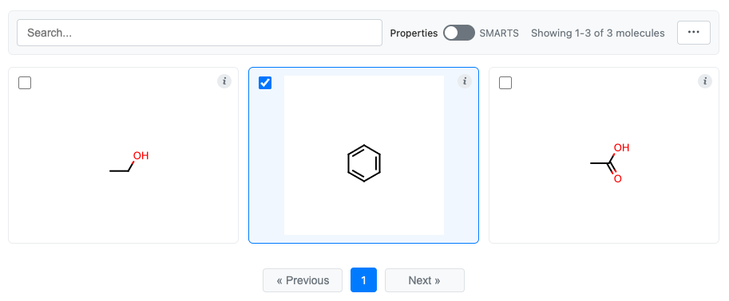
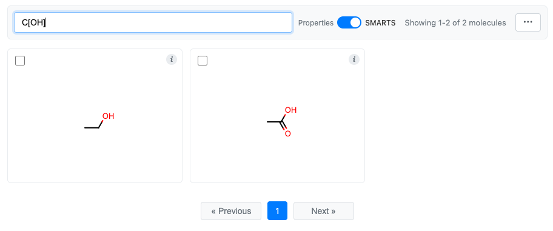
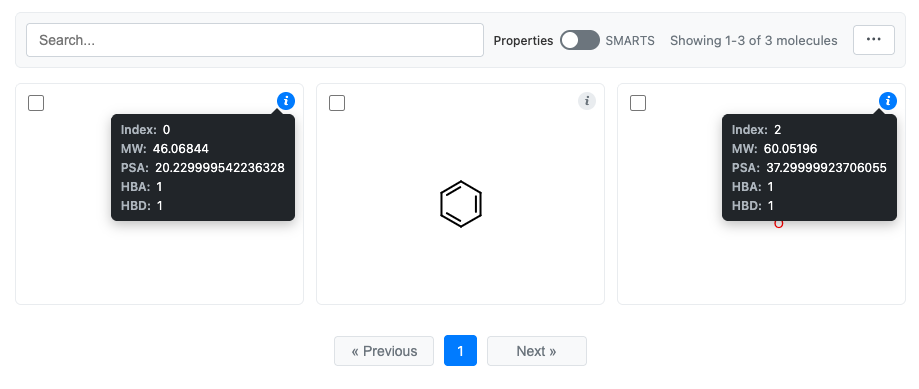
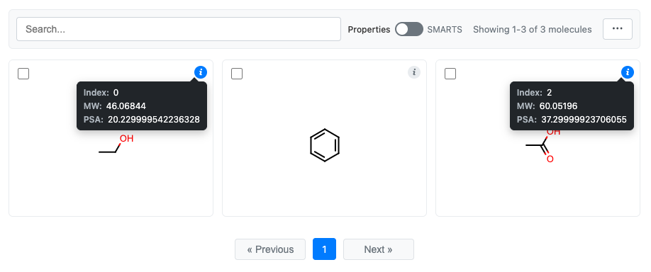
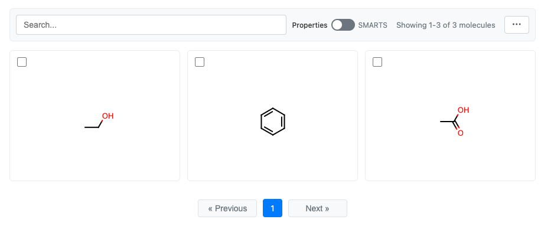
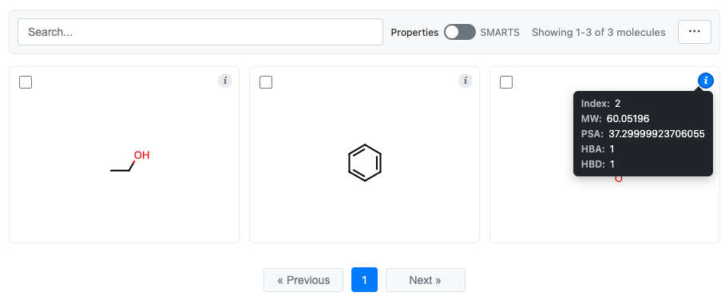
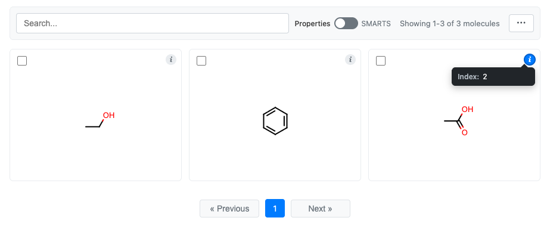
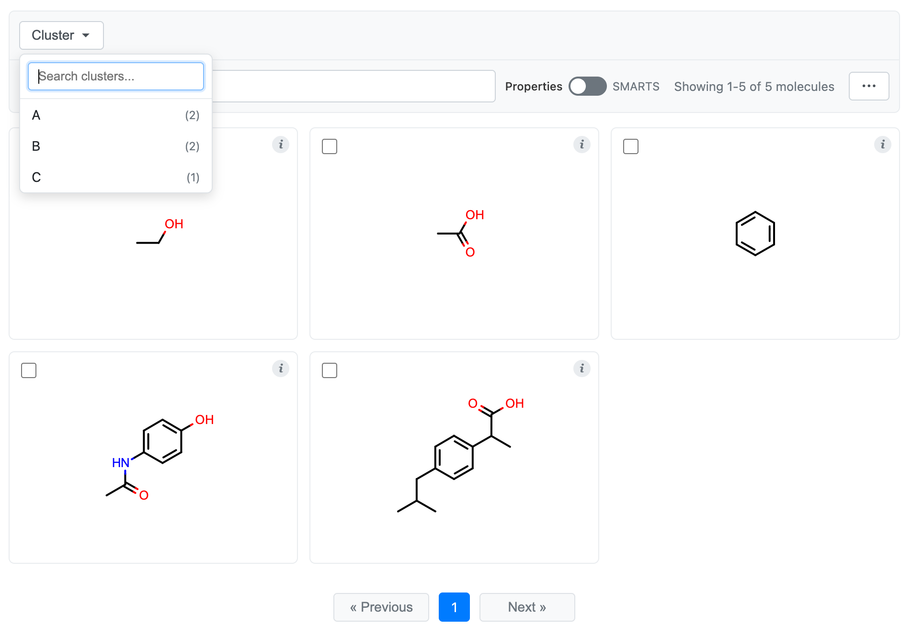
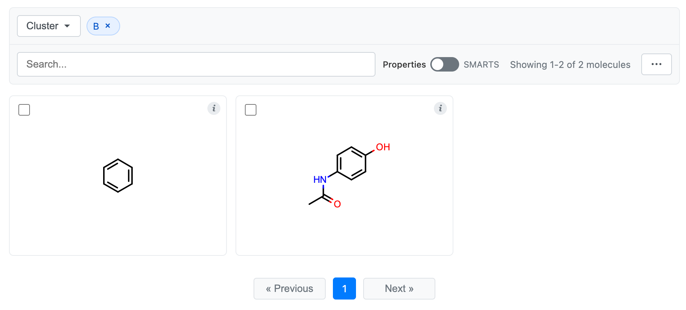

MolGrid: Interactive Molecule Grids
====================================

MolGrid provides an interactive grid visualization for browsing, searching, and
selecting molecules. It is designed for exploring large molecular datasets with
powerful filtering and selection capabilities.

Overview
--------

Key features of MolGrid:

- **Pagination**: Navigate large datasets with configurable items per page
- **Text Search**: Filter by molecule titles and properties
- **SMARTS Search**: Substructure filtering using SMARTS patterns
- **Selection**: Select molecules with checkboxes or click-to-select
- **Export**: Export selected molecules to SMILES or CSV files
- **Info Tooltips**: View molecular data with click-to-pin tooltips
- **DataFrame Integration**: Automatic field detection from DataFrames
- **Generic and SD Data**: Recognizes OpenEye generic data and/or SD data on molecules
- **Cluster Viewing**: Filter and browse molecules by cluster labels

Basic Usage
-----------

Creating a Simple Grid
^^^^^^^^^^^^^^^^^^^^^^

You can create a molecule grid from any iterable.

.. code-block:: python

    from cnotebook import MolGrid
    from openeye import oechem

    # Create molecules
    molecules = []
    for smi in ["CCO", "c1ccccc1", "CC(=O)O"]:
        mol = oechem.OEGraphMol()
        oechem.OESmilesToMol(mol, smi)
        molecules.append(mol)

    # Create and display grid
    grid = MolGrid(molecules)
    grid.display()

.. image:: _static/simple_molgrid.png
    :align: center

See :ref:`molgrid-class` for the complete list of options.

Selection
---------

You can select molecules and then retrieve the selections later in the same notebook.

Enabling Selection
^^^^^^^^^^^^^^^^^^

Selection is enabled by default:

.. code-block:: python

    grid = MolGrid(molecules, select=True)   # Enabled (default)
    grid = MolGrid(molecules, select=False)  # Disable molecule selection

Selection Methods
^^^^^^^^^^^^^^^^^

Multiple ways to select molecules:

1. **Click on a molecule** to toggle its selection
2. **Click the checkbox** in the top-left corner
3. **Use the Actions menu** ("..." button):

   - Select All: Select all visible molecules
   - Clear Selection: Deselect all molecules
   - Invert Selection: Toggle selection state of all visible molecules

Retrieving Selections
^^^^^^^^^^^^^^^^^^^^^

Let's make a selection in the simple molecule grid that we created above.

You can now retrieve the selection in two different ways:

.. code-block:: python

    # Get selected molecule objects
    selected_mols = grid.get_selection()
    print(f'Selected molecules: {", ".join(map(oechem.OEMolToSmiles, selected_mols))}')

    # Get selected indices
    indices = grid.get_selection_indices()
    print(f"Selected indices: {indices}")

This prints:

.. code-block:: text

    Selected molecules: c1ccccc1
    Selected indices: [1]

Exporting Selections
^^^^^^^^^^^^^^^^^^^^

Use the Actions menu to export selected molecules:

- **Copy to Clipboard**: Copy as CSV to clipboard
- **Save to SMILES**: Download as .smi file
- **Save to CSV**: Download as .csv file with all data columns

Customizing the Display
-----------------------

Image Settings
^^^^^^^^^^^^^^

Control the size and format of molecule images:

.. code-block:: python

    grid = MolGrid(
        molecules,
        width=150,                  # Image width in pixels
        height=150,                 # Image height in pixels
        image_format="svg",         # "svg" or "png"
        atom_label_font_scale=1.5,  # Scale factor for atom labels
    )

Pagination
^^^^^^^^^^

Control how many molecules appear per page:

.. code-block:: python

    grid = MolGrid(
        molecules,
        n_items_per_page=24,  # Molecules per page (default: 24)
    )

Title Display
^^^^^^^^^^^^^

Control molecule title display:

.. code-block:: python

    # Show titles from molecule's built-in title (default)
    grid = MolGrid(molecules, title=True)

    # Show titles from SD data field
    grid = MolGrid(molecules, title="Name")

    # Hide titles
    grid = MolGrid(molecules, title=None)

Search and Filtering
--------------------

MolGrid provides two search modes accessible via the toggle in the toolbar:

Text Search
^^^^^^^^^^^

Search across molecule titles and configured search fields:

.. code-block:: python

    # Configure which fields are searchable
    grid = MolGrid(
        molecules,
        search_fields=["Name", "Category"],
    )

When using a DataFrame, string columns are automatically detected as searchable.

SMARTS Mode (Substructure Search)
^^^^^^^^^^^^^^^^^^^^^^^^^^^^^^^^^

Filter molecules by SMARTS substructure patterns. Switch to SMARTS mode using
the toggle in the toolbar, then enter a SMARTS pattern.

Info Button and Tooltips
------------------------

Each molecule cell has an info button ("i") in the top-right corner.

- **Hover** over the "i" to see the tooltip
- **Click** the "i" to pin the tooltip open
- **Click again** to unpin

This allows comparing data across multiple molecules by pinning multiple tooltips.

Here is an example using a DataFrame:

.. code-block:: python

    import pandas as pd
    from cnotebook import MolGrid
    from openeye import oechem, oemolprop

    # Create DataFrame
    df = pd.DataFrame(
        {"Molecule": ["CCO", "c1ccccc1", "CC(=O)O"]}
    ).chem.as_molecule("Molecule")

    # Calculate some properties
    df["MW"] = df.Molecule.apply(oechem.OECalculateMolecularWeight)
    df["PSA"] = df.Molecule.apply(oemolprop.OEGet2dPSA)
    df["HBA"] = df.Molecule.apply(oemolprop.OEGetHBondAcceptorCount)
    df["HBD"] = df.Molecule.apply(oemolprop.OEGetHBondDonorCount)

    # Display the grid (using the 'Molecule' column for structures)
    grid = df.chem.molgrid("Molecule")
    grid.display()

Clicking the "i" for the first and last molecules:

Configuring Displayed Data
^^^^^^^^^^^^^^^^^^^^^^^^^^

Control what appears in the info tooltip using the ``data`` parameter:

.. code-block:: python

    # Display the grid and only show MW and PSA
    grid = df.chem.molgrid("Molecule", data=["MW", "PSA"])
    grid.display()

The tooltip always displays:

1. **Index**: The molecule's position in the grid
2. **Title**: The molecule's title (if set)
3. **Data fields**: Additional fields from the ``data`` parameter

Disabling the Info Button
^^^^^^^^^^^^^^^^^^^^^^^^^

You can remove the info button if you don't want to see it.

.. code-block:: python

    grid = MolGrid(molecules, information=False)

DataFrame Integration
---------------------

Pandas
^^^^^^

Pandas has both ``DataFrame``-level and ``Series``-level accessors for displaying molecule grids. The
``DataFrame``-level accessor will include other data from the ``DataFrame``, the ``Series``-level accessor will not.

Here is the same example as above:

.. code-block:: python

    import pandas as pd
    from cnotebook import MolGrid
    from openeye import oechem, oemolprop

    # Create DataFrame
    df = pd.DataFrame(
        {"Molecule": ["CCO", "c1ccccc1", "CC(=O)O"]}
    ).chem.as_molecule("Molecule")

    # Calculate some properties
    df["MW"] = df.Molecule.apply(oechem.OECalculateMolecularWeight)
    df["PSA"] = df.Molecule.apply(oemolprop.OEGet2dPSA)
    df["HBA"] = df.Molecule.apply(oemolprop.OEGetHBondAcceptorCount)
    df["HBD"] = df.Molecule.apply(oemolprop.OEGetHBondDonorCount)

    # Display the grid
    grid = df.chem.molgrid("Molecule")
    grid.display()

You can see that all the data has accompanied the molecules in the grid:

This is not the case with the ``Series-level`` accessor. It will just show the molecules:

.. code-block:: python

    # Display the grid
    grid = df.Molecule.chem.molgrid()
    grid.display()

Automatic Field Detection
^^^^^^^^^^^^^^^^^^^^^^^^^

When using a DataFrame, MolGrid automatically detects:

- **Search fields**: String columns for text search
- **Info fields**: All simple type columns (string, int, float) for the info tooltip

.. code-block:: python

    import pandas as pd
    from cnotebook import MolGrid
    from openeye import oechem, oemolprop, oeiupac

    # Create DataFrame
    df = pd.DataFrame(
        {"Molecule": ["CCO", "c1ccccc1", "CC(=O)O"]}
    ).chem.as_molecule("Molecule")

    # Add the IUPAC name
    df["IUPAC"] = df.Molecule.apply(oeiupac.OECreateIUPACName)

    # Calculate some numerical properties
    df["HBA"] = df.Molecule.apply(oemolprop.OEGetHBondAcceptorCount)
    df["HBD"] = df.Molecule.apply(oemolprop.OEGetHBondDonorCount)

    # Create the grid
    grid = df.chem.molgrid("Molecule")

    # Check what was auto-detected
    print(f"Search fields: {grid.search_fields}")
    print(f"Info fields: {grid.information_fields}")

You can see that only the string ``"IUPAC"`` column is searched.

.. code-block:: text

    Search fields: ['IUPAC']
    Info fields: ['IUPAC', 'HBA', 'HBD']

Viewing Clusters
----------------

If your DataFrame has cluster labels (or if they are attached to your molecules as SD or OpenEye generic data), then
you can configure the molecule grid for cluster browsing by providing the ``cluster`` parameter.

.. code-block:: python

    import cnotebook
    import pandas as pd
    from openeye import oechem

    # Example data
    df = pd.DataFrame({
        "Molecule": ['CCO', 'CC(=O)O', 'c1ccccc1', 'CC(=O)Nc1ccc(O)cc1',
                     'CC(C)Cc1ccc(C(C)C(=O)O)cc1'],
        "Name": ['Ethanol', 'Acetic Acid', 'Benzene', 'Acetaminophen', 'Ibuprofen'],
        "Cluster": ['A', 'A', 'B', 'B', 'C']  # Can be any type
    }).chem.as_molecule("Molecule")

    # Create the grid specifying that "Cluster" contains cluster labels
    grid = df.chem.molgrid("Molecule", cluster="Cluster")

    # Display the grid
    grid.display()

You'll now see a dropdown at the top that allows you to search and select cluster labels to view. Selecting a cluster
will only show members of that cluster, and selecting multiple clusters will show the union of those clusters. Search will
only search within the clusters that you have selected. Similarly, selections from the "..." menu (e.g., "Select All")
will only apply to the selected clusters.

Selecting cluster label "B":

API Reference
-------------

MolGrid Class
^^^^^^^^^^^^^

.. py:class:: MolGrid(mols, *, dataframe=None, mol_col=None, title=True, tooltip_fields=None, n_items_per_page=24, width=200, height=200, atom_label_font_scale=1.5, image_format="svg", select=True, information=True, data=None, search_fields=None, name=None, cluster=None, cluster_counts=True)

   Interactive molecule grid widget.

   :param mols: Iterable of OpenEye molecule objects
   :param dataframe: Optional DataFrame with molecule data
   :param mol_col: Column name containing molecules (required if dataframe is provided)
   :param title: Title display mode. True uses molecule's title, a string specifies a field name, None/False hides titles
   :param tooltip_fields: List of fields for hover tooltip
   :param n_items_per_page: Number of molecules per page
   :param width: Image width in pixels
   :param height: Image height in pixels
   :param atom_label_font_scale: Scale factor for atom labels
   :param image_format: Image format ("svg" or "png")
   :param select: Enable selection checkboxes
   :param information: Enable info button with tooltip
   :param data: Column(s) to display in info tooltip; auto-detects if None with DataFrame
   :param search_fields: Fields for text search; auto-detects if None with DataFrame
   :param name: Grid identifier for tracking selections
   :param cluster: Cluster filtering mode. A string specifies a DataFrame column name containing cluster labels. A dict maps values to display labels. None disables cluster filtering.
   :param cluster_counts: Show molecule count next to each cluster label in the dropdown. Defaults to True.

   .. py:method:: display()

      Display the grid in the notebook.

      :returns: HTML object for display

   .. py:method:: to_html()

      Generate HTML representation of the grid.

      :returns: Complete HTML document as string

   .. py:method:: get_selection()

      Get list of selected molecules.

      :returns: List of selected OEMol objects

   .. py:method:: get_selection_indices()

      Get indices of selected molecules.

      :returns: List of selected indices (sorted)

molgrid Function
^^^^^^^^^^^^^^^^

.. py:function:: molgrid(mols, *, title=True, tooltip_fields=None, n_items_per_page=24, width=200, height=200, image_format="svg", select=True, information=True, data=None, search_fields=None, name=None, cluster=None, cluster_counts=True)

   Convenience function to create an interactive molecule grid.

   See :py:class:`MolGrid` for parameter documentation.

   :returns: MolGrid instance
