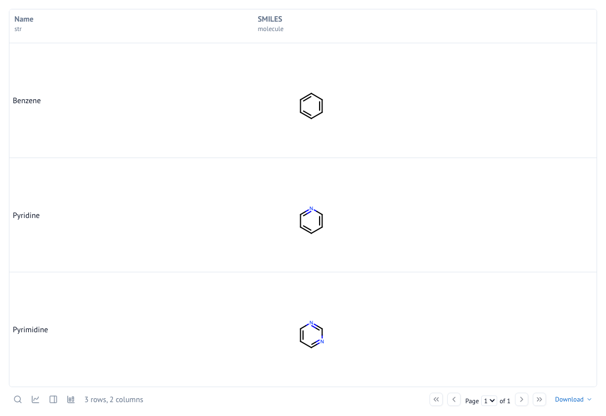
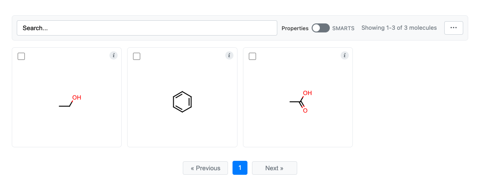
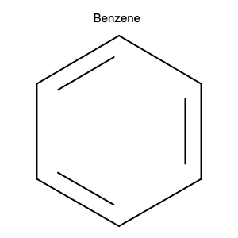

Quick Start
===========

This guide will help you get started with CNotebook in just a few minutes.

Basic Molecule Rendering
------------------------

The simplest way to use CNotebook is to import it and display molecules:

.. code-block:: python

    import cnotebook
    from openeye import oechem

    # Create a molecule from SMILES
    mol = oechem.OEGraphMol()
    oechem.OESmilesToMol(mol, "c1ccccc1")
    mol.SetTitle("Benzene")

    # In a Jupyter/Marimo cell, simply display the molecule
    mol  # Renders as a chemical structure

Outputs:

.. image:: _static/benzene.png
    :align: center

That's it. CNotebook automatically registers formatters so that OpenEye molecule
objects display as chemical structures instead of text representations.

Working with DataFrames
-----------------------

CNotebook integrates with Pandas and Polars DataFrames:

**Pandas Example:**

.. code-block:: python

    import cnotebook
    import oepandas as oepd
    import pandas as pd

    # Create a DataFrame with SMILES
    df = pd.DataFrame({
        "Name": ["Benzene", "Pyridine", "Pyrimidine"],
        "SMILES": ["c1ccccc1", "c1cnccc1", "n1cnccc1"]
    })

    # Convert SMILES to molecules
    df.chem.as_molecule("SMILES", inplace=True)

    # Display the DataFrame - molecules render automatically
    df

Will output:

.. raw:: html

    

    

    <table border="1" class="dataframe">
    <thead>
    <tr style="text-align: right;">
    <th></th>
    <th>Name</th>
    <th style="min-width: 0.0;">SMILES</th>
    </tr>
    </thead>
    <tbody>
    <tr>
    <th>0</th>
    <td>Benzene</td>
    <td>

    <!--?xml version="1.0" encoding="UTF-8"?-->

    <svg &nbsp;&nbsp;="" viewBox="0.00 0.00 200.00 200.00" xmlns="http://www.w3.org/2000/svg" xmlns:xlink="http://www.w3.org/1999/xlink">
    <!-- Created by OpenEye Scientific Software -->
    <!-- Creation Date Mon Jan 26 09:27:50 2026 -->
    <rect fill="white" height="200.00" width="200.00"></rect>
    <line stroke="black" stroke-linecap="round" stroke-linejoin="round" stroke-width="2" x1="80.48" x2="100.00" y1="98.80" y2="87.39"></line>
    <line stroke="black" stroke-linecap="round" stroke-linejoin="round" stroke-width="2" x1="85.93" x2="99.20" y1="100.95" y2="93.18"></line>
    <line stroke="black" stroke-linecap="round" stroke-linejoin="round" stroke-width="2" x1="80.48" x2="80.48" y1="98.80" y2="121.42"></line>
    <line stroke="black" stroke-linecap="round" stroke-linejoin="round" stroke-width="2" x1="80.48" x2="100.00" y1="121.42" y2="132.61"></line>
    <line stroke="black" stroke-linecap="round" stroke-linejoin="round" stroke-width="2" x1="85.90" x2="99.17" y1="119.22" y2="126.83"></line>
    <line stroke="black" stroke-linecap="round" stroke-linejoin="round" stroke-width="2" x1="100.00" x2="119.52" y1="132.61" y2="121.42"></line>
    <line stroke="black" stroke-linecap="round" stroke-linejoin="round" stroke-width="2" x1="119.52" x2="119.52" y1="121.42" y2="98.80"></line>
    <line stroke="black" stroke-linecap="round" stroke-linejoin="round" stroke-width="2" x1="114.92" x2="114.92" y1="117.80" y2="102.42"></line>
    <line stroke="black" stroke-linecap="round" stroke-linejoin="round" stroke-width="2" x1="119.52" x2="100.00" y1="98.80" y2="87.39"></line>
    </svg>
    
</td>
    </tr>
    <tr>
    <th>1</th>
    <td>Pyridine</td>
    <td>

    <!--?xml version="1.0" encoding="UTF-8"?-->

    <svg &nbsp;&nbsp;="" viewBox="0.00 0.00 200.00 200.00" xmlns="http://www.w3.org/2000/svg" xmlns:xlink="http://www.w3.org/1999/xlink">
    <!-- Created by OpenEye Scientific Software -->
    <!-- Creation Date Mon Jan 26 09:27:50 2026 -->
    <rect fill="white" height="200.00" width="200.00"></rect>
    <line stroke="black" stroke-linecap="round" stroke-linejoin="round" stroke-width="2" x1="80.48" x2="100.00" y1="121.42" y2="132.61"></line>
    <line stroke="black" stroke-linecap="round" stroke-linejoin="round" stroke-width="2" x1="85.90" x2="99.17" y1="119.22" y2="126.83"></line>
    <line stroke="black" stroke-linecap="round" stroke-linejoin="round" stroke-width="2" x1="80.48" x2="80.48" y1="121.42" y2="98.80"></line>
    <line stroke="black" stroke-linecap="round" stroke-linejoin="round" stroke-width="2" x1="90.24" x2="80.48" y1="93.09" y2="98.80"></line>
    <line stroke="blue" stroke-linecap="round" stroke-linejoin="round" stroke-width="2" x1="90.24" x2="94.74" y1="93.09" y2="90.46"></line>
    <line stroke="black" stroke-linecap="round" stroke-linejoin="round" stroke-width="2" x1="92.56" x2="85.93" y1="97.06" y2="100.95"></line>
    <line stroke="blue" stroke-linecap="round" stroke-linejoin="round" stroke-width="2" x1="92.56" x2="99.20" y1="97.06" y2="93.18"></line>
    <line stroke="blue" stroke-linecap="round" stroke-linejoin="round" stroke-width="2" x1="109.76" x2="105.26" y1="93.09" y2="90.46"></line>
    <line stroke="black" stroke-linecap="round" stroke-linejoin="round" stroke-width="2" x1="109.76" x2="119.52" y1="93.09" y2="98.80"></line>
    <line stroke="black" stroke-linecap="round" stroke-linejoin="round" stroke-width="2" x1="119.52" x2="119.52" y1="98.80" y2="121.42"></line>
    <line stroke="black" stroke-linecap="round" stroke-linejoin="round" stroke-width="2" x1="114.92" x2="114.92" y1="102.42" y2="117.80"></line>
    <line stroke="black" stroke-linecap="round" stroke-linejoin="round" stroke-width="2" x1="119.52" x2="100.00" y1="121.42" y2="132.61"></line>
    <text fill="blue" font-family="Arial" font-size="9" font-style="normal" font-weight="normal" text-anchor="middle" x="100.00" y="90.36">&nbsp;&nbsp;N </text>
    </svg>
    
</td>
    </tr>
    <tr>
    <th>2</th>
    <td>Pyrimidine</td>
    <td>

    <!--?xml version="1.0" encoding="UTF-8"?-->

    <svg &nbsp;&nbsp;="" viewBox="0.00 0.00 200.00 200.00" xmlns="http://www.w3.org/2000/svg" xmlns:xlink="http://www.w3.org/1999/xlink">
    <!-- Created by OpenEye Scientific Software -->
    <!-- Creation Date Mon Jan 26 09:27:50 2026 -->
    <rect fill="white" height="200.00" width="200.00"></rect>
    <line stroke="blue" stroke-linecap="round" stroke-linejoin="round" stroke-width="2" x1="109.76" x2="114.23" y1="127.02" y2="124.46"></line>
    <line stroke="black" stroke-linecap="round" stroke-linejoin="round" stroke-width="2" x1="109.76" x2="100.00" y1="127.02" y2="132.62"></line>
    <line stroke="blue" stroke-linecap="round" stroke-linejoin="round" stroke-width="2" x1="107.47" x2="114.11" y1="123.03" y2="119.22"></line>
    <line stroke="black" stroke-linecap="round" stroke-linejoin="round" stroke-width="2" x1="107.47" x2="100.83" y1="123.03" y2="126.84"></line>
    <line stroke="blue" stroke-linecap="round" stroke-linejoin="round" stroke-width="2" x1="119.52" x2="119.52" y1="110.11" y2="115.33"></line>
    <line stroke="black" stroke-linecap="round" stroke-linejoin="round" stroke-width="2" x1="119.52" x2="119.52" y1="110.11" y2="98.81"></line>
    <line stroke="black" stroke-linecap="round" stroke-linejoin="round" stroke-width="2" x1="109.76" x2="119.52" y1="93.09" y2="98.81"></line>
    <line stroke="blue" stroke-linecap="round" stroke-linejoin="round" stroke-width="2" x1="109.76" x2="105.26" y1="93.09" y2="90.46"></line>
    <line stroke="black" stroke-linecap="round" stroke-linejoin="round" stroke-width="2" x1="107.44" x2="114.07" y1="97.06" y2="100.95"></line>
    <line stroke="blue" stroke-linecap="round" stroke-linejoin="round" stroke-width="2" x1="107.44" x2="100.80" y1="97.06" y2="93.18"></line>
    <line stroke="blue" stroke-linecap="round" stroke-linejoin="round" stroke-width="2" x1="90.24" x2="94.74" y1="93.09" y2="90.46"></line>
    <line stroke="black" stroke-linecap="round" stroke-linejoin="round" stroke-width="2" x1="90.24" x2="80.48" y1="93.09" y2="98.81"></line>
    <line stroke="black" stroke-linecap="round" stroke-linejoin="round" stroke-width="2" x1="80.48" x2="80.48" y1="98.81" y2="121.42"></line>
    <line stroke="black" stroke-linecap="round" stroke-linejoin="round" stroke-width="2" x1="85.08" x2="85.08" y1="102.42" y2="117.80"></line>
    <line stroke="black" stroke-linecap="round" stroke-linejoin="round" stroke-width="2" x1="80.48" x2="100.00" y1="121.42" y2="132.62"></line>
    <text fill="blue" font-family="Arial" font-size="9" font-style="normal" font-weight="normal" text-anchor="middle" x="119.52" y="124.39">&nbsp;&nbsp;N </text>
    <text fill="blue" font-family="Arial" font-size="9" font-style="normal" font-weight="normal" text-anchor="middle" x="100.00" y="90.35">&nbsp;&nbsp;N </text>
    </svg>
    
</td>
    </tr>
    </tbody>
    </table>
    

    

**Polars Example:**

.. code-block:: python

    import cnotebook
    import oepolars as oeplr
    import polars as pl

    # Create a DataFrame with SMILES
    df = pl.DataFrame({
        "Name": ["Benzene", "Pyridine", "Pyrimidine"],
        "smiles": ["c1ccccc1", "c1cnccc1", "n1cnccc1"]
    })

    # Convert SMILES to molecules
    df = df.chem.as_molecule("smiles")

    # Display the DataFrame - molecules render automatically
    df

This will output the DataFrame using the default built-in Marimo table UI with pagination and all other
capabilities.

Using MolGrid
-------------

MolGrid provides an interactive grid for browsing molecules:

.. code-block:: python

    from cnotebook import molgrid
    from openeye import oechem

    # Create molecules
    molecules = []
    for smi in ["CCO", "c1ccccc1", "CC(=O)O"]:
        mol = oechem.OEGraphMol()
        oechem.OESmilesToMol(mol, smi)
        molecules.append(mol)

    # Display interactive grid
    grid = molgrid(molecules)
    grid.display()

    # Later, retrieve selected molecules
    selected = grid.get_selection()

For more details, see the :doc:`molgrid` documentation.

Customizing Rendering
---------------------

You can customize rendering through the global context. Settings will automatically propogate down to rendering
other objects such DataFrames, keeping rendering uniform. You can also use local rendering contexts as well.

.. code-block:: python

    # Access the rendering context
    ctx = cnotebook.cnotebook_context.get()

    ctx.width = 300
    ctx.height = 300
    ctx.title_font_scale = 0.25
    ctx.structure_scale = oedepict.OEScale_AutoScale

You can always reset the contex to default values with ``ctx.reset()``.

Environment Support
-------------------

Nearly all code in this package works seemlessly with `Pandas`_, `Polars`_, `Jupyter`_ and `Marimo`_.

.. _Pandas: https://pandas.pydata.org/
.. _Polars: https://pola.rs/
.. _Jupyter: https://jupyter.org/
.. _Marimo: https://marimo.io/

Next Steps
----------

- :doc:`rendering` - Detailed rendering options and customization
- :doc:`dataframes` - DataFrame integration guide
- :doc:`molgrid` - Interactive molecule grid documentation
- :doc:`api/index` - Full API reference
