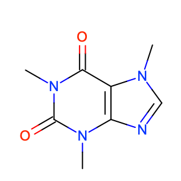
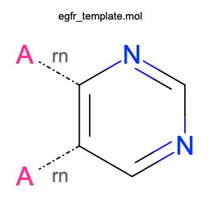
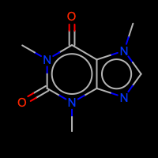
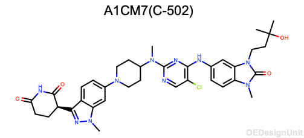
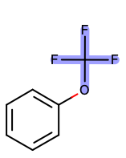
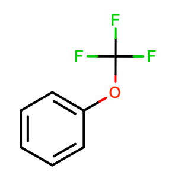
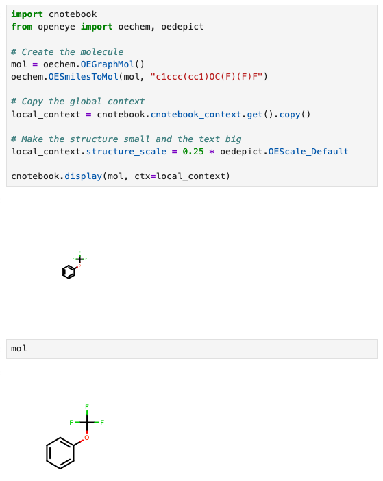

Basic Rendering
=======================

Rendering molecules "just works" in both Jupyter and Marimo. OpenEye objects
are recognized as first-class objects, so by terminating a cell with an object,
it will render.

All you have to do is import cnotebook and it takes care of the rest. There
are also extensive customization options if you don't like the defaults!

Molecules
---------

Concrete molecules, such as ``OEGraphMol`` and ``OEMol`` are straightforwardly
rendered using the global rendering context (more on that later).

.. code-block:: python

    import cnotebook
    from openeye import oechem

    mol = oechem.OEMol()
    oechem.OESmilesToMol(mol, "CN1C=NC2=C1C(=O)N(C(=O)N2C)C")

    mol

Will output:

Query Molecules
---------------

Query molecules, such as ``OEQMol`` can also be displayed.

.. code-block:: python

    import cnotebook
    from openeye import oechem

    qmol = oechem.OEQMol()

    with oechem.oemolistream("examples/assets/egfr_template.mol") as ifs:
        oechem.OEReadMDLQueryFile(ifs, qmol)

    qmol

Will display:

Display Objects
---------------

Display objects store many different styling options and are handled natively.

.. code-block:: python

    import cnotebook
    from openeye import oechem

    mol = oechem.OEMol()
    oechem.OESmilesToMol(mol, "CN1C=NC2=C1C(=O)N(C(=O)N2C)C")

    # Calculate 2D coordinates (since we're using a display object)
    oedepict.OEPrepareDepiction(mol)

    # Customized display options
    opts = oedepict.OE2DMolDisplayOptions(200, 200, oedepict.OEScale_AutoScale)
    opts.SetAromaticStyle(oedepict.OEAromaticStyle_Circle)
    opts.SetAtomColorStyle(oedepict.OEAtomColorStyle_BlackCPK)
    opts.SetTitleLocation(oedepict.OETitleLocation_Bottom)

    disp = oedepict.OE2DMolDisplay(mol, opts)

    disp

Outputs:

Design Units
---------------

OpenEye ``OEDesignUnit`` objects are supported natively in both 2D and 3D contexts.

**2D Rendering (Marimo)**

In Marimo, ``OEDesignUnit`` objects are automatically formatted as 2D images
when displayed in a notebook cell. The design unit title and a structure overview
are rendered using the standard CNotebook rendering pipeline.

.. code-block:: python
    from openeye import oechem
    from cnotebook.c3d import C3D

    du = oechem.OEDesignUnit()
    oechem.OEReadDesignUnit("examples/assets/spruce_9Q03_ABC__DU__A1CM7_C-502.oedu", du)

    # Display it
    du

**3D Viewing (C3D)**

For interactive 3D visualization of design units, use the :doc:`C3D viewer <c3d>`:

.. code-block:: python

    from openeye import oechem
    from cnotebook.c3d import C3D

    du = oechem.OEDesignUnit()
    oechem.OEReadDesignUnit("examples/assets/spruce_9Q03_ABC__DU__A1CM7_C-502.oedu", du)

    viewer = (
        C3D()
        .add_design_unit(du, name="complex")
        .set_preset("sites")
        .orient("resi 502")
    )
    viewer.display()

.. iframe:: _static/c3d-design-unit.html

The design unit's full complex (all components) is extracted and converted to PDB
format for 3Dmol.js. See :doc:`c3d` for full documentation of the 3D viewer.

Substructure Highlighting
-------------------------

The ``highlight_smarts`` helper makes SMARTS highlighting fun and easy:

**Single Molecule:**

.. code-block:: python

    from cnotebook import highlight_smarts
    from openeye import oechem

    mol = oechem.OEGraphMol()
    oechem.OESmilesToMol(mol, "c1ccc(cc1)OC(F)(F)F")

    # Highlight hydroxyl group
    highlight_smarts(mol, smarts="C(O)(F)(F)F")

Outputs:

Rendering Contexts
------------------

CNotebook uses contexts to control rendering style. You can also provide local
rendering contexts to just about anything for extensive customizability.

Global Context
^^^^^^^^^^^^^^

There is a single global context, which you are free to change however you like.

.. code-block:: python

    import cnotebook

    # Get the global context
    ctx = cnotebook.cnotebook_context.get()

This context object has the following attributes that can be set:

+------------------------+------------------+---------------+-----------------------------------------------------+
| Option                 | Type             | Default       | Description                                         |
+========================+==================+===============+=====================================================+
| ``width``              | ``float``        | ``0`` (auto)  | Image width in pixels. When 0, determined by scale. |
+------------------------+------------------+---------------+-----------------------------------------------------+
| ``height``             | ``float``        | ``0`` (auto)  | Image height in pixels. When 0, determined by scale.|
+------------------------+------------------+---------------+-----------------------------------------------------+
| ``min_width``          | ``float | None`` | ``200.0``     | Minimum image width in pixels.                      |
+------------------------+------------------+---------------+-----------------------------------------------------+
| ``min_height``         | ``float | None`` | ``200.0``     | Minimum image height in pixels.                     |
+------------------------+------------------+---------------+-----------------------------------------------------+
| ``max_width``          | ``float | None`` | ``None``      | Maximum image width in pixels.                      |
+------------------------+------------------+---------------+-----------------------------------------------------+
| ``max_height``         | ``float | None`` | ``None``      | Maximum image height in pixels.                     |
+------------------------+------------------+---------------+-----------------------------------------------------+
| ``structure_scale``    | ``float``        | ``12.0``      | Structure scaling factor (OEScale_Default * 0.6).   |
+------------------------+------------------+---------------+-----------------------------------------------------+
| ``atom_label_font_scale`` | ``float``     | ``1.0``       | Scale factor for atom labels (0.5 to 2.0).          |
+------------------------+------------------+---------------+-----------------------------------------------------+
| ``title_font_scale``   | ``float``        | ``1.0``       | Scale factor for title font (0.5 to 2.0).           |
+------------------------+------------------+---------------+-----------------------------------------------------+
| ``image_format``       | ``str``          | ``"png"``     | Output format: ``"png"`` or ``"svg"``.              |
+------------------------+------------------+---------------+-----------------------------------------------------+
| ``bond_width_scaling`` | ``bool``         | ``False``     | Enable bond width scaling based on structure scale. |
+------------------------+------------------+---------------+-----------------------------------------------------+
| ``title``              | ``bool``         | ``True``      | Whether to display the molecule title.              |
+------------------------+------------------+---------------+-----------------------------------------------------+
| ``callbacks``          | ``list | None``  | ``[]``        | Callbacks to apply to OE2DMolDisplay before render. |
+------------------------+------------------+---------------+-----------------------------------------------------+

Here is an example of changing the global context to make all molecules a bit bigger,
scale bond widths, and turn off displaying titles.

.. code-block:: python

    import cnotebook
    from openeye import oedepict

    # Get the global context
    ctx = cnotebook.cnotebook_context.get()

    ctx.structure_scale = 2.0 * oedepict.OEScale_Default
    ctx.bond_width_scaling = True
    ctx.title = False

    mol = oechem.OEGraphMol()
    oechem.OESmilesToMol(mol, "c1ccc(cc1)OC(F)(F)F")
    mol.SetTitle("You won't see this!")

    mol

Outputs:

**You can always reset the global context:**

.. code-block:: python

    ctx.reset()

This is useful if you're interactively making lots of changes.

Local Contexts
^^^^^^^^^^^^^^

Let's say you only want to limit the scope of your changes. You can copy the global
context to a local context and modify it however you like. One cool feature is that
if you later modify a part of the global context that hasn't been explicitly set in
the local context, the change will propogate.

You can pass any renderable object (e.g., molecules or DataFrames) to ``cnotebook.display``
with an optional context and it will render.

Environment-Specific Behavior
-----------------------------

CNotebook automatically adjusts rendering based on the environment.
You can check the detected environment using the ``get_env()`` function:

.. code-block:: python

    import cnotebook

    env = cnotebook.get_env()

    print(f"IPython: {env.ipython_available} ({env.ipython_version})")
    print(f"Marimo: {env.marimo_available} ({env.marimo_version})")
    print(f"Pandas: {env.pandas_available} ({env.pandas_version})")
    print(f"Polars: {env.polars_available} ({env.polars_version})")
    print(f"Jupyter Notebook: {env.is_jupyter_notebook}")
    print(f"Marimo Notebook: {env.is_marimo_notebook}")

Results will depend in your specific environment, but it will look something like this:

.. code-block:: text

    IPython: False ()
    Marimo: True (0.19.5)
    Pandas: True (3.0.0)
    Polars: True (1.37.1)
    Jupyter Notebook: False
    Marimo Notebook: True